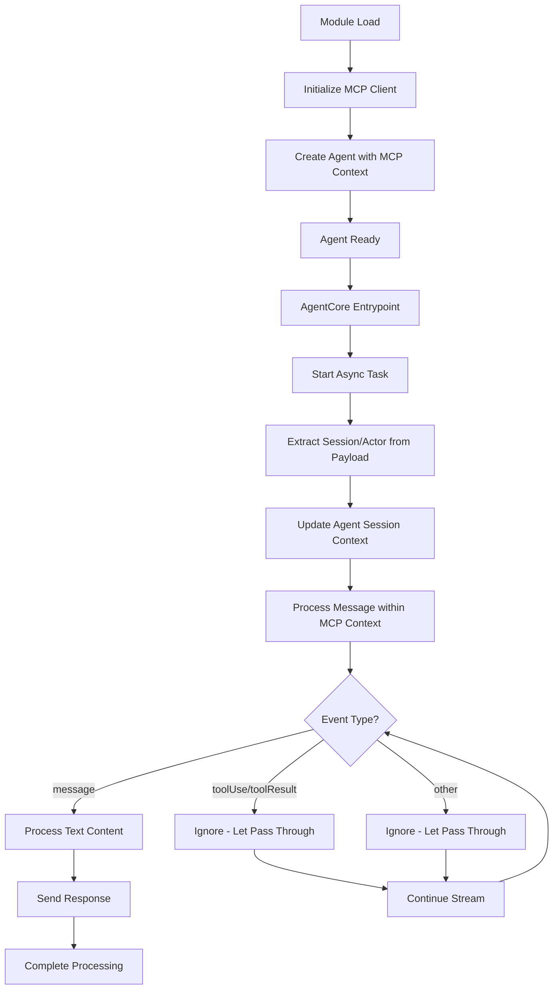

# Design Document

## Overview

This design addresses two critical issues in the AgentCore agent implementation
by simplifying the current approach:

1. **Tool Event Processing**: Fix handling of tool use and tool result events in
   the agent stream to eliminate warnings
2. **Agent Pattern Simplification**: Replace the complex global agent pattern
   with the standard AgentCore pattern where the agent is created once at module
   level

The solution involves fixing event stream processing and returning to the proven
AgentCore pattern shown in the documentation.

## Architecture

### Current Issues Analysis

#### Tool Processing Problem

- Agent stream events contain `toolUse` and `toolResult` objects in dict format
- Current code expects text-based content and logs warnings for dict content
- Tool events are not being processed correctly, causing incomplete responses

#### Complex Global Agent Pattern Problem

- The current implementation uses a complex global agent pattern with async
  tasks
- This creates issues with AgentCore Runtime's execution model
- The SessionManager is creating multiple internal agents, not reusing the
  global one
- The async task pattern (`@app.async_task`) complicates the execution flow

### Proposed Solution Architecture

Return to the standard AgentCore pattern with proper MCP context management:



## Components and Interfaces

### 1. Agent Creation with MCP Context

**Purpose**: Create agent within MCP context and reuse across invocations

**Pattern**:

```python
# Initialize MCP client once
mcp_client = create_mcp_client()

# Wrap entire application in MCP context
with mcp_client:
    # Create app within MCP context
    app = BedrockAgentCoreApp()

    # Load tools once within MCP context
    tools = mcp_client.list_tools_sync()

    # Global variables to track session consistency
    current_session_id = None
    current_actor_id = None
    agent = None

    @app.async_task
    async def process_user_message(user_message, actor_id, session_id, ...):
        global agent, current_session_id, current_actor_id

        # Create agent once per execution, validate session/actor consistency
        if agent is None:
            session_manager = create_session_manager(session_id, actor_id)
            agent = Agent(
                model=model,
                system_prompt=instructions,
                tools=tools,  # Tools already loaded within MCP context
                session_manager=session_manager
            )
            current_session_id = session_id
            current_actor_id = actor_id
        else:
            # Validate session/actor hasn't changed (critical error if it has)
            if current_session_id != session_id:
                raise RuntimeError(f"Session ID changed within execution: {current_session_id} -> {session_id}")
            if current_actor_id != actor_id:
                raise RuntimeError(f"Actor ID changed within execution: {current_actor_id} -> {actor_id}")

        # Process message (already within MCP context)
        async for event in agent.stream_async(user_message):
            # Only process message events, ignore tool events completely
            if "message" in event:
                await process_message_event(event, conversation_id)

    @app.entrypoint
    def invoke(payload, context):
        # Extract session/actor and start async task
        session_id = context.session_id
        actor_id = payload.get("actor_id")

        # Start async processing
        task = asyncio.create_task(
            process_user_message(
                user_message=payload.get("prompt"),
                actor_id=actor_id,
                session_id=session_id,
                conversation_id=session_id,
                message_id=payload.get("message_id"),
                ...
            )
        )

        return {"status": "processing_started"}

    # Run app within MCP context
    if __name__ == "__main__":
        app.run()
```

### 2. Fixed Event Stream Processing

**Purpose**: Only process message events, ignore tool events completely

**Current Problem**:

```python
# This generates warnings for tool events
if isinstance(content, dict) and "text" in content:
    text.append(content["text"])
else:
    logger.warning(f"Unexpected content format: {type(content)} - content: {content}")
```

**Solution**:

```python
# Only process message events, ignore tool events completely
async for event in agent.stream_async(user_message):
    if "message" in event:
        # Process text messages only
        message_content = event.get("message", {}).get("content", [])
        text_parts = []

        for content in message_content:
            if isinstance(content, dict) and "text" in content:
                text_parts.append(content["text"])

        if text_parts:
            message = "".join(text_parts)
            await platform_router.send_response(conversation_id, message)

    # Don't process toolUse or toolResult events at all
    # Don't log warnings for expected tool events
    # Let tool events pass through without interference
```

```python
# Handle all expected event types
if "message" in event:
    # Process text messages
    process_message_event(event["message"])
elif "toolUse" in event:
    # Log tool usage at debug level
    logger.debug(f"Tool invocation: {event['toolUse']['name']}")
elif "toolResult" in event:
    # Log tool result at debug level
    logger.debug(f"Tool result: {event['toolResult']['status']}")
else:
    # Only log truly unexpected events
    logger.debug(f"Other event type: {list(event.keys())[0]}")
```

### 3. SessionManager Integration

**Purpose**: Create SessionManager per session/actor combination

**Pattern**:

```python
def create_session_manager(session_id: str, actor_id: str):
    """Create SessionManager for specific session/actor."""
    memory_id = os.getenv("AGENTCORE_MEMORY_ID")
    if not memory_id:
        raise ValueError("AGENTCORE_MEMORY_ID is required")

    config = AgentCoreMemoryConfig(
        memory_id=memory_id,
        session_id=session_id,
        actor_id=actor_id
    )

    return AgentCoreMemorySessionManager(
        agentcore_memory_config=config,
        region_name=os.getenv("AWS_REGION", "us-east-1")
    )

# No update_session_context function needed
# In AgentCore Runtime's isolated environment, session/actor should never change
# If they do change, it's a critical error that should raise an exception
```

## Data Models

### Simplified Event Processing

```python
@dataclass
class EventProcessor:
    """Process message events only, ignore all others."""

async def process_message_event(event: dict, conversation_id: str) -> None:
    """Process message events only, ignore all others."""
    if "message" not in event:
        return

    message_content = event.get("message", {}).get("content", [])
    text_parts = []

    for content in message_content:
        if isinstance(content, dict) and "text" in content:
            text_parts.append(content["text"])

    if text_parts:
        message = "".join(text_parts)
        if message.strip():
            await platform_router.send_response(conversation_id, message)

# No processing needed for tool events - let them pass through
# This eliminates the warnings and allows tools to work properly
```

## Error Handling

### Strict Validation

Replace graceful degradation with strict validation:

```python
def validate_configuration():
    """Validate required configuration or fail fast."""
    memory_id = os.getenv("AGENTCORE_MEMORY_ID")
    if not memory_id:
        raise ValueError("AGENTCORE_MEMORY_ID environment variable is required")

    aws_region = os.getenv("AWS_REGION")
    if not aws_region:
        raise ValueError("AWS_REGION environment variable is required")

    return memory_id, aws_region

def create_required_components():
    """Create required components or fail fast."""
    memory_id, aws_region = validate_configuration()

    # Create memory client
    try:
        memory_client = MemoryClient(region_name=aws_region)
    except Exception as e:
        raise RuntimeError(f"Failed to create MemoryClient: {e}")

    # Create MCP client
    try:
        mcp_client = create_mcp_client()
        tools = load_mcp_tools(mcp_client)
    except Exception as e:
        raise RuntimeError(f"Failed to create MCP client or load tools: {e}")

    return memory_client, mcp_client, tools, memory_id, aws_region
```

## Testing Strategy

### Unit Tests

1. **Event Processing Tests**:
   - Test `EventProcessor` handles all event types correctly
   - Verify no warnings are generated for expected events
   - Test text extraction from message events

2. **Agent Creation Tests**:
   - Test agent is created once at module level
   - Verify SessionManager is properly configured
   - Test session context updates work correctly

3. **Configuration Tests**:
   - Test strict validation catches missing environment variables
   - Test component creation fails appropriately
   - Verify error messages are clear and actionable

### Integration Tests

1. **Tool Usage Tests**:
   - Test complete tool invocation flow
   - Verify tool events are processed without warnings
   - Test multiple tool usage in single conversation

2. **Session Persistence Tests**:
   - Test conversation continuity across multiple messages
   - Verify SessionManager maintains context correctly
   - Test session isolation between different users

## Implementation Phases

### Phase 1: Simplify Agent Pattern

- Remove complex global agent management
- Create agent once at module level following AgentCore pattern
- Remove async task pattern and use direct entrypoint
- Test basic agent functionality

### Phase 2: Fix Event Processing

- Implement proper event type handling
- Remove warnings for expected tool events
- Add debug logging for tool operations
- Test tool invocation flow

### Phase 3: Strict Configuration

- Add strict validation for required environment variables
- Remove graceful degradation for missing components
- Implement clear error messages
- Test error scenarios

### Phase 4: Comprehensive Testing

- Add unit tests for all components
- Implement integration tests for tool usage
- Test session persistence and isolation
- Validate error handling and user experience

## Key Simplifications

1. **MCP Context Management**: Create MCP context at module level, keep tools
   loaded within context
2. **Session/Actor Validation**: Strict validation that session/actor don't
   change within execution
3. **Agent Per Execution**: Create agent once per AgentCore execution with
   proper session context
4. **Tool Event Ignoring**: Don't process tool events at all - let them pass
   through without interference
5. **Strict Validation**: Fail fast on missing configuration or session/actor
   changes

This approach aligns with AgentCore documentation examples and eliminates the
complexity that was causing the current issues.
