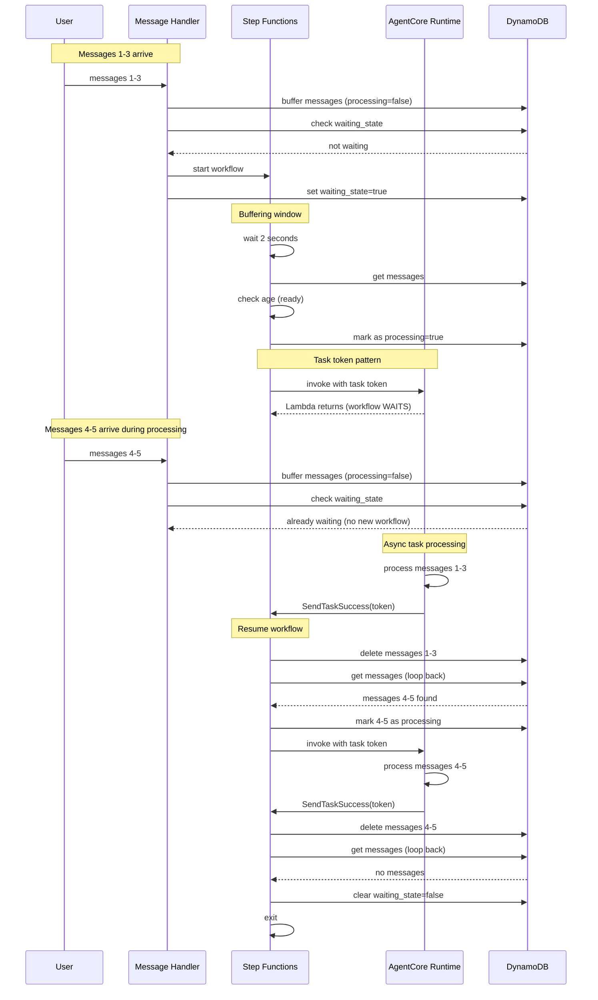
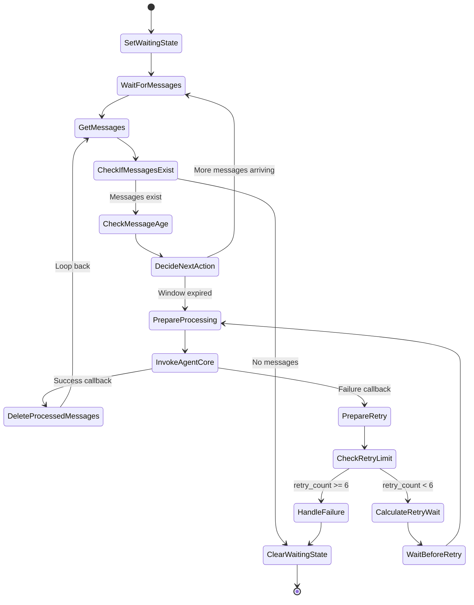

# Design Document: AgentCore Async Task Error Handling

## Overview

This design implements proper error handling and retry logic for AgentCore async
task failures using AWS Step Functions task token pattern. The solution
addresses two critical issues introduced during the migration from SQS to Step
Functions:

1. **Lost Retry Capability**: Messages were deleted before async tasks
   completed, preventing retries on failure
2. **Concurrent Workflows**: Multiple workflows could run for the same user,
   violating the single-workflow-per-user principle

The design uses Step Functions `.waitForTaskToken` integration pattern combined
with a loop-back mechanism to ensure:

- Messages are only deleted after async task confirms success
- Single workflow per user is maintained during async processing
- New messages arriving during processing are automatically handled
- Failed processing triggers proper retry with exponential backoff

**Backward Compatibility**: The task token is **optional**. When present, the
system operates in Step Functions mode with callbacks. When absent, it works as
before (direct invocation), maintaining full backward compatibility with
non-Step Functions usage.

## Architecture

### High-Level Flow

```
SNS Topic (WhatsApp messages)
    ↓
Message Handler Lambda
    ├─> Write message to DynamoDB
    ├─> Check if workflow waiting
    └─> Start workflow if not waiting
         ↓
Step Functions Workflow (with Task Token)
    ├─> Set waiting state
    ├─> Wait 2 seconds
    ├─> Get messages from DynamoDB
    ├─> Check message age (JSONata)
    ├─> Loop if messages still arriving
    ├─> Mark messages as processing
    ├─> Invoke AgentCore (pass task token, WAIT)
    │    ↓
    │   AgentCore Runtime (async task)
    │    ├─> Process messages
    │    ├─> On success: SendTaskSuccess(token)
    │    └─> On failure: SendTaskFailure(token)
    │         ↓
    ├─> Resume on callback
    ├─> Delete processed messages
    ├─> Loop back to GetMessages
    ├─> If new messages: continue processing
    └─> If no messages: clear waiting state, exit
```

### Detailed Workflow Diagram



### Step Functions State Machine Flow



## Components and Interfaces

### 1. Modified InvokeAgentCore Lambda

**Purpose**: Invoke AgentCore Runtime with optional task token for Step
Functions integration

**Interface**:

```python
def lambda_handler(event: dict[str, Any], context: LambdaContext) -> dict[str, Any]:
    """Invoke AgentCore with optional task token for async callback.

    Args:
        event: Contains marked_messages, session_id, user_id, and optional task_token
        context: Lambda context

    Returns:
        Success response

    Note:
        - If task_token is present: Running within Step Functions, callbacks will be sent
        - If task_token is absent: Direct invocation, works as before (backward compatible)
    """
```

**Implementation Details**:

```python
# Extract optional task token from event
task_token = event.get("task_token")  # May be None for direct invocations

# Extract optional task token from event
task_token = event.get("task_token")  # May be None for direct invocations

# Extract other parameters
user_id = event.get("user_id")
session_id = event.get("session_id")
processing_messages = event.get("marked_messages", {}).get("processing_messages", [])

# Combine content and extract IDs
combined_content = "\n".join(msg["content"] for msg in processing_messages)
message_ids = [msg["message_id"] for msg in processing_messages]

# Mark messages as delivered
for message_id in message_ids:
    await platform_router.update_message_status(message_id, "delivered")

# Create AgentCore invocation request
request_kwargs = {
    "prompt": combined_content,
    "actorId": user_id,
    "messageIds": message_ids,
    "conversationId": session_id,
    "modelId": os.environ.get("BEDROCK_MODEL_ID"),
    "temperature": float(os.environ.get("MODEL_TEMPERATURE", "0.2"))
}

# Add task_token if present (Step Functions invocation)
if task_token:
    request_kwargs["task_token"] = task_token

request = AgentCoreInvocationRequest(**request_kwargs)

# Invoke AgentCore (reuse existing client)
agentcore_client = AgentCoreClient()
response = agentcore_client.invoke_agent(request)

# Check response
if not response.success:
    error_msg = str(response.error) if response.error else "Unknown error"

    # Send failure callback to Step Functions if task_token present
    if task_token:
        sfn_client = boto3.client("stepfunctions")
        sfn_client.send_task_failure(
            taskToken=task_token,
            error="AgentCoreInvocationError",
            cause=error_msg
        )
        return {"status": "callback_sent", "result": "failure"}
    else:
        # Direct invocation - raise exception
        raise Exception(f"AgentCore invocation failed: {error_msg}")

# Success - async task will send callback if task_token present
return {
    "status": "async_task_started" if task_token else "success",
    "message_ids": message_ids,
    "user_id": user_id
}
```

### 2. Modified AgentCore Agent (agent.py)

**Purpose**: Send Step Functions callback after async task completes (when
task_token present)

**Key Changes**:

```python
# Add Step Functions client at module level (only used when task_token present)
sfn_client = boto3.client("stepfunctions")

@app.async_task
async def process_user_message(
    user_message: str,
    actor_id: str,
    message_ids: list[str],
    conversation_id: str,
    model_id: str,
    temperature: float,
    session_id: str,
    task_token: str = None,  # NEW: Optional task token for Step Functions callback
):
    """Process user message with optional Step Functions callback on completion.

    Args:
        task_token: Optional Step Functions task token. If present, callbacks will be sent.
                   If None, works as before (backward compatible).
    """

    try:
        # ... existing processing logic ...

        # Process message with agent
        async for event in agent.stream_async(user_message):
            # ... existing event handling ...

        logger.debug(f"Completed processing message group: {message_ids}")

        # NEW: Send success callback to Step Functions (only if task_token present)
        if task_token:
            try:
                # Retry callback send with exponential backoff
                max_retries = 3
                for attempt in range(max_retries):
                    try:
                        sfn_client.send_task_success(
                            taskToken=task_token,
                            output=json.dumps({
                                "status": "success",
                                "message_ids": message_ids,
                                "user_id": actor_id
                            })
                        )
                        logger.info(f"Sent success callback for message group {message_ids}")
                        break
                    except Exception as retry_error:
                        if attempt < max_retries - 1:
                            wait_time = 2 ** attempt  # Exponential backoff: 1s, 2s, 4s
                            logger.warning(f"Callback send failed (attempt {attempt + 1}/{max_retries}), retrying in {wait_time}s: {retry_error}")
                            await asyncio.sleep(wait_time)
                        else:
                            raise
            except Exception as callback_error:
                logger.error(f"Failed to send success callback after {max_retries} attempts: {callback_error}")
                # Don't raise - processing succeeded, callback is best-effort

    except Exception as e:
        # ... existing error handling ...

        # NEW: Send failure callback to Step Functions (only if task_token present)
        if task_token:
            try:
                # Retry callback send with exponential backoff
                max_retries = 3
                for attempt in range(max_retries):
                    try:
                        sfn_client.send_task_failure(
                            taskToken=task_token,
                            error="AsyncTaskProcessingError",
                            cause=sanitized_error
                        )
                        logger.info(f"Sent failure callback for message group {message_ids}")
                        break
                    except Exception as retry_error:
                        if attempt < max_retries - 1:
                            wait_time = 2 ** attempt  # Exponential backoff: 1s, 2s, 4s
                            logger.warning(f"Callback send failed (attempt {attempt + 1}/{max_retries}), retrying in {wait_time}s: {retry_error}")
                            await asyncio.sleep(wait_time)
                        else:
                            raise
            except Exception as callback_error:
                logger.error(f"Failed to send failure callback after {max_retries} attempts: {callback_error}")

        # Re-raise the original exception
        raise


@app.entrypoint
async def invoke(payload, context: RequestContext):
    """Main entrypoint - extract optional task token and pass to async task."""

    # ... existing validation and setup ...

    # NEW: Extract optional task token from payload
    task_token = payload.get("task_token")  # May be None for direct invocations

    if task_token:
        logger.debug("Task token present - Step Functions callback mode enabled")
    else:
        logger.debug("No task token - direct invocation mode (backward compatible)")

    # Start async task with optional task token
    task = asyncio.create_task(
        process_user_message(
            user_message=request.prompt,
            actor_id=actor_id,
            message_ids=request.message_ids,
            conversation_id=session_id,
            model_id=model_id,
            temperature=temperature,
            session_id=session_id,
            task_token=task_token,  # NEW: Pass optional task token
        )
    )

    # ... existing callback and return ...
```

### 3. New CheckIfMessagesExist State

**Purpose**: Determine if messages exist after GetMessages to decide whether to
continue or exit

**Implementation**: JSONata Pass state

```python
# In Step Functions definition
check_if_messages_exist = sfn.Pass.jsonata(
    self,
    "CheckIfMessagesExist",
    comment="Check if any messages were retrieved",
    outputs={
        "has_messages": "",
        "messages": "",
    },
)
```

### 4. New ClearWaitingState State

**Purpose**: Clear waiting_state and exit workflow when no messages remain

**Implementation**: DynamoDB UpdateItem

```python
# In Step Functions definition
clear_waiting_state = tasks.DynamoUpdateItem.jsonata(
    self,
    "ClearWaitingState",
    table=self.message_buffer_table,
    key={"user_id": tasks.DynamoAttributeValue.from_string("")},
    update_expression="SET waiting_state = :false",
    expression_attribute_values={":false": tasks.DynamoAttributeValue.from_boolean(False)},
    comment="Clear waiting state when no messages remain",
)
```

### 5. Modified InvokeAgentCore State

**Purpose**: Use task token integration pattern to wait for async task
completion

**Implementation**: LambdaInvoke with `.waitForTaskToken()`

```python
# In Step Functions definition
invoke_agentcore = tasks.LambdaInvoke(
    self,
    "InvokeAgentCore",
    lambda_function=self.invoke_agentcore_lambda,
    integration_pattern=sfn.IntegrationPattern.WAIT_FOR_TASK_TOKEN,
    payload=sfn.TaskInput.from_object({
        "user_id": sfn.JsonPath.string_at("$.user_id"),
        "session_id": sfn.JsonPath.string_at("$.session_id"),
        "marked_messages": sfn.JsonPath.object_at("$.marked_messages"),
        "task_token": sfn.JsonPath.task_token,  # Pass task token
    }),
    timeout=Duration.minutes(4),  # 4 minute timeout for async task
)
```

## Data Models

### Modified AgentCoreInvocationRequest

Add optional task_token field:

```python
class AgentCoreInvocationRequest(BaseModel):
    """Request model for AgentCore invocation."""

    prompt: str
    actorId: str
    messageIds: list[str]
    conversationId: str
    modelId: str | None = None
    temperature: float | None = None
    task_token: str | None = None  # NEW: Optional task token for callbacks
```

### DynamoDB Message Buffer Schema (Unchanged)

The existing schema already supports the processing flag:

```python
{
    'user_id': str,              # Partition key
    'messages': list[dict],      # List with processing flag
    'session_id': str,           # AgentCore session ID
    'last_update_time': float,   # Timestamp
    'waiting_state': bool,       # Whether workflow is active
    'workflow_execution_arn': str,  # ARN of active workflow
    'ttl': int                   # TTL for cleanup
}
```

## Correctness Properties

_A property is a characteristic or behavior that should hold true across all
valid executions of a system-essentially, a formal statement about what the
system should do. Properties serve as the bridge between human-readable
specifications and machine-verifiable correctness guarantees._

### Property 1: Task Token Passed to Async Task

_For any_ AgentCore invocation, the task token from Step Functions should be
passed through the Lambda to the async task.

**Validates: Requirements 7.1, 7.2**

### Property 2: Workflow Waits for Callback

_For any_ InvokeAgentCore state execution, Step Functions should pause and wait
for a callback before proceeding.

**Validates: Requirements 8.1, 8.2**

### Property 3: Success Callback Sent

_For any_ successful async task completion, the agent should send
SendTaskSuccess with the task token.

**Validates: Requirements 9.1**

### Property 4: Failure Callback Sent

_For any_ failed async task, the agent should send SendTaskFailure with the task
token and error details.

**Validates: Requirements 9.2**

### Property 5: Messages Deleted Only After Success Callback

_For any_ message batch, messages should only be deleted from the buffer after
the async task sends a success callback.

**Validates: Requirements 3.4**

### Property 6: Workflow Loops Back After Deletion

_For any_ successful message deletion, the workflow should loop back to
GetMessages to check for new messages.

**Validates: Requirements 9.5.1**

### Property 7: Continues Processing When Messages Exist

_For any_ GetMessages execution that finds messages, the workflow should
continue processing them.

**Validates: Requirements 9.5.2**

### Property 8: Exits When No Messages

_For any_ GetMessages execution that finds no messages, the workflow should
proceed to ClearWaitingState and exit.

**Validates: Requirements 9.5.3, 9.6.1**

### Property 9: Waiting State Cleared on Exit

_For any_ workflow exit, the waiting_state should be set to false in DynamoDB.

**Validates: Requirements 9.6.2, 9.6.3**

### Property 10: Single Workflow Per User During Processing

_For any_ user with an active workflow (waiting_state=true), new messages should
be buffered without starting a new workflow.

**Validates: Requirements 1.5.1, 1.5.2**

### Property 11: Retry on Failure Callback

_For any_ failure callback received, Step Functions should proceed to
PrepareRetry state.

**Validates: Requirements 8.4**

### Property 12: Exponential Backoff Retry Timing

_For any_ retry attempt, the wait time should be calculated as 2 \* (2 ^
retry_count) seconds.

**Validates: Requirements 4.2, 4.3, 4.4**

### Property 13: Maximum Retry Limit

_For any_ retry sequence, the system should retry up to 6 times before giving
up.

**Validates: Requirements 4.5**

### Property 14: Callback Timeout Handling

_For any_ InvokeAgentCore state, if no callback is received within the timeout
period, the workflow should fail.

**Validates: Requirements 8.5**

## Error Handling

### Async Task Failures

**Scenario**: Agent processing fails (MCP error, Bedrock error, etc.)

**Handling**:

1. Async task catches exception
2. Sends `SendTaskFailure(taskToken, error, cause)` to Step Functions
3. Step Functions receives failure callback
4. Transitions to PrepareRetry state
5. Unmarks messages (processing=false)
6. Calculates retry wait time (2s, 4s, 8s, 16s, 32s, 64s)
7. Waits and retries from PrepareProcessing
8. After 6 retries, transitions to HandleFailure

### Callback Send Failures

**Scenario**: Network error when sending callback to Step Functions

**Handling**:

- Retry callback send with exponential backoff (3 attempts: 1s, 2s, 4s)
- Log each retry attempt
- If all retries fail, log error but don't crash
- Step Functions will timeout after 4 minutes if no callback received
- Timeout triggers workflow failure
- Messages remain in buffer with processing=true
- Manual intervention required (or TTL cleanup after 10 minutes)

### Task Token Timeout

**Scenario**: Async task never sends callback (agent crashes, infinite loop,
etc.)

**Handling**:

- Step Functions timeout (4 minutes) triggers
- Workflow fails and goes to DLQ
- Messages remain in buffer with processing=true
- Waiting state remains true (blocks new workflows)
- TTL eventually cleans up (10 minutes)

**Mitigation**: CloudWatch alarm for workflow timeouts

### Concurrent Workflow Prevention

**Scenario**: Multiple messages arrive simultaneously

**Handling**:

- First message: Sets waiting_state=true, starts workflow
- Subsequent messages: Conditional update fails, messages buffered only
- Workflow processes all buffered messages via loop-back
- Only clears waiting_state when no messages remain

## Testing Strategy

### Unit Tests

1. **InvokeAgentCore Lambda**:
   - Test task token extraction from event
   - Test callback sending on immediate errors
   - Test return value includes task token

2. **Agent Async Task**:
   - Test success callback sent after processing
   - Test failure callback sent on exception
   - Test callback includes correct message_ids and user_id
   - Test callback error handling (best-effort)

3. **CheckIfMessagesExist State**:
   - Test correctly identifies when messages exist
   - Test correctly identifies when no messages

4. **ClearWaitingState State**:
   - Test sets waiting_state=false
   - Test uses correct user_id

### Integration Tests

1. **End-to-End Success Flow**:
   - Send messages
   - Verify workflow starts
   - Verify async task processes
   - Verify success callback sent
   - Verify messages deleted
   - Verify workflow exits cleanly

2. **Loop-Back Processing**:
   - Send 3 messages
   - During processing, send 2 more messages
   - Verify first batch processed
   - Verify workflow loops back
   - Verify second batch processed
   - Verify workflow exits after second batch

3. **Async Task Failure and Retry**:
   - Send messages
   - Simulate agent failure
   - Verify failure callback sent
   - Verify PrepareRetry executed
   - Verify exponential backoff timing
   - Verify retry processes messages
   - Verify success on retry

4. **Retry Exhaustion**:
   - Send messages
   - Simulate persistent agent failure
   - Verify 6 retries attempted
   - Verify HandleFailure executed
   - Verify messages marked as failed
   - Verify waiting_state cleared

5. **Task Token Timeout**:
   - Send messages
   - Simulate agent hang (no callback)
   - Verify workflow times out after 4 minutes
   - Verify workflow goes to DLQ
   - Verify messages remain in buffer

### Property-Based Tests

Each correctness property should be implemented as a property-based test with
minimum 100 iterations. Tests should:

- Generate random message batches
- Generate random failure scenarios
- Verify properties hold across all generated inputs
- Use mocks for Step Functions callbacks

## Performance Considerations

### Latency

- **First message**: ~2 seconds (buffering window) + processing time
- **Subsequent messages in batch**: Included in same invocation
- **Messages during processing**: Processed in next loop iteration
- **Callback overhead**: ~50-100ms for SendTaskSuccess/Failure
- **Total latency**: 2-4 seconds + processing time per batch

### Cost

- **Lambda invocations**: Same as before (1 per message + 1 per batch)
- **Step Functions**: Same state transitions, but longer execution time (waits
  for callback)
- **Step Functions cost**: Charged per state transition, not execution time
- **Estimated cost**: ~$0.00008 per message group (unchanged)

### Scalability

- **Concurrent users**: Unlimited (independent workflows)
- **Messages per user**: Unlimited (DynamoDB item size: 400KB)
- **Workflow duration**: Up to 4 minutes per batch (task token timeout)
- **Loop iterations**: Unlimited (processes until no messages remain, Step
  Functions limit: 25,000 state transitions)

## Deployment Considerations

### CDK Configuration Changes

**Modified InvokeAgentCore Lambda**:

```python
# Add Step Functions permissions
self.invoke_agentcore_lambda.add_to_role_policy(
    iam.PolicyStatement(
        sid="StepFunctionsCallback",
        effect=iam.Effect.ALLOW,
        actions=[
            "states:SendTaskSuccess",
            "states:SendTaskFailure",
        ],
        resources=["*"],  # Task tokens are opaque, can't scope by ARN
    )
)
```

**Modified State Machine Definition**:

```python
# Use task token integration pattern
invoke_agentcore = tasks.LambdaInvoke(
    self,
    "InvokeAgentCore",
    lambda_function=self.invoke_agentcore_lambda,
    integration_pattern=sfn.IntegrationPattern.WAIT_FOR_TASK_TOKEN,
    payload=sfn.TaskInput.from_object({
        "user_id": sfn.JsonPath.string_at("$.user_id"),
        "session_id": sfn.JsonPath.string_at("$.session_id"),
        "marked_messages": sfn.JsonPath.object_at("$.marked_messages"),
        "task_token": sfn.JsonPath.task_token,
    }),
    timeout=Duration.minutes(4),
)

# Add loop-back from DeleteProcessedMessages to GetMessages
delete_processed_messages.next(get_messages)

# Add CheckIfMessagesExist choice after GetMessages
get_messages.next(check_if_messages_exist)
check_if_messages_exist_choice = sfn.Choice(self, "CheckIfMessagesExistChoice")
check_if_messages_exist.next(check_if_messages_exist_choice)

check_if_messages_exist_choice.when(
    sfn.Condition.boolean_equals("$.has_messages", False),
    clear_waiting_state
)
check_if_messages_exist_choice.otherwise(check_message_age)

# ClearWaitingState exits
clear_waiting_state.next(sfn.Succeed(self, "WorkflowComplete"))
```

### Environment Variables

No new environment variables required. Existing variables sufficient:

- `MESSAGE_BUFFER_TABLE`: DynamoDB table name
- `BATCHER_STATE_MACHINE_ARN`: Step Functions ARN
- `AGENTCORE_RUNTIME_ARN`: AgentCore Runtime ARN
- `BEDROCK_MODEL_ID`: Model ID
- `MODEL_TEMPERATURE`: Temperature

### Monitoring and Alarms

**CloudWatch Alarms**:

1. **Task Token Timeout Alarm**:
   - Metric: Step Functions execution timeouts
   - Threshold: > 0 in 5 minutes
   - Action: SNS notification
   - Purpose: Alert when async tasks fail to send callbacks within 4 minutes

## Migration Strategy

### Phase 1: Deploy Updated Infrastructure

1. Deploy modified Lambda functions with task token support
2. Deploy updated Step Functions state machine
3. Keep existing behavior (no breaking changes yet)
4. Test in development environment

### Phase 2: Enable Task Token Pattern

1. Update InvokeAgentCore to use `.waitForTaskToken()`
2. Update agent.py to send callbacks
3. Deploy to staging environment
4. Monitor for callback failures and timeouts

### Phase 3: Enable Loop-Back Pattern

1. Add CheckIfMessagesExist and ClearWaitingState states
2. Connect DeleteProcessedMessages → GetMessages loop
3. Deploy to staging environment
4. Test with rapid-fire messages

### Phase 4: Production Rollout

1. Deploy to production
2. Monitor metrics and alarms
3. Verify no message loss
4. Verify proper retry behavior

### Rollback Plan

If issues occur:

1. Revert state machine to previous version
2. Revert Lambda functions to previous version
3. Messages in buffer will be processed by old workflow
4. No data loss (messages remain in buffer)

## Security Considerations

### Task Token Security

- Task tokens are opaque strings generated by Step Functions
- Cannot be scoped by IAM resource ARN (must use `"*"`)
- Tokens are single-use and expire after workflow completes
- Tokens cannot be reused or forged

### IAM Permissions

**InvokeAgentCore Lambda**:

- `states:SendTaskSuccess` - Required for success callbacks
- `states:SendTaskFailure` - Required for failure callbacks
- Resource: `"*"` (task tokens are opaque)

**AgentCore Runtime**:

- No new permissions required
- Existing Bedrock and DynamoDB permissions sufficient

### Callback Validation

- Step Functions validates task tokens automatically
- Invalid tokens are rejected with error
- Expired tokens are rejected with error
- No additional validation needed in Lambda

## Open Questions

~~1. **Maximum loop iterations**: Should we add a safety limit to prevent
infinite loops?~~

- **RESOLVED**: No safety limit needed. Step Functions has a built-in limit of
  25,000 state transitions per execution, which is more than sufficient.

~~2. **Callback retry logic**: Should we retry callback sends on network
errors?~~

- **RESOLVED**: Yes. Implement retry logic with exponential backoff for callback
  send failures.

~~3. **Timeout duration**: Is 10 minutes appropriate for task token timeout?~~

- **RESOLVED**: Use 4 minutes. This aligns better with DynamoDB TTL timing and
  is sufficient for message processing.

~~4. **Monitoring**: What additional metrics should we track?~~

- **RESOLVED**: No additional alarms or metrics beyond what's already specified
  in the design.

## Future Enhancements

1. **Adaptive timeout**: Adjust timeout based on message count or content length
2. **Priority processing**: Process high-priority messages first
3. **Batch size limits**: Limit messages per batch to prevent long processing
   times
4. **Dead letter analysis**: Automated analysis of DLQ messages
5. **Callback retry**: Exponential backoff retry for callback send failures
