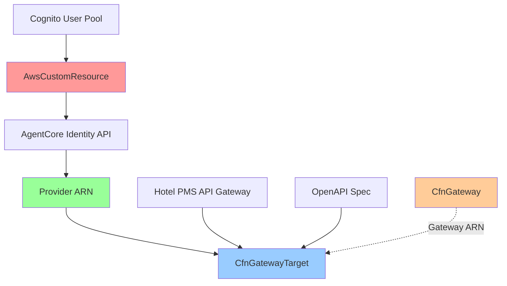

# Design Document

## Overview

The AgentCore Gateway Integration design provides a CDK construct that connects
the Hotel PMS API Gateway with AWS AgentCore Gateway service, enabling AI agents
to discover and use hotel management tools. The design uses AwsCustomResource to
call AgentCore Identity APIs and L1 constructs (CfnGateway, CfnGatewayTarget)
for gateway configuration.

**Key Design Principles:**

- Use AwsCustomResource instead of custom Lambda functions for simplicity
- Leverage existing L1 constructs for AgentCore Gateway resources
- Integrate with existing Hotel PMS API Gateway and Cognito constructs
- Deploy as part of the Hotel PMS Stack (customer-replaceable reference
  implementation)

## Architecture

### High-Level Architecture



**Key Relationships:**

- **Cognito → AgentCore Identity**: AwsCustomResource creates identity provider
  with OIDC config
- **AgentCore Identity → Provider ARN**: Returns provider ARN for authentication
- **CfnGateway**: Standalone gateway resource (no provider ARN)
- **Provider ARN → CfnGatewayTarget**: Target uses provider ARN for
  authentication
- **API Gateway → CfnGatewayTarget**: Target links to API endpoint
- **OpenAPI Spec → CfnGatewayTarget**: Embedded for tool discovery
- **Gateway ARN → CfnGatewayTarget**: Target belongs to gateway

### Component Responsibilities

- **AwsCustomResource**: Calls AgentCore Identity APIs to create identity
  provider
- **AgentCore Identity**: AWS service that creates and manages identity
  providers
- **Provider ARN**: Unique identifier linking Cognito to AgentCore Gateway
- **CfnGateway**: L1 construct for AgentCore Gateway resource
- **CfnGatewayTarget**: L1 construct linking API Gateway endpoint with OpenAPI
  spec
- **OpenAPI Spec**: Tool discovery specification for AI agents

## Components and Interfaces

### AgentCore Gateway Construct

```python
from aws_cdk import (
    custom_resources as cr,
    aws_iam as iam,
    Names,
)
from aws_cdk import aws_bedrockagentcore as agentcore

class AgentCoreGatewayConstruct(Construct):
    """CDK construct for AgentCore Gateway integration."""

    def __init__(
        self,
        scope: Construct,
        construct_id: str,
        api_construct: HotelPmsApiConstruct,
        cognito_construct: AgentCoreCognitoUserPool,
        openapi_spec_path: str,
        **kwargs
    ):
        super().__init__(scope, construct_id, **kwargs)

        # Create identity provider wrapper construct
        self.identity_provider_construct = AgentCoreIdentityProviderConstruct(
            self,
            "IdentityProvider",
            cognito_construct=cognito_construct
        )

        # Create AgentCore Gateway (no provider ARN needed)
        gateway_name = Names.unique_resource_name(
            self,
            max_length=64,
            separator="-",
            allowed_special_characters=""
        )

        self.gateway = agentcore.CfnGateway(
            self,
            "Gateway",
            gateway_name=gateway_name,
            description="AgentCore Gateway for Hotel PMS API"
        )

        # Read OpenAPI specification
        with open(openapi_spec_path, 'r') as f:
            openapi_spec = f.read()

        # Create Gateway Target (uses provider ARN)
        target_name = Names.unique_resource_name(
            self,
            max_length=64,
            separator="-",
            allowed_special_characters=""
        )

        self.gateway_target = agentcore.CfnGatewayTarget(
            self,
            "GatewayTarget",
            gateway_arn=self.gateway.attr_gateway_arn,
            target_name=target_name,
            target_configuration={
                "apiConfiguration": {
                    "apiUrl": api_construct.api_endpoint_url,
                    "apiSchema": openapi_spec,
                    "authConfiguration": {
                        "type": "OAUTH2_CLIENT_CREDENTIALS",
                        "oauth2ClientCredentialsConfiguration": {
                            "identityProviderArn": self.identity_provider_construct.identity_provider_arn
                        }
                    }
                }
            },
            description="Hotel PMS API target for AI agents"
        )

    @property
    def gateway_arn(self) -> str:
        """Get the AgentCore Gateway ARN."""
        return self.gateway.attr_gateway_arn

    @property
    def gateway_target_arn(self) -> str:
        """Get the Gateway Target ARN."""
        return self.gateway_target.attr_target_arn

    @property
    def provider_arn(self) -> str:
        """Get the Identity Provider ARN."""
        return self.identity_provider_construct.identity_provider_arn
```

**Key Features:**

- **Identity Provider Wrapper**: Encapsulates AwsCustomResource with unique
  naming
- **CfnGateway**: No provider ARN needed (only used by CfnGatewayTarget)
- **CfnGatewayTarget**: Uses provider ARN for authentication (AgentCore Identity
  manages Cognito)
- **Unique Naming**: All resources use CDK Names utility for globally unique
  names
- **OpenAPI Integration**: Embedded specification for tool discovery

### Identity Provider Wrapper Construct

```python
from aws_cdk import Names

class AgentCoreIdentityProviderConstruct(Construct):
    """Wrapper construct for AgentCore Identity Provider with unique naming."""

    def __init__(
        self,
        scope: Construct,
        construct_id: str,
        cognito_construct: AgentCoreCognitoUserPool,
        **kwargs
    ):
        super().__init__(scope, construct_id, **kwargs)

        # Generate unique provider name using CDK Names utility
        provider_name = Names.unique_resource_name(
            self,
            max_length=64,
            separator="-",
            allowed_special_characters=""
        )

        # Create identity provider using AwsCustomResource
        self.identity_provider = cr.AwsCustomResource(
            self,
            "IdentityProvider",
            on_create=cr.AwsSdkCall(
                service="BedrockAgentIdentity",
                action="createIdentityProvider",
                parameters={
                    "identityProviderName": provider_name,
                    "identityProviderConfiguration": {
                        "oidcConfiguration": {
                            "issuerUrl": cognito_construct.discovery_url,
                            "clientId": cognito_construct.user_pool_client_id,
                            "clientSecret": cognito_construct.user_pool_client.user_pool_client_secret.unsafe_unwrap(),
                            "authorizationEndpoint": f"{cognito_construct.user_pool_domain.base_url()}/oauth2/authorize",
                            "tokenEndpoint": f"{cognito_construct.user_pool_domain.base_url()}/oauth2/token",
                            "scope": ["gateway-resource-server/read", "gateway-resource-server/write"]
                        }
                    }
                },
                physical_resource_id=cr.PhysicalResourceId.from_response("identityProviderArn")
            ),
            on_update=cr.AwsSdkCall(
                service="BedrockAgentIdentity",
                action="updateIdentityProvider",
                parameters={
                    "identityProviderArn": cr.PhysicalResourceIdReference(),
                    "identityProviderConfiguration": {
                        "oidcConfiguration": {
                            "issuerUrl": cognito_construct.discovery_url,
                            "clientId": cognito_construct.user_pool_client_id,
                            "clientSecret": cognito_construct.user_pool_client.user_pool_client_secret.unsafe_unwrap(),
                            "authorizationEndpoint": f"{cognito_construct.user_pool_domain.base_url()}/oauth2/authorize",
                            "tokenEndpoint": f"{cognito_construct.user_pool_domain.base_url()}/oauth2/token",
                            "scope": ["gateway-resource-server/read", "gateway-resource-server/write"]
                        }
                    }
                },
                physical_resource_id=cr.PhysicalResourceId.from_response("identityProviderArn")
            ),
            on_delete=cr.AwsSdkCall(
                service="BedrockAgentIdentity",
                action="deleteIdentityProvider",
                parameters={
                    "identityProviderArn": cr.PhysicalResourceIdReference()
                }
            ),
            policy=cr.AwsCustomResourcePolicy.from_statements([
                iam.PolicyStatement(
                    actions=[
                        "bedrock-agent-identity:CreateIdentityProvider",
                        "bedrock-agent-identity:UpdateIdentityProvider",
                        "bedrock-agent-identity:DeleteIdentityProvider",
                        "bedrock-agent-identity:GetIdentityProvider"
                    ],
                    resources=["*"]
                )
            ])
        )

        # Get provider ARN from custom resource
        self.provider_arn = self.identity_provider.get_response_field("identityProviderArn")

    @property
    def identity_provider_arn(self) -> str:
        """Get the Identity Provider ARN."""
        return self.provider_arn
```

**Key Features:**

- **Unique Naming**: Uses CDK Names.unique_resource_name() for globally unique
  provider names
- **OIDC Configuration**: AgentCore Identity manages Cognito authentication
- **Provider ARN**: Used by CfnGatewayTarget (not CfnGateway)
- **Lifecycle Management**: Handles CREATE, UPDATE, and DELETE operations

### CfnGateway Configuration

```python
from aws_cdk import aws_bedrockagentcore as agentcore

# Generate unique gateway name
gateway_name = Names.unique_resource_name(
    self,
    max_length=64,
    separator="-",
    allowed_special_characters=""
)

# Create AgentCore Gateway (no provider ARN needed)
self.gateway = agentcore.CfnGateway(
    self,
    "Gateway",
    gateway_name=gateway_name,
    description="AgentCore Gateway for Hotel PMS API"
)
```

**Key Features:**

- **L1 Construct**: Uses native CloudFormation resource
- **No Provider ARN**: CfnGateway doesn't use provider ARN directly
- **Unique Gateway Name**: Generated using CDK Names utility
- **Description**: Human-readable gateway purpose

### CfnGatewayTarget Configuration

```python
# Read OpenAPI specification
with open(openapi_spec_path, 'r') as f:
    openapi_spec = f.read()

# Generate unique target name
target_name = Names.unique_resource_name(
    self,
    max_length=64,
    separator="-",
    allowed_special_characters=""
)

# Create Gateway Target (uses provider ARN, not Cognito directly)
self.gateway_target = agentcore.CfnGatewayTarget(
    self,
    "GatewayTarget",
    gateway_arn=self.gateway.attr_gateway_arn,
    target_name=target_name,
    target_configuration={
        "apiConfiguration": {
            "apiUrl": api_construct.api_endpoint_url,
            "apiSchema": openapi_spec,
            "authConfiguration": {
                "type": "OAUTH2_CLIENT_CREDENTIALS",
                "oauth2ClientCredentialsConfiguration": {
                    "identityProviderArn": identity_provider_construct.identity_provider_arn
                }
            }
        }
    },
    description="Hotel PMS API target for AI agents"
)
```

**Key Features:**

- **API Configuration**: Links API Gateway endpoint with OpenAPI spec
- **Auth Configuration**: Uses provider ARN (AgentCore Identity manages Cognito
  authentication)
- **No Direct Cognito Access**: CfnGatewayTarget uses provider ARN, not Cognito
  client credentials
- **OpenAPI Schema**: Embedded specification for tool discovery
- **Unique Target Name**: Generated using CDK Names utility

### CDK Construct Properties

```python
@property
def gateway_arn(self) -> str:
    """Get the AgentCore Gateway ARN."""
    return self.gateway.attr_gateway_arn

@property
def gateway_target_arn(self) -> str:
    """Get the Gateway Target ARN."""
    return self.gateway_target.attr_target_arn

@property
def provider_arn_output(self) -> str:
    """Get the Identity Provider ARN."""
    return self.provider_arn
```

## Data Models

### Identity Provider Configuration

```python
{
    "identityProviderName": "hotel-pms-provider",
    "identityProviderConfiguration": {
        "oidcConfiguration": {
            "issuerUrl": "https://cognito-idp.us-east-1.amazonaws.com/us-east-1_XXXXXXXXX",
            "clientId": "1234567890abcdefghijklmnop",
            "clientSecret": "secret-value-from-cognito",
            "authorizationEndpoint": "https://agent-gateway-abc123.auth.us-east-1.amazoncognito.com/oauth2/authorize",
            "tokenEndpoint": "https://agent-gateway-abc123.auth.us-east-1.amazoncognito.com/oauth2/token",
            "scope": [
                "gateway-resource-server/read",
                "gateway-resource-server/write"
            ]
        }
    }
}
```

### Gateway Target Configuration

```python
{
    "apiConfiguration": {
        "apiUrl": "https://abc123.execute-api.us-east-1.amazonaws.com/v1",
        "apiSchema": "<OpenAPI YAML content>",
        "authConfiguration": {
            "type": "OAUTH2_CLIENT_CREDENTIALS",
            "oauth2ClientCredentialsConfiguration": {
                "identityProviderArn": "arn:aws:bedrock-agent-identity:us-east-1:123456789012:identity-provider/abc123",
                "clientId": "1234567890abcdefghijklmnop",
                "clientSecret": "secret-value-from-cognito"
            }
        }
    }
}
```

## Integration with Hotel PMS Stack

### Stack Integration

```python
from aws_cdk import Stack
from constructs import Construct
from .stack_constructs.hotel_pms_dynamodb_construct import HotelPMSDynamoDBConstruct
from .stack_constructs.hotel_pms_api_construct import HotelPmsApiConstruct
from .stack_constructs.agentcore_gateway_construct import AgentCoreGatewayConstruct

class HotelPmsStack(Stack):
    """Hotel PMS Stack with AgentCore Gateway integration."""

    def __init__(self, scope: Construct, construct_id: str, **kwargs):
        super().__init__(scope, construct_id, **kwargs)

        # Create DynamoDB tables
        self.dynamodb_construct = HotelPMSDynamoDBConstruct(self, "HotelPMSDynamoDB")

        # Create API Gateway with Cognito
        self.api_construct = HotelPmsApiConstruct(
            self, "HotelPmsApi",
            dynamodb_construct=self.dynamodb_construct
        )

        # Create AgentCore Gateway integration
        self.agentcore_gateway = AgentCoreGatewayConstruct(
            self, "AgentCoreGateway",
            api_construct=self.api_construct,
            cognito_construct=self.api_construct.cognito_construct,
            openapi_spec_path="../../packages/hotel-pms-lambda/openapi.yaml"
        )

        # Stack outputs
        CfnOutput(
            self, "GatewayArn",
            value=self.agentcore_gateway.gateway_arn,
            description="AgentCore Gateway ARN"
        )

        CfnOutput(
            self, "GatewayTargetArn",
            value=self.agentcore_gateway.gateway_target_arn,
            description="Gateway Target ARN for Hotel PMS API"
        )

        CfnOutput(
            self, "IdentityProviderArn",
            value=self.agentcore_gateway.provider_arn_output,
            description="Identity Provider ARN"
        )
```

## Error Handling

### AwsCustomResource Error Handling

```python
# AwsCustomResource automatically handles:
# - Retry logic for transient failures
# - CloudFormation response formatting
# - Error propagation to CloudFormation

# Additional error handling in policy:
policy=cr.AwsCustomResourcePolicy.from_statements([
    iam.PolicyStatement(
        actions=[
            "bedrock-agent-identity:CreateIdentityProvider",
            "bedrock-agent-identity:UpdateIdentityProvider",
            "bedrock-agent-identity:DeleteIdentityProvider",
            "bedrock-agent-identity:GetIdentityProvider"
        ],
        resources=["*"],
        conditions={
            "StringEquals": {
                "aws:RequestedRegion": Stack.of(self).region
            }
        }
    )
])
```

### Common Error Scenarios

1. **Identity Provider Creation Failure**
   - Cause: Invalid Cognito configuration or missing permissions
   - Handling: AwsCustomResource retries and reports to CloudFormation
   - Resolution: Verify Cognito User Pool and client configuration

2. **Gateway Target Creation Failure**
   - Cause: Invalid OpenAPI spec or API Gateway endpoint
   - Handling: CloudFormation rollback with error message
   - Resolution: Validate OpenAPI spec format and API Gateway deployment

3. **Authentication Failure**
   - Cause: Invalid client credentials or OAuth2 configuration
   - Handling: Gateway target creation fails with descriptive error
   - Resolution: Verify Cognito client secret and OAuth2 scopes

## Testing Strategy

### CDK Synthesis Validation

```bash
# Synthesize CloudFormation template
pnpm exec nx run infra:synth

# Verify template includes required resources
cat packages/infra/cdk.out/HotelPmsStack.template.json | jq '.Resources | keys | .[]' | grep -E "(IdentityProvider|Gateway|GatewayTarget)"

# Expected output:
# - Custom::AWS resource for IdentityProvider
# - AWS::BedrockAgentCore::Gateway resource
# - AWS::BedrockAgentCore::GatewayTarget resource
```

**Validation Checks:**

- AwsCustomResource for AgentCore Identity provider creation
- CfnGateway resource with unique gateway name
- CfnGatewayTarget resource with provider ARN reference
- IAM policy for AwsCustomResource with bedrock-agent-identity permissions
- Stack outputs for gateway ARN, target ARN, and provider ARN

### CDK Deployment Validation

```bash
# Deploy Hotel PMS Stack with AgentCore Gateway
pnpm exec nx deploy infra

# Verify stack outputs
aws cloudformation describe-stacks \
  --stack-name HotelPmsStack \
  --query 'Stacks[0].Outputs' \
  --output table

# Expected outputs:
# - GatewayArn: arn:aws:bedrock-agent-core:region:account:gateway/gateway-id
# - GatewayTargetArn: arn:aws:bedrock-agent-core:region:account:gateway-target/target-id
# - IdentityProviderArn: arn:aws:bedrock-agent-identity:region:account:identity-provider/provider-id

# Verify identity provider
aws bedrock-agent-identity get-identity-provider \
  --identity-provider-arn <provider-arn>

# Verify gateway
aws bedrock-agent-core get-gateway \
  --gateway-arn <gateway-arn>

# Verify gateway target
aws bedrock-agent-core get-gateway-target \
  --gateway-arn <gateway-arn> \
  --target-arn <target-arn>
```

**Deployment Validation:**

- Identity provider created successfully with OIDC configuration
- Gateway created and linked to provider ARN
- Gateway target created with API configuration and OpenAPI spec
- All resources have unique names (account + region + stack combination)
- Stack outputs accessible for downstream integration

## Security Considerations

### IAM Permissions

```python
# Least-privilege IAM policy for AwsCustomResource
iam.PolicyStatement(
    actions=[
        "bedrock-agent-identity:CreateIdentityProvider",
        "bedrock-agent-identity:UpdateIdentityProvider",
        "bedrock-agent-identity:DeleteIdentityProvider",
        "bedrock-agent-identity:GetIdentityProvider"
    ],
    resources=["*"],  # Provider ARN not known at synthesis time
    conditions={
        "StringEquals": {
            "aws:RequestedRegion": Stack.of(self).region
        }
    }
)
```

### Secret Management

- **Client Secret**: Retrieved from Cognito User Pool Client using
  `unsafe_unwrap()`
- **Storage**: Stored securely in CfnGatewayTarget configuration (encrypted by
  AWS)
- **Logging**: Client secrets are never logged or exposed in CloudFormation
  outputs
- **Rotation**: Requires updating Cognito client secret and redeploying stack

### Network Security

- **VPC Endpoints**: Use VPC endpoints for AgentCore Identity API calls where
  available
- **API Gateway**: Protected by Cognito authorizer (OAuth2 client credentials)
- **TLS**: All API calls use HTTPS/TLS encryption

## Deployment Process

### Deployment Steps

1. **Deploy Hotel PMS Stack** with AgentCore Gateway construct
2. **AwsCustomResource** calls AgentCore Identity to create provider
3. **CfnGateway** creates gateway resource with provider ARN
4. **CfnGatewayTarget** links API Gateway endpoint with OpenAPI spec
5. **Stack Outputs** expose gateway ARN, target ARN, and provider ARN

### Deployment Validation

```bash
# Deploy stack
pnpm exec nx deploy infra

# Verify outputs
aws cloudformation describe-stacks \
  --stack-name HotelPmsStack \
  --query 'Stacks[0].Outputs'

# Test gateway target
aws bedrock-agent-core get-gateway-target \
  --gateway-arn <gateway-arn> \
  --target-arn <target-arn>
```

This design provides a clean, maintainable approach to integrating Hotel PMS API
Gateway with AgentCore Gateway using native CDK constructs and AWS services.
