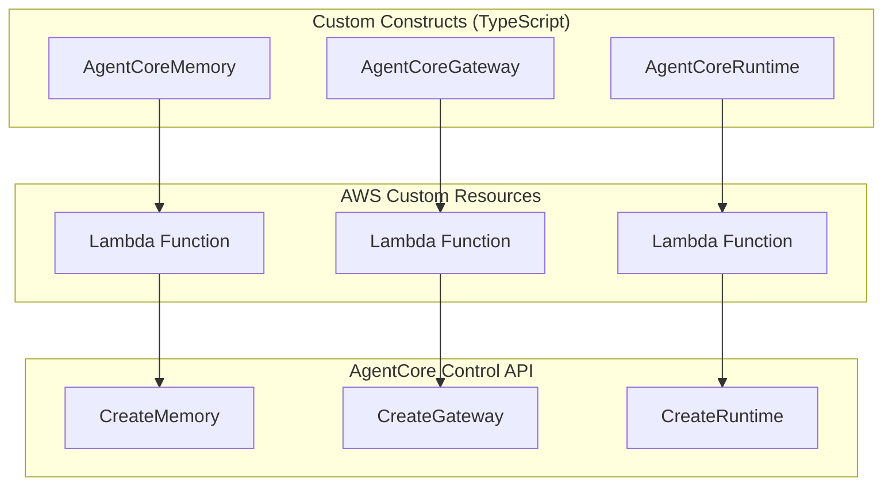
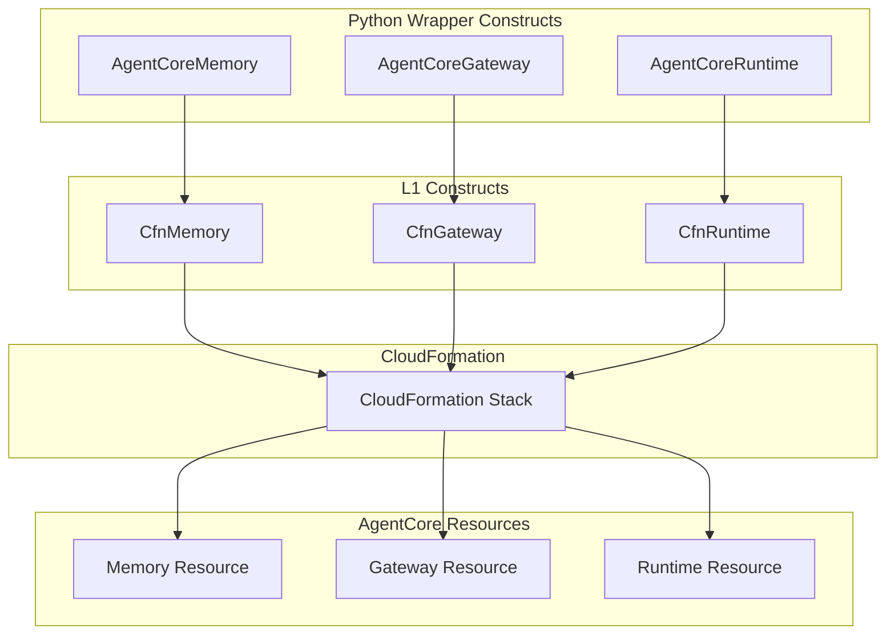

# Design Document

## Overview

This design document outlines the migration from custom AgentCore constructs to
GA CloudFormation L1 constructs. The migration will replace three custom
resource implementations (`AgentCoreMemory`, `AgentCoreGateway`, and
`AgentCoreRuntime`) with Python wrapper constructs that use the corresponding L1
constructs (`CfnMemory`, `CfnGateway`, and `CfnRuntime`) from the
`aws_cdk.aws_bedrockagentcore` module.

## Migration Compatibility Analysis

After analyzing the L1 constructs documentation, **all functionality from the
custom constructs can be migrated** to the L1 constructs:

### Memory Construct Compatibility ✅

- **Event expiry duration**: Supported (required property)
- **Memory strategies**: Fully supported with semantic, summary, user
  preference, and custom strategies
- **Encryption**: KMS key ARN support maintained
- **Execution role**: Memory execution role ARN supported
- **Namespaces**: Supported within memory strategies

### Gateway Construct Compatibility ✅

- **JWT Authorization**: Full support for custom JWT authorizer with discovery
  URL, allowed audiences, and clients
- **MCP Protocol**: Native support for MCP protocol type and configuration
- **Semantic Search**: Supported via protocol configuration
- **Exception Level**: DEBUG level supported
- **KMS Encryption**: KMS key ARN support maintained
- **Gateway Targets**: Separate CfnGatewayTarget construct for Lambda
  integration
- **Outbound OAuth**: Full support for OAuth2 credential providers via AgentCore
  Identity service
  - `providerArn` is the ARN returned from `CreateOauth2CredentialProvider` API
  - Supports built-in providers (Google, GitHub, Slack, Salesforce, Microsoft,
    etc.) and custom OAuth2
  - Credential provider ARN format:
    `arn:aws:acps:region:account:token-vault/vault-id/oauth2credentialprovider/provider-name`

### Runtime Construct Compatibility ✅

- **Container Configuration**: Full support for container URI from Docker assets
- **Network Configuration**: Support for both PUBLIC and VPC network modes with
  security groups/subnets
- **Authorization**: Support for both IAM SigV4 and custom JWT authorizers
- **Environment Variables**: Direct support for environment variable mapping
- **Protocol Configuration**: Support for MCP and HTTP server protocols

**Conclusion**: No functionality will be lost in the migration. The L1
constructs provide equivalent or enhanced capabilities compared to the custom
resources.

## Current Project OAuth2 Usage Analysis

The current project uses OAuth2 in the following ways:

1. **Inbound Authentication**: Cognito User Pool with JWT tokens for MCP client
   authentication
2. **Outbound Authentication**: IAM roles for Lambda function invocation (no
   OAuth2 credential providers currently used)

**OAuth2 Credential Provider Requirements**: The current project does **NOT**
require OAuth2 credential providers because:

- Gateway targets are Lambda functions (use IAM role authentication)
- No external API integrations requiring OAuth2 (GitHub, Slack, etc.)
- Hotel PMS is implemented as a Lambda function, not an external
  OAuth2-protected service

**Future Considerations**: If the project later needs to integrate with external
OAuth2-protected APIs, OAuth2 credential providers would need to be created
using:

- **Custom Resource**: Since there's no native CloudFormation resource for
  OAuth2 credential providers yet
- **Manual Creation**: Via CLI/API calls outside of CDK
- **Separate Stack**: Dedicated stack for credential provider management

## Critical Authentication Issue Identified

During testing of the migrated L1 constructs, a critical authentication issue
was discovered:

### Problem Analysis

The AgentCore Runtime is failing to authenticate with the Hotel PMS Gateway with
the following error:

```
ERROR: OAuth2 token request failed: No description provided
HTTP 400 Bad Request from Cognito token endpoint
```

### Root Cause

Comparison with the original TypeScript constructs revealed that the Python
implementation is missing critical OAuth2 configuration:

1. **Missing Client Credentials Flow**: The Cognito User Pool Client is not
   configured with `client_credentials` OAuth flow
2. **Missing Resource Server**: No resource server with appropriate scopes for
   machine-to-machine authentication
3. **Incorrect OAuth Settings**: The client is configured for authorization code
   flow instead of client credentials

### Original vs Current Configuration

**Original TypeScript Implementation:**

```typescript
oAuth: {
  flows: {
    clientCredentials: true,  // ✅ Enabled for M2M
    authorizationCodeGrant: false,
    implicitCodeGrant: false,
  },
  scopes: [
    cognito.OAuthScope.resourceServer(resourceServer, readScope),
    cognito.OAuthScope.resourceServer(resourceServer, writeScope),
  ],
}
```

**Current Python Implementation (Incorrect):**

```python
oauth_settings = cognito.OAuthSettings(
    flows=cognito.OAuthFlows(
        authorization_code_grant=True,  # ❌ Wrong flow
        implicit_code_grant=True,       # ❌ Wrong flow
        client_credentials=True,        # ✅ Correct but overridden
    ),
    callback_urls=props.callback_urls,  # ❌ Not needed for M2M
)
```

### Required Fix

The AgentCoreCognitoUserPool construct must be updated to:

1. Enable only `client_credentials` OAuth flow for machine-to-machine
   authentication
2. Create a resource server with read/write scopes
3. Remove callback URLs and other OAuth settings not needed for M2M
4. Configure the client for machine-to-machine authentication only

## Architecture

### Current Architecture (Custom Resources)



### Target Architecture (L1 Constructs)



## Components and Interfaces

### 1. AgentCore Memory Wrapper

**File:** `packages/common/constructs/src/agentcore_memory.py`

```python
from typing import List, Optional
from aws_cdk import aws_iam as iam, aws_bedrockagentcore as bedrockagentcore
from constructs import Construct

class MemoryStrategyConfig:
    def __init__(
        self,
        strategy_type: str,  # 'SEMANTIC_MEMORY' | 'SUMMARY_MEMORY' | 'USER_PREFERENCE_MEMORY'
        description: Optional[str] = None,
        namespaces: Optional[List[str]] = None
    ):
        self.strategy_type = strategy_type
        self.description = description
        self.namespaces = namespaces

class AgentCoreMemoryProps:
    def __init__(
        self,
        event_expiry_duration: int,
        memory_name: Optional[str] = None,
        description: Optional[str] = None,
        memory_strategies: Optional[List[MemoryStrategyConfig]] = None,
        memory_execution_role_arn: Optional[str] = None,
        encryption_key_arn: Optional[str] = None
    ):
        self.memory_name = memory_name
        self.description = description
        self.event_expiry_duration = event_expiry_duration
        self.memory_strategies = memory_strategies
        self.memory_execution_role_arn = memory_execution_role_arn
        self.encryption_key_arn = encryption_key_arn

class AgentCoreMemory(Construct):
    def __init__(self, scope: Construct, construct_id: str, props: AgentCoreMemoryProps):
        super().__init__(scope, construct_id)

        # Validate and create CfnMemory
        self._cfn_memory = bedrockagentcore.CfnMemory(
            self, "Memory",
            name=props.memory_name or self._generate_unique_name(),
            event_expiry_duration=props.event_expiry_duration,
            description=props.description,
            memory_execution_role_arn=props.memory_execution_role_arn,
            encryption_key_arn=props.encryption_key_arn,
            memory_strategies=self._map_memory_strategies(props.memory_strategies)
        )

    @property
    def memory_id(self) -> str:
        return self._cfn_memory.attr_memory_id

    @property
    def memory_arn(self) -> str:
        return self._cfn_memory.attr_memory_arn

    def grant(self, grantee: iam.IGrantable, *actions: str) -> iam.Grant:
        # Grant permissions to memory resource
        pass
```

### 2. AgentCore Gateway Wrapper

**File:** `packages/common/constructs/src/agentcore_gateway.py`

```python
from typing import Optional, List, Dict, Any
from aws_cdk import aws_iam as iam, aws_bedrockagentcore as bedrockagentcore
from constructs import Construct

class CustomJWTAuthorizerConfig:
    def __init__(
        self,
        discovery_url: str,
        allowed_audience: Optional[List[str]] = None,
        allowed_clients: Optional[List[str]] = None
    ):
        self.discovery_url = discovery_url
        self.allowed_audience = allowed_audience
        self.allowed_clients = allowed_clients

class AgentCoreGatewayProps:
    def __init__(
        self,
        execution_role: iam.Role,
        jwt_authorizer: CustomJWTAuthorizerConfig,
        gateway_name: Optional[str] = None,
        description: Optional[str] = None,
        enable_semantic_search: Optional[bool] = False,
        exception_level: Optional[str] = None,
        kms_key_arn: Optional[str] = None,
        instructions: Optional[str] = None
    ):
        self.gateway_name = gateway_name
        self.description = description
        self.execution_role = execution_role
        self.jwt_authorizer = jwt_authorizer
        self.enable_semantic_search = enable_semantic_search
        self.exception_level = exception_level
        self.kms_key_arn = kms_key_arn
        self.instructions = instructions

class AgentCoreGateway(Construct):
    def __init__(self, scope: Construct, construct_id: str, props: AgentCoreGatewayProps):
        super().__init__(scope, construct_id)

        # Create CfnGateway with mapped properties
        self._cfn_gateway = bedrockagentcore.CfnGateway(
            self, "Gateway",
            name=props.gateway_name or self._generate_unique_name(),
            description=props.description,
            protocol_type="MCP",
            role_arn=props.execution_role.role_arn,
            authorizer_type="CUSTOM_JWT",
            authorizer_configuration=self._build_authorizer_config(props.jwt_authorizer),
            protocol_configuration=self._build_protocol_config(props),
            exception_level=props.exception_level,
            kms_key_arn=props.kms_key_arn
        )

    @property
    def gateway_id(self) -> str:
        return self._cfn_gateway.attr_gateway_id

    @property
    def gateway_arn(self) -> str:
        return self._cfn_gateway.attr_gateway_arn

    @property
    def gateway_url(self) -> str:
        return self._cfn_gateway.attr_gateway_url
```

### 3. AgentCore Runtime Wrapper

**File:** `packages/common/constructs/src/agentcore_runtime.py`

```python
from typing import Optional, Dict
from aws_cdk import aws_iam as iam, aws_bedrockagentcore as bedrockagentcore
from aws_cdk.aws_ecr_assets import DockerImageAsset
from constructs import Construct

class AgentCoreRuntimeProps:
    def __init__(
        self,
        container: DockerImageAsset,
        server_protocol: str,  # 'MCP' | 'HTTP'
        runtime_name: Optional[str] = None,
        authorizer_configuration: Optional[Dict] = None,
        environment_variables: Optional[Dict[str, str]] = None,
        network_configuration: Optional[Dict] = None
    ):
        self.runtime_name = runtime_name
        self.container = container
        self.server_protocol = server_protocol
        self.authorizer_configuration = authorizer_configuration
        self.environment_variables = environment_variables
        self.network_configuration = network_configuration

class AgentCoreRuntime(Construct):
    def __init__(self, scope: Construct, construct_id: str, props: AgentCoreRuntimeProps):
        super().__init__(scope, construct_id)

        # Create execution role
        self.agent_core_role = self._create_execution_role()

        # Create CfnRuntime
        self._cfn_runtime = bedrockagentcore.CfnRuntime(
            self, "Runtime",
            agent_runtime_name=props.runtime_name or self._generate_unique_name(),
            agent_runtime_artifact=self._build_artifact_config(props.container),
            network_configuration=props.network_configuration or {"networkMode": "PUBLIC"},
            role_arn=self.agent_core_role.role_arn,
            authorizer_configuration=props.authorizer_configuration,
            environment_variables=props.environment_variables,
            protocol_configuration=props.server_protocol
        )

    @property
    def agent_runtime_arn(self) -> str:
        return self._cfn_runtime.attr_agent_runtime_arn

    @property
    def agent_runtime_id(self) -> str:
        return self._cfn_runtime.attr_agent_runtime_id
```

## Data Models

### Memory Strategy Configuration Mapping

The L1 constructs support more memory strategy types than the current custom
constructs:

```python
# Current custom construct strategies
SEMANTIC_MEMORY = "SEMANTIC_MEMORY"
SUMMARY_MEMORY = "SUMMARY_MEMORY"

# L1 construct strategies (expanded)
SEMANTIC_MEMORY = "semanticMemoryStrategy"
SUMMARY_MEMORY = "summaryMemoryStrategy"
USER_PREFERENCE_MEMORY = "userPreferenceMemoryStrategy"  # New in L1
CUSTOM_MEMORY = "customMemoryStrategy"  # New in L1
```

**Mapping Logic:**

- Map strategy types to appropriate L1 construct property names
- Preserve description and namespace configuration
- Support new strategy types for future enhancement

### Gateway Configuration Mapping

JWT authorizer configuration maps directly:

```python
# Custom construct format
jwt_config = {
    "discovery_url": "https://cognito-idp.region.amazonaws.com/pool_id/.well-known/openid-configuration",
    "allowed_clients": ["client_id"]
}

# L1 construct format
authorizer_configuration = {
    "customJwtAuthorizer": {
        "discoveryUrl": jwt_config["discovery_url"],
        "allowedClients": jwt_config["allowed_clients"]
    }
}
```

### Runtime Container Configuration Mapping

Container configuration requires extracting image URI from Docker asset:

```python
# Custom construct
container_asset = DockerImageAsset(...)

# L1 construct mapping
agent_runtime_artifact = {
    "containerConfiguration": {
        "containerUri": container_asset.image_uri
    }
}
```

### OAuth2 Credential Provider Configuration

For gateway targets that require outbound OAuth2 authentication, the
`providerArn` comes from creating an OAuth2 credential provider:

```python
# Create OAuth2 credential provider using AgentCore Identity service
# This would typically be done outside the CDK construct, either via CLI or separate API call
# aws bedrock-agentcore-control create-oauth2-credential-provider \
#   --name "github-provider" \
#   --credential-provider-vendor "GithubOauth2" \
#   --oauth2-provider-config-input '{"githubOauth2ProviderConfig": {"clientId": "...", "clientSecret": "..."}}'

# The response includes the credentialProviderArn:
# "credentialProviderArn": "arn:aws:acps:us-east-1:123456789012:token-vault/vault-id/oauth2credentialprovider/github-provider"

# Use in gateway target configuration
credential_provider_configurations = [
    {
        "credentialProviderType": "OAUTH2",
        "credentialProvider": {
            "oauth2CredentialProvider": {
                "providerArn": "arn:aws:acps:us-east-1:123456789012:token-vault/vault-id/oauth2credentialprovider/github-provider"
            }
        }
    }
]
```

**Supported OAuth2 Providers:**

- Built-in: Google, GitHub, Slack, Salesforce, Microsoft, Atlassian, LinkedIn, X
  (Twitter), Okta, OneLogin, PingOne, Facebook, Yandex, Reddit, Zoom, Twitch,
  Spotify, Dropbox, Notion, HubSpot, CyberArk, FusionAuth, Auth0, Cognito
- Custom OAuth2 providers with configurable discovery URLs

## Error Handling

### Validation Strategy

1. **Input Validation at Construct Level:**
   - Validate required properties before L1 construct creation
   - Check ARN formats and constraints
   - Validate strategy configurations and mappings

2. **L1 Construct Native Validation:**
   - CloudFormation validates properties at deployment time
   - Better error messages for invalid configurations
   - Automatic constraint checking

3. **Deployment Error Handling:**
   - CloudFormation handles resource creation failures
   - Standard rollback behavior on errors
   - No custom Lambda debugging required

## Testing Strategy

### Unit Testing

1. **Wrapper Construct Tests:**
   - Test property mapping from wrapper to L1 constructs
   - Validate error handling for invalid configurations
   - Test unique name generation

2. **Interface Compatibility Tests:**
   - Verify public properties return correct values
   - Test grant methods for memory construct
   - Validate CloudFormation output generation

### Integration Testing

1. **Stack Deployment Tests:**
   - Deploy test stacks with L1 wrapper constructs
   - Verify resources created with correct properties
   - Test resource lifecycle (create/update/delete)

2. **Functional Tests:**
   - Test memory integration with virtual assistant
   - Verify gateway MCP connectivity
   - Test runtime container deployment

## Migration Implementation Plan

### Phase 1: Create Python Wrapper Constructs

1. **Create new Python wrapper files in `packages/common/constructs/src/`:**
   - `agentcore_memory.py`
   - `agentcore_gateway.py`
   - `agentcore_runtime.py`
   - `agentcore_cognito.py` (if needed)

2. **Implement wrapper logic:**
   - Property validation and mapping to L1 constructs
   - Maintain same public interface as TypeScript versions
   - Add comprehensive error handling

3. **Update `__init__.py` exports:**
   - Export new Python constructs
   - Maintain backward compatibility during transition

### Phase 2: Update Infrastructure Code

1. **Update Python stack files:**
   - Replace TypeScript construct imports with Python imports
   - Update construct instantiation calls
   - Verify all properties are correctly mapped

2. **Update CDK Nag suppressions:**
   - Remove custom resource specific suppressions
   - Add L1 construct specific suppressions as needed

### Phase 3: Testing and Validation

1. **Deploy to development environment:**
   - Destroy existing stack with custom resources
   - Deploy new stack with L1 wrapper constructs
   - Verify all resources created correctly

2. **Run comprehensive tests:**
   - Test virtual assistant chat functionality
   - Verify MCP gateway connectivity with hotel PMS
   - Test container runtime deployment and scaling

### Phase 4: Cleanup and Documentation

1. **Remove TypeScript constructs:**
   - Delete original TypeScript construct files
   - Remove TypeScript build dependencies
   - Clean up package.json and tsconfig files

2. **Update documentation:**
   - Document new Python construct usage
   - Update deployment guides
   - Add migration notes and troubleshooting

## Security Considerations

### Improved Security Model

1. **No Custom Lambda Functions:**
   - Eliminates custom resource Lambda security risks
   - Reduces attack surface area
   - No need for Lambda execution role permissions

2. **CloudFormation Native Security:**
   - Standard CloudFormation service-linked roles
   - AWS-managed security policies
   - Reduced IAM complexity

3. **Maintained Encryption:**
   - KMS key support preserved for all resources
   - Data-at-rest encryption continues
   - Network encryption maintained

## Performance Optimization

### Deployment Performance

1. **Faster Resource Creation:**
   - No Lambda cold start delays
   - Direct CloudFormation resource creation
   - Parallel resource provisioning

2. **Simplified Dependency Management:**
   - Cleaner resource dependency graphs
   - Faster CloudFormation operations
   - Improved rollback performance

### Runtime Performance

1. **Direct Service Integration:**
   - No Lambda proxy overhead
   - Direct AgentCore API access
   - Better connection pooling

2. **Native CloudFormation Management:**
   - Faster resource updates
   - Better scaling characteristics
   - Improved monitoring integration

## Critical Authentication Issue Identified

During testing of the migrated L1 constructs, a critical authentication issue
was discovered:

### Problem Analysis

The AgentCore Runtime is failing to authenticate with the Hotel PMS Gateway with
the following error:

```
ERROR: OAuth2 token request failed: No description provided
HTTP 400 Bad Request from Cognito token endpoint
```

### Root Cause

Comparison with the original TypeScript constructs revealed that the Python
implementation is missing critical OAuth2 configuration:

1. **Missing Client Credentials Flow**: The Cognito User Pool Client is not
   configured with `client_credentials` OAuth flow
2. **Missing Resource Server**: No resource server with appropriate scopes for
   machine-to-machine authentication
3. **Incorrect OAuth Settings**: The client is configured for authorization code
   flow instead of client credentials

### Original vs Current Configuration

**Original TypeScript Implementation:**

```typescript
oAuth: {
  flows: {
    clientCredentials: true,  // ✅ Enabled for M2M
    authorizationCodeGrant: false,
    implicitCodeGrant: false,
  },
  scopes: [
    cognito.OAuthScope.resourceServer(resourceServer, readScope),
    cognito.OAuthScope.resourceServer(resourceServer, writeScope),
  ],
}
```

**Current Python Implementation (Incorrect):**

```python
oauth_settings = cognito.OAuthSettings(
    flows=cognito.OAuthFlows(
        authorization_code_grant=True,  # ❌ Wrong flow
        implicit_code_grant=True,       # ❌ Wrong flow
        client_credentials=True,        # ✅ Correct but overridden
    ),
    callback_urls=props.callback_urls,  # ❌ Not needed for M2M
)
```

### Required Fix

The AgentCoreCognitoUserPool construct must be updated to:

1. **Enable only `client_credentials` OAuth flow** for machine-to-machine
   authentication
2. **Create a resource server** with identifier "gateway-resource-server" and
   scopes:
   ```python
   read_scope = cognito.ResourceServerScope(
       scope_name="read",
       scope_description="Read access"
   )
   write_scope = cognito.ResourceServerScope(
       scope_name="write",
       scope_description="Write access"
   )
   resource_server = user_pool.add_resource_server("GatewayResourceServer",
       identifier="gateway-resource-server",
       scopes=[read_scope, write_scope]
   )
   ```
3. **Configure OAuth scopes** using the resource server:
   ```python
   oauth_settings = cognito.OAuthSettings(
       flows=cognito.OAuthFlows(client_credentials=True),  # Only M2M flow
       scopes=[
           cognito.OAuthScope.resource_server(resource_server, read_scope),
           cognito.OAuthScope.resource_server(resource_server, write_scope),
       ]
   )
   ```
4. **Remove callback URLs** and other OAuth settings not needed for M2M
5. **Configure the client** for machine-to-machine authentication only with
   `generate_secret=True`

This design provides a comprehensive migration path that maintains full
functionality while improving reliability, security, and performance through
native CloudFormation L1 constructs.
