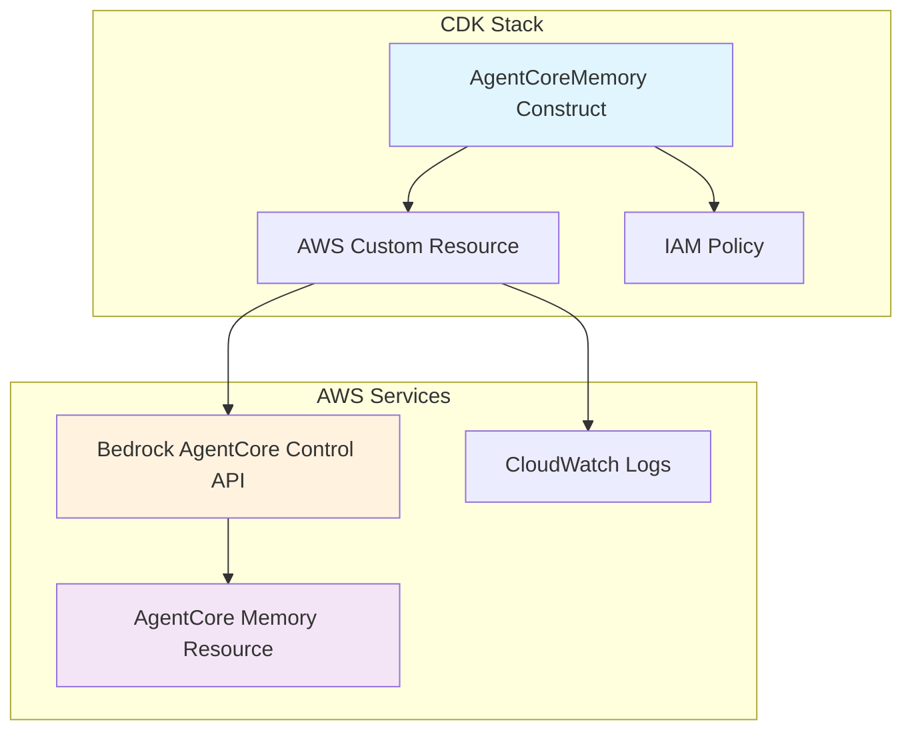

# Design Document

## Overview

The AgentCore Memory construct will be a CDK construct that manages Amazon
Bedrock AgentCore Memory resources using AWS Custom Resources. It follows the
same patterns established by the existing AgentCore constructs in the common
constructs package, using the `aws-cdk-lib/custom-resources` module to make
direct API calls to the bedrock-agentcore-control service.

## Architecture

### High-Level Architecture



### Component Interaction

1. **AgentCoreMemory Construct**: Main CDK construct that developers interact
   with
2. **AWS Custom Resource**: Handles CREATE/UPDATE/DELETE operations via
   bedrock-agentcore-control APIs
3. **IAM Policy**: Grants necessary permissions for the custom resource Lambda
   to call AgentCore APIs
4. **Memory Resource**: The actual AgentCore Memory resource managed by AWS

## Components and Interfaces

### TypeScript Interfaces

```typescript
export interface MemoryStrategyConfig {
  readonly type: 'SEMANTIC_MEMORY' | 'SUMMARY_MEMORY';
  readonly description?: string;
  readonly namespaces?: string[];
}

export interface AgentCoreMemoryProps {
  readonly memoryName: string;
  readonly description?: string;
  readonly eventExpiryDuration: number; // 7-365 days
  readonly memoryStrategies?: MemoryStrategyConfig[];
  readonly memoryExecutionRoleArn?: string;
  readonly encryptionKeyArn?: string;
}

export class AgentCoreMemory extends Construct implements IGrantable {
  public readonly memoryId: string;
  public readonly memoryArn: string;
  public readonly grantPrincipal: iam.IPrincipal;

  constructor(scope: Construct, id: string, props: AgentCoreMemoryProps);

  public grant(grantee: iam.IGrantable, ...actions: string[]): iam.Grant;
}
```

### Core Implementation Structure

```typescript
export class AgentCoreMemory extends Construct implements IGrantable {
  private readonly customResource: custom.AwsCustomResource;

  constructor(scope: Construct, id: string, props: AgentCoreMemoryProps) {
    super(scope, id);

    // Validate props
    this.validateProps(props);

    // Create custom resource for memory management
    this.customResource = new custom.AwsCustomResource(this, 'Memory', {
      onCreate: {
        service: 'bedrock-agentcore-control',
        action: 'CreateMemory',
        parameters: this.buildCreateParameters(props),
        physicalResourceId: custom.PhysicalResourceId.fromResponse('memory.id'),
      },
      onUpdate: {
        service: 'bedrock-agentcore-control',
        action: 'UpdateMemory',
        parameters: this.buildUpdateParameters(props),
        physicalResourceId: custom.PhysicalResourceId.fromResponse('memory.id'),
      },
      onDelete: {
        service: 'bedrock-agentcore-control',
        action: 'DeleteMemory',
        parameters: {
          memoryId: new custom.PhysicalResourceIdReference(),
        },
      },
      policy: this.createCustomResourcePolicy(),
      installLatestAwsSdk: true,
    });

    // Set public properties
    this.memoryId = this.customResource.getResponseField('memory.id');
    this.memoryArn = this.customResource.getResponseField('memory.arn');
    this.grantPrincipal = this.customResource;
  }
}
```

## Data Models

### Memory Strategy Configuration

The construct will support built-in memory strategies with simple configuration:

```typescript
// Semantic Memory Strategy - stores facts and knowledge
{
  type: 'SEMANTIC_MEMORY',
  description: 'Stores conversation facts and knowledge',
  namespaces: ['hotel-guest-preferences', 'booking-history']
}

// Summary Memory Strategy - maintains conversation summaries
{
  type: 'SUMMARY_MEMORY',
  description: 'Maintains running conversation summaries',
  namespaces: ['session-summaries']
}
```

### API Parameter Mapping

#### CreateMemory Parameters

```typescript
private buildCreateParameters(props: AgentCoreMemoryProps) {
  const params: any = {
    name: props.memoryName,
    eventExpiryDuration: props.eventExpiryDuration,
  };

  if (props.description) params.description = props.description;
  if (props.memoryExecutionRoleArn) params.memoryExecutionRoleArn = props.memoryExecutionRoleArn;
  if (props.encryptionKeyArn) params.encryptionKeyArn = props.encryptionKeyArn;

  if (props.memoryStrategies && props.memoryStrategies.length > 0) {
    params.memoryStrategies = props.memoryStrategies.map(strategy => ({
      type: strategy.type,
      description: strategy.description,
      namespaces: strategy.namespaces,
      configuration: {
        type: strategy.type
      }
    }));
  }

  return params;
}
```

#### UpdateMemory Parameters

```typescript
private buildUpdateParameters(props: AgentCoreMemoryProps) {
  const params: any = {
    memoryId: new custom.PhysicalResourceIdReference(),
  };

  if (props.description) params.description = props.description;
  if (props.eventExpiryDuration) params.eventExpiryDuration = props.eventExpiryDuration;
  if (props.memoryExecutionRoleArn) params.memoryExecutionRoleArn = props.memoryExecutionRoleArn;

  // For simplicity in this prototype, we'll replace all strategies on update
  // rather than implementing complex add/modify/delete logic
  if (props.memoryStrategies) {
    params.memoryStrategies = {
      addMemoryStrategies: props.memoryStrategies.map(strategy => ({
        type: strategy.type,
        description: strategy.description,
        namespaces: strategy.namespaces,
        configuration: {
          type: strategy.type
        }
      }))
    };
  }

  return params;
}
```

## Error Handling

### Validation

- Validate `eventExpiryDuration` is between 7 and 365 days
- Validate `memoryName` follows AWS naming conventions (alphanumeric, hyphens,
  underscores)
- Validate ARN formats for execution role and encryption key
- Validate memory strategy types are supported

### API Error Handling

The custom resource will handle common AgentCore API errors:

- `AccessDeniedException`: Insufficient permissions
- `ConflictException`: Resource name conflicts
- `ResourceNotFoundException`: Resource not found during update/delete
- `ServiceQuotaExceededException`: Service limits exceeded
- `ValidationException`: Invalid parameters

### Error Recovery

- Failed CREATE operations will be retried by CloudFormation
- Failed UPDATE operations will leave the resource in its previous state
- Failed DELETE operations will be logged but won't fail stack deletion

## Testing Strategy

### Unit Tests

- Test construct creation with various property combinations
- Test parameter building for CREATE/UPDATE operations
- Test validation logic for props
- Test grant method functionality

### Integration Tests

- Test actual memory creation/update/deletion with AWS APIs
- Test IAM permission granting
- Test error scenarios and recovery

### Example Usage Tests

```typescript
// Basic memory creation
const memory = new AgentCoreMemory(this, 'TestMemory', {
  memoryName: 'hotel-assistant-memory',
  eventExpiryDuration: 30,
  description: 'Memory for hotel assistant conversations',
  memoryStrategies: [
    {
      type: 'SEMANTIC_MEMORY',
      description: 'Store guest preferences and facts',
      namespaces: ['guest-preferences'],
    },
  ],
});

// Grant permissions to a role
memory.grant(
  agentRole,
  'bedrock-agentcore:GetMemory',
  'bedrock-agentcore:PutMemoryEvent'
);
```

## Implementation Plan

### File Structure

```
packages/common/constructs/src/
├── agentcore-memory.ts          # Main construct implementation
├── index.ts                     # Export the new construct
└── __tests__/
    └── agentcore-memory.test.ts # Unit tests
```

### Dependencies

- `aws-cdk-lib`: Core CDK library
- `aws-cdk-lib/custom-resources`: For AWS API calls
- `aws-cdk-lib/aws-iam`: For IAM permissions
- `constructs`: Base construct class

### IAM Permissions Required

The custom resource will need these permissions:

```json
{
  "Version": "2012-10-17",
  "Statement": [
    {
      "Effect": "Allow",
      "Action": [
        "bedrock-agentcore:CreateMemory",
        "bedrock-agentcore:UpdateMemory",
        "bedrock-agentcore:DeleteMemory",
        "bedrock-agentcore:GetMemory"
      ],
      "Resource": "*"
    }
  ]
}
```

### Grant Method Implementation

```typescript
public grant(grantee: iam.IGrantable, ...actions: string[]): iam.Grant {
  const memoryActions = actions.length > 0 ? actions : [
    'bedrock-agentcore:GetMemory',
    'bedrock-agentcore:PutMemoryEvent',
    'bedrock-agentcore:GetMemoryEvents',
    'bedrock-agentcore:DeleteMemoryEvents'
  ];

  return iam.Grant.addToPrincipal({
    grantee,
    actions: memoryActions,
    resourceArns: [this.memoryArn],
    scope: this,
  });
}
```

This design provides a simple, prototype implementation that follows existing
patterns while supporting the core AgentCore Memory functionality needed for the
hotel assistant use case.
