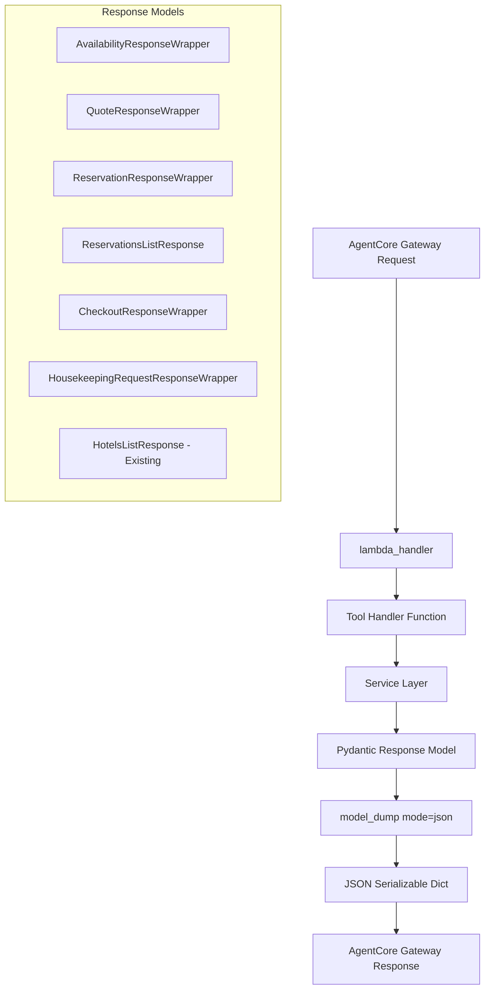

# Design Document

## Overview

This design outlines the conversion of AgentCore handler functions from
returning raw dictionaries to returning Pydantic models. The solution ensures
type safety, consistent JSON serialization, and maintains backward compatibility
while improving the developer experience and system reliability.

## Architecture

### Current State Analysis

The current implementation has the following characteristics:

- `handle_get_hotels()` already returns a `HotelsListResponse` Pydantic model ✅
- All other handlers return `Dict[str, Any]` which can cause JSON serialization
  issues
- The `lambda_handler` has logic to detect Pydantic models and call
  `model_dump(mode='json')`
- Existing tests verify JSON serialization for some handlers but not
  consistently

### Target Architecture



## Components and Interfaces

### Response Model Classes

#### 1. Availability Response Wrapper

```python
class AvailabilityResponseWrapper(BaseModel):
    """Wrapper for availability check response."""
    availability: AvailabilityResponse

    class Config:
        json_encoders = {
            datetime: lambda v: v.isoformat(),
            date: lambda v: v.isoformat()
        }
```

#### 2. Quote Response Wrapper

```python
class QuoteResponseWrapper(BaseModel):
    """Wrapper for quote generation response."""
    quote: QuoteResponse

    class Config:
        json_encoders = {
            datetime: lambda v: v.isoformat(),
            date: lambda v: v.isoformat(),
            Decimal: lambda v: float(v)
        }
```

#### 3. Reservation Response Models

```python
class ReservationResponseWrapper(BaseModel):
    """Wrapper for single reservation response."""
    reservation: Reservation

class ReservationsListResponse(BaseModel):
    """Response for multiple reservations."""
    reservations: list[Reservation]
    total_count: int
```

#### 4. Guest Service Response Models

```python
class CheckoutResponseWrapper(BaseModel):
    """Wrapper for checkout response."""
    checkout: CheckoutResponse

class HousekeepingRequestResponseWrapper(BaseModel):
    """Wrapper for housekeeping request response."""
    request: HousekeepingRequest
```

### Handler Function Signatures

Each handler function will be updated with proper type annotations:

```python
def handle_check_availability(parameters: dict[str, Any]) -> AvailabilityResponseWrapper:
def handle_generate_quote(parameters: dict[str, Any]) -> QuoteResponseWrapper:
def handle_create_reservation(parameters: dict[str, Any]) -> ReservationResponseWrapper:
def handle_get_reservations(parameters: dict[str, Any]) -> ReservationsListResponse:
def handle_get_reservation(parameters: dict[str, Any]) -> ReservationResponseWrapper:
def handle_update_reservation(parameters: dict[str, Any]) -> ReservationResponseWrapper:
def handle_checkout_guest(parameters: dict[str, Any]) -> CheckoutResponseWrapper:
def handle_create_housekeeping_request(parameters: dict[str, Any]) -> HousekeepingRequestResponseWrapper:
def handle_get_hotels(parameters: dict[str, Any]) -> HotelsListResponse:  # Already implemented
```

### Lambda Handler Integration

The existing `lambda_handler` logic already supports Pydantic models:

```python
# Existing logic that will work with all new models
if hasattr(result, "model_dump"):
    return result.model_dump(mode="json")
elif isinstance(result, list) and result and hasattr(result[0], "model_dump"):
    return [item.model_dump(mode="json") for item in result]
else:
    return result
```

## Data Models

### Wrapper Pattern Design

The design uses a consistent wrapper pattern for single-entity responses:

1. **Single Entity Responses**: Use wrapper classes that contain the main entity
   - `AvailabilityResponseWrapper.availability`
   - `QuoteResponseWrapper.quote`
   - `ReservationResponseWrapper.reservation`
   - `CheckoutResponseWrapper.checkout`
   - `HousekeepingRequestResponseWrapper.request`

2. **List Responses**: Include both the list and metadata
   - `ReservationsListResponse.reservations` + `total_count`
   - `HotelsListResponse.hotels` + `total_count` (existing)

### JSON Serialization Strategy

#### Pydantic V2 Approach

Using `model_dump(mode='json')` which automatically handles:

- `datetime` objects → ISO format strings
- `date` objects → ISO format strings
- `Decimal` objects → float values
- Nested Pydantic models → dictionaries

#### Fallback Custom Encoder

The existing `CustomJSONEncoder` class will remain as a fallback for any edge
cases:

```python
class CustomJSONEncoder(json.JSONEncoder):
    def default(self, obj):
        if isinstance(obj, Decimal):
            return float(obj)
        elif isinstance(obj, date | datetime):
            return obj.isoformat()
        return super().default(obj)
```

## Error Handling

### Exception Handling Strategy

1. **Maintain Existing Behavior**: All existing exception handling logic remains
   unchanged
2. **Pydantic Validation Errors**: Add handling for `PydanticValidationError` if
   needed
3. **JSON Serialization Errors**: The `model_dump(mode='json')` approach should
   eliminate these

### Error Response Models

Error responses will continue to use the existing exception handling mechanism
in `lambda_handler`:

```python
except HotelPMSError as e:
    # Existing error handling logic
    logger.error(f"Hotel PMS error in tool {tool_name}", ...)
    raise

except Exception as e:
    # Existing error handling logic
    logger.error(f"Unexpected error in tool {tool_name}", ...)
    raise
```

## Testing Strategy

### Test Structure Updates

#### 1. Assertion Pattern Changes

```python
# OLD: Dictionary assertions
assert "field" in result
assert result["field"] == value

# NEW: Pydantic model assertions
assert hasattr(result, "field")
assert result.field == value
```

#### 2. JSON Serialization Tests

Every successful test case will include:

```python
# Verify JSON serialization works
json_data = result.model_dump(mode='json')
json_string = json.dumps(json_data)
parsed_back = json.loads(json_string)
assert parsed_back == json_data
```

#### 3. Datetime Serialization Tests

For handlers with datetime fields:

```python
# Verify datetime serialization
json_data = result.model_dump(mode='json')
if 'created_at' in json_data:
    assert isinstance(json_data['created_at'], str)
    # Verify it's a valid ISO format
    datetime.fromisoformat(json_data['created_at'].replace('Z', '+00:00'))
```

### Test Categories

1. **Model Structure Tests**: Verify Pydantic model attributes and types
2. **JSON Serialization Tests**: Verify `json.dumps()` compatibility
3. **Datetime Handling Tests**: Verify proper datetime serialization
4. **Error Scenario Tests**: Verify exception handling remains unchanged
5. **Backward Compatibility Tests**: Verify same data content is returned

## Implementation Approach

### Phase 1: Response Model Creation

1. Create all wrapper classes in `agentcore_handler.py`
2. Add proper imports for existing service response models
3. Ensure all models have proper type hints

### Phase 2: Handler Function Updates

1. Update function signatures with return type annotations
2. Modify return statements to wrap responses in appropriate models
3. Update `get_reservations` to return `ReservationsListResponse`

### Phase 3: Test Updates

1. Update all existing test assertions to work with Pydantic models
2. Add JSON serialization verification to all successful test cases
3. Add specific datetime serialization tests where applicable

### Phase 4: Validation and Integration

1. Run full test suite to ensure no regressions
2. Test MCP server integration end-to-end
3. Verify AgentCore Gateway compatibility

## Performance Considerations

### Memory Usage

- Pydantic models have minimal memory overhead compared to dictionaries
- The wrapper pattern adds one additional object layer but provides type safety
  benefits

### Serialization Performance

- `model_dump(mode='json')` is optimized for JSON serialization
- Eliminates runtime JSON serialization errors
- Slightly faster than custom JSON encoders for complex objects

### Backward Compatibility

- All existing functionality remains unchanged
- Same data content is returned, just wrapped in Pydantic models
- No breaking changes to the API contract

## Monitoring and Observability

### Existing Metrics Preservation

All existing metrics and logging will be preserved:

- Response time tracking
- Error rate monitoring
- Tool usage metrics
- Performance logging

### Enhanced Debugging

Pydantic models provide better debugging capabilities:

- Clear type information in logs
- Automatic validation error messages
- Better IDE support for development

## Security Considerations

### Input Validation

- Existing input validation logic remains unchanged
- Pydantic models provide additional output validation
- No new security vulnerabilities introduced

### Data Sanitization

- All existing sanitization functions (`sanitize_string`, `validate_email`,
  `validate_phone`) remain in use
- Pydantic models add an additional layer of type safety

## Migration Strategy

### Zero-Downtime Deployment

1. The changes are backward compatible at the API level
2. AgentCore Gateway will receive the same JSON structure
3. Internal implementation changes don't affect external consumers

### Rollback Plan

If issues arise:

1. Revert handler functions to return dictionaries
2. Remove wrapper model instantiation
3. Existing `lambda_handler` logic handles both patterns

This design ensures a smooth transition to Pydantic models while maintaining all
existing functionality and improving type safety and JSON serialization
reliability.
