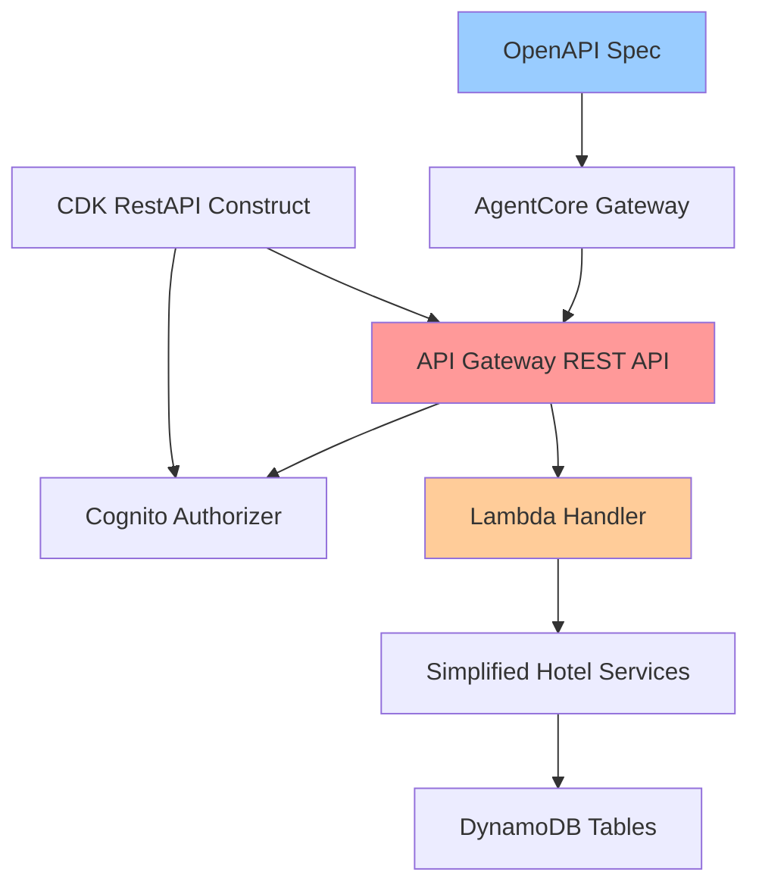

# Design Document

## Overview

The API Gateway with Cognito design provides a REST API layer over the
simplified Hotel PMS system using AWS API Gateway, Lambda, and Cognito for
authentication. The design emphasizes manual management of the OpenAPI
specification to ensure accuracy and AI-friendly descriptions for AgentCore
Gateway integration.

**Key Design Updates Based on AgentCore Gateway Requirements:**

- All operations MUST include `operationId` fields (used as tool names by
  AgentCore Gateway)
- Only `application/json` content type is fully supported
- Authentication handled by AgentCore Gateway, not in OpenAPI spec
- Simple parameter structures (no complex serialization like oneOf, anyOf,
  allOf)
- Manual OpenAPI spec management for accuracy and AI-friendly descriptions

## Architecture

### High-Level Architecture



### Component Responsibilities

- **API Gateway REST API**: HTTP endpoint routing and request/response handling
- **Cognito Authorizer**: JWT token validation for machine-to-machine
  authentication
- **Lambda Handler**: Single function routing requests to appropriate service
  methods
- **OpenAPI Spec**: Manually maintained specification for AgentCore Gateway
  integration
- **CDK RestAPI Construct**: Infrastructure as code for API deployment

## Data Models

### DynamoDB Tables

The API uses the existing DynamoDB tables from the Simplified Hotel PMS plus a
new quotes table:

- **Hotels**: Static hotel information (hotel_id, name, location, timezone)
- **Room Types**: Room type definitions with pricing (room_type_id, hotel_id,
  name, max_occupancy, base_rate)
- **Rate Modifiers**: Pricing adjustments (modifier_id, hotel_id, modifier_type,
  value, date_range)
- **Reservations**: Guest bookings (reservation_id, hotel_id, guest_email,
  status, dates)
- **Requests**: Housekeeping and maintenance requests (request_id, hotel_id,
  room_number, type, status)
- **Quotes**: Generated pricing quotes with expiration (quote_id, hotel_id,
  room_type_id, pricing_details, expires_at)

### Quotes Table Schema

The quotes table stores temporary pricing quotes that expire after a set time:

```python
{
    "quote_id": "Q-2024-001-ABC123",           # Primary key (generated UUID)
    "hotel_id": "H-PVR-002",                  # Hotel identifier
    "room_type_id": "RT-STD",                 # Room type identifier
    "check_in_date": "2024-03-15",            # Check-in date (YYYY-MM-DD)
    "check_out_date": "2024-03-17",           # Check-out date (YYYY-MM-DD)
    "guests": 2,                              # Number of guests
    "nights": 2,                              # Number of nights
    "base_rate": 150.00,                      # Base rate per night
    "guest_multiplier": 1.0,                  # Guest count multiplier
    "total_cost": 300.00,                     # Total calculated cost
    "pricing_breakdown": {                     # Detailed pricing breakdown
        "base_rate_per_night": 150.00,
        "nights": 2,
        "guest_multiplier": 1.0,
        "subtotal": 300.00,
        "total_with_guest_adjustment": 300.00
    },
    "expires_at": "2024-03-15T18:00:00Z",     # Quote expiration timestamp (TTL)
    "created_at": "2024-03-15T12:00:00Z"      # Quote creation timestamp
}
```

**Key Features:**

- **TTL (Time To Live)**: Quotes automatically expire after 6 hours using
  DynamoDB TTL
- **Unique Quote IDs**: Generated using UUID with prefix for easy identification
- **Complete Pricing Details**: Stores all pricing calculations for reservation
  creation
- **Immutable**: Once created, quotes cannot be modified (create new quote if
  needed)

## Components and Interfaces

### Lambda Handler Implementation with Powertools

```python
import json
from typing import Dict, Any

from aws_lambda_powertools import Logger, Tracer
from aws_lambda_powertools.event_handler import APIGatewayRestResolver
from aws_lambda_powertools.event_handler.exceptions import (
    BadRequestError,
    NotFoundError,
    InternalServerError
)
from aws_lambda_powertools.logging import correlation_paths

from hotel_pms_lambda.tools.simplified_tools import (
    check_availability,
    generate_quote,
    create_reservation,
    get_reservations,
    get_reservation,
    update_reservation,
    checkout_guest,
    get_hotels,
    create_housekeeping_request
)

# Initialize Powertools
logger = Logger()
tracer = Tracer()
app = APIGatewayRestResolver()

# Availability endpoints
@app.post("/availability/check")
@tracer.capture_method
def check_availability_handler():
    """Check room availability for a hotel on specific dates"""
    try:
        body = app.current_event.json_body
        logger.info("Processing availability check", extra={"hotel_id": body.get("hotel_id")})

        result = check_availability(**body)


        return result
    except Exception as e:
        logger.error("Availability check failed", extra={"error": str(e)})

        raise BadRequestError("Invalid availability request")

@app.post("/quotes/generate")
@tracer.capture_method
def generate_quote_handler():
    """Generate a detailed pricing quote and store in DynamoDB"""
    try:
        body = app.current_event.json_body
        logger.info("Processing quote generation", extra={"hotel_id": body.get("hotel_id")})

        # Generate quote with DynamoDB persistence
        result = generate_quote(**body)

        # The generate_quote function now returns a quote_id that can be used for reservations
        logger.info("Quote generated successfully", extra={
            "quote_id": result.get("quote_id"),
            "hotel_id": body.get("hotel_id"),
            "total_cost": result.get("total_cost")
        })

        return result
    except Exception as e:
        logger.error("Quote generation failed", extra={"error": str(e)})
        raise BadRequestError("Invalid quote request")

# Reservation endpoints
@app.post("/reservations")
@tracer.capture_method
def create_reservation_handler():
    """Create a new hotel reservation"""
    try:
        body = app.current_event.json_body
        logger.info("Processing reservation creation", extra={"hotel_id": body.get("hotel_id")})

        result = create_reservation(**body)
        metrics.add_metric(name="ReservationCreation", unit=MetricUnit.Count, value=1)

        return result
    except Exception as e:
        logger.error("Reservation creation failed", extra={"error": str(e)})
        metrics.add_metric(name="ReservationCreationError", unit=MetricUnit.Count, value=1)
        raise BadRequestError("Invalid reservation request")

@app.get("/reservations")
@tracer.capture_method
def get_reservations_handler():
    """Retrieve reservations by hotel or guest email"""
    try:
        query_params = app.current_event.query_string_parameters or {}
        logger.info("Processing reservations query", extra={"params": query_params})

        result = get_reservations(**query_params)
        metrics.add_metric(name="ReservationsQuery", unit=MetricUnit.Count, value=1)

        return result
    except Exception as e:
        logger.error("Reservations query failed", extra={"error": str(e)})
        metrics.add_metric(name="ReservationsQueryError", unit=MetricUnit.Count, value=1)
        raise BadRequestError("Invalid reservations query")

@app.get("/reservations/<reservation_id>")
@tracer.capture_method
def get_reservation_handler(reservation_id: str):
    """Get details of a specific reservation"""
    try:
        logger.info("Processing reservation lookup", extra={"reservation_id": reservation_id})

        result = get_reservation(reservation_id=reservation_id)
        if not result:
            raise NotFoundError("Reservation not found")

        metrics.add_metric(name="ReservationLookup", unit=MetricUnit.Count, value=1)
        return result
    except NotFoundError:
        raise
    except Exception as e:
        logger.error("Reservation lookup failed", extra={"error": str(e)})
        metrics.add_metric(name="ReservationLookupError", unit=MetricUnit.Count, value=1)
        raise InternalServerError("Failed to retrieve reservation")

@app.put("/reservations/<reservation_id>")
@tracer.capture_method
def update_reservation_handler(reservation_id: str):
    """Update an existing reservation"""
    try:
        body = app.current_event.json_body
        logger.info("Processing reservation update", extra={"reservation_id": reservation_id})

        result = update_reservation(reservation_id=reservation_id, **body)
        metrics.add_metric(name="ReservationUpdate", unit=MetricUnit.Count, value=1)

        return result
    except Exception as e:
        logger.error("Reservation update failed", extra={"error": str(e)})
        metrics.add_metric(name="ReservationUpdateError", unit=MetricUnit.Count, value=1)
        raise BadRequestError("Invalid reservation update")

@app.post("/reservations/<reservation_id>/checkout")
@tracer.capture_method
def checkout_guest_handler(reservation_id: str):
    """Process guest checkout and final billing"""
    try:
        body = app.current_event.json_body
        logger.info("Processing guest checkout", extra={"reservation_id": reservation_id})

        result = checkout_guest(reservation_id=reservation_id, **body)
        metrics.add_metric(name="GuestCheckout", unit=MetricUnit.Count, value=1)

        return result
    except Exception as e:
        logger.error("Guest checkout failed", extra={"error": str(e)})
        metrics.add_metric(name="GuestCheckoutError", unit=MetricUnit.Count, value=1)
        raise BadRequestError("Invalid checkout request")

# Hotel endpoints
@app.get("/hotels")
@tracer.capture_method
def get_hotels_handler():
    """Get a list of all available hotels"""
    try:
        query_params = app.current_event.query_string_parameters or {}
        logger.info("Processing hotels query")

        result = get_hotels(**query_params)
        metrics.add_metric(name="HotelsQuery", unit=MetricUnit.Count, value=1)

        return result
    except Exception as e:
        logger.error("Hotels query failed", extra={"error": str(e)})
        metrics.add_metric(name="HotelsQueryError", unit=MetricUnit.Count, value=1)
        raise InternalServerError("Failed to retrieve hotels")

# Request endpoints
@app.post("/requests/housekeeping")
@tracer.capture_method
def create_housekeeping_request_handler():
    """Create a housekeeping or maintenance request"""
    try:
        body = app.current_event.json_body
        logger.info("Processing housekeeping request", extra={"hotel_id": body.get("hotel_id")})

        result = create_housekeeping_request(**body)
        metrics.add_metric(name="HousekeepingRequest", unit=MetricUnit.Count, value=1)

        return result
    except Exception as e:
        logger.error("Housekeeping request failed", extra={"error": str(e)})
        metrics.add_metric(name="HousekeepingRequestError", unit=MetricUnit.Count, value=1)
        raise BadRequestError("Invalid housekeeping request")

# Lambda handler
@logger.inject_lambda_context(correlation_id_path=correlation_paths.API_GATEWAY_REST)
@tracer.capture_lambda_handler
def lambda_handler(event, context):
    """Main Lambda handler using Powertools"""
    return app.resolve(event, context)
```

### API Gateway REST API Structure

```
/v1/  (API Gateway stage)
├── /availability
│   └── POST /check          # operationId: check_availability
├── /quotes
│   └── POST /generate       # operationId: generate_quote
├── /reservations
│   ├── POST /               # operationId: create_reservation
│   ├── GET /                # operationId: get_reservations (query params)
│   ├── GET /{id}           # operationId: get_reservation
│   ├── PUT /{id}           # operationId: update_reservation
│   └── POST /{id}/checkout # operationId: checkout_guest
├── /hotels
│   └── GET /               # operationId: get_hotels
└── /requests
    └── POST /housekeeping  # operationId: create_housekeeping_request
```

**Key AgentCore Gateway Requirements:**

- Each operation MUST have an `operationId` field (used as tool name)
- Only `application/json` content type supported
- Authentication handled by AgentCore Gateway (not in OpenAPI spec)
- Simple parameter structures (no complex serialization)

### AgentCoreCognitoUserPool Integration

The design uses the existing `AgentCoreCognitoUserPool` construct from
`packages/infra/stack/stack_constructs/agentcore_cognito.py`, which is a
sophisticated wrapper specifically designed for AgentCore Gateway
authentication.

#### Construct Features

**Machine-to-Machine Authentication:**

- Configured exclusively for client credentials OAuth flow
- Disables all user-facing authentication flows (user_password, user_srp,
  admin_user_password)
- Generates client secret for secure M2M authentication
- No callback URLs or user sign-up capabilities

**Resource Server with Scopes:**

- Creates a "gateway-resource-server" with read/write scopes
- Scopes: `gateway-resource-server/read` and `gateway-resource-server/write`
- OAuth scopes are automatically configured for the client

**Security Best Practices:**

- Uses Cognito PLUS feature plan for OAuth2 support and advanced security
- Implements `StandardThreatProtectionMode.FULL_FUNCTION` (modern replacement
  for deprecated AdvancedSecurityMode)
- Secure password policy with complexity requirements
- Account recovery disabled for M2M use cases

**Unique Domain Generation:**

- Hash-based domain prefix using stack name, account, and region
- Format: `agent-gateway-{8-char-hash}`
- Provides stable, globally unique OAuth endpoints across deployments

**JWT Authorizer Configuration:**

- OpenID Connect discovery URL:
  `https://cognito-idp.{region}.amazonaws.com/{user-pool-id}/.well-known/openid-configuration`
- Allowed clients list for token validation
- Compatible with AgentCore Gateway JWT authorizer requirements

#### Construct Properties

The construct accepts flexible configuration through
`AgentCoreCognitoUserPoolProps`:

```python
class AgentCoreCognitoUserPoolProps:
    def __init__(
        self,
        enable_self_sign_up: bool = False,           # Always False for M2M
        user_pool_name: str | None = None,          # Auto-generated if not provided
        password_policy: cognito.PasswordPolicy | None = None,  # Secure default provided
        token_validity: dict | None = None,         # Access: 1h, ID: 1h, Refresh: 30d
        oauth_scopes: list[str] | None = None,      # Resource server scopes used
        callback_urls: list[str] | None = None,     # Not used for M2M
        logout_urls: list[str] | None = None,       # Not used for M2M
    )
```

#### Validation and Error Handling

The construct includes comprehensive validation:

- User pool name format validation (alphanumeric, hyphens, underscores only)
- URL format validation for callback/logout URLs
- OAuth scope validation with support for custom scopes
- Maximum length constraints (128 chars for user pool name)

#### Available Properties and Methods

```python
# Core properties
user_pool_id: str                    # Cognito User Pool ID
user_pool_client_id: str            # Client ID for authentication
user_pool_arn: str                  # User Pool ARN for IAM policies
discovery_url: str                  # OpenID Connect discovery URL

# Resource access
user_pool: cognito.UserPool         # CDK User Pool construct
user_pool_client: cognito.UserPoolClient  # CDK Client construct
gateway_resource_server: cognito.UserPoolResourceServer  # Resource server

# JWT configuration
create_jwt_authorizer_config() -> JWTAuthorizerConfig  # For AgentCore Gateway

# Additional resource servers
add_resource_server(identifier, scopes, name) -> cognito.UserPoolResourceServer
```

#### AgentCore Gateway Integration

The `AgentCoreCognitoUserPool` construct is specifically designed to work with
AgentCore Gateway:

**Token Endpoint Access:**

- OAuth2 token endpoint:
  `https://{domain-prefix}.auth.{region}.amazoncognito.com/oauth2/token`
- Client credentials flow for machine-to-machine authentication
- Automatic domain creation with unique, stable prefix

**JWT Token Validation:**

- AgentCore Gateway validates JWT tokens using the OpenID Connect discovery URL
- Tokens include resource server scopes for fine-grained access control
- Standard JWT claims (iss, aud, exp, iat, sub) for validation

**Resource Server Scopes:**

- `gateway-resource-server/read`: Read access to API operations
- `gateway-resource-server/write`: Write access to API operations
- Scopes are included in JWT tokens and can be validated by API Gateway

**Security Configuration:**

- Client secret required for token requests (stored securely)
- Short-lived access tokens (1 hour default)
- No refresh tokens for M2M authentication
- Advanced threat protection enabled

### DynamoDB Construct Enhancement

The existing `HotelPMSDynamoDBConstruct` needs to be enhanced to include a
quotes table:

````python
# Add to HotelPMSDynamoDBConstruct class

# Quotes table (dynamic table for temporary quote storage)
self.quotes_table = dynamodb.TableV2(
    self,
    "QuotesTable",
    partition_key=dynamodb.Attribute(name="quote_id", type=dynamodb.AttributeType.STRING),
    billing=dynamodb.Billing.on_demand(),
    removal_policy=RemovalPolicy.DESTROY,
    time_to_live_attribute="expires_at",  # Enable TTL for automatic quote expiration
)

**Updated Environment Variables:**

```python
@property
def environment_variables(self) -> dict:
    """Get environment variables for Lambda functions."""
    return {
        "HOTELS_TABLE_NAME": self.hotels_table.table_name,
        "ROOM_TYPES_TABLE_NAME": self.room_types_table.table_name,
        "RATE_MODIFIERS_TABLE_NAME": self.rate_modifiers_table.table_name,
        "RESERVATIONS_TABLE_NAME": self.reservations_table.table_name,
        "REQUESTS_TABLE_NAME": self.requests_table.table_name,
        "QUOTES_TABLE_NAME": self.quotes_table.table_name,  # New quotes table
    }
````

**Updated Grant Methods:**

```python
def grant_read(self, grantee: iam.IGrantable) -> None:
    """Grant read access to all tables."""
    # ... existing tables ...
    self.quotes_table.grant_read_data(grantee)

def grant_write(self, grantee: iam.IGrantable) -> None:
    """Grant write access to dynamic tables."""
    # ... existing tables ...
    self.quotes_table.grant_read_write_data(grantee)
```

### Service Layer Updates

The `SimplifiedAvailabilityService` needs to be updated to support DynamoDB
quote persistence:

```python
class SimplifiedAvailabilityService:
    def __init__(self):
        # ... existing initialization ...
        self.quotes_table_name = os.environ.get("QUOTES_TABLE_NAME", "hotel-quotes")
        self.quotes_table = self.dynamodb.Table(self.quotes_table_name)

    def generate_quote(self, hotel_id: str, room_type_id: str,
                      check_in_date: str, check_out_date: str, guests: int) -> dict:
        """Generate and store a pricing quote in DynamoDB with TTL expiration."""

        # Generate quote calculations (existing logic)
        quote_data = self._calculate_quote_pricing(...)

        # Generate unique quote ID
        quote_id = f"Q-{datetime.now().strftime('%Y%m%d')}-{uuid.uuid4().hex[:8].upper()}"

        # Set expiration time (6 hours from now)
        expires_at = datetime.now() + timedelta(hours=6)

        # Store quote in DynamoDB
        quote_item = {
            "quote_id": quote_id,
            "hotel_id": hotel_id,
            "room_type_id": room_type_id,
            "check_in_date": check_in_date,
            "check_out_date": check_out_date,
            "guests": guests,
            "nights": quote_data["nights"],
            "base_rate": quote_data["base_rate"],
            "guest_multiplier": quote_data["guest_multiplier"],
            "total_cost": quote_data["total_cost"],
            "pricing_breakdown": quote_data["pricing_breakdown"],
            "expires_at": int(expires_at.timestamp()),  # TTL timestamp
            "created_at": datetime.now().isoformat()
        }

        self.quotes_table.put_item(Item=quote_item)

        # Return quote with quote_id for reservation creation
        return {
            "quote_id": quote_id,
            "expires_at": expires_at.isoformat(),
            **quote_data
        }

    def get_quote(self, quote_id: str) -> dict | None:
        """Retrieve a quote by ID (used during reservation creation)."""
        try:
            response = self.quotes_table.get_item(Key={"quote_id": quote_id})
            return response.get("Item")
        except Exception as e:
            logger.error(f"Error retrieving quote {quote_id}: {e}")
            return None
```

**Key Changes:**

- **DynamoDB Storage**: Quotes are stored in DynamoDB instead of memory
- **TTL Expiration**: Quotes automatically expire after 6 hours using DynamoDB
  TTL
- **Unique Quote IDs**: Generated with timestamp and UUID for easy
  identification
- **Quote Retrieval**: New method to retrieve quotes during reservation creation
- **Stateless Operation**: Each Lambda invocation can access previously
  generated quotes

### CDK RestAPI Construct

```python
from aws_cdk import (
    Stack,
    aws_apigateway as apigateway,
    aws_lambda as _lambda,
    aws_iam as iam,
    Duration
)
from constructs import Construct
from packages.infra.stack.stack_constructs.agentcore_cognito import AgentCoreCognitoUserPool

class HotelPmsApiConstruct(Construct):
    """CDK construct for Hotel PMS API Gateway with Cognito auth"""

    def __init__(self, scope: Construct, construct_id: str,
                 lambda_function: _lambda.Function, **kwargs):
        super().__init__(scope, construct_id, **kwargs)

        # Create Cognito User Pool using AgentCoreCognitoUserPool construct
        self.cognito_construct = AgentCoreCognitoUserPool(
            self, "HotelPmsCognito",
            enable_self_sign_up=False,  # Machine-to-machine only
            user_pool_name="hotel-pms-api-pool",
            # Uses secure password policy and PLUS feature plan by default
        )

        # Get references to the created resources
        self.user_pool = self.cognito_construct.user_pool
        self.user_pool_client = self.cognito_construct.user_pool_client

        # Create Cognito Authorizer using the construct's configuration
        self.authorizer = apigateway.CognitoUserPoolsAuthorizer(
            self, "HotelPmsAuthorizer",
            cognito_user_pools=[self.user_pool],
            authorizer_name="hotel-pms-authorizer"
        )

        # Get JWT authorizer configuration for AgentCore Gateway integration
        self.jwt_config = self.cognito_construct.create_jwt_authorizer_config()

        # Create API Gateway REST API
        self.api = apigateway.RestApi(
            self, "HotelPmsApi",
            rest_api_name="hotel-pms-api",
            description="Hotel PMS API for AgentCore Gateway integration",
            default_cors_preflight_options=apigateway.CorsOptions(
                allow_origins=apigateway.Cors.ALL_ORIGINS,
                allow_methods=apigateway.Cors.ALL_METHODS,
                allow_headers=['Content-Type', 'Authorization']
            ),
            deploy_options=apigateway.StageOptions(
                stage_name="v1",
                throttling_rate_limit=100,
                throttling_burst_limit=200
            )
        )

        # Create Lambda integration
        lambda_integration = apigateway.LambdaIntegration(
            lambda_function,
            proxy=True,
            integration_responses=[
                apigateway.IntegrationResponse(
                    status_code="200",
                    response_parameters={
                        'method.response.header.Access-Control-Allow-Origin': "'*'"
                    }
                )
            ]
        )

        # Add API resources and methods
        self._create_api_resources(lambda_integration)

        # Grant API Gateway permission to invoke Lambda
        lambda_function.add_permission(
            "ApiGatewayInvoke",
            principal=iam.ServicePrincipal("apigateway.amazonaws.com"),
            source_arn=f"{self.api.arn_for_execute_api()}/*/*"
        )

    @property
    def api_endpoint_url(self) -> str:
        """Get the API Gateway endpoint URL."""
        return self.api.url

    @property
    def cognito_user_pool_id(self) -> str:
        """Get the Cognito User Pool ID."""
        return self.cognito_construct.user_pool_id

    @property
    def cognito_client_id(self) -> str:
        """Get the Cognito User Pool Client ID."""
        return self.cognito_construct.user_pool_client_id

    @property
    def cognito_discovery_url(self) -> str:
        """Get the OpenID Connect discovery URL."""
        return self.cognito_construct.discovery_url

    @property
    def jwt_authorizer_config(self) -> dict:
        """Get JWT authorizer configuration for AgentCore Gateway."""
        return {
            "discovery_url": self.jwt_config.discovery_url,
            "allowed_clients": self.jwt_config.allowed_clients,
            "allowed_audience": self.jwt_config.allowed_audience
        }

    def _create_api_resources(self, integration: apigateway.LambdaIntegration):
        """Create API Gateway resources and methods"""

        # API Gateway stage handles versioning (/v1/)
        # Resources start from root for AgentCore Gateway compatibility

        # Availability endpoints
        availability = v1.add_resource("availability")
        check = availability.add_resource("check")
        check.add_method("POST", integration, authorizer=self.authorizer)

        # Quote endpoints
        quotes = v1.add_resource("quotes")
        generate = quotes.add_resource("generate")
        generate.add_method("POST", integration, authorizer=self.authorizer)

        # Reservation endpoints
        reservations = v1.add_resource("reservations")
        reservations.add_method("POST", integration, authorizer=self.authorizer)
        reservations.add_method("GET", integration, authorizer=self.authorizer)

        reservation_id = reservations.add_resource("{id}")
        reservation_id.add_method("GET", integration, authorizer=self.authorizer)
        reservation_id.add_method("PUT", integration, authorizer=self.authorizer)

        checkout = reservation_id.add_resource("checkout")
        checkout.add_method("POST", integration, authorizer=self.authorizer)

        # Hotel endpoints
        hotels = v1.add_resource("hotels")
        hotels.add_method("GET", integration, authorizer=self.authorizer)

        # Request endpoints
        requests = v1.add_resource("requests")
        housekeeping = requests.add_resource("housekeeping")
        housekeeping.add_method("POST", integration, authorizer=self.authorizer)
```

### Complete OpenAPI Specification

```yaml
openapi: 3.0.3
info:
  title: Hotel PMS API
  description: |
    Hotel Property Management System API for AI agent integration.
    Provides comprehensive hotel operations including availability checking,
    reservation management, and guest services.
  version: 1.0.0
  contact:
    name: Hotel PMS API Support

servers:
  - url: https://{api-id}.execute-api.{region}.amazonaws.com/v1
    description: AWS API Gateway endpoint

# Note: Security handled by AgentCore Gateway, not in OpenAPI spec
components:
  schemas:
    AvailabilityRequest:
      type: object
      required: [hotel_id, check_in_date, check_out_date, guests]
      properties:
        hotel_id:
          type: string
          description: Unique identifier for the hotel
          example: 'H-PVR-002'
        check_in_date:
          type: string
          format: date
          description: Check-in date in YYYY-MM-DD format
          example: '2024-03-15'
        check_out_date:
          type: string
          format: date
          description: Check-out date in YYYY-MM-DD format
          example: '2024-03-17'
        guests:
          type: integer
          minimum: 1
          maximum: 10
          description: Number of guests
          example: 2

    QuoteRequest:
      type: object
      required: [hotel_id, room_type_id, check_in_date, check_out_date, guests]
      properties:
        hotel_id:
          type: string
          description: Unique identifier for the hotel
        room_type_id:
          type: string
          description: Unique identifier for the room type
        check_in_date:
          type: string
          format: date
          description: Check-in date in YYYY-MM-DD format
        check_out_date:
          type: string
          format: date
          description: Check-out date in YYYY-MM-DD format
        guests:
          type: integer
          minimum: 1
          maximum: 10
          description: Number of guests

    ReservationRequest:
      type: object
      required: [quote_id, guest_name, guest_email]
      properties:
        quote_id:
          type: string
          description:
            Quote ID from generate_quote operation (required for reservation)
        guest_name:
          type: string
          description: Full name of the primary guest
        guest_email:
          type: string
          format: email
          description: Email address of the guest
        guest_phone:
          type: string
          description: Phone number of the guest

paths:
  /availability/check:
    post:
      summary: Check room availability
      description: |
        Check room availability for a hotel on specific dates.
        Use this to see what room types are available and their pricing
        before making a reservation. Returns availability status and
        room type options with current rates.
      operationId: check_availability
      requestBody:
        required: true
        content:
          application/json:
            schema:
              $ref: '#/components/schemas/AvailabilityRequest'
      responses:
        '200':
          description: Availability check completed successfully
          content:
            application/json:
              schema:
                type: object
                properties:
                  hotel_id:
                    type: string
                  available:
                    type: boolean
                  available_room_types:
                    type: array
                    items:
                      type: object
                      properties:
                        room_type_id:
                          type: string
                        room_type_name:
                          type: string
                        available_rooms:
                          type: integer
                        base_rate:
                          type: number

  /quotes/generate:
    post:
      summary: Generate pricing quote
      description: |
        Generate a detailed pricing quote for a specific room type and dates.
        Use this after checking availability to get exact pricing details.
        The quote_id returned must be used for creating reservations.
      operationId: generate_quote
      requestBody:
        required: true
        content:
          application/json:
            schema:
              $ref: '#/components/schemas/QuoteRequest'
      responses:
        '200':
          description: Quote generated successfully
          content:
            application/json:
              schema:
                type: object
                properties:
                  quote_id:
                    type: string
                    description:
                      Unique quote identifier (required for reservation)
                  hotel_id:
                    type: string
                  room_type_id:
                    type: string
                  nights:
                    type: integer
                  base_rate:
                    type: number
                  total_cost:
                    type: number
                  expires_at:
                    type: string
                    format: date-time
                    description: Quote expiration time

  /reservations:
    post:
      summary: Create reservation
      description: |
        Create a new hotel reservation using a valid quote_id.
        You must first generate a quote using generate_quote to get a quote_id.
      operationId: create_reservation
      requestBody:
        required: true
        content:
          application/json:
            schema:
              $ref: '#/components/schemas/ReservationRequest'
      responses:
        '200':
          description: Reservation created successfully
          content:
            application/json:
              schema:
                type: object
                properties:
                  reservation_id:
                    type: string
                  status:
                    type: string
                    enum: [confirmed]
    get:
      summary: Get reservations
      description: |
        Retrieve reservations by hotel or guest email.
        Use this to look up existing bookings.
      operationId: get_reservations
      parameters:
        - name: hotel_id
          in: query
          schema:
            type: string
          description: Filter by hotel ID
        - name: guest_email
          in: query
          schema:
            type: string
          description: Filter by guest email
        - name: limit
          in: query
          schema:
            type: integer
          description: Maximum number of results
      responses:
        '200':
          description: Reservations retrieved successfully

  /reservations/{reservation_id}:
    get:
      summary: Get reservation details
      description: |
        Get details of a specific reservation by its ID.
        Use this to look up a particular booking.
      operationId: get_reservation
      parameters:
        - name: reservation_id
          in: path
          required: true
          schema:
            type: string
          description: Unique reservation identifier
      responses:
        '200':
          description: Reservation details retrieved
        '404':
          description: Reservation not found
    put:
      summary: Update reservation
      description: |
        Update an existing reservation. Use this to modify guest details,
        dates, or reservation status.
      operationId: update_reservation
      parameters:
        - name: reservation_id
          in: path
          required: true
          schema:
            type: string
      requestBody:
        content:
          application/json:
            schema:
              type: object
              properties:
                guest_name:
                  type: string
                guest_email:
                  type: string
                guest_phone:
                  type: string
                status:
                  type: string
                  enum: [confirmed, checked_in, checked_out, cancelled]
      responses:
        '200':
          description: Reservation updated successfully

  /reservations/{reservation_id}/checkout:
    post:
      summary: Checkout guest
      description: |
        Process guest checkout and final billing.
        Use this when a guest is leaving the hotel.
      operationId: checkout_guest
      parameters:
        - name: reservation_id
          in: path
          required: true
          schema:
            type: string
      requestBody:
        content:
          application/json:
            schema:
              type: object
              properties:
                additional_charges:
                  type: number
                  description: Additional charges (room service, minibar, etc.)
                payment_method:
                  type: string
                  enum: [card, cash, transfer]
      responses:
        '200':
          description: Checkout completed successfully

  /hotels:
    get:
      summary: Get hotels list
      description: |
        Get a list of all available hotels with their basic information.
        Use this to discover hotel options and get hotel IDs for other operations.
      operationId: get_hotels
      parameters:
        - name: limit
          in: query
          schema:
            type: integer
          description: Maximum number of hotels to return
      responses:
        '200':
          description: Hotels list retrieved successfully
          content:
            application/json:
              schema:
                type: object
                properties:
                  hotels:
                    type: array
                    items:
                      type: object
                      properties:
                        hotel_id:
                          type: string
                        name:
                          type: string
                        location:
                          type: string
                        timezone:
                          type: string

  /requests/housekeeping:
    post:
      summary: Create housekeeping request
      description: |
        Create a housekeeping or maintenance request for a hotel room.
        Use this when guests need room service or report issues.
      operationId: create_housekeeping_request
      requestBody:
        required: true
        content:
          application/json:
            schema:
              type: object
              required: [hotel_id, room_number, guest_name, request_type]
              properties:
                hotel_id:
                  type: string
                  description: Unique identifier for the hotel
                room_number:
                  type: string
                  description: Room number where service is needed
                guest_name:
                  type: string
                  description: Name of the guest making the request
                request_type:
                  type: string
                  enum: [cleaning, maintenance, amenities, towels, other]
                  description: Type of request
                description:
                  type: string
                  description: Detailed description of the request
      responses:
        '200':
          description: Housekeeping request created successfully
```

## Error Handling

### HTTP Status Code Mapping

- **200 OK**: Successful operation
- **400 Bad Request**: Invalid input parameters or validation errors
- **401 Unauthorized**: Missing or invalid JWT token
- **404 Not Found**: Resource not found (hotel, reservation, etc.)
- **500 Internal Server Error**: Unexpected server errors

### Error Response Format

```json
{
  "error": true,
  "error_code": "VALIDATION_ERROR",
  "message": "Invalid check-in date format",
  "details": {
    "field": "check_in_date",
    "expected_format": "YYYY-MM-DD"
  }
}
```

## Testing Strategy

### API Testing Approach with Powertools

```python
import pytest
import json
from aws_lambda_powertools.event_handler import APIGatewayRestResolver
from aws_lambda_powertools.utilities.typing import LambdaContext
from moto import mock_dynamodb

# Test the Powertools resolver directly
@mock_dynamodb
def test_availability_endpoint():
    """Test availability check endpoint using Powertools resolver"""
    from hotel_pms_api.handler import app  # Import the APIGatewayRestResolver app

    # Create mock API Gateway event
    event = {
        "httpMethod": "POST",
        "path": "/availability/check",
        "headers": {"Content-Type": "application/json"},
        "body": json.dumps({
            "hotel_id": "H-PVR-002",
            "check_in_date": "2024-03-15",
            "check_out_date": "2024-03-17",
            "guests": 2
        }),
        "requestContext": {
            "requestId": "test-request-id",
            "stage": "test"
        }
    }

    # Mock Lambda context
    context = LambdaContext()
    context._aws_request_id = "test-request-id"

    # Call the resolver
    response = app.resolve(event, context)

    assert response["statusCode"] == 200
    body = json.loads(response["body"])
    assert body["available"] is True
    assert len(body["available_room_types"]) > 0

def test_quote_to_reservation_flow():
    """Test the complete flow: availability -> quote -> reservation"""
    from hotel_pms_api.handler import app

    # Step 1: Check availability
    availability_event = {
        "httpMethod": "POST",
        "path": "/availability/check",
        "body": json.dumps({
            "hotel_id": "H-PVR-002",
            "check_in_date": "2024-03-15",
            "check_out_date": "2024-03-17",
            "guests": 2
        })
    }

    availability_response = app.resolve(availability_event, LambdaContext())
    assert availability_response["statusCode"] == 200

    # Step 2: Generate quote
    quote_event = {
        "httpMethod": "POST",
        "path": "/quotes/generate",
        "body": json.dumps({
            "hotel_id": "H-PVR-002",
            "room_type_id": "RT-STD",
            "check_in_date": "2024-03-15",
            "check_out_date": "2024-03-17",
            "guests": 2
        })
    }

    quote_response = app.resolve(quote_event, LambdaContext())
    assert quote_response["statusCode"] == 200
    quote_data = json.loads(quote_response["body"])
    quote_id = quote_data["quote_id"]

    # Step 3: Create reservation using quote_id
    reservation_event = {
        "httpMethod": "POST",
        "path": "/reservations",
        "body": json.dumps({
            "quote_id": quote_id,
            "guest_name": "John Doe",
            "guest_email": "john@example.com"
        })
    }

    reservation_response = app.resolve(reservation_event, LambdaContext())
    assert reservation_response["statusCode"] == 200
    reservation_data = json.loads(reservation_response["body"])
    assert reservation_data["status"] == "confirmed"

def test_powertools_logging():
    """Test that Powertools logging works correctly"""
    import logging
    from aws_lambda_powertools import Logger

    # Capture log output
    logger = Logger()

    with pytest.LoggingPlugin.caplog.at_level(logging.INFO):
        logger.info("Test log message", extra={"hotel_id": "H-PVR-002"})

    assert "Test log message" in pytest.LoggingPlugin.caplog.text
    assert "H-PVR-002" in pytest.LoggingPlugin.caplog.text

def test_error_handling():
    """Test Powertools exception handling"""
    from hotel_pms_api.handler import app

    # Test invalid request
    event = {
        "httpMethod": "POST",
        "path": "/availability/check",
        "body": json.dumps({"invalid": "data"})
    }

    response = app.resolve(event, LambdaContext())
    assert response["statusCode"] == 400

    # Test not found
    event = {
        "httpMethod": "GET",
        "path": "/reservations/invalid-id"
    }

    response = app.resolve(event, LambdaContext())
    assert response["statusCode"] == 404
```

This design provides a solid foundation for the API Gateway implementation with
proper authentication, routing, and AgentCore Gateway integration.
