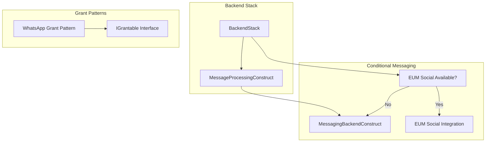

# Design Document

## Overview

This design outlines the refactoring of CDK infrastructure code from functions
to proper constructs, focusing on improving reusability, testability, and
maintainability. The refactoring addresses the most critical architectural
issues while maintaining the prototype's focus on core functionality.

## Research Findings

Based on AWS CDK best practices research:

### AWS Solutions Constructs

- **Decision**: Not using AWS Solutions Constructs as they add complexity for
  small customizations
- **Approach**: Build simple, focused constructs that encapsulate only what we
  need

### CDK Nag Security Compliance

- **AwsSolutions-IAM5**: Wildcard permissions require specific justification
  with `appliesTo` for granular suppression
- **Pattern**: Use
  `appliesTo: ['Action::bedrock-agentcore:*', 'Resource::arn:aws:logs:*:*:*']`
  for specific suppressions
- **Documentation**: Each suppression must include evidence and business
  justification

### Lambda Powertools Integration

- **Current State**: Lambda Powertools already included in Lambda zip packages
- **No Action Required**: No need for additional layers or configuration

## Architecture

### Current State Problems

1. **Message Processing Infrastructure**: Complex SQS/Lambda setup embedded in
   private methods within `backend_stack.py`
2. **Messaging Stack Architecture**: Entire messaging backend deployed as a
   stack rather than a conditional construct
3. **Permission Patterns**: WhatsApp permissions don't follow CDK `IGrantable`
   patterns
4. **Code Organization**: Unclear separation between constructs and utility
   functions

### Target Architecture



## Components and Interfaces

### 1. MessageProcessingConstruct

**Purpose**: Encapsulate SQS queue, DLQ, and Lambda function for message
processing.

**Simple Interface**:

```python
class MessageProcessingConstruct(Construct):
    def __init__(
        self,
        scope: Construct,
        construct_id: str,
        agentcore_runtime_arn: str,
        environment_variables: Dict[str, str] = None,
        **kwargs,
    ) -> None
        # Resources exposed as simple properties
        self.processing_queue: sqs.Queue
        self.dead_letter_queue: sqs.Queue
        self.lambda_function: _lambda.Function
```

**Key Features**:

- Simple resource encapsulation without unnecessary methods
- Resources exposed as direct properties (no `@property` decorators)
- Configurable environment variables passed in constructor
- Automatic IAM permissions setup
- CDK Nag suppressions with specific `appliesTo` justifications

### 2. MessagingBackendConstruct

**Purpose**: Convert the entire messaging stack into a reusable construct for
conditional deployment.

**Simple Interface**:

```python
class MessagingBackendConstruct(Construct):
    def __init__(
        self,
        scope: Construct,
        construct_id: str,
        **kwargs,
    ) -> None
        # Resources exposed as simple properties
        self.messaging_topic: sns.Topic
        self.machine_client_secret: secretsmanager.Secret
        self.api: apigw.RestApi
        self.user_pool: cognito.UserPool
```

**Key Features**:

- Encapsulates all messaging stack components (DynamoDB, SNS, Lambda, API
  Gateway, Cognito, WAF)
- Resources exposed as direct properties for integration with other stacks
- Self-contained with proper CDK Nag suppressions
- Can be conditionally deployed based on EUM Social availability

### 3. WhatsApp Grant Pattern

**Purpose**: Implement CDK-standard grant pattern for WhatsApp permissions.

**Interface**:

```python
def grant_whatsapp_permissions(
    grantee: iam.IGrantable,
    cross_account_role: str = None
) -> iam.Grant
```

**Key Features**:

- Follows CDK `IGrantable` interface pattern
- Returns `iam.Grant` object for chaining
- Supports optional cross-account role assumption
- Consistent with other CDK grant methods

## Data Models

### MessageProcessingConstruct Configuration

```python
@dataclass
class MessageProcessingConfig:
    agentcore_runtime_arn: str
    environment_variables: Dict[str, str]
    queue_visibility_timeout: Duration = Duration.seconds(90)
    dlq_retention_period: Duration = Duration.days(14)
    lambda_memory_size: int = 128
    lambda_timeout: Duration = Duration.seconds(30)
```

### MessagingBackendConstruct Configuration

```python
@dataclass
class MessagingBackendConfig:
    callback_urls: List[str]
    oauth_scopes: List[str] = field(default_factory=lambda: ["chatbot-messaging/write"])
    api_throttling_rate_limit: int = 100
    api_throttling_burst_limit: int = 200
    waf_rate_limit: int = 2000
```

## Error Handling

### Construct Validation

1. **Parameter Validation**: Validate required parameters in construct
   constructors
2. **Resource Dependencies**: Ensure proper dependency ordering between
   resources
3. **IAM Permissions**: Validate that all required permissions are granted
4. **CDK Nag Compliance**: Include appropriate suppressions with justifications

### Runtime Error Handling

1. **Lambda Function**: Proper error handling and logging in message processor
2. **SQS Integration**: Dead letter queue for failed message processing
3. **API Gateway**: Proper error responses and logging
4. **WAF Protection**: Rate limiting and security rule enforcement

## Testing Strategy

### CDK Synthesis Testing

Since this is a prototype solution, testing will focus on CDK synthesis
validation:

1. **Construct Creation**: Verify constructs can be instantiated without errors
2. **Resource Generation**: Ensure all expected AWS resources are created
3. **IAM Permissions**: Validate that proper permissions are configured
4. **CDK Nag Compliance**: Ensure no security violations are introduced

### Testing Commands

```bash
# Test individual constructs
uv run cdk synth --quiet

# Validate CloudFormation templates
aws cloudformation validate-template --template-body file://cdk.out/BackendStack.template.json

# Check for CDK Nag violations
uv run cdk synth 2>&1 | grep -i "nag"
```

## Implementation Plan

### Phase 1: MessageProcessingConstruct

1. Create `MessageProcessingConstruct` class
2. Extract SQS and Lambda creation logic from `backend_stack.py`
3. Add proper IAM permissions and CDK Nag suppressions
4. Update `backend_stack.py` to use the new construct
5. Test with CDK synthesis

### Phase 2: MessagingBackendConstruct

1. Create `MessagingBackendConstruct` class
2. Move all messaging stack logic into the construct
3. Expose necessary properties for external integration
4. Update deployment logic to conditionally use the construct
5. Test with CDK synthesis

### Phase 3: WhatsApp Grant Pattern

1. Create `grant_whatsapp_permissions()` function following CDK patterns
2. Update existing usage in `backend_stack.py`
3. Ensure proper `IGrantable` interface compliance
4. Test with CDK synthesis

### Phase 4: Stack Refactoring

1. Update `backend_stack.py` to use new constructs
2. Implement conditional messaging backend deployment
3. Clean up unused private methods
4. Verify all CDK outputs are preserved
5. Final testing with CDK synthesis

## Migration Strategy

### Backward Compatibility

- All existing CDK outputs will be preserved
- No changes to deployed resource names or configurations
- Existing environment variables and permissions maintained

### Deployment Approach

1. **Development Environment**: Test new constructs in development first
2. **Incremental Rollout**: Deploy one construct at a time
3. **Rollback Plan**: Keep original code until new constructs are validated
4. **Monitoring**: Verify all resources deploy correctly after refactoring

### Risk Mitigation

1. **CDK Diff**: Use `cdk diff` to verify no unintended changes
2. **Resource Naming**: Maintain consistent resource naming patterns
3. **Permission Preservation**: Ensure all IAM permissions are maintained
4. **Output Preservation**: Keep all stack outputs for dependent systems

## Performance Considerations

### Construct Instantiation

- Minimal performance impact as constructs are created at synthesis time
- Improved synthesis time due to better code organization
- Reduced complexity in stack constructors

### Runtime Performance

- No impact on runtime performance of deployed resources
- Same AWS resources created with identical configurations
- Maintained performance characteristics of Lambda functions and API Gateway

## Security Considerations

### IAM Permissions

- All existing IAM permissions preserved
- CDK Nag suppressions maintained with proper justifications
- Principle of least privilege enforced in new constructs

### Resource Security

- WAF protection maintained for API Gateway
- Cognito authentication patterns preserved
- SSL/TLS enforcement continued for all resources

### Secrets Management

- Existing Secrets Manager usage patterns maintained
- No changes to secret rotation or access patterns
- Proper secret ARN handling in new constructs

## Monitoring and Observability

### CloudWatch Integration

- All existing CloudWatch logs and metrics preserved
- X-Ray tracing maintained where currently enabled
- No changes to monitoring and alerting configurations

### CDK Metadata

- Proper construct metadata for resource tracking
- Maintained resource tagging patterns
- Clear construct hierarchy for troubleshooting
