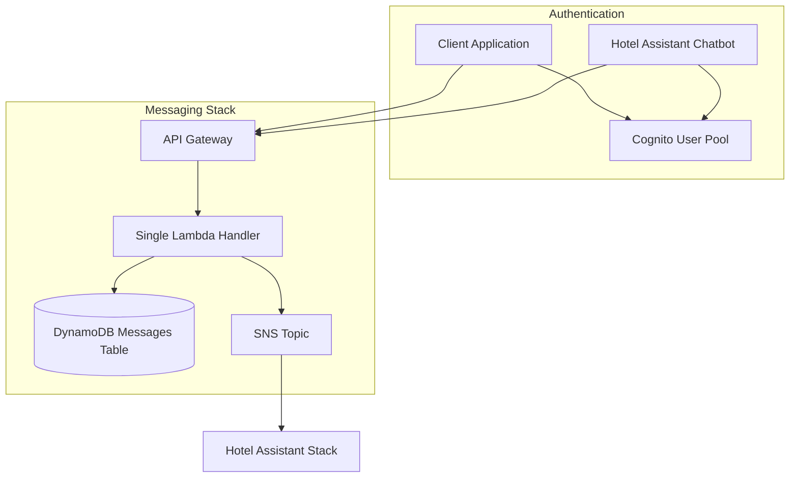
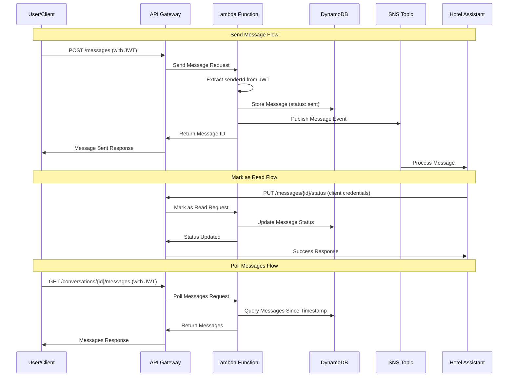

# Design Document

## Overview

The Chatbot Messaging Backend is a serverless REST API built with AWS Lambda and
Lambda Powertools that simulates messaging platform integrations like Twilio and
AWS End User Messaging Social. The system provides a simple interface for
message handling, status management, and conversation flow simulation, enabling
realistic testing of chatbot integrations.

The architecture follows a serverless-first approach using a single Lambda
function (Lambdalith) with APIGatewayRestResolver, DynamoDB for storage, and SNS
for message publishing. The system is designed to be lightweight,
cost-effective, and deployed as a separate CDK stack that the Hotel Assistant
stack depends on.

## Architecture

### High-Level Architecture



### Component Interaction Flow



## Components and Interfaces

### REST API Endpoints

#### 1. Send Message

- **Endpoint**: `POST /messages`
- **Authentication**: JWT token (senderId inferred from token)
- **Request Body**:
  ```json
  {
    "recipientId": "string",
    "content": "string"
  }
  ```
- **Response**:
  ```json
  {
    "messageId": "string",
    "conversationId": "string",
    "timestamp": "ISO8601",
    "status": "sent"
  }
  ```

#### 2. Mark Message as Read

- **Endpoint**: `PUT /messages/{messageId}/status`
- **Authentication**: Client credentials (for chatbot) or JWT token
- **Request Body**:
  ```json
  {
    "status": "read|delivered|failed|warning|deleted"
  }
  ```
- **Response**:
  ```json
  {
    "messageId": "string",
    "status": "string",
    "updatedAt": "ISO8601"
  }
  ```

#### 3. Poll Messages

- **Endpoint**: `GET /conversations/{conversationId}/messages`
- **Authentication**: JWT token
- **Query Parameters**:
  - `since`: ISO8601 timestamp (optional, defaults to beginning of conversation)
  - `limit`: Number of messages to return (optional, defaults to 50)
- **Response**:
  ```json
  {
    "messages": [
      {
        "messageId": "string",
        "conversationId": "string",
        "senderId": "string",
        "recipientId": "string",
        "content": "string",
        "status": "string",
        "timestamp": "ISO8601"
      }
    ],
    "hasMore": "boolean"
  }
  ```

### Lambda Function Architecture

#### Lambdalith with APIGatewayRestResolver

The system uses a single Lambda function (Lambdalith) with
APIGatewayRestResolver from AWS Lambda Powertools:

```python
from aws_lambda_powertools import Logger
from aws_lambda_powertools.event_handler import APIGatewayRestResolver
from aws_lambda_powertools.utilities.typing import LambdaContext

logger = Logger()
app = APIGatewayRestResolver()

@app.post("/messages")
def send_message():
    # Extract senderId from JWT token
    # Create message and publish to SNS
    pass

@app.put("/messages/<message_id>/status")
def update_message_status(message_id: str):
    # Update message status in DynamoDB
    pass

@app.get("/conversations/<conversation_id>/messages")
def get_messages(conversation_id: str):
    # Query messages from DynamoDB with timestamp filtering
    pass

def lambda_handler(event, context: LambdaContext):
    return app.resolve(event, context)
```

## Data Models

### DynamoDB Table Schema

#### Messages Table

- **Table Name**: `chatbot-messages`
- **Partition Key**: `conversationId` (String) - Format:
  `{senderId}#{recipientId}` from first message
- **Sort Key**: `timestamp` (String) - ISO8601 timestamp
- **Attributes**:
  - `messageId` (String) - UUID for the message
  - `senderId` (String) - Sender identifier (from JWT or system)
  - `recipientId` (String) - Recipient identifier
  - `content` (String) - Message content
  - `status` (String) - One of: sent, delivered, read, failed, warning, deleted
  - `createdAt` (String) - ISO8601 timestamp (immutable)
  - `updatedAt` (String) - ISO8601 timestamp (updated on status changes)

#### GSI for Message ID Lookups

- **Index Name**: `MessageIdIndex`
- **Partition Key**: `messageId` (String)
- **Purpose**: Enable direct message lookups for status updates

### SNS Message Format

Messages published to SNS follow this structure:

```json
{
  "messageId": "string",
  "conversationId": "string",
  "senderId": "string",
  "recipientId": "string",
  "content": "string",
  "timestamp": "ISO8601",
  "status": "sent"
}
```

## Error Handling

### HTTP Status Codes

- **200**: Success (GET, PUT operations)
- **201**: Created (POST operations)
- **400**: Bad Request (validation errors)
- **401**: Unauthorized (invalid/missing JWT)
- **404**: Not Found (message/conversation not found)
- **500**: Internal Server Error (system errors)

### Error Response Format

```json
{
  "error": {
    "code": "string",
    "message": "string"
  }
}
```

## Testing Strategy

### Unit Testing

- **Message Creation Logic**: Test message validation and DynamoDB storage
- **Status Update Logic**: Test status transitions and validation
- **Query Logic**: Test message retrieval with timestamp filtering
- **Authentication**: Test JWT token extraction and validation

### Integration Testing

- **API Gateway Integration**: Test complete request/response flow with
  authentication
- **DynamoDB Integration**: Test actual database operations
- **SNS Integration**: Test message publishing

### Mock Strategy

- **AWS Services**: Use moto for mocking AWS services in unit tests
- **JWT Tokens**: Mock JWT validation for testing
- **Time**: Mock datetime for consistent timestamp testing

## Deployment Integration

### Separate CDK Stack

The messaging backend will be deployed as a separate CDK stack in
`packages/infra/`:

```python
# messaging_stack.py
class MessagingStack(Stack):
    def __init__(self, scope: Construct, construct_id: str, **kwargs):
        super().__init__(scope, construct_id, **kwargs)

        # Cognito User Pool for authentication
        self.user_pool = cognito.UserPool(...)

        # DynamoDB table
        self.messages_table = dynamodb.Table(...)

        # SNS topic (output for Hotel Assistant)
        self.messaging_topic = sns.Topic(...)

        # Lambda function
        self.messaging_lambda = _lambda.Function(...)

        # API Gateway
        self.api = apigw.RestApi(...)
```

### Stack Dependencies

- **Hotel Assistant Stack**: Depends on Messaging Stack
- **SNS Topic**: Passed as input to Hotel Assistant Stack
- **Authentication**: Hotel Assistant uses IAM authentication instead of Cognito
  User Pools

### Authentication Architecture

- **Cognito User Pool**: Supports both user/password and client credentials
- **User Authentication**: Username/password for chat users
- **Machine-to-Machine**: Client credentials for chatbot access
- **JWT Claims**: senderId extracted from `sub` claim for users, from custom
  claim for machine clients

## Security Considerations

### Authentication Types

- **User Authentication**: JWT tokens from Cognito User Pool
- **Machine Authentication**: Client credentials flow for chatbot
- **Authorization**: Validate user access to their own conversations

### Data Validation

- **Input Sanitization**: All inputs validated before processing
- **Message Content**: Basic validation for text content
- **Status Values**: Strict validation against allowed status values

### IAM Permissions

- **DynamoDB**: Read/Write access to messages table and GSI
- **SNS**: Publish access to messaging topic
- **Cognito**: Token validation permissions
