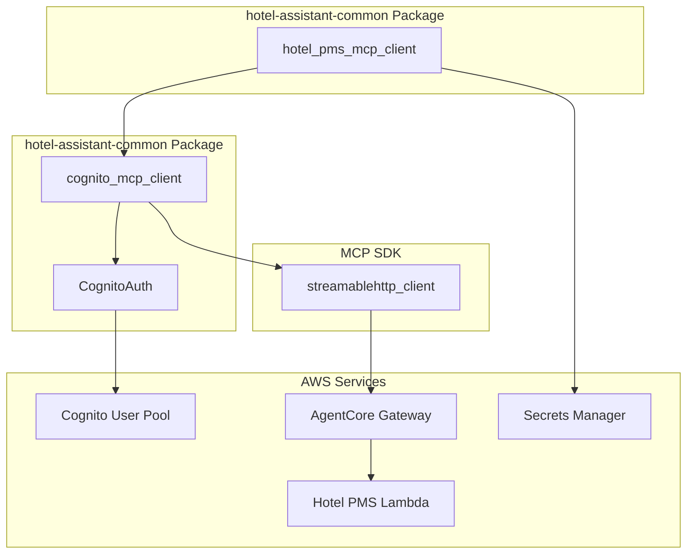
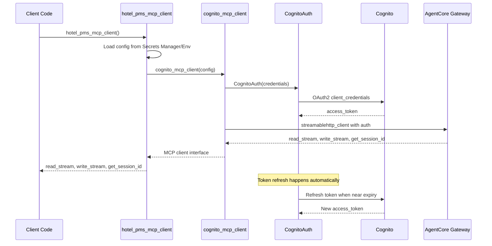

# Design Document

## Overview

This design implements a reusable OAuth2 authenticated streaming HTTP MCP client
module for connecting to MCP servers deployed with AgentCore Gateway that use
Cognito authentication. The solution consists of two main components: a generic
Cognito-authenticated MCP client and a specific Hotel PMS MCP client that uses
it.

## Architecture

### High-Level Architecture



### Component Interaction Flow



## Components and Interfaces

### 1. CognitoAuth (httpx.Auth Implementation)

**Purpose**: Implements httpx.Auth interface for automatic Cognito OAuth2
authentication and token management.

**Key Features**:

- OAuth2 client credentials flow
- Automatic token refresh
- Thread-safe token caching
- Exponential backoff retry logic

**Interface**:

```python
class CognitoAuth(httpx.Auth):
    def __init__(
        self,
        user_pool_id: str,
        client_id: str,
        client_secret: str,
        region: str = "us-east-1",
        timeout: float = 30.0,
        max_retries: int = 3
    ) -> None: ...

    def auth_flow(self, request: httpx.Request) -> Generator[httpx.Request, httpx.Response, None]: ...
```

### 2. cognito_mcp_client Function

**Purpose**: Factory function that creates an authenticated MCP client using the
standard streamablehttp_client interface.

**Interface**:

```python
@asynccontextmanager
async def cognito_mcp_client(
    url: str,
    user_pool_id: str,
    client_id: str,
    client_secret: str,
    region: str = "us-east-1",
    headers: dict[str, str] | None = None,
    timeout: float | timedelta = 30,
    sse_read_timeout: float | timedelta = 60 * 5,
    terminate_on_close: bool = True,
) -> AsyncGenerator[
    tuple[
        MemoryObjectReceiveStream[SessionMessage | Exception],
        MemoryObjectSendStream[SessionMessage],
        GetSessionIdCallback,
    ],
    None,
]: ...
```

### 3. hotel_pms_mcp_client Function

**Purpose**: Factory function specifically for Hotel PMS MCP server with
configuration loading from Secrets Manager and environment variables.

**Interface**:

```python
@asynccontextmanager
async def hotel_pms_mcp_client(
    url: str | None = None,
    user_pool_id: str | None = None,
    client_id: str | None = None,
    client_secret: str | None = None,
    region: str | None = None,
    headers: dict[str, str] | None = None,
    timeout: float | timedelta = 30,
    sse_read_timeout: float | timedelta = 60 * 5,
    terminate_on_close: bool = True,
) -> AsyncGenerator[
    tuple[
        MemoryObjectReceiveStream[SessionMessage | Exception],
        MemoryObjectSendStream[SessionMessage],
        GetSessionIdCallback,
    ],
    None,
]: ...
```

## Data Models

### Configuration Models

```python
@dataclass
class CognitoMcpConfig:
    """Configuration for Cognito MCP authentication."""
    url: str
    user_pool_id: str
    client_id: str
    client_secret: str
    region: str = "us-east-1"
    timeout: float = 30.0
    sse_read_timeout: float = 300.0
    max_retries: int = 3

@dataclass
class TokenInfo:
    """OAuth2 token information."""
    access_token: str
    expires_at: float
    token_type: str = "Bearer"

    @property
    def is_expired(self) -> bool: ...

    @property
    def expires_soon(self, buffer_seconds: int = 60) -> bool: ...
```

## Error Handling

### Exception Hierarchy

```python
class CognitoMcpError(Exception):
    """Base exception for Cognito MCP client errors."""
    pass

class CognitoAuthError(CognitoMcpError):
    """Raised when Cognito authentication fails."""
    pass

class CognitoConfigError(CognitoMcpError):
    """Raised when configuration is invalid or missing."""
    pass

class McpConnectionError(CognitoMcpError):
    """Raised when MCP connection fails."""
    pass
```

### Error Handling Strategy

1. **Authentication Errors**: Retry with exponential backoff for transient
   errors, fail fast for credential errors
2. **Network Errors**: Implement retry logic with circuit breaker pattern
3. **Configuration Errors**: Fail fast with clear error messages
4. **MCP Protocol Errors**: Wrap and re-raise with context

## Testing Strategy

### Unit Tests

1. **CognitoAuth Tests**:
   - Token acquisition and refresh
   - Error handling and retries
   - Thread safety

2. **cognito_mcp_client Tests**:
   - Client creation and configuration
   - Integration with streamablehttp_client
   - Error propagation

3. **hotel_pms_mcp_client Tests**:
   - Configuration loading from Secrets Manager
   - Environment variable fallback
   - Connection management

### Integration Tests

1. **Real Cognito Authentication**:
   - Test with actual Cognito user pool
   - Verify token refresh behavior
   - Test error scenarios

2. **Real MCP Server Connection**:
   - Connect to deployed AgentCore Gateway
   - List actual Hotel PMS tools
   - Execute tool calls

3. **End-to-End Workflow**:
   - Full authentication and tool execution flow
   - Error recovery scenarios

## Implementation Details

### Token Management

The CognitoAuth class implements proactive token refresh:

1. **Token Caching**: Store token with expiration time
2. **Proactive Refresh**: Refresh token 60 seconds before expiry
3. **Thread Safety**: Use asyncio locks for concurrent access
4. **Error Recovery**: Retry failed refresh attempts with backoff

### Configuration Loading for Hotel PMS Client

The hotel_pms_mcp_client supports flexible configuration:

1. **Secrets Manager Priority**: Try to load from AWS Secrets Manager first
2. **Environment Variable Fallback**: Fall back to environment variables:
   - `HOTEL_PMS_MCP_URL`
   - `HOTEL_PMS_MCP_USER_POOL_ID`
   - `HOTEL_PMS_MCP_CLIENT_ID`
   - `HOTEL_PMS_MCP_CLIENT_SECRET`
   - `HOTEL_PMS_MCP_REGION`

3. **Configuration Validation**: Validate required fields and provide clear
   error messages

4. **Default Values**: Sensible defaults for optional configuration

### Logging and Observability

1. **Structured Logging**: Use structured logging for authentication events
2. **Metrics**: Track authentication success/failure rates
3. **Debugging**: Detailed debug logs for troubleshooting

## File Structure

```
packages/hotel-assistant/hotel-assistant-common/
├── hotel_assistant_common/
│   ├── __init__.py
│   ├── cognito_mcp/
│   │   ├── __init__.py
│   │   ├── cognito_auth.py          # CognitoAuth implementation
│   │   ├── cognito_mcp_client.py    # cognito_mcp_client function
│   │   └── exceptions.py            # Cognito MCP exception classes
│   ├── hotel_pms_mcp_client.py      # hotel_pms_mcp_client function
│   └── exceptions.py                # Base exception classes
├── tests/
│   ├── unit/
│   │   ├── test_cognito_auth.py
│   │   ├── test_cognito_mcp_client.py
│   │   └── test_hotel_pms_mcp_client.py
│   └── integration/
│       ├── test_cognito_integration.py
│       └── test_hotel_pms_integration.py
├── .env.example                     # Example environment configuration
└── pyproject.toml                   # Updated with dependencies
```

## Dependencies

### Runtime Dependencies

```toml
dependencies = [
    "httpx>=0.25.0",
    "httpx-sse>=0.4.0",
    "mcp>=1.0.0",
    "anyio>=4.0.0",
    "boto3>=1.34.0",
    "pydantic>=2.0.0",
]
```

### Development Dependencies

```toml
[dependency-groups]
dev = [
    "pytest>=8.3.5",
    "pytest-asyncio>=0.23.0",
    "pytest-mock>=3.12.0",
    "moto[cognitoidp]>=5.0.0",
    "python-dotenv>=1.0.0",
]
```

## Security Considerations

1. **Credential Storage**: Never log or expose client secrets
2. **Token Security**: Store tokens securely in memory only
3. **Network Security**: Use HTTPS for all communications
4. **Error Messages**: Avoid exposing sensitive information in error messages
5. **Timeout Configuration**: Implement reasonable timeouts to prevent hanging
   connections

## Performance Considerations

1. **Token Caching**: Cache tokens to avoid unnecessary authentication requests
2. **Connection Pooling**: Reuse HTTP connections where possible
3. **Async Operations**: Use async/await for all I/O operations
4. **Resource Cleanup**: Properly close connections and clean up resources

## Migration from Existing Code

The existing `hotel_pms_config.py` in hotel-assistant-chat can be refactored to
use this new common module:

1. **Extract Common Logic**: Move OAuth2 authentication logic to common module
2. **Simplify Chat Integration**: Use hotel_pms_mcp_client in chat package
3. **Maintain Compatibility**: Ensure existing functionality continues to work
4. **Add Token Refresh**: Implement missing token refresh functionality
