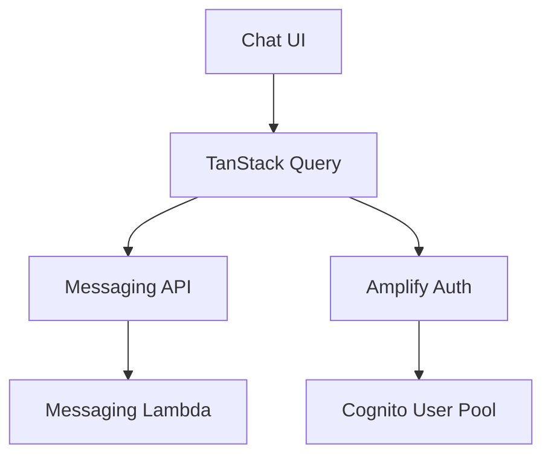
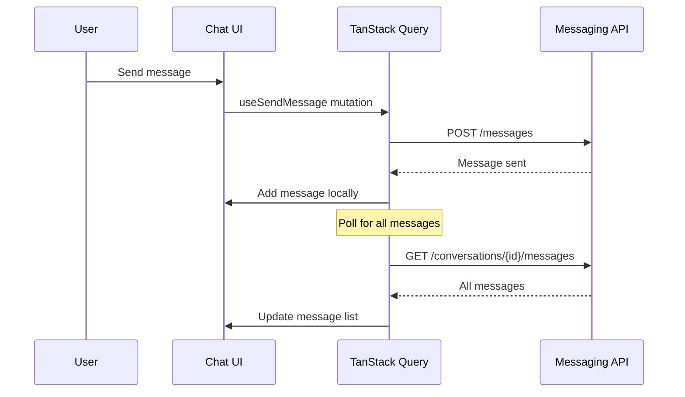

# Design Document

## Overview

This design document outlines a simplified architecture for integrating the
frontend chat interface with the new chatbot messaging backend. The solution
replaces direct AgentCore communication with a REST API-based approach using
TanStack Query for state management and simple polling for message updates. This
is designed as a prototype with minimal complexity.

## Architecture

### Simplified Component Flow



### Message Flow



## Components and Interfaces

### 1. Configuration (Reuse Existing)

Use existing configuration pattern from `chatbot-config.ts`:

```typescript
// Add new properties to existing config
const config = {
  // Existing properties
  agentCoreRuntimeArn: env.VITE_AGENTCORE_RUNTIME_ARN,
  awsRegion: env.VITE_AWS_REGION,

  // New messaging properties
  messagingApiEndpoint: env.VITE_MESSAGING_API_ENDPOINT,
  hotelAssistantClientId: env.VITE_HOTEL_ASSISTANT_CLIENT_ID,
};
```

### 2. Simple Message Interface

```typescript
interface Message {
  messageId: string;
  conversationId: string;
  senderId: string;
  recipientId: string;
  content: string;
  status: 'sent' | 'delivered' | 'read' | 'failed';
  timestamp: string;
  isUser: boolean; // Computed from senderId vs current user
}
```

### 3. Simple API Client

```typescript
class MessagingApiClient {
  private baseUrl: string;

  constructor(apiEndpoint: string) {
    this.baseUrl = `${apiEndpoint}/prod`; // Hardcode stage for simplicity
  }

  async sendMessage(
    recipientId: string,
    content: string,
    modelId?: string,
    temperature?: string
  ) {
    const session = await fetchAuthSession();
    const token = session.tokens?.accessToken?.toString();

    const response = await fetch(`${this.baseUrl}/messages`, {
      method: 'POST',
      headers: {
        Authorization: `Bearer ${token}`,
        'Content-Type': 'application/json',
      },
      body: JSON.stringify({
        recipientId,
        content,
        ...(modelId && { modelId }),
        ...(temperature && { temperature }),
      }),
    });

    if (!response.ok) throw new Error(`API Error: ${response.status}`);
    return response.json();
  }

  async getMessages(conversationId: string) {
    const session = await fetchAuthSession();
    const token = session.tokens?.accessToken?.toString();

    const encodedId = encodeURIComponent(conversationId);
    const response = await fetch(
      `${this.baseUrl}/conversations/${encodedId}/messages?limit=100`,
      {
        headers: { Authorization: `Bearer ${token}` },
      }
    );

    if (!response.ok) throw new Error(`API Error: ${response.status}`);
    return response.json();
  }
}
```

### 4. Simple TanStack Query Hooks

```typescript
// Send message mutation
function useSendMessage() {
  const queryClient = useQueryClient();
  const apiClient = useMessagingApiClient();

  return useMutation({
    mutationFn: ({ recipientId, content, modelId, temperature }) =>
      apiClient.sendMessage(recipientId, content, modelId, temperature),
    onSuccess: (data, variables) => {
      // Invalidate messages query to refetch all messages
      queryClient.invalidateQueries({ queryKey: ['messages'] });
    },
  });
}

// Get all messages query with simple polling
function useMessages(conversationId: string) {
  const apiClient = useMessagingApiClient();

  return useQuery({
    queryKey: ['messages', conversationId],
    queryFn: () => apiClient.getMessages(conversationId),
    refetchInterval: 5000, // Simple 5-second polling
    enabled: !!conversationId,
  });
}
```

### 5. Simple Conversation ID Generation

```typescript
function generateConversationId(
  userId: string,
  assistantClientId: string
): string {
  // Simple lexicographic sort
  const participants = [userId, assistantClientId].sort();
  return `${participants[0]}#${participants[1]}`;
}
```

### 6. Message Status Icons (CloudScape)

Use CloudScape StatusIndicator with icon-only display:

```typescript
import { StatusIndicator } from '@cloudscape-design/components';

function MessageStatusIcon({ status }: { status: string }) {
  switch (status) {
    case 'sent':
      return <StatusIndicator type="pending" iconAriaLabel="Sent" />;
    case 'delivered':
      return <StatusIndicator type="in-progress" iconAriaLabel="Delivered" />;
    case 'read':
      return <StatusIndicator type="success" iconAriaLabel="Read" />;
    case 'failed':
      return <StatusIndicator type="error" iconAriaLabel="Failed" />;
    default:
      return null;
  }
}
```

## Data Models

### Simple Message State

```typescript
interface ChatState {
  messages: Message[];
  isLoading: boolean;
  error: string | null;
}
```

## Error Handling

### Simple Error Handling

```typescript
// Let TanStack Query handle retries automatically
// Simple error display in UI
function ChatError({ error }: { error: Error }) {
  return (
    <Alert type="error" header="Message Error">
      {error.message}
    </Alert>
  );
}
```

## Testing Strategy

### Minimal Testing

- Basic component rendering tests
- API client integration tests only if straightforward
- Rely on manual testing for prototype

## Implementation Notes

### Key Simplifications

1. **No backward compatibility** - Remove AgentCore client entirely
2. **Reuse existing config pattern** - Just add new properties
3. **Simple polling** - Use TanStack Query's `refetchInterval`
4. **Get all messages** - No complex timestamp filtering
5. **CloudScape components** - Use existing design system
6. **No complex polling manager** - Let TanStack Query handle it
7. **Simple conversation ID** - Basic lexicographic sort
8. **Minimal error handling** - Basic error display

### Infrastructure Updates Required

#### CDK Custom Resource Updates

Update `packages/infra/stack/stack_constructs/custom_resource_construct.py`:

- Add `VITE_MESSAGING_API_ENDPOINT` property
- Add `VITE_HOTEL_ASSISTANT_CLIENT_ID` property

Update `packages/infra/stack/lambdas/update_config_js_fn/index.py`:

- Include new messaging configuration in config.js output

#### Backend API Updates

Update
`packages/chatbot-messaging-backend/chatbot_messaging_backend/handlers/lambda_handler.py`:

- Modify `SendMessageRequest` to include optional `modelId` and `temperature`
  fields
- Pass these parameters to the message service

### Frontend File Changes Required

1. Install TanStack Query: `pnpm add @tanstack/react-query`
2. Update `chatbot-config.ts` with new messaging properties
3. Create new `MessagingApiClient` class
4. Replace `AgentCoreService` usage with `MessagingApiClient`
5. Update `Chatbot.tsx` to use TanStack Query hooks
6. Add TanStack Query provider to app root
7. Update message status display with CloudScape StatusIndicator components
