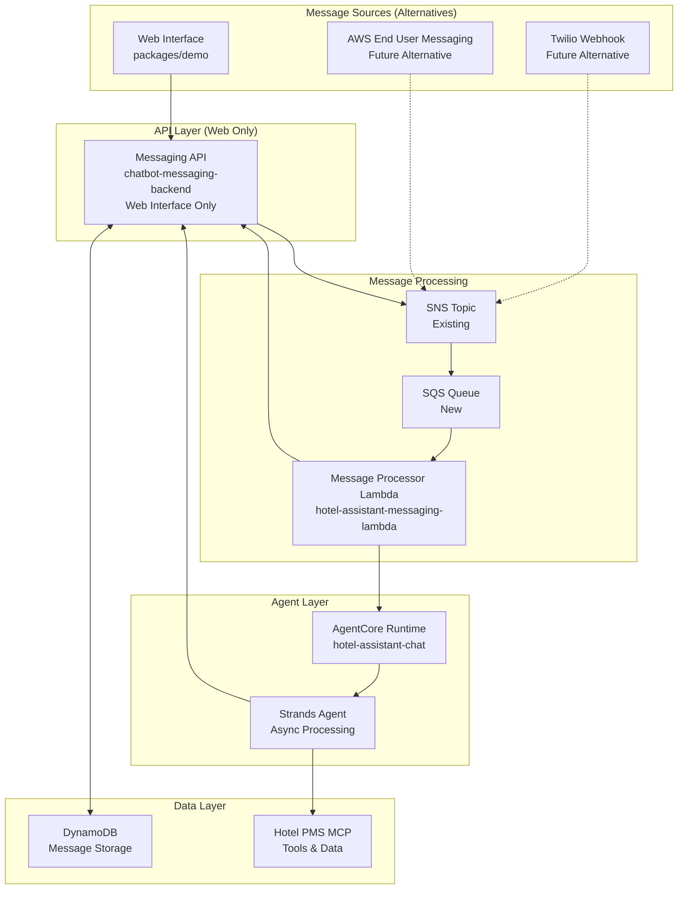
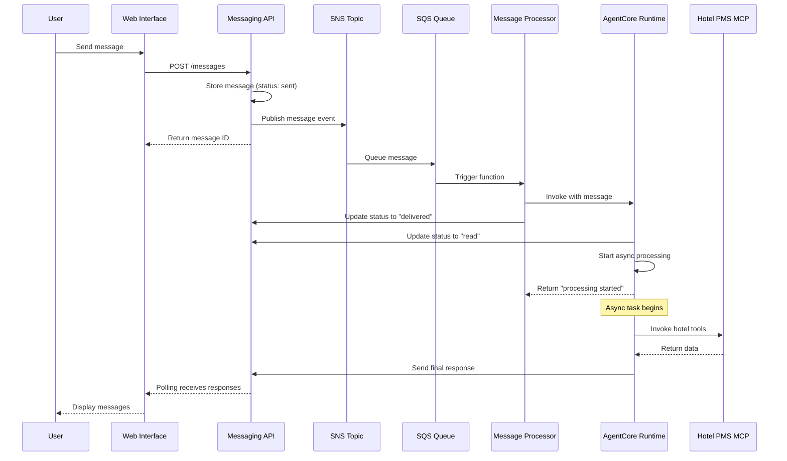

# Design Document

## Overview

This design outlines the integration of hotel-assistant-chat with the
chatbot-messaging-backend to create an asynchronous messaging architecture. The
system uses Amazon Bedrock AgentCore Runtime with Strands agents for intelligent
message processing, SNS/SQS for reliable message delivery, and supports multiple
messaging platforms through a unified interface.

## Architecture

### High-Level Architecture



### Message Flow Sequence



## Components and Interfaces

### New Lambda Package: hotel-assistant-messaging-lambda

#### Package Structure

```
packages/hotel-assistant/hotel-assistant-messaging-lambda/
├── hotel_assistant_messaging_lambda/
│   ├── __init__.py
│   ├── handlers/
│   │   ├── __init__.py
│   │   └── message_processor.py      # Main Lambda handler
│   ├── services/
│   │   ├── __init__.py
│   │   └── message_processor.py      # Message processing logic
│   └── models/
│       ├── __init__.py
│       └── sqs_events.py             # SQS event models
├── tests/
│   ├── __init__.py
│   ├── test_message_processor.py
│   ├── test_agentcore_client.py
│   └── test_messaging_client.py
├── project.json                      # NX configuration
├── pyproject.toml                    # Python dependencies
└── README.md
```

#### Message Processor Lambda Handler

```python
# hotel_assistant_messaging_lambda/handlers/message_processor.py
import json
import logging
from typing import Dict, Any
from aws_lambda_powertools import Logger, Tracer, Metrics
from aws_lambda_powertools.event_handler import SQSBatchProcessor
from aws_lambda_powertools.utilities.typing import LambdaContext

from ..services.agentcore_client import AgentCoreClient
from ..services.messaging_client import MessagingClient
from ..models.sqs_events import MessageEvent

logger = Logger()
tracer = Tracer()
metrics = Metrics()

processor = SQSBatchProcessor()

@processor.record_handler
def process_message_record(record: Dict[str, Any]) -> None:
    """Process individual SQS message record"""
    try:
        # Parse SNS message from SQS
        sns_message = json.loads(record["body"])
        message_data = json.loads(sns_message["Message"])

        event = MessageEvent(**message_data)

        # Update message status to delivered
        messaging_client = MessagingClient()
        messaging_client.update_message_status(
            event.message_id,
            "delivered"
        )

        # Invoke AgentCore Runtime
        agentcore_client = AgentCoreClient()
        response = agentcore_client.invoke_agent(
            payload={
                "prompt": event.content,
                "actorId": event.sender_id,
                "messageId": event.message_id,
                "conversationId": event.conversation_id
            }
        )

        logger.info(f"Agent invoked successfully for message {event.message_id}")

    except Exception as e:
        logger.error(f"Failed to process message: {str(e)}")
        raise

@logger.inject_lambda_context
@tracer.capture_lambda_handler
@metrics.log_metrics
def lambda_handler(event: Dict[str, Any], context: LambdaContext) -> Dict[str, Any]:
    """Main Lambda handler for SQS batch processing"""
    return processor.process(event, context)
```

#### AgentCore Runtime Integration

The Lambda function will use the boto3 AgentCore Runtime client directly,
eliminating the need for a custom abstraction layer.

### Updated AgentCore Runtime (hotel-assistant-chat)

#### Async Task Implementation

```python
# hotel_assistant_chat/agent.py (updated)
import asyncio
from bedrock_agentcore import BedrockAgentCoreApp
from strands import Agent

app = BedrockAgentCoreApp()

@app.async_task
async def process_user_message(
    user_message: str,
    actor_id: str,
    message_id: str,
    conversation_id: str
):
    """Process user message asynchronously"""

    # Update message status to read immediately
    messaging_client = MessagingClient()
    await messaging_client.update_message_status(message_id, "read")

    # Create agent and process message
    agent = Agent(
        model=model,
        system_prompt=instructions,
        tools=tools,
        hooks=hooks,
    )

    # Use Strands async streaming - agent decides all messaging

    # Send final response
    final_result = agent(user_message)
    await messaging_client.send_message(
        recipient_id=actor_id,
        content=final_result.message,
        sender_id="hotel-assistant"
    )

@app.entrypoint
def invoke(payload, context: RequestContext):
    """Main entrypoint - starts async processing"""
    user_message = payload.get("prompt", "")
    actor_id = payload.get("actorId")
    message_id = payload.get("messageId")
    conversation_id = payload.get("conversationId")

    # Start async task
    asyncio.create_task(process_user_message(
        user_message, actor_id, message_id, conversation_id
    ))

    return {"status": "processing_started"}
```

### Shared Models (hotel-assistant-common)

#### Message Models

```python
# hotel_assistant_common/models/messaging.py
from enum import Enum
from typing import Optional, Dict, Any
from pydantic import BaseModel

class MessageStatus(str, Enum):
    SENT = "sent"
    DELIVERED = "delivered"
    READ = "read"
    FAILED = "failed"

class MessageEvent(BaseModel):
    """SNS message event for agent processing"""
    message_id: str
    conversation_id: str
    sender_id: str
    recipient_id: str
    content: str
    timestamp: str
    platform: str = "web"  # web, twilio, aws-eum
    platform_metadata: Optional[Dict[str, Any]] = None

class AgentInvocationPayload(BaseModel):
    """Payload for AgentCore Runtime invocation"""
    prompt: str
    actor_id: str
    message_id: str
    conversation_id: str
    model_id: Optional[str] = None
    temperature: Optional[float] = None

class PlatformMessage(BaseModel):
    """Abstract message format for different platforms"""
    content: str
    sender_id: str
    recipient_id: str
    platform: str
    platform_specific_data: Optional[Dict[str, Any]] = None
```

#### Platform Interfaces (Stubs)

```python
# hotel_assistant_common/platforms/base.py
from abc import ABC, abstractmethod
from typing import Dict, Any
from ..models.messaging import MessageEvent

class MessagingPlatform(ABC):
    """Base class for messaging platform integrations"""

    @abstractmethod
    async def process_incoming_message(self, message_event: MessageEvent) -> None:
        """Process incoming message from SNS/SQS"""
        pass

    @abstractmethod
    async def update_message_status(self, message_id: str, status: str) -> None:
        """Update message status"""
        pass

    @abstractmethod
    async def send_response(self, conversation_id: str, content: str, sender_id: str) -> None:
        """Send response message using conversation ID"""
        pass

# hotel_assistant_common/platforms/twilio.py
class TwilioMessaging(MessagingPlatform):
    """Twilio SMS/WhatsApp integration (stub)"""

    async def process_incoming_message(self, message_event: MessageEvent) -> None:
        # TODO: Process Twilio message from SNS topic
        raise NotImplementedError("Twilio message processing not yet implemented")

    async def update_message_status(self, message_id: str, status: str) -> None:
        # TODO: Update Twilio message status
        raise NotImplementedError("Twilio status update not yet implemented")

    async def send_response(self, conversation_id: str, content: str, sender_id: str) -> None:
        # TODO: Send Twilio SMS/WhatsApp response
        raise NotImplementedError("Twilio response sending not yet implemented")

# hotel_assistant_common/platforms/aws_eum.py
class AWSEndUserMessaging(MessagingPlatform):
    """AWS End User Messaging Social integration (stub)"""

    async def process_incoming_message(self, message_event: MessageEvent) -> None:
        # TODO: Process AWS EUM message from SNS topic
        raise NotImplementedError("AWS EUM message processing not yet implemented")

    async def update_message_status(self, message_id: str, status: str) -> None:
        # TODO: Update AWS EUM message status
        raise NotImplementedError("AWS EUM status update not yet implemented")

    async def send_response(self, conversation_id: str, content: str, sender_id: str) -> None:
        # TODO: Send AWS EUM response
        raise NotImplementedError("AWS EUM response sending not yet implemented")

# hotel_assistant_common/platforms/web.py
class WebMessaging(MessagingPlatform):
    """Web interface messaging implementation"""

    async def process_incoming_message(self, message_event: MessageEvent) -> None:
        """Process web message - already handled by messaging API"""
        pass

    async def update_message_status(self, message_id: str, status: str) -> None:
        """Update message status via messaging API"""
        from ..clients.messaging_client import MessagingClient
        client = MessagingClient()
        await client.update_message_status(message_id, status)

    async def send_response(self, conversation_id: str, content: str, sender_id: str) -> None:
        """Send response via messaging API"""
        from ..clients.messaging_client import MessagingClient
        client = MessagingClient()
        await client.send_message(
            recipient_id=sender_id,
            content=content
        )
```

#### Messaging Client (Shared)

```python
# hotel_assistant_common/clients/messaging_client.py
import httpx
from typing import Optional

class MessagingClient:
    """Shared messaging API client for Lambda and AgentCore Runtime"""

    def __init__(self):
        self.api_endpoint = os.environ["MESSAGING_API_ENDPOINT"]

    async def send_message(self, recipient_id: str, content: str, sender_id: str = "hotel-assistant") -> dict:
        """Send message via messaging API"""
        async with httpx.AsyncClient() as client:
            response = await client.post(
                f"{self.api_endpoint}/messages",
                json={
                    "recipientId": recipient_id,
                    "content": content
                },
                headers={"Authorization": f"Bearer {self._get_auth_token()}"}
            )
            response.raise_for_status()
            return response.json()

    async def update_message_status(self, message_id: str, status: str) -> dict:
        """Update message status via messaging API"""
        async with httpx.AsyncClient() as client:
            response = await client.patch(
                f"{self.api_endpoint}/messages/{message_id}/status",
                json={"status": status},
                headers={"Authorization": f"Bearer {self._get_auth_token()}"}
            )
            response.raise_for_status()
            return response.json()

    def _get_auth_token(self) -> str:
        """Get authentication token - implementation depends on context"""
        # TODO: Implement based on Lambda IAM or AgentCore context
        pass
```

## Data Models

### SQS Event Structure

The SQS event will contain a message following the chatbot-messaging-backend
Message model:

```json
{
  "Records": [
    {
      "messageId": "uuid",
      "body": "{\"Type\":\"Notification\",\"Message\":\"{\\\"messageId\\\":\\\"msg-123\\\",\\\"conversationId\\\":\\\"conv-456\\\",\\\"senderId\\\":\\\"user-789\\\",\\\"recipientId\\\":\\\"hotel-assistant\\\",\\\"content\\\":\\\"Hello\\\",\\\"status\\\":\\\"sent\\\",\\\"timestamp\\\":\\\"2024-01-01T12:00:00Z\\\",\\\"createdAt\\\":\\\"2024-01-01T12:00:00Z\\\",\\\"updatedAt\\\":\\\"2024-01-01T12:00:00Z\\\"}\"}",
      "attributes": {},
      "messageAttributes": {},
      "eventSource": "aws:sqs"
    }
  ]
}
```

### AgentCore Runtime IAM Authentication

#### IAM Role Policy

```json
{
  "Version": "2012-10-17",
  "Statement": [
    {
      "Effect": "Allow",
      "Action": ["bedrock-agentcore:InvokeRuntime"],
      "Resource": "arn:aws:bedrock-agentcore:*:*:runtime/hotel-assistant-chat-runtime"
    }
  ]
}
```

#### SigV4 Request Signing

The Lambda function will use AWS SDK's SigV4 signing to authenticate requests to
the AgentCore Runtime, eliminating the need for OAuth token management.

## Error Handling

### Lambda Error Handling

```python
# Error handling with default SQS retry behavior
def lambda_handler(event, context):
    try:
        return processor.process(event, context)
    except Exception as e:
        logger.error(f"Lambda processing failed: {str(e)}")
        # Let SQS handle retries with default behavior
        raise
```

### Dead Letter Queue Configuration

```python
# CDK configuration for DLQ
sqs.Queue(
    self, "MessageProcessingDLQ",
    queue_name="hotel-assistant-message-processing-dlq"
)

sqs.Queue(
    self, "MessageProcessingQueue",
    queue_name="hotel-assistant-message-processing",
    dead_letter_queue=sqs.DeadLetterQueue(
        max_receive_count=3,
        queue=dlq
    )
)
```

### AgentCore Runtime Error Handling

```python
# Error handling with generic error message to user
@app.entrypoint
def invoke(payload, context):
    try:
        # Start async processing
        asyncio.create_task(process_user_message(...))
        return {"status": "processing_started"}
    except Exception as e:
        logger.error(f"Failed to start processing: {str(e)}")

        # Send generic error message to user
        try:
            messaging_client = MessagingClient()
            asyncio.create_task(messaging_client.send_message(
                recipient_id=payload.get("actorId"),
                content="I'm sorry, I'm having trouble processing your request right now. Please try again later."
            ))
        except Exception as msg_error:
            logger.error(f"Failed to send error message: {str(msg_error)}")

        return {"status": "error", "message": str(e)}
```

## Testing Strategy

### Unit Testing

#### Lambda Function Tests

```python
# tests/test_message_processor.py
import pytest
from moto import mock_sqs
from hotel_assistant_messaging_lambda.handlers.message_processor import lambda_handler

@mock_sqs
def test_message_processor_success():
    # Test successful message processing
    event = create_test_sqs_event()
    result = lambda_handler(event, mock_context)
    assert result["batchItemFailures"] == []

def test_message_processor_error_handling():
    # Test error handling and retry behavior
    pass
```

### Integration Testing

#### End-to-End Message Flow

```python
@pytest.mark.integration
async def test_complete_message_flow():
    # Test: Web UI → API → SNS → SQS → Lambda → AgentCore → Response
    # Requires deployed infrastructure
    pass
```

#### Platform Integration Tests

```python
@pytest.mark.integration
async def test_twilio_webhook_stub():
    # Test Twilio webhook handling (when implemented)
    pass

@pytest.mark.integration
async def test_aws_eum_integration_stub():
    # Test AWS EUM integration (when implemented)
    pass
```

## Infrastructure Updates

### Backend Stack Changes

```python
# stack/backend_stack.py (additions)
class BackendStack(Stack):
    def __init__(self, scope, construct_id, **kwargs):
        super().__init__(scope, construct_id, **kwargs)

        # Get existing SNS topic from messaging stack
        messaging_topic_arn = ssm.StringParameter.value_for_string_parameter(
            self, "/hotel-assistant/messaging/sns-topic-arn"
        )

        # Create SQS queue for message processing
        message_processing_queue = sqs.Queue(
            self, "MessageProcessingQueue",
            queue_name="hotel-assistant-message-processing",
            visibility_timeout=Duration.minutes(15),  # Match Lambda timeout
            dead_letter_queue=sqs.DeadLetterQueue(
                max_receive_count=3,
                queue=sqs.Queue(self, "MessageProcessingDLQ")
            )
        )

        # Subscribe queue to existing SNS topic
        sns_topic = sns.Topic.from_topic_arn(
            self, "MessagingTopic",
            messaging_topic_arn
        )
        sns_topic.add_subscription(
            sns_subscriptions.SqsSubscription(message_processing_queue)
        )

        # Create message processor Lambda
        message_processor = lambda_.Function(
            self, "MessageProcessor",
            runtime=lambda_.Runtime.PYTHON_3_13,
            handler="hotel_assistant_messaging_lambda.handlers.message_processor.lambda_handler",
            code=lambda_.Code.from_asset("dist/lambda/message-processor/lambda.zip"),
            timeout=Duration.minutes(15),
            environment={
                "AGENTCORE_RUNTIME_ARN": agentcore_runtime.gateway_arn,
                "MESSAGING_API_ENDPOINT": messaging_api_endpoint,
                "LOG_LEVEL": "INFO"
            }
        )

        # Grant permissions
        message_processing_queue.grant_consume_messages(message_processor)
        agentcore_runtime.grant_invoke(message_processor)

        # Add SQS event source
        message_processor.add_event_source(
            lambda_event_sources.SqsEventSource(
                message_processing_queue,
                batch_size=10,
                max_batching_window=Duration.seconds(5)
            )
        )
```

### NX Project Configuration

```json
// packages/hotel-assistant/hotel-assistant-messaging-lambda/project.json
{
  "name": "hotel-assistant-messaging-lambda",
  "$schema": "../../../node_modules/nx/schemas/project-schema.json",
  "projectType": "library",
  "sourceRoot": "packages/hotel-assistant/hotel-assistant-messaging-lambda/hotel_assistant_messaging_lambda",
  "targets": {
    "test": {
      "executor": "nx:run-commands",
      "options": {
        "command": "uv run pytest",
        "cwd": "packages/hotel-assistant/hotel-assistant-messaging-lambda"
      },
      "configurations": {
        "coverage": {
          "command": "uv run pytest --cov=hotel_assistant_messaging_lambda --cov-report=term-missing --cov-report=html"
        },
        "integration": {
          "command": "uv run pytest -m integration"
        },
        "unit": {
          "command": "uv run pytest -m 'not integration'"
        }
      }
    },
    "lint": {
      "executor": "nx:run-commands",
      "options": {
        "command": "uv run ruff check .",
        "cwd": "packages/hotel-assistant/hotel-assistant-messaging-lambda"
      },
      "configurations": {
        "fix": {
          "command": "uv run ruff check --fix ."
        }
      }
    },
    "format": {
      "executor": "nx:run-commands",
      "options": {
        "command": "uv run ruff format .",
        "cwd": "packages/hotel-assistant/hotel-assistant-messaging-lambda"
      }
    },
    "install": {
      "executor": "nx:run-commands",
      "options": {
        "command": "uv sync",
        "cwd": "packages/hotel-assistant/hotel-assistant-messaging-lambda"
      }
    },
    "build": {
      "executor": "nx:run-commands",
      "options": {
        "command": "uv build",
        "cwd": "packages/hotel-assistant/hotel-assistant-messaging-lambda"
      },
      "outputs": ["{projectRoot}/dist"]
    },
    "package": {
      "executor": "nx:run-commands",
      "options": {
        "commands": [
          "rm -rf dist/lambda/message-processor",
          "mkdir -p dist/lambda/message-processor",
          "uv pip install --compile-bytecode --target dist/lambda/message-processor/lambda_package --python-platform aarch64-unknown-linux-gnu --python-version 3.13 .",
          "cd dist/lambda/message-processor/lambda_package && zip -r ../lambda.zip ."
        ],
        "parallel": false,
        "cwd": "packages/hotel-assistant/hotel-assistant-messaging-lambda"
      },
      "dependsOn": ["test"],
      "inputs": [
        "{projectRoot}/pyproject.toml",
        "{projectRoot}/hotel_assistant_messaging_lambda/**/*"
      ],
      "outputs": ["{projectRoot}/dist/lambda/message-processor/lambda.zip"]
    }
  },
  "tags": ["python", "lambda", "messaging", "agentcore"]
}
```

## Performance Considerations

### Lambda Optimization

- **Cold Start Reduction**: Use ARM64 architecture and minimal dependencies
- **Batch Processing**: Process up to 10 SQS messages per Lambda invocation
- **Timeout Management**: 15-minute timeout to handle long agent processing
- **Memory Allocation**: Start with 512MB, monitor and adjust based on usage

### AgentCore Runtime Optimization

- **Async Processing**: Use Strands async capabilities to prevent blocking
- **Connection Pooling**: Reuse HTTP connections for messaging API calls
- **Memory Management**: Proper cleanup of agent instances and tool connections

### SQS Configuration

- **Visibility Timeout**: 15 minutes to match Lambda timeout
- **Batch Size**: 10 messages per batch for efficient processing
- **Dead Letter Queue**: 3 retry attempts before moving to DLQ

## Security Considerations

### IAM Authentication

- **Least Privilege**: Lambda role only has permissions for SQS, AgentCore, and
  Messaging API
- **SigV4 Signing**: All AgentCore Runtime requests use AWS SigV4 authentication
- **No OAuth Tokens**: Eliminates token management complexity and security risks

### Message Security

- **Encryption in Transit**: All API calls use HTTPS/TLS
- **Encryption at Rest**: SQS messages encrypted with AWS managed keys
- **Input Validation**: All message payloads validated before processing

### Platform Security

- **Webhook Validation**: Future Twilio/AWS EUM integrations will validate
  webhook signatures
- **Rate Limiting**: Implement rate limiting for webhook endpoints
- **Input Sanitization**: Sanitize all user inputs before agent processing

## Migration Strategy

### Phase 1: Core Infrastructure

1. Create hotel-assistant-messaging-lambda package
2. Update backend stack with SQS queue and Lambda function
3. Implement basic message processing without agent integration

### Phase 2: AgentCore Integration

1. Update hotel-assistant-chat for async processing
2. Implement IAM authentication for AgentCore Runtime
3. Test end-to-end message flow

### Phase 3: Platform Preparation

1. Add shared models to hotel-assistant-common
2. Create platform interface stubs
3. Update messaging API to support platform routing

### Phase 4: Testing and Optimization

1. Comprehensive integration testing
2. Performance optimization and monitoring
3. Documentation and deployment guides

This design provides a robust, scalable foundation for asynchronous message
processing while maintaining simplicity and preparing for future platform
integrations.
