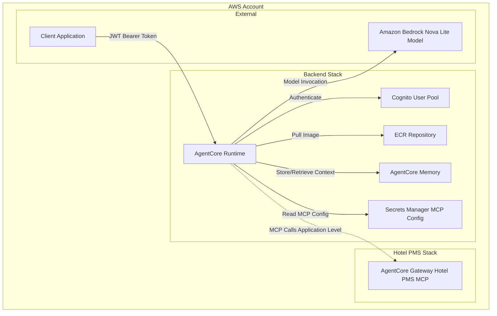

# Design Document

## Overview

This design document outlines the architecture and implementation approach for
deploying the hotel-assistant-chat package as an AgentCore Runtime within the
existing AWS infrastructure. The solution will integrate with existing Cognito
authentication, provide simple memory capabilities, and enable the chat
assistant to operate as a managed service through AWS Bedrock AgentCore.

## Architecture

### High-Level Architecture



### Component Architecture

The deployment consists of several key components that integrate with the
existing infrastructure:

1. **Docker Container**: The hotel-assistant-chat application packaged as an
   ARM64 container
2. **ECR Repository**: Stores the container image with lifecycle management
3. **AgentCore Runtime**: Managed runtime environment for the chat assistant
4. **AgentCore Memory**: Simple short-term memory for conversation context
5. **Authentication Integration**: JWT authentication using existing Cognito
   user pool
6. **Environment Configuration**: Runtime environment variables and secrets
   access

## Components and Interfaces

### 1. Container Build and Registry

**ECR Repository**

- Repository name: `hotel-assistant-chat`
- Lifecycle policy: Keep last 10 images, expire untagged images after 1 day
- Image scanning: Enabled for security vulnerability detection
- Encryption: AWS managed KMS encryption

**Docker Image Asset**

- Platform: `linux/arm64` (required by AgentCore Runtime)
- Build context: `packages/hotel-assistant-chat`
- Dockerfile: Uses existing multi-stage build for optimization
- Tags: Includes commit SHA and timestamp for traceability

### 2. AgentCore Runtime Configuration

**Runtime Properties**

```typescript
{
  runtimeName: "hotel-assistant-chat",
  container: dockerImageAsset,
  serverProtocol: "HTTP", // AgentCore SDK integration
  authorizerConfiguration: {
    customJWTAuthorizer: {
      discoveryUrl: cognitoDiscoveryUrl,
      allowedClients: [cognitoClientId]
    }
  }
}
```

**IAM Role Permissions**

- ECR image pull permissions
- Bedrock model invocation (`us.amazon.nova-lite-v1:0`)
- AgentCore Memory access (GetMemory, PutMemoryEvent, etc.)
- CloudWatch logging and X-Ray tracing
- Workload identity access for JWT token validation

### 3. AgentCore Memory Configuration

**Memory Properties**

```typescript
{
  memoryName: "hotel-assistant-memory",
  description: "Short-term memory for hotel assistant conversations",
  eventExpiryDuration: 7 // 7 days for short-term usage
  // No memoryStrategies - simple short-term memory only
}
```

**Memory Access Pattern**

- Session-based memory using session IDs
- Automatic cleanup after 7 days
- Simple strategy without complex namespaces
- Graceful fallback to stateless operation if memory fails

### 4. Authentication Integration

**JWT Authentication Flow**

1. Client obtains JWT token from existing Cognito user pool
2. Client includes token in `Authorization: Bearer <token>` header
3. AgentCore Runtime validates token against Cognito discovery URL
4. Runtime extracts user identity for memory and logging context

**Cognito Integration**

- Uses existing user pool from HotelAssistantStack
- Leverages existing client configuration
- No additional Cognito resources required
- Maintains compatibility with existing authentication flows

### 5. Environment Configuration

**Runtime Environment Variables**

```bash
AWS_REGION=us-east-1
BEDROCK_MODEL_ID=us.amazon.nova-lite-v1:0
LOG_LEVEL=INFO
AGENTCORE_MEMORY_ID=${memoryResourceId}
HOTEL_PMS_MCP_SECRET_ARN=${mcpConfigSecretArn}
```

**Secrets Manager Integration**

- MCP configuration secret from Hotel PMS stack
- Runtime has read-only access to secret
- Application-level MCP integration (not infrastructure-level)
- Graceful degradation if secret is unavailable

## Infrastructure Configuration

### 1. Stack Integration

**Backend Stack Integration**

- Add AgentCore components to existing BackendStack
- Reference existing Cognito user pool from stack outputs
- Import MCP configuration secret ARN from Hotel PMS stack
- Maintain separation between infrastructure and application concerns

### 2. Resource Dependencies

**Dependency Chain**

1. ECR Repository (independent)
2. Docker Image Asset (depends on repository)
3. AgentCore Memory (independent)
4. AgentCore Runtime (depends on image and memory)
5. Stack Outputs (depends on all resources)

### 3. Cross-Stack References

**Hotel PMS Stack Outputs**

- MCP configuration secret ARN (for environment variable)
- Cognito user pool ID and client ID (for JWT authentication)
- Cognito discovery URL (for JWT authorizer configuration)

## Error Handling

### 1. Runtime Initialization Errors

**Container Startup Failures**

- CloudWatch logs capture container startup errors
- Health check endpoints for runtime status monitoring
- Automatic retry mechanisms for transient failures
- Clear error messages for configuration issues

**Authentication Configuration Errors**

- Validate Cognito discovery URL accessibility
- Verify client ID configuration
- Log authentication setup errors with actionable messages
- Fallback to error responses for invalid configurations

### 2. Runtime Operation Errors

**Memory Access Failures**

- Log memory operation errors with context
- Graceful fallback to stateless operation
- Retry logic for transient memory service issues
- Clear error boundaries between memory and core functionality

**Model Invocation Errors**

- Bedrock service error handling and retries
- Rate limiting and quota management
- Model availability checks and fallbacks
- Structured error logging for troubleshooting

**MCP Integration Errors**

- Application-level error handling for MCP failures
- Graceful degradation when PMS data unavailable
- Connection retry logic with exponential backoff
- Clear separation between infrastructure and application errors

### 3. Client Request Errors

**Authentication Errors**

- HTTP 401 for invalid or expired tokens
- HTTP 403 for insufficient permissions
- Detailed error messages in logs (not exposed to clients)
- Token validation error categorization

**Request Validation Errors**

- HTTP 400 for malformed requests
- Input validation with clear error messages
- Request size and rate limiting
- Session ID format validation

## Testing Strategy

### 1. Infrastructure Testing

**CDK Unit Tests**

- Construct property validation
- IAM policy correctness
- Resource dependency verification
- Output value accuracy

**Integration Tests**

- AgentCore Runtime creation and configuration
- Memory resource provisioning
- Authentication setup validation
- Environment variable configuration

### 2. Container Testing

**Image Build Tests**

- Multi-architecture build verification
- Dependency installation validation
- Security vulnerability scanning
- Image size optimization verification

**Runtime Tests**

- Container startup and health checks
- Environment variable loading
- Application initialization
- Basic functionality verification

### 3. Authentication Testing

**JWT Token Validation**

- Valid token acceptance
- Expired token rejection
- Invalid signature handling
- Client ID validation

**Cognito Integration**

- Discovery URL accessibility
- Token format validation
- User identity extraction
- Error response formatting

### 4. Memory Integration Testing

**Memory Operations**

- Event storage and retrieval
- Session-based isolation
- Expiry handling
- Error recovery scenarios

**Performance Testing**

- Memory operation latency
- Concurrent session handling
- Memory usage patterns
- Cleanup efficiency

## Deployment Considerations

### 1. Infrastructure Deployment Order

1. **ECR Repository**: Create repository for container images
2. **Docker Image Build**: Build and push initial container image
3. **AgentCore Memory**: Create memory resource with proper configuration
4. **AgentCore Runtime**: Create runtime with all dependencies configured
5. **Stack Outputs**: Export necessary ARNs and identifiers

### 2. Configuration Management

**Environment Variables**

- Use CDK to inject runtime configuration
- Reference existing stack outputs for integration
- Validate configuration completeness during deployment
- Support for configuration updates without redeployment

**Secrets Integration**

- Reference existing MCP configuration secret
- Grant minimal required permissions for secret access
- Handle secret rotation and updates gracefully
- Log secret access for audit purposes

### 3. Monitoring and Observability

**CloudWatch Integration**

- Structured logging with consistent format
- Custom metrics for business logic monitoring
- Log aggregation and search capabilities
- Alert configuration for critical errors

**X-Ray Tracing**

- Distributed tracing for request flows
- Performance monitoring and bottleneck identification
- Integration with downstream services
- Trace correlation across components

### 4. Security Considerations

**Network Security**

- Public networking mode (no VPC required)
- HTTPS-only communication
- Proper certificate validation
- Network-level access controls

**IAM Security**

- Principle of least privilege for all roles
- Resource-specific permissions where possible
- Regular permission auditing
- Cross-service access validation

**Data Security**

- Encryption at rest for memory data
- Encryption in transit for all communications
- Secure secret handling and rotation
- PII handling and data retention policies

## Performance Optimization

### 1. Container Optimization

**Image Size Reduction**

- Multi-stage Docker builds
- Minimal base images
- Dependency optimization
- Layer caching strategies

**Startup Performance**

- Bytecode compilation for Python
- Dependency pre-loading
- Configuration caching
- Health check optimization

### 2. Runtime Performance

**Memory Usage**

- Efficient memory event storage
- Session cleanup automation
- Memory usage monitoring
- Garbage collection optimization

**Response Latency**

- Model invocation optimization
- Caching strategies for frequent requests
- Connection pooling for external services
- Asynchronous processing where appropriate

### 3. Scalability Considerations

**Auto-scaling**

- AgentCore Runtime handles scaling automatically
- Monitor resource utilization patterns
- Configure appropriate scaling policies
- Load testing for capacity planning

**Resource Limits**

- Memory and CPU allocation optimization
- Request timeout configuration
- Concurrent request handling
- Resource usage monitoring and alerting
