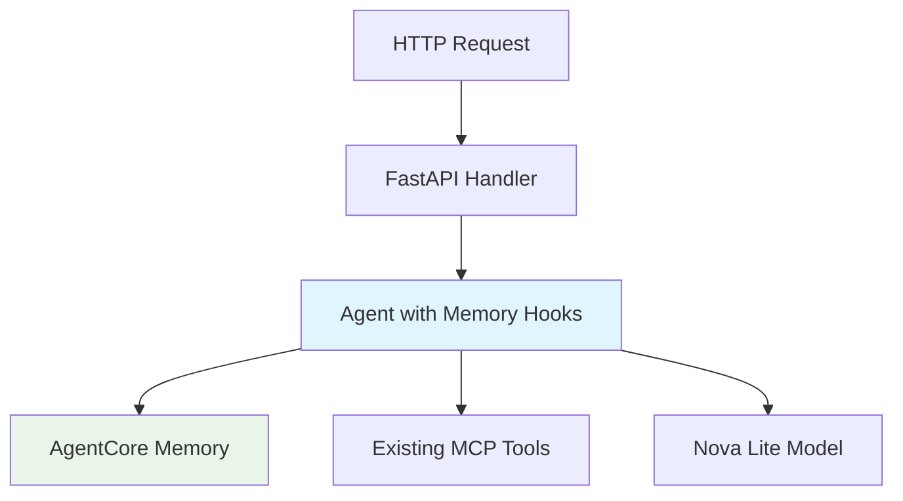

# Hotel Assistant Chat Memory Design

## Overview

This design document outlines a simple implementation of session management and
short-term memory for the hotel-assistant-chat agent using Amazon Bedrock
AgentCore Memory. The solution adds conversation continuity to the existing
Strands agent with minimal complexity.

## Architecture



## Components and Interfaces

### 1. Memory Hook Provider

Simple memory hook provider that automatically handles conversation storage and
retrieval.

```python
class MemoryHookProvider(HookProvider):
    def __init__(self, memory_client: MemoryClient, memory_id: str, actor_id: str, session_id: str):
        self.memory_client = memory_client
        self.memory_id = memory_id
        self.actor_id = actor_id
        self.session_id = session_id

    def on_agent_initialized(self, event: AgentInitializedEvent):
        """Load recent conversation turns when agent starts"""
        try:
            # Get configurable number of turns (default 30 for hotel conversations)
            max_turns = int(os.getenv("AGENTCORE_MEMORY_MAX_TURNS", "30"))
            recent_turns = self.memory_client.get_last_k_turns(
                memory_id=self.memory_id,
                actor_id=self.actor_id,
                session_id=self.session_id,
                k=max_turns
            )
            if recent_turns:
                context = self._format_conversation_history(recent_turns)
                event.agent.system_prompt += f"\n\nRecent conversation:\n{context}"
        except Exception as e:
            logger.warning(f"Failed to load conversation history: {e}")

    def on_message_added(self, event: MessageAddedEvent):
        """Store new messages in memory"""
        try:
            message = event.agent.messages[-1]
            self.memory_client.create_event(
                memory_id=self.memory_id,
                actor_id=self.actor_id,
                session_id=self.session_id,
                messages=[(str(message.get("content", "")), message["role"])]
            )
        except Exception as e:
            logger.warning(f"Failed to store message in memory: {e}")
```

### 2. Enhanced Agent Creation

Modified agent creation to include memory hooks with minimal configuration.

```python
def create_agent_with_memory(actor_id: str = "default_user", session_id: str = "default_session") -> Agent:
    """Create Strands agent with memory hooks and existing MCP tools"""

    try:
        # Initialize memory client
        memory_client = MemoryClient(region_name=os.getenv("AWS_REGION", "us-east-1"))

        # Create or get existing memory resource
        try:
            memory = memory_client.create_memory_and_wait(
                name="HotelAssistantMemory",
                strategies=[],  # Short-term memory only
                event_expiry_days=7
            )
            memory_id = memory["id"]
        except Exception:
            # Memory might already exist, try to find it
            memories = memory_client.list_memories()
            memory_id = next((m["id"] for m in memories if "HotelAssistantMemory" in m["id"]), None)
            if not memory_id:
                raise

        # Create memory hook provider
        memory_hooks = MemoryHookProvider(memory_client, memory_id, actor_id, session_id)
        hooks = [memory_hooks]

    except Exception as e:
        logger.warning(f"Memory initialization failed: {e}. Running without memory.")
        hooks = []

    # Get existing MCP and prompt configuration (unchanged)
    mcp_config = create_authenticated_mcp_server()
    instructions = generate_dynamic_hotel_instructions(mcp_server=mcp_config)

    # Create agent with memory hooks
    agent_kwargs = {
        "model": BedrockModel(model_id="amazon.nova-lite-v1:0", region="us-east-1"),
        "system_prompt": instructions,
        "hooks": hooks
    }

    if mcp_config:
        agent_kwargs["tools"] = [mcp_config]

    return Agent(**agent_kwargs)
```

### 3. Updated FastAPI Handler

Simple modification to support session parameters.

```python
class InvocationRequest(BaseModel):
    input: dict[str, Any]
    session_id: Optional[str] = None
    actor_id: Optional[str] = None

@app.post("/invocations", response_model=InvocationResponse)
async def invoke_agent(request: InvocationRequest):
    """Handle agent invocations with session support"""
    user_message = request.input.get("prompt", "")
    if not user_message:
        raise HTTPException(status_code=400, detail="No prompt found in input")

    # Extract session information
    actor_id = request.actor_id or "default_user"
    session_id = request.session_id or "default_session"

    # Create agent with memory for this session
    agent = create_agent_with_memory(actor_id, session_id)

    try:
        result = agent(user_message)
        response = {
            "message": result.message,
            "timestamp": datetime.utcnow().isoformat(),
            "session_id": session_id,
            "actor_id": actor_id
        }
        return InvocationResponse(output=response)
    except Exception as e:
        logger.error(f"Agent processing failed: {e}")
        raise HTTPException(status_code=500, detail=f"Agent processing failed: {str(e)}")
```

## Data Models

### Memory Event Structure

Simple event structure for conversation storage:

```python
# User message
{
    "role": "user",
    "content": {"text": "I need help with my reservation"},
    "timestamp": "2025-01-27T10:30:00Z"
}

# Assistant response
{
    "role": "assistant",
    "content": {"text": "I'd be happy to help with your reservation."},
    "timestamp": "2025-01-27T10:30:05Z"
}
```

## Error Handling

### Graceful Degradation

- If memory initialization fails, agent runs without memory
- If memory operations fail, log warnings but continue processing
- All existing functionality (MCP tools, prompts) continues to work

## Testing Strategy

### Core Tests

```python
def test_memory_hook_stores_messages():
    """Test that messages are stored in memory"""

def test_memory_hook_loads_history():
    """Test that conversation history is loaded"""

def test_agent_works_without_memory():
    """Test agent continues working when memory fails"""

def test_session_isolation():
    """Test that different sessions have separate memory"""
```

## Implementation Approach

### Single Phase Implementation

1. **Dependencies**: Add `bedrock-agentcore` dependency if needed
2. **Memory Hooks**: Create `MemoryHookProvider` class
3. **Agent Enhancement**: Modify `create_agent()` to
   `create_agent_with_memory()`
4. **API Updates**: Update FastAPI handler to support session parameters
5. **Error Handling**: Add graceful degradation when memory is unavailable
6. **Testing**: Create simple tests for memory functionality

### Prerequisites

The application assumes that an AgentCore Memory resource has been created and
its ID is available via the `AGENTCORE_MEMORY_ID` environment variable. If this
environment variable is not set, the agent will operate without memory
functionality.

## Configuration

### Environment Variables

```bash
# Existing configuration (unchanged)
AWS_REGION=us-east-1
HOTEL_PMS_MCP_URL=https://your-agentcore-gateway...
BEDROCK_MODEL_ID=amazon.nova-lite-v1:0

# New: AgentCore Memory configuration (set by infrastructure)
AGENTCORE_MEMORY_ID=mem-12345abcdef  # Created by CDK/CloudFormation
AGENTCORE_MEMORY_MAX_TURNS=15        # Number of conversation turns to load (default: 15)
```

## File Structure

```
packages/hotel-assistant-chat/
├── hotel_assistant_chat/
│   ├── __init__.py
│   ├── agent.py                    # Enhanced with memory
│   ├── memory_hooks.py             # New: MemoryHookProvider
│   ├── mcp/                        # Existing MCP integration
│   ├── prompts.py                  # Existing prompt management
│   └── assets/                     # Existing prompt assets
└── tests/
    ├── test_memory.py              # New: Memory tests
    ├── test_integration.py         # Enhanced with memory tests
    └── test_agent.py               # Enhanced with memory tests
```

## Dependencies

### New Dependencies

```toml
dependencies = [
    # Existing dependencies (unchanged)
    "strands-agents",
    "bedrock-agentcore",  # Already exists
    "boto3>=1.37.31",
    "httpx>=0.27.0",
    "fastapi",
    "uvicorn[standard]",
    "pydantic",
]
```

This simplified design focuses on core functionality with minimal complexity,
making it suitable for a prototype implementation while maintaining all existing
features.
