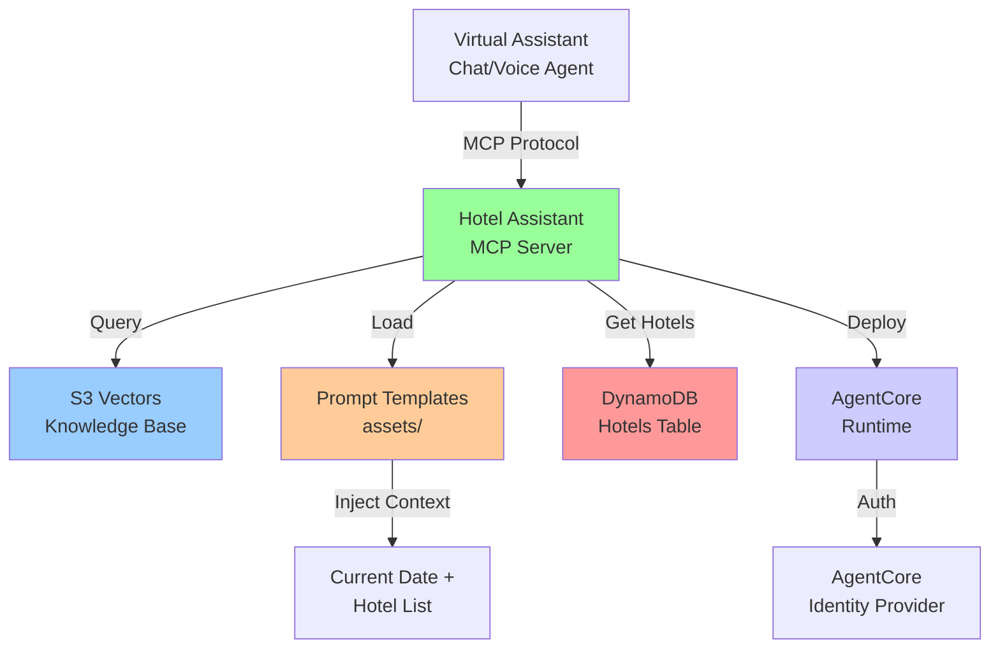

# Design Document

## Overview

The Hotel Assistant MCP Server is a Python-based FastMCP server that provides AI
agents with tools for querying hotel documentation and prompts for maintaining
consistent conversational behavior. The server integrates with the S3 Vectors
Knowledge Base and DynamoDB hotel data, deployed on AgentCore Runtime for
scalability.

**Key Design Principles:**

- Use FastMCP for simple MCP server implementation
- Deploy on AgentCore Runtime with Docker containerization
- Reuse existing AgentCore identity provider for authentication
- Load prompts from template files with dynamic context injection
- Get hotel data from DynamoDB using existing HotelService
- No retry logic in MCP server (handled by agent)

## Architecture

### High-Level Architecture



### Component Responsibilities

- **FastMCP Server**: Implements MCP protocol with tools and prompts
- **Knowledge Query Tool**: Searches S3 Vectors KB with optional hotel filtering
- **Prompt Functions**: Return prompts with dynamic context injection
- **Hotel Context Generator**: Provides current date and hotel list from
  DynamoDB
- **AgentCore Runtime**: Hosts and scales the MCP server with Docker
- **Identity Provider**: Reuses existing Cognito OAuth2 provider for
  authentication

## Components and Interfaces

### FastMCP Server Implementation

```python
"""
Hotel Assistant MCP Server

Provides tools for querying hotel documentation and prompts for AI agents.
Location: packages/hotel-pms-simulation/hotel_pms_simulation/mcp/server.py
"""

from mcp.server import FastMCP
from aws_lambda_powertools import Logger
import boto3
import os
from typing import List, Optional, Dict, Any
from datetime import datetime
from pathlib import Path

# Import hotel service for DynamoDB access
from ..services.hotel_service import HotelService

logger = Logger()

# Initialize FastMCP server
mcp = FastMCP("Hotel Assistant")

# Global configuration
KNOWLEDGE_BASE_ID = os.environ.get("KNOWLEDGE_BASE_ID")
AWS_REGION = os.environ.get("AWS_REGION", "us-east-1")
PROMPT_DIR = Path(__file__).parent / "assets"

# Initialize services
hotel_service = HotelService()
bedrock_agent = boto3.client('bedrock-agent-runtime', region_name=AWS_REGION)


@mcp.tool(description="Query hotel documentation from knowledge base")
async def query_hotel_knowledge(
    query: str,
    hotel_ids: Optional[List[str]] = None,
    max_results: int = 5
) -> List[Dict[str, Any]]:
    """
    Query hotel documentation from knowledge base.

    Args:
        query: Search query string
        hotel_ids: Optional list of hotel IDs to filter by
        max_results: Maximum number of results (default: 5)

    Returns:
        List of relevant document excerpts with metadata
    """
    try:
        # Build retrieval configuration
        retrieval_config = {
            'vectorSearchConfiguration': {
                'numberOfResults': max_results
            }
        }

        # Add hotel_id filter if provided
        if hotel_ids:
            retrieval_config['vectorSearchConfiguration']['filter'] = {
                'in': {
                    'key': 'hotel_id',
                    'value': hotel_ids
                }
            }

        # Query knowledge base
        response = bedrock_agent.retrieve(
            knowledgeBaseId=KNOWLEDGE_BASE_ID,
            retrievalQuery={'text': query},
            retrievalConfiguration=retrieval_config
        )

        # Format results
        results = []
        for item in response.get('retrievalResults', []):
            results.append({
                'content': item['content']['text'],
                'score': item['score'],
                'metadata': item.get('metadata', {}),
                'source': item.get('location', {}).get('s3Location', {})
            })

        logger.info(
            "Knowledge base query completed",
            extra={
                'query': query,
                'hotel_ids': hotel_ids,
                'results_count': len(results)
            }
        )

        return results

    except Exception as e:
        logger.error(
            "Knowledge base query failed",
            extra={'error': str(e), 'query': query}
        )
        raise


@mcp.prompt(name='chat_system_prompt')
async def chat_system_prompt() -> str:
    """System prompt optimized for text-based chat interactions."""
    return load_prompt_with_context('chat', prompt_dir=PROMPT_DIR)


@mcp.prompt(name='voice_system_prompt')
async def voice_system_prompt() -> str:
    """System prompt optimized for speech-to-speech voice interactions."""
    return load_prompt_with_context('voice', prompt_dir=PROMPT_DIR)


@mcp.prompt(name='default_system_prompt')
async def default_system_prompt() -> str:
    """General-purpose system prompt for any interaction type (returns chat prompt)."""
    return load_prompt_with_context('chat', prompt_dir=PROMPT_DIR)


def load_prompt_with_context(prompt_type: str, prompt_dir: Path) -> str:
    """
    Load prompt template and inject dynamic hotel context.

    Args:
        prompt_type: Type of prompt (chat, voice, default)
        prompt_dir: Directory containing prompt templates

    Returns:
        Prompt with injected context
    """
    # Load template
    template_path = prompt_dir / f'{prompt_type}_prompt.txt'
    if not template_path.exists():
        raise FileNotFoundError(f"Prompt template not found: {template_path}")

    template = template_path.read_text()

    # Generate dynamic context
    context = generate_hotel_context()

    # Inject context
    prompt = template.replace('{current_date}', context['current_date'])
    prompt = prompt.replace('{hotel_list}', context['hotel_list'])

    logger.info(
        "Generated prompt with context",
        extra={'prompt_type': prompt_type}
    )

    return prompt


def generate_hotel_context() -> Dict[str, str]:
    """
    Generate dynamic hotel context for prompt injection.

    Returns:
        Dictionary with current_date and hotel_list
    """
    # Get current date
    current_date = datetime.now().strftime('%B %d, %Y')

    # Get hotels from DynamoDB
    try:
        hotels_response = hotel_service.get_hotels()
        hotels = hotels_response.get('hotels', [])

        # Format hotel list
        hotel_list_lines = ["Available hotels:"]
        for hotel in hotels:
            hotel_list_lines.append(
                f"- {hotel.get('name', 'Unknown')} (ID: {hotel.get('hotel_id', 'unknown')})"
            )

        hotel_list = '\n'.join(hotel_list_lines)

    except Exception as e:
        logger.error(
            "Failed to get hotel list",
            extra={'error': str(e)}
        )
        hotel_list = "Hotel list temporarily unavailable"

    return {
        'current_date': current_date,
        'hotel_list': hotel_list
    }


# Entry point for AgentCore Runtime
def handler(event, context):
    """Lambda handler for AgentCore Runtime."""
    return mcp.run(transport="streamable-http")
```

### Prompt Template Files

```
packages/hotel-pms-simulation/hotel_pms_simulation/mcp/assets/
├── chat_prompt.txt
├── voice_prompt.txt
└── default_prompt.txt
```

**chat_prompt.txt** (copied from virtual-assistant-chat):

```
You are a helpful hotel assistant for our hotel properties. You provide information about hotels, rooms, amenities, and help guests with reservations.

Current date: {current_date}

{hotel_list}

When guests ask questions:
- Be professional, friendly, and concise
- Use the query_hotel_knowledge tool to find accurate information
- Always specify which hotel you're referring to
- Provide clear pricing and availability information
- Offer to help with reservations when appropriate

Remember to maintain a helpful and professional tone in all interactions.
```

**voice_prompt.txt** (copied from virtual-assistant-livekit):

```
You are a helpful hotel assistant speaking with guests. Keep responses brief and natural for voice conversations.

Current date: {current_date}

{hotel_list}

Voice interaction guidelines:
- Keep responses under 3 sentences when possible
- Use natural speech patterns
- Avoid lists or complex formatting
- Confirm understanding before taking actions
- Use the query_hotel_knowledge tool for factual information

Speak naturally and be helpful!
```

**default_prompt.txt** (not needed - default returns chat prompt):

```
# This file is not created - default_system_prompt returns chat_prompt.txt
```

## Dockerfile

```dockerfile
# Multi-stage build for Hotel Assistant MCP Server
FROM ghcr.io/astral-sh/uv:python3.13-bookworm-slim

# Install system dependencies
RUN apt-get update && apt-get install -y curl && apt-get clean && rm -rf /var/lib/apt/lists/*

# Create non-root user
RUN addgroup --system --gid 1001 appgroup && \
    adduser --system --uid 1001 --gid 1001 appuser

WORKDIR /app

# Enable bytecode compilation for better startup performance
ENV UV_COMPILE_BYTECODE=1

# Copy from the cache instead of linking since it's a mounted cache
ENV UV_LINK_MODE=copy

# Copy package configuration
COPY --chown=appuser:appgroup pyproject.toml ./
COPY --chown=appuser:appgroup README.md ./

# Install dependencies without the project itself (for better layer caching)
RUN --mount=type=cache,target=/root/.cache/uv \
    uv sync --frozen --no-install-project

# Copy application code
COPY --chown=appuser:appgroup hotel_pms_simulation/ ./hotel_pms_simulation/

# Install the project itself
RUN --mount=type=cache,target=/root/.cache/uv \
    uv sync --frozen

# Activate the virtual environment by adding its bin directory to PATH
ENV PATH="/app/.venv/bin:$PATH"

# Set Python path for proper module resolution
ENV PYTHONPATH="/app"

# Switch to non-root user
USER appuser

# Expose port for health checks
EXPOSE 8080

# Add healthcheck
HEALTHCHECK --interval=30s --timeout=5s --start-period=60s --retries=3 \
    CMD curl -f http://localhost:8080/ping || exit 1

# Use the MCP server handler as entry point
ENTRYPOINT ["python", "-m", "hotel_pms_simulation.mcp.server"]
```

## CDK Infrastructure

### AgentCore Runtime Deployment

```python
"""
CDK construct for Hotel Assistant MCP Server deployment.
Location: packages/infra/stack/stack_constructs/hotel_assistant_mcp_construct.py
"""

from aws_cdk import (
    Duration,
    Stack,
)
from aws_cdk import aws_bedrock_agentcore_alpha as agentcore
from aws_cdk import aws_ec2 as ec2
from aws_cdk import aws_ecr_assets as ecr_assets
from aws_cdk import aws_iam as iam
from cdk_nag import NagSuppressions
from constructs import Construct


class HotelAssistantMCPConstruct(Construct):
    """Construct for Hotel Assistant MCP Server on AgentCore Runtime."""

    def __init__(
        self,
        scope: Construct,
        construct_id: str,
        knowledge_base_id: str,
        knowledge_base_arn: str,
        hotels_table_name: str,
        hotels_table_arn: str,
        cognito_discovery_url: str,
        cognito_allowed_clients: list,
        **kwargs,
    ):
        super().__init__(scope, construct_id, **kwargs)

        # Build Docker image
        docker_image = ecr_assets.DockerImageAsset(
            self,
            "MCPServerImage",
            directory="../hotel-pms-simulation",
            file="Dockerfile-mcp",
        )

        # Create IAM role for MCP server
        mcp_role = iam.Role(
            self,
            "MCPServerRole",
            assumed_by=iam.ServicePrincipal("agentcore.amazonaws.com"),
            description="Role for Hotel Assistant MCP Server",
        )

        # Grant knowledge base access
        mcp_role.add_to_policy(
            iam.PolicyStatement(
                actions=[
                    "bedrock:Retrieve",
                    "bedrock:RetrieveAndGenerate",
                ],
                resources=[knowledge_base_arn],
            )
        )

        # Grant DynamoDB read access for hotels table
        mcp_role.add_to_policy(
            iam.PolicyStatement(
                actions=[
                    "dynamodb:GetItem",
                    "dynamodb:Scan",
                    "dynamodb:Query",
                ],
                resources=[hotels_table_arn],
            )
        )

        # Deploy MCP server on AgentCore Runtime
        # Uses same Cognito User Pool for inbound auth as AgentCore Gateway
        self.runtime = agentcore.Runtime(
            self,
            "MCPRuntime",
            runtime_name="hotel-assistant-mcp",
            image=agentcore.RuntimeImage.from_ecr(
                repository=docker_image.repository,
                tag=docker_image.image_tag,
            ),
            role=mcp_role,
            environment={
                "KNOWLEDGE_BASE_ID": knowledge_base_id,
                "AWS_REGION": Stack.of(self).region,
                "HOTELS_TABLE_NAME": hotels_table_name,
                "LOG_LEVEL": "INFO",
            },
            memory_size=512,
            timeout=Duration.minutes(5),
            authorizer_type="CUSTOM_JWT",
            authorizer_configuration=agentcore.Runtime.AuthorizerConfigurationProperty(
                custom_jwt_authorizer=agentcore.Runtime.CustomJWTAuthorizerConfigurationProperty(
                    discovery_url=cognito_discovery_url,
                    allowed_clients=cognito_allowed_clients,
                )
            ),
        )

        # Suppress CDK Nag warnings
        NagSuppressions.add_resource_suppressions(
            mcp_role,
            [
                {
                    "id": "AwsSolutions-IAM5",
                    "reason": "MCP server requires read access to DynamoDB table and knowledge base. "
                    "Scoped to specific resources.",
                }
            ],
            apply_to_children=True,
        )

    @property
    def runtime_arn(self) -> str:
        """Get the AgentCore Runtime ARN."""
        return self.runtime.runtime_arn

    @property
    def runtime_url(self) -> str:
        """Get the AgentCore Runtime URL."""
        return self.runtime.runtime_url
```

### Integration with HotelPMSStack

```python
# In packages/infra/stack/hotel_pms_stack.py

from .stack_constructs.hotel_assistant_mcp_construct import HotelAssistantMCPConstruct

class HotelPMSStack(Stack):
    def __init__(self, scope: Construct, construct_id: str, **kwargs):
        super().__init__(scope, construct_id, **kwargs)

        # ... existing constructs ...

        # Create Hotel Assistant MCP Server
        # Uses same Cognito JWT configuration as AgentCore Gateway
        jwt_config = self.api_construct.jwt_authorizer_config
        self.mcp_server = HotelAssistantMCPConstruct(
            self,
            "HotelAssistantMCP",
            knowledge_base_id=self.knowledge_base_construct.knowledge_base_id,
            knowledge_base_arn=self.knowledge_base_construct.knowledge_base_arn,
            hotels_table_name=self.dynamodb_construct.table_names['hotels'],
            hotels_table_arn=self.dynamodb_construct.table_arns['hotels'],
            cognito_discovery_url=jwt_config['discovery_url'],
            cognito_allowed_clients=jwt_config['allowed_clients'],
        )

        # Output MCP server information
        CfnOutput(
            self,
            "MCPServerRuntimeArn",
            value=self.mcp_server.runtime_arn,
            description="Hotel Assistant MCP Server Runtime ARN",
        )

        CfnOutput(
            self,
            "MCPServerRuntimeUrl",
            value=self.mcp_server.runtime_url,
            description="Hotel Assistant MCP Server Runtime URL",
        )
```

## Data Models

### MCP Tool Request/Response

```python
# Tool Request
{
    "jsonrpc": "2.0",
    "id": 1,
    "method": "tools/call",
    "params": {
        "name": "query_hotel_knowledge",
        "arguments": {
            "query": "What are the check-in times?",
            "hotel_ids": ["hotel-001", "hotel-002"],
            "max_results": 5
        }
    }
}

# Tool Response
{
    "jsonrpc": "2.0",
    "id": 1,
    "result": {
        "content": [
            {
                "type": "text",
                "text": "[{\"content\": \"Check-in time is 3:00 PM...\", \"score\": 0.95, \"metadata\": {\"hotel_id\": \"hotel-001\"}, \"source\": {\"uri\": \"s3://bucket/hotel-001/policies.md\"}}]"
            }
        ]
    }
}
```

### MCP Prompt Request/Response

```python
# List Prompts Request
{
    "jsonrpc": "2.0",
    "id": 1,
    "method": "prompts/list"
}

# List Prompts Response
{
    "jsonrpc": "2.0",
    "id": 1,
    "result": {
        "prompts": [
            {
                "name": "chat_system_prompt",
                "description": "System prompt optimized for text-based chat interactions"
            },
            {
                "name": "voice_system_prompt",
                "description": "System prompt optimized for speech-to-speech voice interactions"
            },
            {
                "name": "default_system_prompt",
                "description": "General-purpose system prompt for any interaction type"
            }
        ]
    }
}

# Get Prompt Request
{
    "jsonrpc": "2.0",
    "id": 2,
    "method": "prompts/get",
    "params": {
        "name": "chat_system_prompt",
        "arguments": {}
    }
}

# Get Prompt Response
{
    "jsonrpc": "2.0",
    "id": 2,
    "result": {
        "description": "System prompt for chat interactions",
        "messages": [
            {
                "role": "user",
                "content": {
                    "type": "text",
                    "text": "You are a helpful hotel assistant...\n\nCurrent date: December 15, 2024\n\nAvailable hotels:\n- Grand Plaza Hotel (ID: hotel-001)\n- Seaside Resort (ID: hotel-002)"
                }
            }
        ]
    }
}
```

## Error Handling

### Error Response Format

```python
{
    "jsonrpc": "2.0",
    "id": 1,
    "error": {
        "code": -32603,
        "message": "Internal error",
        "data": {
            "details": "Knowledge base temporarily unavailable"
        }
    }
}
```

### Error Handling Strategy

- **Knowledge Base Errors**: Log error and raise exception (agent will retry)
- **DynamoDB Errors**: Return fallback message "Hotel list temporarily
  unavailable"
- **Template Not Found**: Raise FileNotFoundError during initialization
- **Invalid Parameters**: FastMCP handles validation automatically

## Testing Strategy

### Unit Tests

```python
# Test knowledge query tool
@pytest.mark.asyncio
async def test_query_knowledge_base_with_hotel_filter(mock_bedrock_client):
    """Test querying with hotel_ids filter."""
    results = await query_hotel_knowledge(
        query="check-in time",
        hotel_ids=["hotel-001"],
        max_results=3
    )
    assert len(results) <= 3
    assert all(r['metadata'].get('hotel_id') == 'hotel-001' for r in results)

# Test prompt generation
def test_prompt_injection(tmp_path):
    """Test dynamic context injection."""
    # Create test template
    template = tmp_path / "chat_prompt.txt"
    template.write_text("Date: {current_date}\n{hotel_list}")

    prompt = load_prompt_with_context('chat', prompt_dir=tmp_path)
    assert datetime.now().strftime('%B') in prompt
    assert 'Available hotels:' in prompt

# Test hotel context generation
def test_generate_hotel_context(mock_hotel_service):
    """Test hotel context generation from DynamoDB."""
    context = generate_hotel_context()
    assert 'current_date' in context
    assert 'hotel_list' in context
    assert 'Grand Plaza Hotel' in context['hotel_list']
```

### Integration Tests

```python
@pytest.mark.integration
async def test_mcp_server_end_to_end():
    """Test complete MCP server workflow."""
    # Test tool call
    results = await query_hotel_knowledge(
        query="amenities",
        hotel_ids=["hotel-001"]
    )
    assert len(results) > 0

    # Test prompt generation
    prompt = await chat_system_prompt()
    assert len(prompt) > 0
    assert datetime.now().strftime('%B') in prompt
```

## Package Structure

```
packages/hotel-pms-simulation/
├── hotel_pms_simulation/
│   ├── __init__.py
│   ├── mcp/
│   │   ├── __init__.py
│   │   ├── server.py              # FastMCP server implementation
│   │   └── assets/
│   │       ├── chat_prompt.txt    # Chat prompt template
│   │       ├── voice_prompt.txt   # Voice prompt template
│   │       └── default_prompt.txt # Default prompt template
│   ├── services/
│   │   └── hotel_service.py       # Existing HotelService (reused)
│   └── handlers/
│       └── api_gateway_handler.py # Existing API handler
├── tests/
│   └── mcp/
│       ├── test_server.py
│       ├── test_prompts.py
│       └── integration/
│           └── test_mcp_integration.py
├─��� Dockerfile-mcp                 # Docker build for MCP server
├── pyproject.toml
└── README.md
```

This design provides a complete FastMCP server implementation with knowledge
querying, dynamic prompt generation, and AgentCore Runtime deployment using
existing infrastructure patterns.
