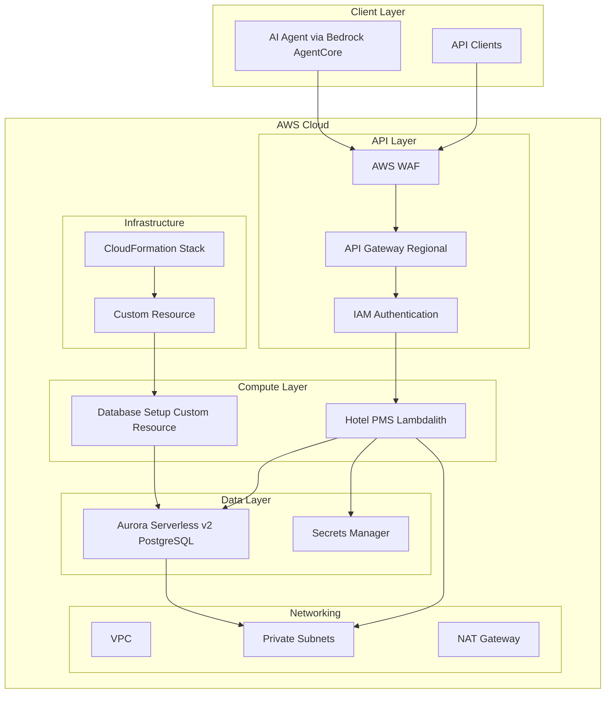

# Design Document

## Overview

The Hotel Property Management System (PMS) API is a serverless REST API built on
AWS that provides comprehensive hotel management capabilities. The system is
designed to work as an MCP (Model Context Protocol) server with Amazon Bedrock
AgentCore Gateway, enabling AI agents to perform hotel operations through
natural language interactions.

The architecture follows AWS Well-Architected principles with a focus on
security, scalability, and cost optimization. The system uses a regional API
Gateway with IAM authentication, AWS Lambda functions for business logic, and
Aurora Serverless v2 PostgreSQL for data persistence.

## Architecture

### High-Level Architecture



### Technology Stack

- **API Gateway**: Regional REST API with IAM authentication
- **AWS Lambda**: Python 3.13 runtime with Lambda Powertools
- **Aurora Serverless v2**: PostgreSQL 15.x with automatic scaling
- **VPC**: Private networking with NAT Gateway for Lambda internet access
- **Secrets Manager**: Database credentials and connection strings
- **CDK**: Infrastructure as Code using Python CDK constructs

## Components and Interfaces

### API Gateway Configuration

**Regional REST API**

- Endpoint Type: Regional (for better performance and lower latency)
- Authentication: IAM (AWS Signature Version 4)
- Throttling: 10,000 requests per second burst, 5,000 steady state
- CORS: Enabled for cross-origin requests
- Request Validation: Enabled with OpenAPI schema validation
- WAF: AWS WAF v2 with basic protection rules

**AWS WAF Configuration**

- Rate limiting: 2000 requests per 5-minute window per IP
- AWS Managed Rules: Core Rule Set (CRS)
- AWS Managed Rules: Known Bad Inputs
- Geographic restrictions: Configurable by region
- IP allowlist/blocklist support

**Resource Structure**

```
/api
├── /availability (GET)
├── /pricing (GET)
├── /quote (POST)
├── /reservations (POST, GET)
├── /reservations/{reservation_id} (GET, PUT)
├── /checkout (POST)
└── /housekeeping-request (POST)
```

### Lambda Functions

#### 1. Hotel PMS Lambdalith

**Purpose**: Handle all hotel PMS operations in a single Lambda function
**Runtime**: Python 3.13 **Memory**: 1024 MB **Timeout**: 60 seconds
**Environment Variables**:

- `DB_SECRET_ARN`: Aurora connection secret ARN
- `LOG_LEVEL`: INFO

**Endpoints Handled**:

- `GET /api/availability`
- `GET /api/pricing`
- `POST /api/quote`
- `POST /api/reservations`
- `GET /api/reservations`
- `GET /api/reservations/{reservation_id}`
- `PUT /api/reservations/{reservation_id}`
- `POST /api/checkout`
- `POST /api/housekeeping-request`

#### 2. Database Setup Custom Resource Lambda

**Purpose**: CloudFormation custom resource for database schema initialization
and seed data loading **Runtime**: Python 3.13 **Memory**: 512 MB **Timeout**:
900 seconds (15 minutes) **Trigger**: CloudFormation custom resource during
stack CREATE/UPDATE/DELETE operations

**Custom Resource Properties**:

- `DeleteData`: Boolean flag to control whether database is torn down on stack
  deletion (default: false)

**CloudFormation Events Handled**:

- **CREATE**: Set up database schema and load seed data from bundled CSV files
- **UPDATE**: Re-run database setup (idempotent operation)
- **DELETE**: Optionally tear down database if DeleteData=true, otherwise
  preserve data

**Response Data**:

- `DatabaseStatus`: Status of the database operation
  (created/updated/deleted/preserved)
- `RecordCounts`: Number of records inserted for each table type
- `TotalTables`: Total number of database tables created
- `Message`: Human-readable status message

### Database Initialization Strategy

#### CloudFormation Custom Resource Approach

The database schema and seed data initialization is handled through a
CloudFormation custom resource, providing several advantages:

**Infrastructure Integration**:

- Database setup is part of the CloudFormation stack lifecycle
- Automatic rollback on deployment failures
- Consistent deployment across environments
- No manual intervention required

**Lifecycle Management**:

- **Stack Creation**: Automatically sets up schema and loads seed data
- **Stack Updates**: Re-runs setup (idempotent) to handle schema changes
- **Stack Deletion**: Configurable data preservation or cleanup

**Operational Benefits**:

- Eliminates manual database setup steps
- Ensures consistent database state across deployments
- Provides CloudFormation outputs with database status
- Integrates with CDK deployment pipeline

**Custom Resource Implementation**:

```python
# CloudFormation custom resource properties
{
    "Type": "Custom::DatabaseSetup",
    "Properties": {
        "ServiceToken": "arn:aws:lambda:region:account:function:db-setup-custom-resource",
        "DeleteData": false,  # Preserve data on stack deletion
        "Version": "1.0"      # Force updates when changed
    }
}
```

### Database Design

#### Aurora Serverless v2 Configuration

- **Engine**: PostgreSQL 15.x
- **Scaling**: 0.5 ACU minimum, 16 ACU maximum
- **Backup**: 7-day retention period
- **Encryption**: Enabled with AWS managed keys
- **Multi-AZ**: Enabled for high availability
- **Network**: Private subnets only, no public access

#### Connection Management

- **Connection Pooling**: Implemented in Lambda functions using asyncpg pool
- **Secrets Manager**: Database credentials stored securely
- **Connection Reuse**: Lambda container reuse for connection efficiency
- **Async Operations**: asyncpg provides native async/await support for better
  performance

## Data Models

### Core Database Schema

#### Hotels Table

```sql
CREATE TABLE hotels (
    hotel_id VARCHAR(50) PRIMARY KEY,
    name VARCHAR(200) NOT NULL,
    location VARCHAR(200) NOT NULL,
    timezone VARCHAR(50) DEFAULT 'America/Mexico_City',
    created_at TIMESTAMP DEFAULT CURRENT_TIMESTAMP
);
```

#### Room Types Table

```sql
CREATE TABLE room_types (
    room_type_id VARCHAR(50) PRIMARY KEY,
    hotel_id VARCHAR(50) NOT NULL REFERENCES hotels(hotel_id),
    name VARCHAR(100) NOT NULL,
    description TEXT,
    max_occupancy INTEGER NOT NULL,
    total_rooms INTEGER NOT NULL,
    base_rate DECIMAL(10,2) NOT NULL,
    breakfast_rate DECIMAL(10,2) NOT NULL,
    all_inclusive_rate DECIMAL(10,2) NOT NULL,
    created_at TIMESTAMP DEFAULT CURRENT_TIMESTAMP
);
```

#### Rooms Table

```sql
CREATE TABLE rooms (
    room_id VARCHAR(50) PRIMARY KEY,
    hotel_id VARCHAR(50) NOT NULL REFERENCES hotels(hotel_id),
    room_number VARCHAR(20) NOT NULL,
    room_type_id VARCHAR(50) NOT NULL REFERENCES room_types(room_type_id),
    floor INTEGER,
    status VARCHAR(20) DEFAULT 'available',
    created_at TIMESTAMP DEFAULT CURRENT_TIMESTAMP,
    UNIQUE(hotel_id, room_number)
);
```

#### Rate Modifiers Table

```sql
CREATE TABLE rate_modifiers (
    modifier_id SERIAL PRIMARY KEY,
    hotel_id VARCHAR(50) NOT NULL REFERENCES hotels(hotel_id),
    room_type_id VARCHAR(50) REFERENCES room_types(room_type_id),
    start_date DATE NOT NULL,
    end_date DATE NOT NULL,
    multiplier DECIMAL(4,2) NOT NULL DEFAULT 1.00,
    reason VARCHAR(100),
    created_at TIMESTAMP DEFAULT CURRENT_TIMESTAMP
);
```

#### Reservations Table

```sql
CREATE TABLE reservations (
    reservation_id VARCHAR(50) PRIMARY KEY,
    hotel_id VARCHAR(50) NOT NULL REFERENCES hotels(hotel_id),
    room_id VARCHAR(50) REFERENCES rooms(room_id),
    room_type_id VARCHAR(50) NOT NULL REFERENCES room_types(room_type_id),
    guest_name VARCHAR(200) NOT NULL,
    guest_email VARCHAR(200),
    guest_phone VARCHAR(50),
    check_in_date DATE NOT NULL,
    check_out_date DATE NOT NULL,
    guests INTEGER NOT NULL,
    package_type VARCHAR(20) NOT NULL,
    nights INTEGER GENERATED ALWAYS AS (check_out_date - check_in_date) STORED,
    base_amount DECIMAL(10,2) NOT NULL,
    total_amount DECIMAL(10,2) NOT NULL,
    status VARCHAR(20) DEFAULT 'pending',
    payment_status VARCHAR(20) DEFAULT 'pending',
    created_at TIMESTAMP DEFAULT CURRENT_TIMESTAMP,
    updated_at TIMESTAMP DEFAULT CURRENT_TIMESTAMP
);
```

#### Housekeeping Requests Table

```sql
CREATE TABLE housekeeping_requests (
    request_id VARCHAR(50) PRIMARY KEY,
    hotel_id VARCHAR(50) NOT NULL REFERENCES hotels(hotel_id),
    room_number VARCHAR(20) NOT NULL,
    guest_name VARCHAR(200) NOT NULL,
    request_type VARCHAR(50) NOT NULL,
    description TEXT,
    priority VARCHAR(20) DEFAULT 'normal',
    status VARCHAR(20) DEFAULT 'pending',
    requested_at TIMESTAMP DEFAULT CURRENT_TIMESTAMP,
    completed_at TIMESTAMP,
    notes TEXT
);
```

### API Response Models

#### Availability Response

```json
{
  "hotel_id": "string",
  "check_in_date": "2024-01-15",
  "check_out_date": "2024-01-17",
  "available_room_types": [
    {
      "room_type_id": "string",
      "name": "string",
      "description": "string",
      "max_occupancy": 2,
      "available_rooms": 5,
      "rate_per_night": 150.0,
      "total_cost": 300.0,
      "package_type": "simple"
    }
  ]
}
```

#### Reservation Response

```json
{
  "reservation_id": "string",
  "hotel_id": "string",
  "room_id": "string",
  "room_number": "101",
  "guest_name": "string",
  "guest_email": "string",
  "check_in_date": "2024-01-15",
  "check_out_date": "2024-01-17",
  "guests": 2,
  "package_type": "breakfast",
  "total_amount": 320.0,
  "status": "confirmed",
  "payment_status": "pending"
}
```

## Error Handling

### Error Response Format

All API endpoints return consistent error responses:

```json
{
  "error": {
    "code": "VALIDATION_ERROR",
    "message": "Invalid check-in date",
    "details": {
      "field": "check_in_date",
      "value": "2024-01-01",
      "constraint": "must be in the future"
    }
  },
  "request_id": "uuid"
}
```

### Error Categories

#### Client Errors (4xx)

- **400 Bad Request**: Invalid request parameters or body
- **401 Unauthorized**: Missing or invalid IAM credentials
- **403 Forbidden**: Insufficient permissions
- **404 Not Found**: Resource not found
- **409 Conflict**: Resource conflict (e.g., double booking)
- **422 Unprocessable Entity**: Valid request but business logic error

#### Server Errors (5xx)

- **500 Internal Server Error**: Unexpected server error
- **502 Bad Gateway**: Lambda function error
- **503 Service Unavailable**: Database connection issues
- **504 Gateway Timeout**: Lambda function timeout

### Lambda Error Handling

Each Lambda function implements:

- Structured logging with AWS Lambda Powertools
- Automatic retry logic for transient database errors
- Circuit breaker pattern for external service calls
- Graceful degradation when possible

## Testing Strategy

### Unit Testing

- **Framework**: pytest with pytest-asyncio
- **Coverage**: Minimum 85% code coverage
- **Mocking**: Database operations and AWS services mocked with unittest.mock
- **Test Data**: Factory pattern for generating test data

### Integration Testing

- **Database**: Test against local PostgreSQL instance
- **API**: End-to-end API testing with real Lambda invocations
- **Authentication**: IAM signature testing with boto3

### Security Testing

- **CDK Nag**: Automated security rule validation
- **IAM**: Least privilege principle validation
- **SQL Injection**: Parameterized query testing
- **Input Validation**: Boundary value testing

## Performance Optimization

### Database Optimization

- **Indexes**: Optimized indexes for common query patterns
- **Connection Pooling**: Reuse connections across Lambda invocations
- **Query Optimization**: Efficient SQL queries with proper joins
- **Caching**: Application-level caching for static data

### Lambda Optimization

- **Memory Allocation**: 1024 MB for the Lambdalith to handle all operations
- **Package Size**: Minimal dependencies packaged directly with function
- **Connection Reuse**: Database connections cached in global scope
- **Single Function**: Lambdalith approach reduces cold starts and complexity

### Lambda Packaging

The Lambda function will be packaged using a custom script that creates a
deployment-ready zip file:

```bash
#!/bin/bash
# Lambda packaging script for hotel-pms-lambda

# Create target directory
mkdir -p dist/lambda/hotel-pms-handler

# Install dependencies with target platform
cd dist/lambda/hotel-pms-handler
rm -rf lambda_package
mkdir lambda_package

# Install the built wheel with platform targeting
uv pip install --compile-bytecode \
  --target lambda_package \
  --python-platform aarch64-unknown-linux-gnu \
  --python-version 3.13 \
  ../../../packages/hotel-pms-lambda/dist/*.whl

# Create zip package
cd lambda_package
zip -r ../lambda.zip .
cd ..

# Clean up temporary directory
rm -rf lambda_package
```

This approach ensures:

- Platform-specific dependencies for AWS Lambda ARM64 runtime
- Compiled bytecode for faster cold starts
- Minimal package size with only required dependencies
- Reproducible builds across different development environments

### API Gateway Optimization

- **Caching**: Response caching for availability queries
- **Compression**: GZIP compression enabled
- **Request Validation**: Early validation to reduce Lambda invocations
- **Throttling**: Appropriate rate limits to prevent abuse

## Security Considerations

### Authentication and Authorization

- **IAM Authentication**: AWS Signature Version 4 for all requests
- **Least Privilege**: Minimal IAM permissions for each Lambda function
- **Resource-based Policies**: API Gateway resource policies for additional
  security

### Data Protection

- **Encryption at Rest**: Aurora encryption with AWS managed keys
- **Encryption in Transit**: TLS 1.2+ for all communications
- **Secrets Management**: Database credentials in AWS Secrets Manager
- **PII Handling**: Minimal PII storage with proper data classification

### Network Security

- **VPC**: Private subnets for database and Lambda functions
- **Security Groups**: Restrictive inbound/outbound rules
- **NACLs**: Additional network-level access controls
- **WAF**: Web Application Firewall for API Gateway with managed rule sets

### Monitoring and Logging

- **CloudWatch Logs**: Structured logging for all components
- **CloudWatch Metrics**: Custom metrics for business KPIs
- **X-Ray Tracing**: Distributed tracing for performance analysis
- **CloudTrail**: API call auditing and compliance

## MCP Server Integration

### OpenAPI Specification

The API will generate a comprehensive OpenAPI 3.0 specification with:

- Detailed operation descriptions for AI tool usage
- Parameter descriptions with business context
- Response schema definitions
- Error response documentation

### Tool Descriptions for AI Agents

Each endpoint includes AI-friendly descriptions:

```yaml
/api/availability:
  get:
    summary: 'Check room availability and pricing'
    description:
      'Use this tool to check what rooms are available for specific dates at a
      hotel. Provide the hotel ID, check-in date, check-out date, and number of
      guests. The response will show available room types with current pricing
      including any seasonal adjustments.'
    parameters:
      - name: hotel_id
        description: 'The unique identifier for the hotel property'
      - name: check_in
        description: 'Check-in date in YYYY-MM-DD format'
      - name: check_out
        description: 'Check-out date in YYYY-MM-DD format'
      - name: guests
        description: 'Number of guests (used to filter rooms by occupancy)'
```

### Bedrock AgentCore Gateway Integration

- **Authentication**: OAuth 2.0 integration with Cognito
- **Schema Validation**: OpenAPI schema validation for requests
- **Error Mapping**: Consistent error responses for AI interpretation
- **Rate Limiting**: Appropriate limits for AI agent usage patterns
