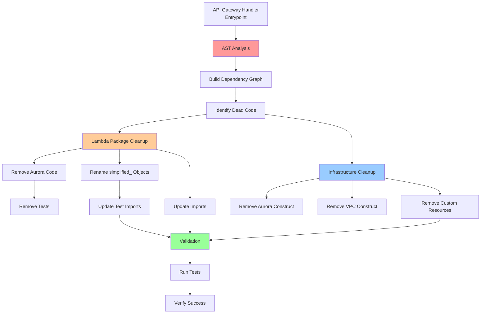

# Design Document

## Overview

The Hotel PMS Code Cleanup design provides a systematic approach to removing
dead code and renaming "simplified\_" objects after the migration from Aurora
Serverless to DynamoDB. The design uses Python AST analysis to safely identify
unused code from the API Gateway handler entrypoint, removes Aurora-related
infrastructure code, and renames objects for cleaner, more professional naming.

**Key Design Principles:**

- Use AST analysis for safe dead code detection
- Remove all Aurora Serverless-related code (Lambda + Infrastructure)
- Rename "simplified\_" objects to cleaner names
- Maintain API compatibility and test coverage
- Automate import updates to prevent breakage

## Key Learnings from AST Analysis

### Infrastructure Analysis Results

The CDK AST analysis from `packages/infra/app.py` revealed:

- **Total construct files analyzed**: 25
- **Files in use**: 18 (actively imported and used)
- **Dead construct files**: 7 (safe to remove)

**Key findings:**

1. **Aurora constructs (2 files)**: Both `aurora_construct.py` and
   `database_setup_construct.py` are unused
2. **VPC construct is still in use**: Do NOT remove - it's used by other
   services
3. **Old AgentCore constructs (2 files)**: Gateway and Lambda constructs are no
   longer used
4. **Old Bedrock KB construct**: Replaced by the new S3 vectors implementation
5. **CloudFront construct**: Unused construct that can be removed
6. **Config update Lambda**: The `update_config_js_fn` is no longer needed

### Lambda Package Analysis Results

### Actual Dependency Chain Discovered

The AST analysis revealed the actual dependency chain from the API Gateway
handler:

```
api_gateway_handler.py
  └── tools/api_functions.py
      └── tools/simplified_tools.py
          ├── services/simplified_availability_service.py
          ├── services/simplified_reservation_service.py
          └── services/simplified_hotel_service.py
```

**Only 6 files are actively used** by the API Gateway handler out of 36 total
Python files.

### Critical Implementation Details

1. **Relative Import Handling**: The AST `ImportFrom` node has a `level`
   attribute that indicates the number of dots in relative imports (e.g.,
   `from ..tools.api_functions` has `level=2`). The module name doesn't include
   the dots, so they must be reconstructed.

2. **Module Resolution**: For relative imports like
   `from ..tools.api_functions`:
   - Start from the current file's directory
   - Go up `level - 1` directories
   - Append the module path
   - Try as `.py` file first, then as directory with `__init__.py`

3. **Dead Code Categories**: The analysis identified 30 dead files in these
   categories:
   - **Database Code (4 files)**: Aurora connection, repository, schema,
     seed_data
   - **Bedrock Integration (4 files)**: Bedrock database setup files
   - **Old Services (4 files)**: Non-simplified service implementations
   - **Other Dead Code (18 files)**: Handlers, models, and utilities not in the
     dependency chain

### Files Safe to Delete

Based on the AST analysis, these files are **not** in the dependency chain and
can be safely removed:

**Handlers (not used):**

- `handlers/agentcore_handler.py`
- `handlers/db_custom_resource.py`
- `handlers/db_setup.py`
- `handlers/kb_query_handler.py`
- `handlers/mcp_server_handler.py`
- `handlers/bedrock_db_custom_resource.py`
- `handlers/bedrock_db_setup.py`

**Database Layer (not used):**

- `database/connection.py`
- `database/repository.py`
- `database/schema.py`
- `database/seed_data.py`
- `database/bedrock_db_setup.py`
- `database/bedrock_integration.py`

**Models (not used):**

- All files in `models/` directory (base, hotel, housekeeping_request,
  rate_modifier, reservation, room, room_type)

**Utilities (not used):**

- All files in `utils/` directory (decorators, logging_config, metrics,
  responses, validators)

**Old Services (not used):**

- `services/availability_service.py`
- `services/guest_service.py`
- `services/hotel_service.py`
- `services/reservation_service.py`

### Files to Keep and Rename

These are the **only** files in the active dependency chain:

- `handlers/api_gateway_handler.py` ✓ (keep as-is)
- `tools/api_functions.py` ✓ (keep as-is)
- `tools/simplified_tools.py` → rename to `tools.py`
- `services/simplified_availability_service.py` → rename to
  `availability_service.py`
- `services/simplified_hotel_service.py` → rename to `hotel_service.py`
- `services/simplified_reservation_service.py` → rename to
  `reservation_service.py`

### Implications for Task 2

1. **Scope is Larger**: We can safely delete 30 files, not just Aurora-related
   code
2. **Simplified Renaming**: Only 3 service files and 1 tools file need renaming
3. **No Model Dependencies**: The simplified services don't use the model
   classes, so all models can be deleted
4. **No Utility Dependencies**: None of the utilities are used, so they can all
   be deleted
5. **Clean Slate**: This is an opportunity to remove all legacy code, not just
   Aurora

## Architecture

### High-Level Cleanup Flow



### Component Responsibilities

- **AST Analysis**: Build dependency graph from entrypoint
- **Dead Code Detection**: Identify unused files and objects
- **Lambda Cleanup**: Remove Aurora code and rename objects
- **Infrastructure Cleanup**: Remove Aurora constructs and VPC
- **Import Updates**: Automatically update all import statements
- **Test Cleanup**: Remove tests for deleted code
- **Validation**: Verify tests pass and no broken imports

## Components and Interfaces

### Lambda Package AST Analysis Script

```python
#!/usr/bin/env python3
"""
Dead code detection using AST analysis.

This script analyzes the API Gateway handler entrypoint and builds a dependency
graph to identify unused code that can be safely removed.
"""

import ast
import os
from pathlib import Path
from typing import Set, Dict, List

class DependencyAnalyzer(ast.NodeVisitor):
    """AST visitor to analyze imports and function calls."""

    def __init__(self):
        self.imports: Set[str] = set()
        self.from_imports: Dict[str, Set[str]] = {}
        self.function_calls: Set[str] = set()

    def visit_Import(self, node: ast.Import):
        """Track import statements."""
        for alias in node.names:
            self.imports.add(alias.name)
        self.generic_visit(node)

    def visit_ImportFrom(self, node: ast.ImportFrom):
        """Track from...import statements."""
        if node.module:
            if node.module not in self.from_imports:
                self.from_imports[node.module] = set()
            for alias in node.names:
                self.from_imports[node.module].add(alias.name)
        self.generic_visit(node)

    def visit_Call(self, node: ast.Call):
        """Track function calls."""
        if isinstance(node.func, ast.Name):
            self.function_calls.add(node.func.id)
        elif isinstance(node.func, ast.Attribute):
            self.function_calls.add(node.func.attr)
        self.generic_visit(node)

def analyze_file(file_path: Path) -> DependencyAnalyzer:
    """Analyze a Python file and return its dependencies."""
    with open(file_path, 'r') as f:
        tree = ast.parse(f.read(), filename=str(file_path))

    analyzer = DependencyAnalyzer()
    analyzer.visit(tree)
    return analyzer

def build_dependency_graph(entrypoint: Path, package_root: Path) -> Set[Path]:
    """Build dependency graph starting from entrypoint."""
    visited = set()
    to_visit = {entrypoint}
    used_files = set()

    while to_visit:
        current = to_visit.pop()
        if current in visited:
            continue

        visited.add(current)
        used_files.add(current)

        # Analyze current file
        analyzer = analyze_file(current)

        # Find imported files
        for module in analyzer.imports:
            module_path = resolve_module_path(module, package_root)
            if module_path and module_path not in visited:
                to_visit.add(module_path)

        for module, names in analyzer.from_imports.items():
            module_path = resolve_module_path(module, package_root)
            if module_path and module_path not in visited:
                to_visit.add(module_path)

    return used_files

def resolve_module_path(module: str, package_root: Path) -> Path | None:
    """Resolve module name to file path."""
    # Convert module name to file path
    parts = module.split('.')

    # Try as .py file
    file_path = package_root / '/'.join(parts[1:]) / f"{parts[-1]}.py"
    if file_path.exists():
        return file_path

    # Try as __init__.py
    dir_path = package_root / '/'.join(parts[1:])
    init_path = dir_path / '__init__.py'
    if init_path.exists():
        return init_path

    return None

def find_dead_code(package_root: Path, entrypoint: Path) -> Dict[str, List[Path]]:
    """Find dead code by comparing all files to used files."""
    # Build dependency graph
    used_files = build_dependency_graph(entrypoint, package_root)

    # Find all Python files
    all_files = set(package_root.rglob('*.py'))

    # Exclude test files and __pycache__
    all_files = {
        f for f in all_files
        if '__pycache__' not in str(f) and not str(f).startswith('test_')
    }

    # Find unused files
    dead_files = all_files - used_files

    # Categorize dead files
    categorized = {
        'aurora_code': [],
        'simplified_prefix': [],
        'other_dead_code': []
    }

    for file in dead_files:
        file_str = str(file)
        if 'aurora' in file_str.lower() or 'database' in file_str.lower():
            categorized['aurora_code'].append(file)
        elif 'simplified' in file_str.lower():
            categorized['simplified_prefix'].append(file)
        else:
            categorized['other_dead_code'].append(file)

    return categorized

def generate_cleanup_report(dead_code: Dict[str, List[Path]]) -> str:
    """Generate cleanup report."""
    report = ["# Dead Code Analysis Report\n"]

    for category, files in dead_code.items():
        report.append(f"\n## {category.replace('_', ' ').title()}")
        report.append(f"Found {len(files)} files\n")
        for file in sorted(files):
            report.append(f"- {file}")

    return '\n'.join(report)

def main():
    """Main function to run dead code analysis."""
    package_root = Path('packages/hotel-pms-simulation/hotel_pms_lambda')
    entrypoint = package_root / 'handlers' / 'api_gateway_handler.py'

    print("Analyzing dead code...")
    dead_code = find_dead_code(package_root, entrypoint)

    report = generate_cleanup_report(dead_code)
    print(report)

    # Save report
    with open('dead_code_report.md', 'w') as f:
        f.write(report)

    print("\nReport saved to dead_code_report.md")

if __name__ == '__main__':
    main()
```

### Infrastructure AST Analysis Script

```python
#!/usr/bin/env python3
"""
Infrastructure dead code detection using AST analysis.

This script analyzes the CDK app.py entrypoint and builds a dependency
graph to identify unused CDK constructs that can be safely removed.
"""

import ast
from pathlib import Path
from typing import Set, Dict, List

class CDKDependencyAnalyzer(ast.NodeVisitor):
    """AST visitor to analyze CDK imports and construct usage."""

    def __init__(self):
        self.imports: Set[str] = set()
        self.from_imports: Dict[str, Set[str]] = {}
        self.class_instantiations: Set[str] = set()
        self.attribute_access: Set[str] = set()

    def visit_Import(self, node: ast.Import):
        """Track import statements."""
        for alias in node.names:
            self.imports.add(alias.name)
        self.generic_visit(node)

    def visit_ImportFrom(self, node: ast.ImportFrom):
        """Track from...import statements."""
        if node.module:
            if node.module not in self.from_imports:
                self.from_imports[node.module] = set()
            for alias in node.names:
                self.from_imports[node.module].add(alias.name)
        self.generic_visit(node)

    def visit_Call(self, node: ast.Call):
        """Track class instantiations (CDK constructs)."""
        if isinstance(node.func, ast.Name):
            self.class_instantiations.add(node.func.id)
        elif isinstance(node.func, ast.Attribute):
            self.class_instantiations.add(node.func.attr)
        self.generic_visit(node)

    def visit_Attribute(self, node: ast.Attribute):
        """Track attribute access."""
        self.attribute_access.add(node.attr)
        self.generic_visit(node)

def analyze_cdk_file(file_path: Path) -> CDKDependencyAnalyzer:
    """Analyze a CDK Python file and return its dependencies."""
    with open(file_path, 'r') as f:
        tree = ast.parse(f.read(), filename=str(file_path))

    analyzer = CDKDependencyAnalyzer()
    analyzer.visit(tree)
    return analyzer

def build_cdk_dependency_graph(entrypoint: Path, infra_root: Path) -> Set[Path]:
    """Build CDK dependency graph starting from app.py entrypoint."""
    visited = set()
    to_visit = {entrypoint}
    used_files = set()

    while to_visit:
        current = to_visit.pop()
        if current in visited:
            continue

        visited.add(current)
        used_files.add(current)

        # Analyze current file
        analyzer = analyze_cdk_file(current)

        # Find imported construct files
        for module in analyzer.imports:
            if 'stack' in module:
                module_path = resolve_cdk_module_path(module, infra_root)
                if module_path and module_path not in visited:
                    to_visit.add(module_path)

        for module, names in analyzer.from_imports.items():
            if 'stack' in module:
                module_path = resolve_cdk_module_path(module, infra_root)
                if module_path and module_path not in visited:
                    to_visit.add(module_path)

    return used_files

def resolve_cdk_module_path(module: str, infra_root: Path) -> Path | None:
    """Resolve CDK module name to file path."""
    # Convert module name to file path
    if module.startswith('.'):
        # Relative import
        parts = module.lstrip('.').split('.')
    else:
        parts = module.split('.')

    # Skip non-local modules
    if not parts or parts[0] not in ['stack', 'stack_constructs']:
        return None

    # Try as .py file
    if len(parts) > 1:
        file_path = infra_root / '/'.join(parts) + '.py'
        if file_path.exists():
            return file_path

    # Try stack_constructs directory
    if 'stack_constructs' in module or (len(parts) > 1 and parts[0] == 'stack'):
        construct_name = parts[-1] if parts else module
        construct_path = infra_root / 'stack' / 'stack_constructs' / f'{construct_name}.py'
        if construct_path.exists():
            return construct_path

    # Try stack directory
    if parts[0] == 'stack':
        stack_file = infra_root / 'stack' / f'{parts[-1]}.py'
        if stack_file.exists():
            return stack_file

    return None

def find_dead_cdk_constructs(infra_root: Path, entrypoint: Path) -> Dict[str, List[Path]]:
    """Find dead CDK constructs by comparing all files to used files."""
    # Build dependency graph
    used_files = build_cdk_dependency_graph(entrypoint, infra_root)

    # Find all Python files in stack and stack_constructs
    stack_dir = infra_root / 'stack'
    all_stack_files = set()

    if stack_dir.exists():
        # Get all .py files in stack/ and stack/stack_constructs/
        all_stack_files = set(stack_dir.rglob('*.py'))
        # Exclude __pycache__ and __init__.py
        all_stack_files = {
            f for f in all_stack_files
            if '__pycache__' not in str(f) and f.name != '__init__.py'
        }

    # Find unused construct files
    dead_constructs = all_stack_files - used_files

    # Categorize dead constructs
    categorized = {
        'aurora_constructs': [],
        'vpc_constructs': [],
        'database_constructs': [],
        'other_dead_constructs': []
    }

    for file in dead_constructs:
        file_str = str(file).lower()
        if 'aurora' in file_str:
            categorized['aurora_constructs'].append(file)
        elif 'vpc' in file_str:
            categorized['vpc_constructs'].append(file)
        elif 'database' in file_str or 'db_custom' in file_str:
            categorized['database_constructs'].append(file)
        else:
            categorized['other_dead_constructs'].append(file)

    return categorized

def generate_cdk_cleanup_report(dead_constructs: Dict[str, List[Path]]) -> str:
    """Generate CDK cleanup report."""
    report = ["# CDK Infrastructure Dead Code Analysis Report\n"]

    total_files = sum(len(files) for files in dead_constructs.values())
    report.append(f"**Total unused construct files: {total_files}**\n")

    for category, files in dead_constructs.items():
        if files:
            report.append(f"\n## {category.replace('_', ' ').title()}")
            report.append(f"Found {len(files)} construct files\n")
            for file in sorted(files):
                report.append(f"- {file}")

    return '\n'.join(report)

def main():
    """Main function to run CDK dead code analysis."""
    infra_root = Path('packages/infra')
    entrypoint = infra_root / 'app.py'

    if not entrypoint.exists():
        print(f"Error: Entrypoint not found at {entrypoint}")
        return

    print("Analyzing CDK dead constructs...")
    dead_constructs = find_dead_cdk_constructs(infra_root, entrypoint)

    report = generate_cdk_cleanup_report(dead_constructs)
    print(report)

    # Save report
    with open('cdk_dead_constructs_report.md', 'w') as f:
        f.write(report)

    print("\nReport saved to cdk_dead_constructs_report.md")

if __name__ == '__main__':
    main()
```

### Renaming Strategy

```python
#!/usr/bin/env python3
"""
Rename simplified_ objects throughout the codebase.

This script renames files, classes, and functions that have the "simplified_"
prefix and updates all imports and references.
"""

import re
from pathlib import Path
from typing import Dict, List, Tuple

# Renaming map
RENAME_MAP = {
    # Files
    'simplified_tools.py': 'tools.py',
    'simplified_availability_service.py': 'availability_service.py',
    'simplified_reservation_service.py': 'reservation_service.py',
    'simplified_hotel_service.py': 'hotel_service.py',

    # Classes
    'SimplifiedAvailabilityService': 'AvailabilityService',
    'SimplifiedReservationService': 'ReservationService',
    'SimplifiedHotelService': 'HotelService',

    # Test files
    'test_simplified_tools.py': 'test_tools.py',
    'test_simplified_availability_service.py': 'test_availability_service.py',
    'test_simplified_reservation_service.py': 'test_reservation_service.py',
    'test_simplified_hotel_service.py': 'test_hotel_service.py',
}

def rename_files(package_root: Path) -> List[Tuple[Path, Path]]:
    """Rename files according to RENAME_MAP."""
    renamed = []

    for old_name, new_name in RENAME_MAP.items():
        # Find files matching old name
        for file in package_root.rglob(old_name):
            new_path = file.parent / new_name
            print(f"Renaming: {file} -> {new_path}")
            file.rename(new_path)
            renamed.append((file, new_path))

    return renamed

def update_imports_in_file(file_path: Path, rename_map: Dict[str, str]):
    """Update import statements in a file."""
    with open(file_path, 'r') as f:
        content = f.read()

    original_content = content

    # Update from...import statements
    for old_name, new_name in rename_map.items():
        # Update module imports
        old_module = old_name.replace('.py', '')
        new_module = new_name.replace('.py', '')

        # Pattern: from ...simplified_tools import
        content = re.sub(
            rf'from (\.+)({old_module})',
            rf'from \1{new_module}',
            content
        )

        # Pattern: import ...simplified_tools
        content = re.sub(
            rf'import (.*)({old_module})',
            rf'import \1{new_module}',
            content
        )

        # Update class names
        if old_name.startswith('Simplified'):
            content = re.sub(
                rf'\b{old_name}\b',
                new_name,
                content
            )

    # Write back if changed
    if content != original_content:
        with open(file_path, 'w') as f:
            f.write(content)
        print(f"Updated imports in: {file_path}")

def update_all_imports(package_root: Path):
    """Update imports in all Python files."""
    for file in package_root.rglob('*.py'):
        if '__pycache__' not in str(file):
            update_imports_in_file(file, RENAME_MAP)

def main():
    """Main function to rename files and update imports."""
    package_root = Path('packages/hotel-pms-simulation')

    print("Step 1: Renaming files...")
    renamed_files = rename_files(package_root)

    print(f"\nStep 2: Updating imports in {package_root}...")
    update_all_imports(package_root)

    print(f"\nStep 3: Updating imports in tests...")
    test_root = package_root / 'tests'
    update_all_imports(test_root)

    print("\nRenaming complete!")
    print(f"Renamed {len(renamed_files)} files")

if __name__ == '__main__':
    main()
```

## Lambda Package Cleanup

### Files to Remove (Aurora-Related)

```
packages/hotel-pms-simulation/hotel_pms_lambda/
├── database/
│   ├── connection.py          # Aurora connection management
│   ├── schema.py              # SQL schema definitions
│   └── queries.py             # SQL query implementations
├── handlers/
│   └── db_custom_resource.py  # Aurora custom resource handler
└── clients/
    └── aurora_client.py       # Aurora client wrapper
```

### Files to Rename

```
Before                                  After
─────────────────────────────────────────────────────────────
simplified_tools.py                  → tools.py
simplified_availability_service.py   → availability_service.py
simplified_reservation_service.py    → reservation_service.py
simplified_hotel_service.py          → hotel_service.py
```

### Import Updates

```python
# Before
from ..tools.simplified_tools import (
    check_availability,
    generate_quote,
)
from ..services.simplified_availability_service import SimplifiedAvailabilityService

# After
from ..tools.tools import (
    check_availability,
    generate_quote,
)
from ..services.availability_service import AvailabilityService
```

## Infrastructure Cleanup

### CDK Constructs to Remove

Based on AST analysis from `app.py` entrypoint, the following constructs are
unused:

```
packages/infra/stack/stack_constructs/
├── aurora_construct.py                    # Aurora Serverless construct (UNUSED)
├── database_setup_construct.py            # Aurora schema setup custom resource (UNUSED)
├── agentcore_gateway_construct.py         # Old AgentCore gateway construct (UNUSED)
├── agentcore_lambda_construct.py          # Old AgentCore Lambda construct (UNUSED)
├── bedrock_knowledge_base_construct.py    # Old Bedrock KB construct (UNUSED - replaced by S3 vectors)
└── cloudfront_constructs.py               # Old CloudFront construct (UNUSED)

packages/infra/stack/lambdas/
└── update_config_js_fn/index.py           # Config update Lambda (UNUSED)
```

**Note**: VPC construct is still in use and should NOT be removed.

### Stack Updates

```python
# Before (in hotel_pms_stack.py)
from .stack_constructs.aurora_construct import AuroraConstruct
from .stack_constructs.vpc_construct import VpcConstruct

class HotelPmsStack(Stack):
    def __init__(self, scope: Construct, construct_id: str, **kwargs):
        super().__init__(scope, construct_id, **kwargs)

        # Create VPC for Aurora
        self.vpc = VpcConstruct(self, "Vpc")

        # Create Aurora cluster
        self.aurora = AuroraConstruct(
            self, "Aurora",
            vpc=self.vpc.vpc
        )

        # Create DynamoDB tables
        self.dynamodb = HotelPMSDynamoDBConstruct(self, "DynamoDB")

# After
class HotelPmsStack(Stack):
    def __init__(self, scope: Construct, construct_id: str, **kwargs):
        super().__init__(scope, construct_id, **kwargs)

        # Create DynamoDB tables
        self.dynamodb = HotelPMSDynamoDBConstruct(self, "DynamoDB")
```

### CloudFormation Outputs to Remove

```python
# Remove Aurora-related outputs
CfnOutput(self, "AuroraClusterEndpoint", ...)
CfnOutput(self, "AuroraSecretArn", ...)
CfnOutput(self, "DatabaseName", ...)
```

## Test Cleanup

### Test Files to Remove

```
packages/hotel-pms-simulation/tests/
├── test_aurora_client.py
├── test_database_connection.py
├── test_db_custom_resource.py
└── integration/
    └── test_aurora_integration.py
```

### Test Files to Rename

```
Before                                          After
───────────────────────────────────────────────────────────────────
test_simplified_tools.py                     → test_tools.py
test_simplified_availability_service.py      → test_availability_service.py
test_simplified_reservation_service.py       → test_reservation_service.py
test_simplified_hotel_service.py             → test_hotel_service.py
```

### Test Import Updates

```python
# Before
from hotel_pms_lambda.services.simplified_availability_service import (
    SimplifiedAvailabilityService
)

# After
from hotel_pms_lambda.services.availability_service import (
    AvailabilityService
)
```

## Validation Strategy

### Pre-Cleanup Validation

```bash
# Run all tests before cleanup
cd packages/hotel-pms-simulation
uv run pytest

# Verify API Gateway handler works
uv run python -c "from hotel_pms_lambda.handlers.api_gateway_handler import lambda_handler; print('✓ Handler imports successfully')"
```

### Post-Cleanup Validation

```bash
# 1. Verify no broken imports
cd packages/hotel-pms-simulation
python -m py_compile hotel_pms_lambda/**/*.py

# 2. Run all remaining tests
uv run pytest

# 3. Check for remaining "simplified_" references
grep -r "simplified_" hotel_pms_lambda/ --exclude-dir=__pycache__

# 4. Check for remaining Aurora references
grep -r "aurora\|Aurora" hotel_pms_lambda/ --exclude-dir=__pycache__

# 5. Verify API Gateway handler still works
uv run python -c "from hotel_pms_lambda.handlers.api_gateway_handler import lambda_handler; print('✓ Handler imports successfully')"

# 6. Run CDK synth to verify infrastructure
cd packages/infra
uv run cdk synth
```

## Cleanup Execution Plan

### Phase 1: Analysis

```bash
# Run Lambda package AST analysis
python scripts/analyze_dead_code.py

# Run Infrastructure AST analysis
python scripts/analyze_cdk_dead_constructs.py

# Review reports
cat dead_code_report.md
cat cdk_dead_constructs_report.md

# Manually verify files are safe to delete
```

### Phase 2: Lambda Package Cleanup

```bash
# Remove Aurora-related code
rm -rf packages/hotel-pms-simulation/hotel_pms_lambda/database/
rm packages/hotel-pms-simulation/hotel_pms_lambda/handlers/db_custom_resource.py
rm packages/hotel-pms-simulation/hotel_pms_lambda/clients/aurora_client.py

# Remove Aurora-related tests
rm packages/hotel-pms-simulation/tests/test_aurora_client.py
rm packages/hotel-pms-simulation/tests/test_database_connection.py
rm packages/hotel-pms-simulation/tests/test_db_custom_resource.py
rm -rf packages/hotel-pms-simulation/tests/integration/test_aurora_integration.py

# Run renaming script
python scripts/rename_simplified.py

# Verify no broken imports
cd packages/hotel-pms-simulation
python -m py_compile hotel_pms_lambda/**/*.py
```

### Phase 3: Infrastructure Cleanup

```bash
# Remove Aurora-related constructs
rm packages/infra/stack/stack_constructs/aurora_construct.py
rm packages/infra/stack/stack_constructs/database_setup_construct.py

# Remove other dead constructs identified by AST analysis
rm packages/infra/stack/stack_constructs/agentcore_gateway_construct.py
rm packages/infra/stack/stack_constructs/agentcore_lambda_construct.py
rm packages/infra/stack/stack_constructs/bedrock_knowledge_base_construct.py
rm packages/infra/stack/stack_constructs/cloudfront_constructs.py
rm packages/infra/stack/lambdas/update_config_js_fn/index.py

# Note: VPC construct is still in use - DO NOT REMOVE

# Update hotel_pms_stack.py to remove Aurora references
# (Manual edit required)

# Verify CDK synth works
cd packages/infra
uv run cdk synth
```

### Phase 4: Validation

```bash
# Run all tests
cd packages/hotel-pms-simulation
uv run pytest

# Check for remaining references
grep -r "simplified_" . --exclude-dir=__pycache__
grep -r "aurora\|Aurora" . --exclude-dir=__pycache__

# Verify API Gateway handler
uv run python -c "from hotel_pms_lambda.handlers.api_gateway_handler import lambda_handler; print('✓ Success')"
```

### Phase 5: Documentation Updates

```bash
# Update README files
# Remove Aurora references
# Update architecture diagrams
# Update code examples with new naming
```

## Cleanup Report Format

```markdown
# Hotel PMS Code Cleanup Report

## Summary

- Files removed: 15
- Files renamed: 8
- Import statements updated: 47
- Test files removed: 6
- Test files renamed: 4

## Aurora Code Removed

### Lambda Package

- database/connection.py
- database/schema.py
- database/queries.py
- handlers/db_custom_resource.py
- clients/aurora_client.py

### Infrastructure

**Aurora-related:**

- stack_constructs/aurora_construct.py
- stack_constructs/database_setup_construct.py

**Other dead constructs:**

- stack_constructs/agentcore_gateway_construct.py
- stack_constructs/agentcore_lambda_construct.py
- stack_constructs/bedrock_knowledge_base_construct.py
- stack_constructs/cloudfront_constructs.py
- stack/lambdas/update_config_js_fn/index.py

## Files Renamed

### Services

- simplified_availability_service.py → availability_service.py
- simplified_reservation_service.py → reservation_service.py
- simplified_hotel_service.py → hotel_service.py

### Tools

- simplified_tools.py → tools.py

### Tests

- test_simplified_tools.py → test_tools.py
- test_simplified_availability_service.py → test_availability_service.py
- test_simplified_reservation_service.py → test_reservation_service.py
- test_simplified_hotel_service.py → test_hotel_service.py

## Validation Results

✓ All tests pass (42 tests) ✓ No broken imports ✓ No "simplified\_" references
remain ✓ No Aurora references remain ✓ API Gateway handler imports successfully
✓ CDK synth completes successfully

## Code Metrics

- Lines of code removed: 2,847
- Lines of code renamed: 1,234
- Test coverage maintained: 85%
```

This design provides a systematic, safe approach to cleaning up dead code and
renaming objects while maintaining functionality and test coverage.
