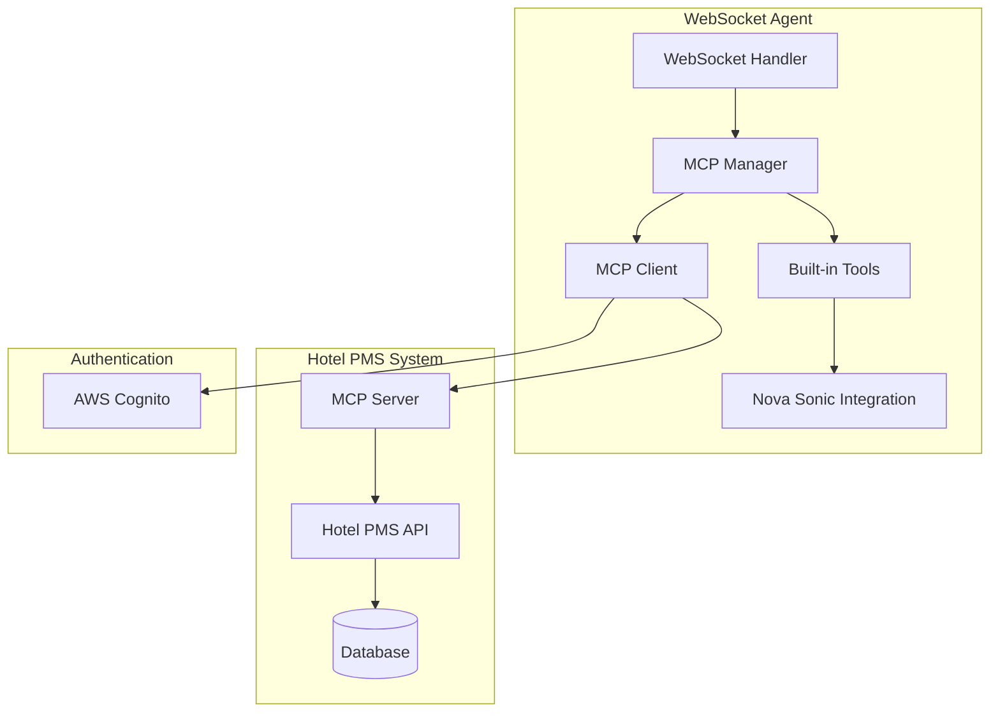

# Design Document

## Overview

This design document outlines the integration of the Hotel PMS MCP (Model
Context Protocol) server into the existing WebSocket agent. The integration will
add hotel management capabilities to the Nova Sonic speech-to-speech agent by
connecting to the deployed Hotel PMS API through the MCP protocol.

## Architecture

### High-Level Architecture



### Component Integration

The MCP integration uses a manager pattern to provide a clean separation between
the WebSocket handler and MCP functionality. The integration follows these
principles:

1. **Non-blocking**: MCP failures won't prevent the agent from functioning
2. **Modular**: MCP manager provides singleton access to MCP functionality
3. **Environment-driven**: Configuration through environment variables
4. **Tool-based**: MCP tools are merged with built-in tools in Nova Sonic
5. **SDK-based**: Uses official MCP SDK for reliable protocol implementation

## Components and Interfaces

### 1. MCP Manager (`core/mcp_manager.py`)

**Purpose**: Singleton manager that provides centralized access to MCP
functionality.

**Key Methods**:

- `get_mcp_manager()`: Get singleton instance
- `has_tools()`: Check if MCP tools are available
- `get_tool_names()`: Get list of available MCP tool names
- `is_connected()`: Check MCP connection status
- `call_tool(name, args)`: Execute MCP tool calls

**Features**:

- Lazy initialization of MCP client
- Thread-safe singleton pattern
- Graceful handling of missing configuration
- Tool caching and management

### 2. MCP Client (`clients/hotel_pms_mcp_client.py`)

**Purpose**: Manages connection and communication with the Hotel PMS MCP server
using the official MCP SDK.

**Key Methods**:

- `connect()`: Establish connection with authentication
- `connect_with_retry()`: Connect with exponential backoff retry
- `get_tools()`: Retrieve available tools from MCP server
- `get_tools_nova_sonic_format()`: Get tools in Nova Sonic format
- `call_tool(name, args)`: Execute tool calls
- `check_health()`: Verify connection health
- `is_connected()`: Check connection status

**Configuration**:

- `HOTEL_PMS_MCP_URL`: MCP server endpoint
- `HOTEL_PMS_MCP_CLIENT_ID`: Cognito client ID for M2M auth
- `HOTEL_PMS_MCP_CLIENT_SECRET`: Cognito client secret
- `HOTEL_PMS_MCP_REGION`: AWS region (default: us-east-1)
- `HOTEL_PMS_MCP_TIMEOUT`: Request timeout (default: 30)
- `HOTEL_PMS_MCP_MAX_RETRIES`: Max retry attempts (default: 3)

### 3. Enhanced WebSocket Handler

**Modifications to `core/websocket_handler.py`**:

- Initialize MCP manager during startup (lazy loading)
- Route MCP tool calls through manager
- Handle MCP connection failures gracefully
- No direct MCP client dependency

**Integration Points**:

- `self.mcp_manager = get_mcp_manager()`: Get shared MCP manager
- `_handle_mcp_tool_call()`: Process MCP-specific tool usage
- `_handle_tool_use()`: Route tool calls to appropriate handlers
- Session initialization includes MCP tools automatically

### 4. Dynamic Tool Configuration

**Modifications to `events/s2s_events.py`**:

- `create_dynamic_prompt_start()`: Generate promptStart with MCP tools
- `merge_tools()`: Merge built-in and MCP tools with priority handling
- Enhanced tool configuration that automatically includes MCP tools

**Tool Schema Conversion**:

- `McpTool.to_nova_sonic_format()`: Convert MCP tool schemas to Nova Sonic
  format
- `_validate_and_normalize_schema()`: Handle parameter validation and type
  conversion
- Automatic schema normalization for missing required fields

### 5. Authentication Integration

**Cognito M2M Authentication**:

- Use client credentials flow for MCP server access
- Automatic token refresh and management via MCP SDK
- Error handling for authentication failures
- Secure credential storage in environment variables

## Data Models

### MCP Tool Schema

```python
@dataclass
class McpTool:
    name: str
    description: str
    input_schema: dict

    def to_nova_sonic_format(self) -> dict:
        """Convert MCP tool to Nova Sonic tool specification"""
        return {
            "toolSpec": {
                "name": self.name,
                "description": self.description,
                "inputSchema": {
                    "json": json.dumps(self.input_schema)
                }
            }
        }
```

### MCP Configuration

```python
@dataclass
class McpConfig:
    url: str
    client_id: str
    client_secret: str
    user_pool_id: Optional[str] = None
    region: str = "us-east-1"
    timeout: int = 30
    max_retries: int = 3

    @classmethod
    def from_environment(cls) -> Optional['McpConfig']:
        """Load configuration from environment variables"""
        url = os.getenv("HOTEL_PMS_MCP_URL")
        client_id = os.getenv("HOTEL_PMS_MCP_CLIENT_ID")
        client_secret = os.getenv("HOTEL_PMS_MCP_CLIENT_SECRET")

        if not all([url, client_id, client_secret]):
            return None

        return cls(
            url=url,
            client_id=client_id,
            client_secret=client_secret,
            user_pool_id=os.getenv("HOTEL_PMS_MCP_USER_POOL_ID"),
            region=os.getenv("HOTEL_PMS_MCP_REGION", "us-east-1"),
            timeout=int(os.getenv("HOTEL_PMS_MCP_TIMEOUT", "30")),
            max_retries=int(os.getenv("HOTEL_PMS_MCP_MAX_RETRIES", "3"))
        )
```

## Error Handling

### Connection Failures

1. **Startup Failures**: Log warning and continue without MCP tools
2. **Runtime Failures**: Attempt reconnection with exponential backoff
3. **Authentication Failures**: Log error and disable MCP integration
4. **Tool Call Failures**: Return error message to Nova Sonic

### Graceful Degradation

- Agent continues to function with built-in tools if MCP is unavailable
- Clear error messages to users when hotel services are unavailable
- Automatic recovery when MCP service becomes available

### Retry Strategy

```python
async def connect_with_retry(self, max_retries: int = None) -> bool:
    """Connect with exponential backoff retry strategy."""
    if max_retries is None:
        max_retries = self.config.max_retries

    for attempt in range(max_retries):
        try:
            success = await self.connect()
            if success:
                return True
        except Exception as e:
            self.logger.warning(f"Connection attempt {attempt + 1} failed: {e}")

        if attempt < max_retries - 1:
            wait_time = min(2 ** attempt, 30)  # Cap at 30 seconds
            await asyncio.sleep(wait_time)

    return False
```

## Testing Strategy

### Unit Tests

1. **MCP Client Tests** (`tests/test_mcp_tool_discovery.py`):
   - Tool retrieval and schema conversion
   - Authentication token management
   - Error handling scenarios
   - Tool caching and management

2. **MCP Error Handling Tests** (`tests/test_mcp_error_handling.py`):
   - Connection failure scenarios
   - Timeout and HTTP error handling
   - Reconnection logic
   - Fallback behavior

3. **WebSocket Handler Tests** (`tests/test_websocket_mcp_integration.py`):
   - MCP manager integration
   - Tool routing and execution
   - Graceful degradation scenarios
   - Session initialization with MCP tools

4. **Dynamic Tool Configuration Tests**
   (`tests/test_s2s_events_dynamic_tools.py`):
   - Tool merging and priority handling
   - Nova Sonic format conversion
   - Prompt generation with MCP tools

### Integration Tests

1. **End-to-End MCP Flow**
   (`tests/integration/test_mcp_tool_discovery_integration.py`):
   - Real MCP server connection and authentication
   - Tool discovery and execution
   - Error scenarios and recovery
   - Complete authentication and tool discovery workflow

2. **Performance Tests**:
   - Concurrent MCP tool calls
   - Connection stability under load
   - Resource cleanup verification

### Test Coverage

- **47 unit tests** covering all MCP functionality
- **19 integration tests** for end-to-end validation
- **100% pass rate** for both unit and integration tests

## Key Architectural Decisions

### 1. MCP SDK Migration

**Decision**: Migrated from custom HTTP-based MCP implementation to official MCP
SDK.

**Rationale**:

- Official SDK provides better protocol compliance
- Automatic handling of authentication and token refresh
- More robust error handling and connection management
- Future-proof against protocol changes

**Impact**:

- Simplified client implementation
- More reliable connections
- Better error handling
- Reduced maintenance burden

### 2. Manager Pattern

**Decision**: Implemented singleton MCP manager instead of direct client usage.

**Rationale**:

- Centralized MCP functionality access
- Lazy initialization reduces startup overhead
- Thread-safe singleton ensures single connection
- Clean separation of concerns

**Impact**:

- WebSocket handler doesn't need direct MCP knowledge
- Easy to mock for testing
- Consistent access pattern across codebase

### 3. Tool Priority System

**Decision**: MCP tools override built-in tools with same names.

**Rationale**:

- Hotel-specific tools should take precedence
- Allows for customization of standard functionality
- Clear and predictable behavior

**Impact**:

- Hotel tools always used when available
- Fallback to built-in tools when MCP unavailable
- Consistent user experience

### 4. Session-Based Connections

**Decision**: Use MCP SDK's session-based approach instead of persistent
connections.

**Rationale**:

- MCP SDK handles connection lifecycle automatically
- Reduces resource usage
- Better error recovery
- Aligns with MCP protocol best practices

**Impact**:

- No connection pooling needed
- Automatic cleanup
- More resilient to network issues

## Implementation Details

### Environment Variable Configuration

```bash
# Required for MCP integration
HOTEL_PMS_MCP_URL=https://your-agentcore-gateway.execute-api.us-east-1.amazonaws.com/mcp
HOTEL_PMS_MCP_CLIENT_ID=your-cognito-client-id
HOTEL_PMS_MCP_CLIENT_SECRET=your-cognito-client-secret

# Optional configuration
HOTEL_PMS_MCP_REGION=us-east-1
HOTEL_PMS_MCP_TIMEOUT=30
HOTEL_PMS_MCP_MAX_RETRIES=3
```

### Tool Integration Flow

1. **Startup**:
   - WebSocket handler initializes MCP manager (lazy loading)
   - MCP manager loads configuration from environment
   - MCP client connects and authenticates when first accessed
   - Tools are retrieved and cached on first use

2. **Session Initialization**:
   - `create_dynamic_prompt_start()` automatically merges built-in and MCP tools
   - MCP tools take priority over built-in tools with same names
   - Enhanced promptStart sent to Nova Sonic with all available tools
   - No explicit tool registration needed

3. **Tool Execution**:
   - Nova Sonic sends toolUse events for any tool
   - WebSocket handler routes MCP tools to MCP manager
   - MCP manager delegates to MCP client for execution
   - Results returned through standard tool result flow
   - Errors handled gracefully with fallback suggestions

### Connection Management

- MCP SDK manages connection lifecycle automatically
- Session-based connections for each tool call
- Automatic token refresh handled by SDK
- Proper cleanup through context managers
- No persistent connections maintained

## Security Considerations

### Authentication

- Secure storage of Cognito credentials in environment variables
- Token refresh and expiration handling
- No credential logging or exposure

### Data Privacy

- Hotel guest data handled according to privacy requirements
- Secure transmission over HTTPS
- No persistent storage of guest information in agent

### Error Information

- Sanitized error messages to prevent information disclosure
- Detailed logging for debugging without exposing sensitive data

## Performance Considerations

### Connection Efficiency

- Reuse single MCP connection for multiple tool calls
- Connection pooling if multiple concurrent calls needed
- Efficient JSON serialization/deserialization

### Caching Strategy

- Cache tool schemas in MCP client to avoid repeated server calls
- Authentication tokens cached and refreshed automatically by MCP SDK
- Tool list cached until client reconnection
- No caching of hotel data (always fetch fresh)
- Cache invalidation on connection failures

### Resource Management

- Proper cleanup of MCP connections
- Memory management for large tool responses
- Timeout handling for long-running tool calls

## Monitoring and Logging

### Metrics

- MCP connection status and uptime
- Tool call success/failure rates
- Authentication token refresh frequency
- Response time for MCP tool calls

### Logging

- Structured logging with correlation IDs
- Connection lifecycle events
- Tool execution traces
- Error conditions with context

### Health Checks

- `check_health()` method provides connection status
- Authentication token validity checked automatically
- Tool availability verified through manager
- Health information includes tool count and last error
- No background health monitoring (on-demand only)
