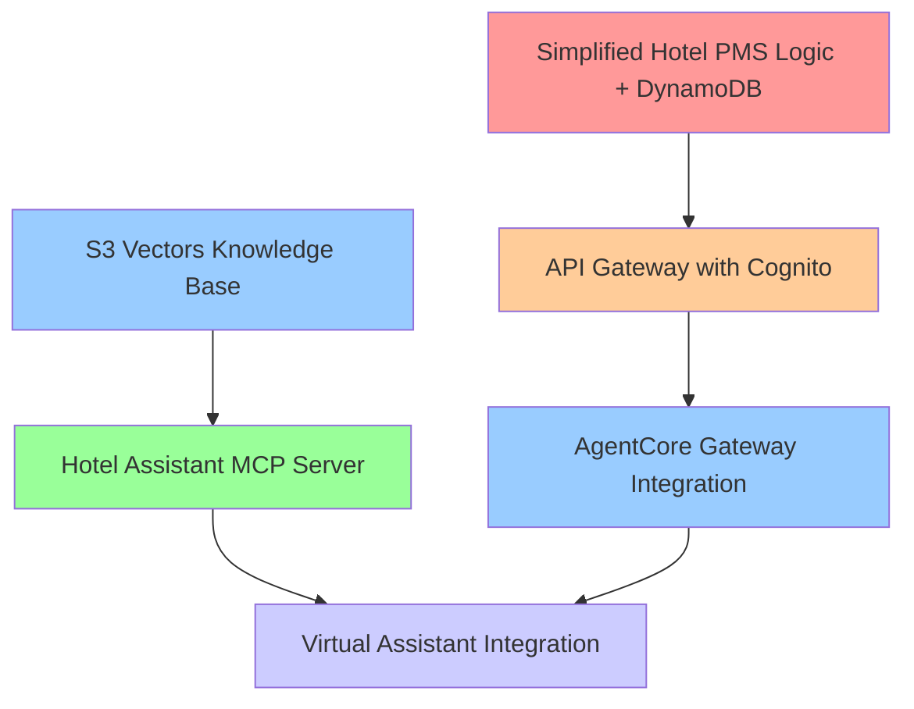

# Hotel PMS Simplification - Master Specification

## Introduction

This master specification defines the overall architecture change to simplify
the Hotel PMS system by replacing Aurora Serverless database and VPC
infrastructure with a lightweight DynamoDB-based solution. This document serves
as a "spec of specs" that outlines the component specifications needed and their
dependencies.

The system will provide simulated hotel management functionality through
AgentCore Gateway APIs and MCP servers, making it more cost-effective and easier
to deploy for demonstration purposes.

## Component Specifications Architecture

### Specification Dependencies

1. **Simplified Hotel PMS Logic + DynamoDB** (Blocker) - Core business logic
   with DynamoDB tables
2. **API Gateway with Cognito** (Depends on #1) - REST API with authentication
3. **AgentCore Gateway Integration** (Depends on #2) - Custom resources for
   identity provider
4. **S3 Vectors Knowledge Base** (Parallel) - Bedrock knowledge base with S3
   vectors
5. **Hotel Assistant MCP Server** (Depends on #4) - MCP server with knowledge
   queries and prompts
6. **Virtual Assistant Integration** (Depends on #3, #5) - Update chat/voice
   agents

## Glossary

- **Simplified_Hotel_PMS**: Core business logic using canned data and date-based
  rules
- **DynamoDB_Migration**: Migration from Aurora Serverless to DynamoDB tables
- **API_Gateway_Service**: REST API with OpenAPI specification and Cognito
  authentication
- **AgentCore_Gateway**: AWS service for exposing APIs to AI agents through MCP
- **S3_Vectors_KB**: Bedrock Knowledge Base using S3 vectors preview feature
- **Hotel_Assistant_MCP**: MCP server providing knowledge queries and system
  prompts
- **Virtual_Assistant_Integration**: Updated chat and voice agents using new MCP
  architecture

## Master Requirements

### Requirement 1: Architecture Simplification

**User Story:** As a system administrator, I want to replace the complex Aurora
Serverless and VPC infrastructure with a simplified DynamoDB-based architecture,
so that I can reduce costs and deployment complexity.

#### Acceptance Criteria

1. THE Master_Architecture SHALL eliminate Aurora Serverless database dependency
2. THE Master_Architecture SHALL remove VPC networking requirements
3. THE Master_Architecture SHALL use DynamoDB for all persistent data storage
4. THE Master_Architecture SHALL reduce infrastructure costs by at least 60%
5. THE Master_Architecture SHALL enable deployment in under 15 minutes

### Requirement 2: Component Specification Dependencies

**User Story:** As a project manager, I want clear specification dependencies
defined, so that development teams can work in parallel while respecting
blockers.

#### Acceptance Criteria

1. THE Simplified_Hotel_PMS SHALL be implemented first as it blocks other
   components
2. THE DynamoDB_Migration SHALL depend on Simplified_Hotel_PMS completion
3. THE API_Gateway_Service SHALL depend on both Simplified_Hotel_PMS and
   DynamoDB_Migration
4. THE S3_Vectors_KB SHALL be developed in parallel with API components
5. THE Virtual_Assistant_Integration SHALL integrate all completed components

### Requirement 3: Demonstration-Focused Implementation

**User Story:** As a solutions architect, I want a prototype system optimized
for demonstrations, so that I can showcase AI-powered hotel services
effectively.

#### Acceptance Criteria

1. THE System SHALL prioritize demo scenarios over production complexity
2. THE System SHALL use canned data with realistic but simplified business logic
3. THE System SHALL support dynamic pricing calculations for demonstration
   purposes
4. THE System SHALL record demo interactions for follow-up queries
5. THE System SHALL maintain consistent demo experience across multiple runs

## Individual Specification Scope

### 1. Simplified Hotel PMS Logic + DynamoDB (.kiro/specs/simplified-hotel-pms/)

- Core business logic with canned responses
- Date-based availability rules (5-7th of month = full)
- Dynamic pricing calculations
- DynamoDB table design and CSV data loading
- Simplified data models without complex relationships

### 2. API Gateway with Cognito (.kiro/specs/api-gateway-cognito/)

- OpenAPI specification design
- Cognito machine-to-machine OAuth setup
- Lambda function implementations
- API Gateway deployment and configuration

### 3. AgentCore Gateway Integration (.kiro/specs/agentcore-gateway-integration/)

- Custom CloudFormation resources
- Identity provider ARN creation
- API credential management
- AgentCore Gateway configuration

### 4. S3 Vectors Knowledge Base (.kiro/specs/s3-vectors-knowledge-base/)

- Bedrock Knowledge Base with S3 vectors
- Custom resources for preview feature
- Hotel documentation ingestion
- Vector search optimization

### 5. Hotel Assistant MCP Server (.kiro/specs/hotel-assistant-mcp/)

- MCP server implementation
- Knowledge query tools
- System prompt generation (chat, voice, default)
- AgentCore Runtime deployment

### 6. Virtual Assistant Integration (.kiro/specs/virtual-assistant-integration/)

- Update chat agent to use new MCP architecture
- Update voice agent to use new MCP architecture
- Multi-MCP server configuration
- System prompt integration
