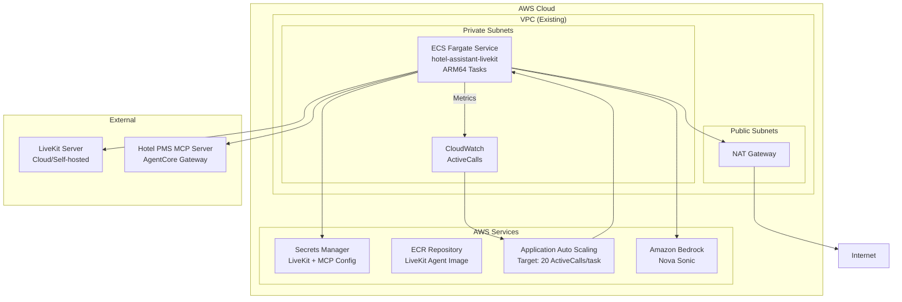

# Design Document

## Overview

This design implements the deployment of the hotel-assistant-livekit package to
AWS ECS with Fargate, providing a scalable LiveKit agent service for
speech-to-speech hotel assistance. The solution leverages existing
infrastructure patterns from the backend stack while adding LiveKit-specific
components including custom metrics for autoscaling, secrets management for MCP
and LiveKit configuration, and ARM64 containerization.

## Architecture

### High-Level Architecture



### Component Integration

The LiveKit ECS deployment integrates with existing infrastructure:

- **VPC**: Reuses existing VPC from backend stack with private subnets
- **Secrets Manager**: Integrates with existing secret management patterns
- **IAM Roles**: Follows existing role and permission patterns
- **ECR**: Uses existing ECR repository construct pattern
- **Monitoring**: Extends existing CloudWatch logging and metrics

## Components and Interfaces

### 1. LiveKit ECS Construct

**Purpose**: Main construct that orchestrates the LiveKit agent deployment

**Key Components**:

- ECS Cluster (dedicated for LiveKit agents)
- Fargate Service with ARM64 tasks
- Application Auto Scaling configuration
- Custom CloudWatch metrics integration

**Interface**:

```python
class LiveKitECSConstruct(Construct):
    def __init__(
        self,
        scope: Construct,
        construct_id: str,
        vpc: ec2.IVpc,
        mcp_config_secret: secretsmanager.ISecret,
        livekit_secret_name: str = "hotel-assistant-livekit",
        **kwargs
    ):
        # Implementation details
        pass

    @property
    def cluster(self) -> ecs.ICluster:
        """ECS cluster running LiveKit agents"""

    @property
    def service(self) -> ecs.IFargateService:
        """Fargate service for LiveKit agents"""

    @property
    def task_role(self) -> iam.IRole:
        """IAM role for LiveKit agent tasks"""
```

### 2. Docker Image Asset

**Purpose**: Builds and manages the LiveKit agent container image

**Key Features**:

- ARM64 architecture targeting
- Multi-stage build for optimization
- Asset hash-based versioning
- ECR integration

**Dockerfile Structure** (following uv best practices):

```dockerfile
# Use uv's ARM64 Python base image
FROM ghcr.io/astral-sh/uv:python3.13-bookworm-slim

WORKDIR /app

# Enable bytecode compilation for better startup performance
ENV UV_COMPILE_BYTECODE=1

# Copy from the cache instead of linking since it's a mounted cache
ENV UV_LINK_MODE=copy

# Install dependencies in a separate layer for better caching
COPY pyproject.toml uv.lock ./

# Install dependencies without the project itself (for better layer caching)
RUN --mount=type=cache,target=/root/.cache/uv \
    uv sync --frozen --no-install-project

# Copy application code
COPY hotel_assistant_livekit/ ./hotel_assistant_livekit/

# Install the project itself
RUN --mount=type=cache,target=/root/.cache/uv \
    uv sync --frozen

# Activate the virtual environment by adding its bin directory to PATH
ENV PATH="/app/.venv/bin:$PATH"

EXPOSE 8081
CMD ["python", "-m", "hotel_assistant_livekit.agent", "start"]
```

### 3. Auto Scaling Configuration

**Purpose**: Manages automatic scaling based on active calls per task

**Key Components**:

- Application Auto Scaling target
- CloudWatch metric-based scaling policy
- Scale-out and scale-in policies with different cooldown periods

**Scaling Logic**:

- **Target Metric**: ActiveCalls (custom metric)
- **Target Value**: 20 calls per task
- **Scale-out**: Fast response (1-2 minutes)
- **Scale-in**: Slow response (10 minutes cooldown)
- **Min Capacity**: 1 task
- **Max Capacity**: 5 tasks

### 4. Secrets Management Integration

**Purpose**: Secure configuration management for LiveKit and MCP credentials

**Secret Structure**:

**LiveKit Secret** (managed externally):

```json
{
  "LIVEKIT_URL": "wss://your-livekit-server.com",
  "LIVEKIT_API_KEY": "your-api-key",
  "LIVEKIT_API_SECRET": "your-api-secret"
}
```

**MCP Secret** (existing):

```json
{
  "base_url": "https://your-mcp-server.com",
  "client_id": "your-client-id",
  "client_secret": "your-client-secret",
  "token_url": "https://cognito-idp.region.amazonaws.com/pool-id/oauth2/token"
}
```

### 5. Custom Metrics Publisher

**Purpose**: Publishes active call metrics for autoscaling decisions

**Implementation**: Integrated into LiveKit agent application code

**Metrics Published**:

- **Metric Name**: `HotelAssistant/ActiveCalls`
- **Dimensions**:
  - `ServiceName`: `hotel-assistant-livekit`
  - `TaskId`: ECS task ID
- **Frequency**: Every 60 seconds
- **Aggregation**: Sum (total calls), Average (calls per task)

### 6. Application Secrets Manager Integration

**Purpose**: Secure credential management for LiveKit and MCP connections

**Key Components**:

- **LiveKit Credentials Handler**: Retrieves LiveKit URL, API key, and secret
  from Secrets Manager
- **Connection Management**: Configures LiveKit with retrieved credentials
- **Error Handling**: Fails fast when required secrets are unavailable

**Implementation Pattern**:

````python
# LiveKit credentials from Secrets Manager
async def get_livekit_credentials():
    secret_name = os.environ.get("LIVEKIT_SECRET_NAME")
    secret = await secrets_client.get_secret_value(SecretId=secret_name)
    credentials = json.loads(secret["SecretString"])
    return credentials["LIVEKIT_URL"], credentials["LIVEKIT_API_KEY"], credentials["LIVEKIT_API_SECRET"]

## Data Models

### 1. ECS Task Definition

**Resource Configuration**:

- **CPU**: 2048 (2 vCPU)
- **Memory**: 4096 MB (4 GB)
- **Architecture**: ARM64
- **Network Mode**: awsvpc
- **Launch Type**: Fargate

**Environment Variables**:

```python
environment_variables = {
    "BEDROCK_MODEL_ID": "us.amazon.nova-sonic-v1:0",
    "MODEL_TEMPERATURE": "0.0",
    "LOG_LEVEL": "INFO",
    "HOTEL_PMS_MCP_SECRET_ARN": mcp_secret.secret_arn,
    "LIVEKIT_SECRET_NAME": livekit_secret_name,
}
````

### 2. Auto Scaling Configuration

**Scaling Target**:

```python
scaling_target = appscaling.ScalableTarget(
    scope=self,
    id="LiveKitScalingTarget",
    service_namespace=appscaling.ServiceNamespace.ECS,
    resource_id=f"service/{cluster.cluster_name}/{service.service_name}",
    scalable_dimension="ecs:service:DesiredCount",
    min_capacity=1,
    max_capacity=5,
)
```

**Scaling Policy**:

```python
scaling_policy = appscaling.TargetTrackingScalingPolicy(
    scope=self,
    id="LiveKitScalingPolicy",
    scaling_target=scaling_target,
    target_value=20.0,  # 20 calls per task
    custom_metric=cloudwatch.Metric(
        namespace="HotelAssistant",
        metric_name="ActiveCalls",
        dimensions_map={"ServiceName": "hotel-assistant-livekit"},
        statistic="Average",
    ),
    scale_in_cooldown=Duration.minutes(10),
    scale_out_cooldown=Duration.minutes(2),
)
```

### 3. IAM Permissions Model

**Task Execution Role** (for ECS runtime):

```python
execution_role_permissions = [
    "ecr:GetAuthorizationToken",
    "ecr:BatchCheckLayerAvailability",
    "ecr:GetDownloadUrlForLayer",
    "ecr:BatchGetImage",
    "logs:CreateLogStream",
    "logs:PutLogEvents",
    "secretsmanager:GetSecretValue",  # For LiveKit and MCP secrets
]
```

**Task Role** (for application runtime):

```python
task_role_permissions = [
    "bedrock:InvokeModel",
    "bedrock:InvokeModelWithResponseStream",
    "cloudwatch:PutMetricData",
    "logs:CreateLogGroup",
    "logs:CreateLogStream",
    "logs:PutLogEvents",
    # Note: MCP secrets access handled by Task Execution Role
]
```

## Error Handling

### 1. Secrets Manager Integration Failures

**Scenario**: LiveKit or MCP secrets are unavailable or malformed

**Handling**:

- Agent fails to start with clear error messages
- ECS restarts the task automatically
- CloudWatch logs capture secret retrieval errors
- Alerts trigger for repeated secret failures

**Implementation**:

```python
# In agent startup code
try:
    livekit_url, api_key, api_secret = await get_livekit_credentials()
    mcp_config = await get_mcp_configuration()
except Exception as e:
    logger.error(f"Failed to retrieve required secrets: {e}")
    sys.exit(1)  # Fail fast to trigger ECS restart
```

### 2. Container Startup Failures

**Scenario**: LiveKit agent fails to start due to missing secrets or
configuration

**Handling**:

- ECS health checks detect failed container startup
- ECS automatically restarts failed tasks
- CloudWatch logs capture startup errors
- Alerts trigger for repeated failures

**Implementation**:

```python
health_check = ecs.HealthCheck(
    command=["CMD-SHELL", "python -c 'import requests; requests.get(\"http://localhost:8081/health\")'"],
    interval=Duration.seconds(30),
    timeout=Duration.seconds(5),
    retries=3,
    start_period=Duration.seconds(60),
)
```

### 3. MCP Connection Failures

**Scenario**: Hotel PMS MCP server is unavailable or authentication fails

**Handling**:

- Agent fails to start (per requirements)
- ECS restarts the task
- Exponential backoff for MCP connection attempts
- CloudWatch alarms for sustained failures

**Implementation**:

```python
# In agent code
try:
    mcp_server = await create_authenticated_mcp_server()
    if not mcp_server:
        logger.error("MCP server configuration failed - agent cannot start")
        sys.exit(1)
except Exception as e:
    logger.error(f"Critical MCP error: {e}")
    sys.exit(1)
```

### 4. LiveKit Server Connection Issues

**Scenario**: LiveKit server is unreachable or credentials are invalid

**Handling**:

- Agent startup fails with clear error messages
- ECS task restarts with exponential backoff
- Health check endpoints detect connection status
- Monitoring alerts for connection failures

### 5. Scaling Failures

**Scenario**: Auto scaling cannot launch new tasks due to resource constraints

**Handling**:

- CloudWatch alarms for scaling failures
- ECS service events logged to CloudWatch
- Capacity provider insights for resource availability
- Manual intervention alerts for sustained issues

## Testing Strategy

### 1. Unit Testing

**Components to Test**:

- CDK construct synthesis
- IAM policy generation
- Environment variable configuration
- Docker image build process

**Test Framework**: pytest with CDK assertions

**Example Test**:

```python
def test_livekit_ecs_construct_creates_required_resources():
    app = cdk.App()
    stack = cdk.Stack(app, "TestStack")

    # Create test VPC and secrets
    vpc = ec2.Vpc(stack, "TestVPC")
    mcp_secret = secretsmanager.Secret(stack, "TestMCPSecret")

    # Create construct
    livekit_construct = LiveKitECSConstruct(
        stack, "TestLiveKit",
        vpc=vpc,
        mcp_config_secret=mcp_secret
    )

    # Assert resources are created
    template = Template.from_stack(stack)
    template.has_resource_properties("AWS::ECS::Cluster", {})
    template.has_resource_properties("AWS::ECS::Service", {
        "LaunchType": "FARGATE"
    })
    template.has_resource_properties("AWS::ApplicationAutoScaling::ScalableTarget", {
        "MinCapacity": 1,
        "MaxCapacity": 5
    })
```

### 2. Integration Testing

**Test Scenarios**:

- Docker image builds successfully for ARM64
- ECS service starts with proper configuration
- Auto scaling responds to metric changes
- Secrets are properly injected into containers

**Test Environment**: Dedicated AWS account with test resources

### 3. Deployment Testing

**Test Pipeline**:

- CDK synthesis validation: `pnpm exec nx run infra:synth HotelAssistantStack`
- CDK diff validation
- Staged deployment (dev → staging → prod)
- Rollback testing
- Blue/green deployment validation

## Performance Considerations

### 1. Resource Sizing

**CPU and Memory**:

- **2 vCPU, 4 GB RAM** per task (based on LiveKit recommendations)
- ARM64 architecture for cost optimization
- Supports 10-25 concurrent sessions per task

**Scaling Parameters**:

- Target 20 active calls per task
- Scale-out threshold: 16 calls per task (80% of target)
- Scale-in threshold: 10 calls per task (50% of target)

### 2. Network Optimization

**VPC Configuration**:

- Private subnets for security
- NAT Gateway for outbound connectivity
- VPC endpoints for AWS services (optional optimization)

**Connection Management**:

- Persistent connections to LiveKit server
- Connection pooling for MCP server
- WebSocket connection optimization

### 3. Monitoring and Observability

**Key Metrics**:

- Active calls per task
- Task CPU and memory utilization
- Connection success/failure rates
- MCP tool call latency
- Agent response times

**Logging Strategy**:

- Structured JSON logging
- CloudWatch Logs integration
- Log retention: 7 days (configurable)
- Error aggregation and alerting

### 4. Cost Optimization

**Fargate Spot** (Future Enhancement):

- Consider Fargate Spot for non-critical workloads
- Mixed capacity providers for cost savings

**Resource Right-sizing**:

- Monitor actual resource usage
- Adjust CPU/memory allocation based on metrics
- Optimize container image size

## Security Considerations

### 1. Network Security

**VPC Configuration**:

- Private subnets only (no public IP addresses)
- Security groups with minimal required access
- NAT Gateway for controlled outbound access

**Security Group Rules**:

```python
# Outbound only - no inbound rules needed
security_group.add_egress_rule(
    peer=ec2.Peer.any_ipv4(),
    connection=ec2.Port.tcp(443),  # HTTPS
    description="HTTPS outbound for AWS APIs"
)
security_group.add_egress_rule(
    peer=ec2.Peer.any_ipv4(),
    connection=ec2.Port.tcp(80),   # HTTP
    description="HTTP outbound for LiveKit"
)
```

### 2. Secrets Management

**Secret Rotation**:

- Support for automatic secret rotation
- Zero-downtime credential updates
- Audit logging for secret access

**Access Control**:

- Least privilege IAM policies
- Resource-based secret policies
- Cross-account access controls (if needed)

### 3. Container Security

**Image Security**:

- Minimal base image (uv:python3.13-bookworm-slim)
- No root user in container
- Regular security scanning
- Dependency vulnerability management

**Runtime Security**:

- Read-only root filesystem (where possible)
- No privileged containers
- Resource limits and quotas

### 4. Compliance and Auditing

**Audit Trail**:

- CloudTrail logging for all API calls
- VPC Flow Logs for network traffic
- Container access logging
- Secret access auditing

**Data Protection**:

- Encryption in transit (TLS)
- Encryption at rest (EBS, S3)
- No sensitive data in logs
- PII handling compliance

## Deployment Strategy

### 1. Infrastructure Deployment

**CDK Stack Integration**:

```python
# In backend_stack.py
livekit_ecs = LiveKitECSConstruct(
    self, "LiveKitECS",
    vpc=vpc_construct.vpc,
    mcp_config_secret=mcp_config_secret,
    livekit_secret_name=self.node.try_get_context("livekit_secret_name") or "hotel-assistant-livekit"
)
```

**Deployment Order**:

1. VPC and networking (existing)
2. Secrets Manager secrets (external)
3. ECR repository and Docker image
4. ECS cluster and service
5. Auto scaling configuration
6. CloudWatch alarms and monitoring

### 2. Application Deployment

**Container Build Process**:

1. CDK builds Docker image during synthesis
2. Image pushed to ECR with content-based tag
3. ECS service updated with new image
4. Rolling deployment with health checks

**Deployment Configuration**:

```python
deployment_configuration = ecs.DeploymentConfiguration(
    maximum_percent=200,  # Allow double capacity during deployment
    minimum_healthy_percent=100,  # Maintain full capacity
    deployment_circuit_breaker=ecs.DeploymentCircuitBreaker(
        enable=True,
        rollback=True
    )
)
```

### 3. Rollback Strategy

**Automatic Rollback**:

- ECS deployment circuit breaker
- Health check failures trigger rollback
- CloudWatch alarm-based rollback

**Manual Rollback**:

- CDK stack rollback capability
- Previous image tag deployment
- Database/configuration rollback (if needed)

### 4. Environment Management

**Context Variables**:

```bash
# Development
cdk deploy --context livekit_secret_name=hotel-assistant-livekit-dev

# Production
cdk deploy --context livekit_secret_name=hotel-assistant-livekit-prod
```

**Environment-Specific Configuration**:

- Different secret names per environment
- Scaling parameters per environment
- Log retention per environment
- Monitoring thresholds per environment
