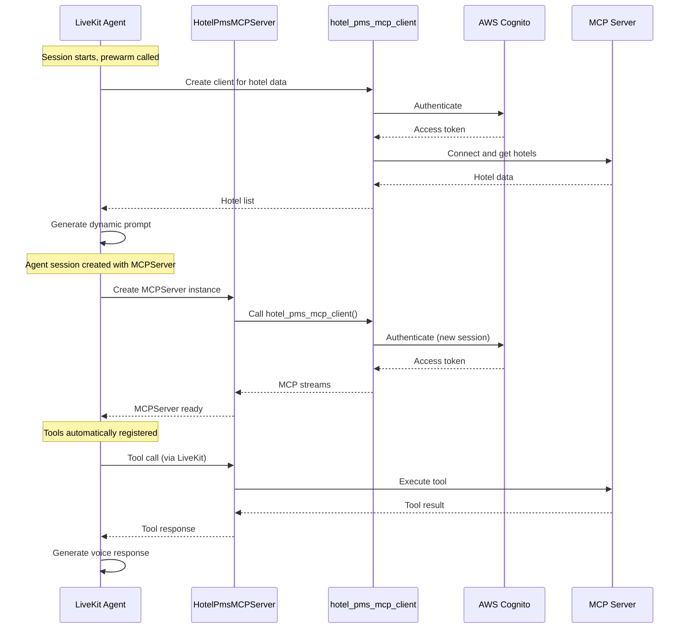

# Design Document

## Overview

This design refactors the Hotel PMS MCP integration to use a simpler, more
robust approach. Instead of complex configuration modules and global client
management, this solution creates a custom MCPServer subclass that directly uses
the existing `hotel_pms_mcp_client()` from the common package.

The design eliminates complexity by leveraging proven components and following
the same pattern used successfully in the chat agent, with per-session MCP
connections and dynamic hotel data fetching.

## Architecture

### Component Interaction Flow



## Components and Interfaces

### 1. Custom Hotel PMS MCP Server

**File:** `hotel_assistant_livekit/hotel_pms_mcp_server.py`

**Purpose:** Custom MCPServer subclass that integrates with
hotel_pms_mcp_client.

**Interface:**

```python
class HotelPmsMCPServer(MCPServer):
    """Custom MCPServer that uses hotel_pms_mcp_client for authentication."""

    def client_streams(self) -> AbstractAsyncContextManager[...]:
        """Return streams from hotel_pms_mcp_client()."""
        return hotel_pms_mcp_client()
```

### 2. Enhanced Agent with Per-Session MCP

**File:** `hotel_assistant_livekit/agent.py`

**Purpose:** Main LiveKit agent with simplified MCP integration.

**Key Changes:**

- Use HotelPmsMCPServer instead of MCPServerHTTP
- Create fresh MCP connection in prewarm for hotel data
- Generate dynamic prompts with hotel information
- Remove complex configuration and caching logic

## Data Models

### Configuration

Configuration is handled entirely by the existing `hotel_pms_mcp_client()`
function from the common package. No additional configuration models are needed.

### Hotel Data Flow

```python
# In prewarm function
async with hotel_pms_mcp_client() as (read_stream, write_stream, get_session_id):
    async with ClientSession(read_stream, write_stream) as session:
        await session.initialize()
        hotels = await get_hotels(session)  # Reuse existing function

# Use hotels for dynamic prompt generation
instructions = generate_dynamic_hotel_instructions(hotels=hotels)
```

## Error Handling

### MCP Client Creation Errors

1. **Configuration/Authentication Errors**: hotel_pms_mcp_client() raises
   exceptions, caught and logged, agent continues without MCP tools
2. **Network Errors**: Handled by hotel_pms_mcp_client() with appropriate
   retries

### Session-Level Errors

1. **Hotel Data Fetch Failure**: Log warning, use fallback generic instructions
2. **MCP Server Creation Failure**: Log error, agent continues without tools
3. **Tool Call Failures**: LiveKit handles gracefully, returns error to LLM

### Connection Management

1. **Per-Session Isolation**: Each session gets fresh connections, no shared
   state
2. **Automatic Cleanup**: Context managers ensure proper resource cleanup
3. **Graceful Degradation**: Agent works without MCP tools if connections fail

## Testing Strategy

### Unit Tests

1. **Configuration Loading**: Test environment variables and Secrets Manager
2. **Authentication**: Mock OAuth2 flow and token refresh
3. **MCP Server Creation**: Test factory function with various configurations

### Integration Tests

**Location:** `tests/integration/`

1. **MCP Server Connection**: Test connection to real MCP server (must fail if
   server unavailable)
2. **Tool Execution**: Test actual tool calls through MCP (must fail if tools
   unavailable)

**Note:** Integration tests mock nothing and must fail if external resources are
unavailable.

## Implementation Approach

### Core Files to Create/Modify

1. `hotel_assistant_livekit/hotel_pms_mcp_server.py` - Custom HotelPmsMCPServer
   class
2. `hotel_assistant_livekit/agent.py` - Update to use new MCP server and
   per-session hotel data
3. `pyproject.toml` - Add hotel-assistant-common dependency

### Dependencies

```toml
# Add to pyproject.toml dependencies
"livekit-agents[mcp]>=1.2.1",  # MCP support (already exists)
"hotel-assistant-common",      # For hotel_pms_mcp_client and get_hotels
```

### Removed Components

- `hotel_assistant_livekit/mcp/` directory and all contents
- Complex configuration loading logic
- Global MCP client management and caching
- Custom authentication handling (delegated to common package)
