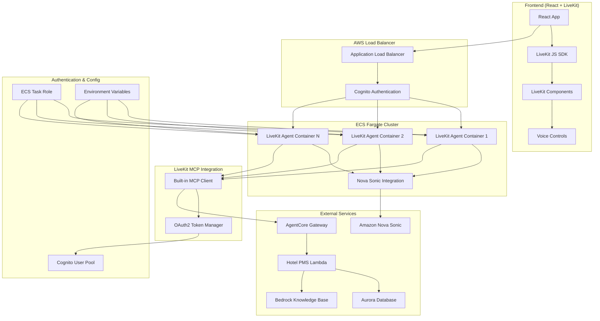

# Design Document

## Overview

This design document outlines the complete replacement of the existing
WebSocket-based speech-to-speech agent with a LiveKit-based solution using
Amazon Nova Sonic. The new architecture will host LiveKit agents in ECS Fargate
behind an Application Load Balancer (ALB) with Cognito authentication,
integrating with the Hotel PMS MCP server via AgentCore Gateway using LiveKit's
built-in MCP support.

## Architecture

### High-Level Architecture



### Component Architecture

The LiveKit-based solution consists of these main components:

1. **Frontend Application**: React app using LiveKit JavaScript SDK and
   components
2. **LiveKit Agent**: Python-based agent using LiveKit Agents framework with
   Nova Sonic
3. **ECS Infrastructure**: Fargate containers behind ALB with Cognito
   authentication
4. **Built-in MCP Integration**: LiveKit's native MCP client for Hotel PMS
   connection
5. **Configuration Management**: Environment-based configuration with secure
   credential handling

## Detailed Component Design

### 1. LiveKit Agent (Python)

**Purpose**: Core conversational agent using LiveKit Agents framework with Nova
Sonic integration and built-in MCP tools.

**Key Components**:

```python
# Main agent structure using LiveKit's built-in MCP support
from livekit import agents
from livekit.agents import AgentSession, Agent, JobContext, mcp
from livekit.plugins.aws.experimental.realtime import RealtimeModel
from livekit.plugins import silero
import os
import requests

class HotelReceptionistAgent(Agent):
    def __init__(self) -> None:
        super().__init__(
            instructions="""
            Eres un recepcionista amigable de hotel que ayuda a los huéspedes con sus necesidades.

            Instrucciones:
            - Siempre responde en español
            - Preséntate como recepcionista del hotel
            - Mantén un tono profesional pero cálido
            - Usa las herramientas disponibles para acceder a información real del hotel
            - Cuando los huéspedes hagan solicitudes, reconoce la petición e informa que investigarás
            """
        )

async def get_oauth2_token() -> str:
    """Get OAuth2 token for AgentCore Gateway authentication"""
    response = requests.post(
        os.environ.get("COGNITO_TOKEN_URL"),
        data={
            "grant_type": "client_credentials",
            "client_id": os.environ.get("COGNITO_CLIENT_ID"),
            "client_secret": os.environ.get("COGNITO_CLIENT_SECRET"),
        },
        headers={"Content-Type": "application/x-www-form-urlencoded"}
    )

    token_data = response.json()
    return token_data["access_token"]

async def entrypoint(ctx: JobContext):
    # Create agent
    agent = HotelReceptionistAgent()

    # Get OAuth2 token for MCP authentication
    oauth_token = await get_oauth2_token()

    # Create session with Nova Sonic and built-in MCP integration
    session = AgentSession(
        llm=RealtimeModel(voice="matthew"),  # Nova Sonic integration
        vad=silero.VAD.load(),  # Voice Activity Detection
        mcp_servers=[
            # LiveKit's built-in MCP HTTP client
            mcp.MCPServerHTTP(
                url=os.environ.get("AGENTCORE_GATEWAY_URL"),
                timeout=10,
                client_session_timeout_seconds=30,
                # Add authentication headers for AgentCore Gateway
                headers={
                    "Authorization": f"Bearer {oauth_token}"
                }
            ),
        ]
    )

    # Start the session - MCP tools will be automatically available
    await session.start(room=ctx.room, agent=agent)
```

**Benefits of LiveKit's Built-in MCP Client**:

- **Simplified Integration**: No need to implement custom MCP client code
- **Automatic Tool Discovery**: MCP tools are automatically available to the
  agent
- **Built-in Error Handling**: LiveKit handles MCP connection errors and retries
- **Session Management**: Proper MCP session lifecycle management
- **Authentication Support**: Built-in support for custom headers and
  authentication

### 2. Frontend Application (React + LiveKit)

**Purpose**: Modern web interface using LiveKit JavaScript SDK and React
components.

**Key Components**:

```typescript
// Main App component using LiveKit
import { Room } from 'livekit-client';
import { RoomContext, useVoiceAssistant } from '@livekit/components-react';
import { AgentControlBar } from '@/components/livekit/agent-control-bar';
import { MediaTiles } from '@/components/livekit/media-tiles';

export function HotelAssistantApp() {
  const [room] = useState(() => new Room());
  const [connectionDetails, setConnectionDetails] = useState<ConnectionDetails | null>(null);

  // Fetch connection details from backend
  useEffect(() => {
    fetch('/api/connection-details')
      .then(res => res.json())
      .then(setConnectionDetails);
  }, []);

  // Connect to LiveKit room
  useEffect(() => {
    if (connectionDetails && room.state === 'disconnected') {
      room.connect(connectionDetails.serverUrl, connectionDetails.participantToken);
    }
  }, [connectionDetails, room]);

  return (
    <RoomContext.Provider value={room}>
      <div className="hotel-assistant-interface">
        <MediaTiles />
        <AgentControlBar
          capabilities={{
            supportsChatInput: true,
            supportsVideoInput: false,
            supportsScreenShare: false,
          }}
        />
      </div>
    </RoomContext.Provider>
  );
}
```

**Connection Details API**:

```typescript
// API route for generating LiveKit tokens
import { AccessToken, VideoGrant } from 'livekit-server-sdk';

export async function GET() {
  const roomName = `hotel_assistant_${Math.random().toString(36).substring(7)}`;
  const participantName = 'guest';
  const participantIdentity = `guest_${Date.now()}`;

  const token = new AccessToken(
    process.env.LIVEKIT_API_KEY,
    process.env.LIVEKIT_API_SECRET,
    {
      identity: participantIdentity,
      name: participantName,
      ttl: '1h',
    }
  );

  token.addGrant({
    room: roomName,
    roomJoin: true,
    canPublish: true,
    canSubscribe: true,
  } as VideoGrant);

  return Response.json({
    serverUrl: process.env.LIVEKIT_URL,
    roomName,
    participantToken: token.toJwt(),
    participantName,
  });
}
```

### 3. ECS Infrastructure (CDK)

**Purpose**: Host LiveKit agents in ECS Fargate with ALB and Cognito
authentication.

**CDK Stack Structure**:

```python
class LiveKitAgentStack(Stack):
    def __init__(self, scope: Construct, construct_id: str, **kwargs) -> None:
        super().__init__(scope, construct_id, **kwargs)

        # Reuse existing VPC from backend stack
        vpc = ec2.Vpc.from_lookup(self, "VPC", vpc_name="BackendStack-VPC")

        # Create ECS cluster
        cluster = ecs.Cluster(self, "LiveKitAgentCluster", vpc=vpc)

        # Create task definition
        task_definition = ecs.FargateTaskDefinition(
            self, "LiveKitAgentTask",
            memory_limit_mib=2048,
            cpu=1024,
        )

        # Add container with LiveKit agent
        container = task_definition.add_container(
            "LiveKitAgent",
            image=ecs.ContainerImage.from_asset("../livekit-agent"),
            environment={
                "LIVEKIT_API_KEY": livekit_api_key,
                "LIVEKIT_API_SECRET": livekit_api_secret,
                "LIVEKIT_URL": livekit_url,
                "AGENTCORE_GATEWAY_URL": agentcore_gateway_url,
                "COGNITO_CLIENT_ID": cognito_client_id,
                "COGNITO_CLIENT_SECRET": cognito_client_secret,
                "COGNITO_TOKEN_URL": cognito_token_url,
            },
            logging=ecs.LogDrivers.aws_logs(
                stream_prefix="livekit-agent",
                log_retention=logs.RetentionDays.ONE_WEEK,
            ),
        )

        container.add_port_mappings(
            ecs.PortMapping(container_port=8080, protocol=ecs.Protocol.TCP)
        )

        # Create Fargate service
        service = ecs.FargateService(
            self, "LiveKitAgentService",
            cluster=cluster,
            task_definition=task_definition,
            desired_count=2,
            assign_public_ip=False,
        )

        # Create ALB
        alb = elbv2.ApplicationLoadBalancer(
            self, "LiveKitAgentALB",
            vpc=vpc,
            internet_facing=True,
        )

        # Create target group
        target_group = elbv2.ApplicationTargetGroup(
            self, "LiveKitAgentTargets",
            vpc=vpc,
            port=8080,
            protocol=elbv2.ApplicationProtocol.HTTP,
            targets=[service],
            health_check=elbv2.HealthCheck(
                path="/health",
                healthy_http_codes="200",
            ),
        )

        # Add listener with Cognito authentication
        listener = alb.add_listener(
            "LiveKitAgentListener",
            port=443,
            protocol=elbv2.ApplicationProtocol.HTTPS,
            certificates=[certificate],
            default_action=elbv2.ListenerAction.authenticate_cognito(
                user_pool=cognito_user_pool,
                user_pool_client=cognito_user_pool_client,
                next_action=elbv2.ListenerAction.forward([target_group]),
            ),
        )
```

### 4. Docker Configuration

**Purpose**: Containerize the LiveKit agent with proper dependency management
and security.

**Dockerfile** (adapted from existing pattern):

```dockerfile
FROM python:3.13-alpine
COPY --from=ghcr.io/astral-sh/uv:latest /uv /uvx /bin/

WORKDIR /app

# Install system dependencies for LiveKit and audio processing
RUN apk add --update --no-cache \
    jq curl inotify-tools \
    ffmpeg \
    portaudio-dev \
    alsa-lib-dev

# Enable bytecode compilation for better startup performance
ENV UV_COMPILE_BYTECODE=1
ENV UV_LINK_MODE=copy
ENV UV_PYTHON_PREFERENCE=only-system

# Create non-root user
RUN addgroup -S appuser && adduser -S appuser -G appuser

# Copy dependency files
COPY pyproject.toml uv.lock ./

# Install dependencies
RUN --mount=type=cache,target=/root/.cache/uv \
    uv sync --frozen --no-install-project --no-dev

# Copy application code
COPY . .

# Install the project
RUN --mount=type=cache,target=/root/.cache/uv \
    uv sync --frozen --no-dev

# Set environment variables
ENV LOGLEVEL=INFO
ENV HOST=0.0.0.0
ENV PORT=8080
ENV AWS_DEFAULT_REGION=us-east-1
ENV PYTHONPATH=/app

# Activate virtual environment
ENV PATH="/app/.venv/bin:$PATH"

# Set permissions
RUN chmod +x entrypoint.sh
RUN chown -R appuser:appuser /app

USER appuser

EXPOSE ${PORT}

# Health check
HEALTHCHECK --interval=30s --timeout=5s --start-period=30s --retries=3 \
    CMD curl -f http://localhost:${PORT}/health || exit 1

ENTRYPOINT ["./entrypoint.sh"]
```

**Entrypoint Script** (adapted from existing):

```bash
#!/bin/sh

# Function to check if running in ECS
is_running_in_ecs() {
  if curl -s --connect-timeout 1 http://169.254.170.2 > /dev/null 2>&1; then
    echo "Running in ECS environment"
    return 0
  else
    echo "Not running in ECS environment"
    return 1
  fi
}

# Function to fetch initial credentials
fetch_initial_credentials() {
  CREDS=$(curl -s 169.254.170.2$AWS_CONTAINER_CREDENTIALS_RELATIVE_URI)

  if [ -z "$CREDS" ]; then
    echo "ERROR: Failed to fetch credentials from ECS metadata endpoint"
    return 1
  fi

  export AWS_ACCESS_KEY_ID=$(echo $CREDS | jq -r '.AccessKeyId')
  export AWS_SECRET_ACCESS_KEY=$(echo $CREDS | jq -r '.SecretAccessKey')
  export AWS_SESSION_TOKEN=$(echo $CREDS | jq -r '.Token')
  export AWS_REGION=$(curl -s 169.254.169.254/latest/meta-data/placement/region || echo "us-east-1")

  echo "Initial credentials set, access key ends with: ...${AWS_ACCESS_KEY_ID: -4}"
}

# Cleanup function
cleanup() {
  echo "Cleaning up processes..."
  if [ -n "$APP_PID" ]; then
    kill $APP_PID 2>/dev/null || true
  fi
  exit 0
}

trap cleanup TERM INT

echo "Starting LiveKit Nova Sonic Agent"

# Check if running in ECS and fetch credentials
if is_running_in_ecs; then
  fetch_initial_credentials
  echo "Using on-demand credential refresh"
else
  echo "Skipping credential refresh - not in ECS environment"
fi

export PYTHONPATH="${PYTHONPATH}:/app"

if [ "$DEV_MODE" = "true" ]; then
  echo "Running in DEV_MODE with inotifywait..."

  python livekit_agent.py &
  APP_PID=$!

  while true; do
    inotifywait -r -e modify,create,delete /app --format "%e %w%f"
    echo "Change detected, restarting process..."

    if [ -n "$APP_PID" ]; then
      kill $APP_PID 2>/dev/null || true
      wait $APP_PID 2>/dev/null || true
    fi

    python livekit_agent.py &
    APP_PID=$!
  done
else
  echo "Running in production mode..."
  python livekit_agent.py &
  APP_PID=$!

  wait $APP_PID
fi
```

### 5. Project Structure

```
packages/livekit-agent/
├── livekit_agent.py          # Main agent entrypoint
├── config/
│   ├── __init__.py
│   └── settings.py           # Configuration management
├── utils/
│   ├── __init__.py
│   ├── logging.py            # Logging setup
│   ├── auth.py               # OAuth2 authentication helpers
│   └── health.py             # Health check endpoint
├── pyproject.toml            # Dependencies
├── uv.lock                   # Lock file
├── Dockerfile                # Container definition
├── entrypoint.sh             # Container entrypoint
└── README.md                 # Documentation
```

### 6. Dependencies

**pyproject.toml**:

```toml
[project]
name = "livekit-nova-sonic-agent"
version = "1.0.0"
description = "LiveKit agent with Nova Sonic and Hotel PMS MCP integration"
requires-python = ">=3.13"
dependencies = [
    # LiveKit Agents framework with MCP support
    "livekit-agents>=1.2.1",
    "livekit-plugins-aws>=1.2.1",

    # Audio processing
    "livekit-plugins-silero>=1.0.0",

    # HTTP and authentication
    "requests>=2.31.0",
    "aiohttp>=3.9.0",

    # Utilities
    "python-dotenv>=1.0.0",
    "pydantic>=2.0.0",
]

[dependency-groups]
dev = [
    "pytest>=8.0.0",
    "pytest-asyncio>=0.23.0",
    "ruff>=0.8.0",
    "mypy>=1.8.0",
]

[build-system]
requires = ["hatchling"]
build-backend = "hatchling.build"

[tool.ruff]
line-length = 120
target-version = "py313"

[tool.ruff.lint]
select = ["E", "F", "UP", "B", "SIM", "I"]
ignore = []
```

## Configuration Management

### Environment Variables

```bash
# LiveKit Configuration
LIVEKIT_API_KEY=devkey
LIVEKIT_API_SECRET=secret
LIVEKIT_URL=ws://localhost:7880

# MCP Integration via AgentCore Gateway
AGENTCORE_GATEWAY_URL=https://your-agentcore-gateway.amazonaws.com
COGNITO_CLIENT_ID=your-cognito-client-id
COGNITO_CLIENT_SECRET=your-cognito-client-secret
COGNITO_TOKEN_URL=https://your-cognito-domain.auth.region.amazoncognito.com/oauth2/token

# AWS Configuration
AWS_REGION=us-east-1
AWS_DEFAULT_REGION=us-east-1

# Application Configuration
LOGLEVEL=INFO
HOST=0.0.0.0
PORT=8080
DEV_MODE=false

# Agent Configuration
AGENT_LANGUAGE=es
AGENT_VOICE=matthew
```

## Error Handling and Resilience

### 1. LiveKit Connection Errors

```python
class LiveKitErrorHandler:
    @staticmethod
    async def handle_connection_error(error: Exception, context: str) -> None:
        logger.error(f"LiveKit connection error in {context}: {error}")

        if isinstance(error, ConnectionError):
            # Attempt reconnection with exponential backoff
            await asyncio.sleep(min(2 ** attempt, 30))

        elif isinstance(error, AuthenticationError):
            # Refresh tokens and retry
            await refresh_livekit_credentials()

    @staticmethod
    async def handle_agent_error(error: Exception, session: AgentSession) -> None:
        logger.error(f"Agent error: {error}")

        # Send error message to user in Spanish
        await session.say("Lo siento, he experimentado un problema técnico. Por favor intente nuevamente.")
```

### 2. MCP Integration Errors

Since we're using LiveKit's built-in MCP client, most error handling is managed
automatically. However, we can still handle authentication token refresh:

```python
async def refresh_oauth_token_if_needed():
    """Refresh OAuth2 token if it's about to expire"""
    # This would be called periodically or on auth errors
    try:
        new_token = await get_oauth2_token()
        # Update MCP server configuration with new token
        # LiveKit handles the reconnection automatically
        return new_token
    except Exception as e:
        logger.error(f"Failed to refresh OAuth2 token: {e}")
        raise
```

## Testing Strategy

### 1. Unit Tests

```python
# Test OAuth2 token generation
@pytest.mark.asyncio
async def test_oauth2_token_generation():
    with patch('requests.post') as mock_post:
        mock_post.return_value.json.return_value = {
            'access_token': 'test-token',
            'token_type': 'Bearer',
            'expires_in': 3600
        }

        token = await get_oauth2_token()
        assert token == 'test-token'

# Test agent initialization
def test_hotel_agent_initialization():
    agent = HotelReceptionistAgent()

    assert agent.instructions is not None
    assert "español" in agent.instructions.lower()
    assert "recepcionista" in agent.instructions.lower()
```

### 2. Integration Tests

```python
# Test LiveKit agent with MCP integration
@pytest.mark.integration
async def test_livekit_agent_with_mcp():
    # This would require a test LiveKit server and MCP server
    pass

# Test end-to-end conversation flow
@pytest.mark.integration
async def test_conversation_flow():
    # This would test the complete conversation flow
    pass
```

## Deployment Strategy

### 1. Development Environment

```bash
# Local development with LiveKit server
livekit-server --dev &

# Run the agent
python livekit_agent.py connect --room test-room
```

### 2. Production Deployment

```bash
# Deploy via CDK
cd packages/infra
uv run cdk deploy LiveKitAgentStack
```

### 3. Monitoring and Observability

- **CloudWatch Logs**: All agent logs and errors
- **CloudWatch Metrics**: Custom metrics for agent performance
- **X-Ray Tracing**: Distributed tracing for MCP calls
- **Health Checks**: ALB health checks and ECS health monitoring
- **Alarms**: CloudWatch alarms for error rates and latency

## Benefits of LiveKit + Built-in MCP Approach

1. **Simplified Architecture**: No custom WebSocket or MCP client code
2. **Better Audio Quality**: Native audio processing and Nova Sonic integration
3. **Automatic MCP Management**: Built-in tool discovery, error handling, and
   session management
4. **Scalability**: Built-in load balancing and room management
5. **Reliability**: Proven WebRTC infrastructure with automatic reconnection
6. **Developer Experience**: Rich SDK and component library
7. **Maintenance**: Minimal custom code to maintain
8. **Features**: Built-in features like recording, transcription, etc.
9. **MCP Simplicity**: No need to implement MCP protocol details - just provide
   URL and auth

## Migration Strategy

Since this is a complete replacement rather than a migration:

1. **Parallel Deployment**: Deploy LiveKit solution alongside existing WebSocket
   server
2. **Feature Flag**: Use feature flag to switch between old and new systems
3. **Gradual Rollout**: Start with small percentage of users
4. **Monitoring**: Monitor both systems during transition
5. **Cleanup**: Remove WebSocket server after successful migration
