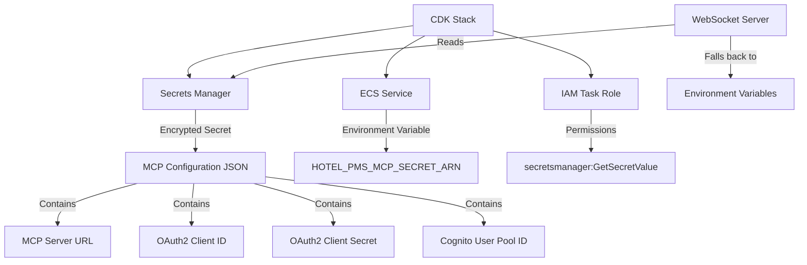
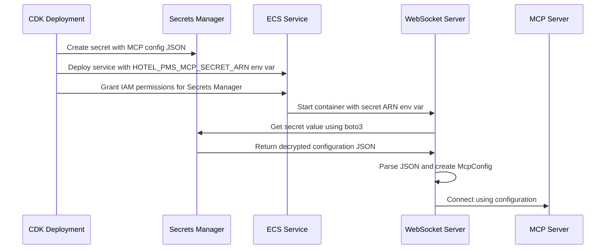

# Design Document

## Overview

This design implements secure configuration management for the Hotel PMS MCP
client using AWS Secrets Manager. The solution will create an encrypted secret
containing MCP configuration data and update both the ECS infrastructure and the
MCP client code to use this secret instead of individual environment variables
for sensitive data.

## Architecture

### High-Level Architecture



### Component Interaction Flow



## Components and Interfaces

### 1. Secrets Manager Secret Configuration

**Secret Structure:**

- **Name**: CDK-generated name (managed by CDK)
- **Type**: Standard secret with automatic encryption
- **Value**: JSON object containing MCP configuration

**JSON Schema:**

```json
{
  "type": "object",
  "required": ["url", "client_id", "client_secret", "user_pool_id"],
  "properties": {
    "url": {
      "type": "string",
      "description": "MCP server endpoint URL"
    },
    "client_id": {
      "type": "string",
      "description": "Cognito OAuth2 client ID"
    },
    "client_secret": {
      "type": "string",
      "description": "Cognito OAuth2 client secret"
    },
    "user_pool_id": {
      "type": "string",
      "description": "Cognito User Pool ID"
    },
    "region": {
      "type": "string",
      "description": "AWS region (optional, defaults to deployment region)"
    }
  }
}
```

### 2. CDK Infrastructure Changes

**New CDK Constructs:**

1. **Secrets Manager Secret**

   ```python
   mcp_config_secret = secretsmanager.Secret(
       self, "McpConfigSecret",
       description="Hotel PMS MCP Client Configuration",
       secret_object_value={
           "url": SecretValue.unsafe_plain_text(mcp_server_url),
           "client_id": SecretValue.unsafe_plain_text(cognito_client.user_pool_client_id),
           "client_secret": cognito_client.user_pool_client_secret,
           "user_pool_id": SecretValue.unsafe_plain_text(user_pool.user_pool_id),
           "region": SecretValue.unsafe_plain_text(self.region)
       }
   )
   ```

2. **IAM Permissions**

   ```python
   # Grant Secrets Manager read access
   mcp_config_secret.grant_read(websocket_task_role)
   ```

3. **ECS Environment Variable**
   ```python
   websocket_container.add_environment(
       "HOTEL_PMS_MCP_SECRET_ARN",
       mcp_config_secret.secret_arn
   )
   ```

### 3. Configuration Data Sources

The MCP configuration will be sourced from existing CDK constructs:

- **URL**: Derived from the Hotel PMS MCP server deployment (if available)
- **Client ID**: From the Cognito App Client created for machine-to-machine
  authentication
- **Client Secret**: From the Cognito App Client secret (SecretValue)
- **User Pool ID**: From the existing Cognito User Pool
- **Region**: From the CDK stack region

### 4. WebSocket Server Code Changes

The MCP client needs to be updated to support Secrets Manager:

1. **New Configuration Method:**

   ```python
   @classmethod
   def _from_secrets_manager(cls, secret_arn: str) -> "McpConfig | None":
       """Create MCP configuration from AWS Secrets Manager."""
       try:
           # Create Secrets Manager client
           sm_client = boto3.client("secretsmanager")

           # Get the secret value
           response = sm_client.get_secret_value(SecretId=secret_arn)

           # Parse the JSON configuration
           config_data = json.loads(response["SecretString"])

           # Validate and create config
           return cls._create_config_from_data(config_data, region)

       except Exception as e:
           logger.error(f"Failed to load from Secrets Manager: {e}")
           return None
   ```

2. **Updated Configuration Loading Priority:**

   ```python
   @classmethod
   def from_environment(cls) -> "McpConfig | None":
       """Create MCP configuration from Secrets Manager or environment variables."""
       # Check if we should load from Secrets Manager
       secret_arn = os.environ.get("HOTEL_PMS_MCP_SECRET_ARN")
       if secret_arn:
           logger.info(f"Loading MCP configuration from Secrets Manager")
           config = cls._from_secrets_manager(secret_arn)
           if config:
               return config
           logger.warning("Failed to load from Secrets Manager, falling back to environment variables")

       # Fallback to environment variables
       logger.info("Loading MCP configuration from environment variables")
       return cls._from_environment_variables()
   ```

## Data Models

### MCP Configuration Model

```python
@dataclass
class McpConfig:
    url: str
    client_id: str
    client_secret: str
    user_pool_id: str | None = None
    region: str = "us-east-1"
    timeout: int = 30
    max_retries: int = 3
```

### Secrets Manager Secret Value Structure

```json
{
  "url": "https://agentcore-gateway-xyz.execute-api.us-east-1.amazonaws.com/mcp",
  "client_id": "1234567890abcdef",
  "client_secret": "secret-value-here",
  "user_pool_id": "us-east-1_AbCdEfGhI",
  "region": "us-east-1"
}
```

## Error Handling

### 1. CDK Deployment Errors

- **Missing Configuration Values**: CDK deployment will fail with clear error
  messages if required MCP configuration is not available
- **IAM Permission Errors**: CDK will validate IAM permissions during deployment
- **Secret Creation Errors**: CDK will handle Secrets Manager secret creation
  failures

### 2. Runtime Configuration Errors

- **Secret Not Found**: WebSocket server logs error and falls back to
  environment variables
- **Invalid JSON**: Server logs parsing error and falls back to environment
  variables
- **Missing Required Fields**: Server logs validation error and falls back to
  environment variables
- **AWS Permissions Error**: Server logs AWS error and falls back to environment
  variables

### 3. Fallback Strategy

```python
def load_configuration():
    # Try Secrets Manager first
    if secret_arn := os.environ.get("HOTEL_PMS_MCP_SECRET_ARN"):
        config = McpConfig._from_secrets_manager(secret_arn)
        if config:
            logger.info("Loaded MCP configuration from Secrets Manager")
            return config
        logger.warning("Failed to load from Secrets Manager, falling back to environment variables")

    # Fallback to environment variables
    config = McpConfig._from_environment_variables()
    if config:
        logger.info("Loaded MCP configuration from environment variables")
        return config

    logger.error("Failed to load MCP configuration from any source")
    return None
```

## Testing Strategy

### 1. Unit Tests

- **Configuration Loading**: Test Secrets Manager loading with mocked boto3
  responses
- **Error Handling**: Test fallback behavior with various error conditions
- **JSON Parsing**: Test configuration parsing with valid and invalid JSON

### 2. Integration Tests

- **End-to-End Configuration**: Verify WebSocket server can load configuration
  from Secrets Manager
- **Fallback Testing**: Test behavior when secret is not available

## Implementation Phases

### Phase 1: CDK Infrastructure Updates

1. Add Secrets Manager secret creation to CDK stack
2. Update ECS task role with Secrets Manager permissions
3. Add environment variable to ECS container definition
4. Handle configuration data sourcing from existing constructs

### Phase 2: WebSocket Server Code Updates

1. Add Secrets Manager support to McpConfig class
2. Update configuration loading priority
3. Add error handling and fallback logic
4. Update tests for new configuration method

### Phase 3: Deployment and Validation

1. Deploy updated infrastructure
2. Verify secret is created correctly
3. Verify ECS service can access secret
4. Test WebSocket server configuration loading
5. Validate fallback behavior

## Security Considerations

### 1. Encryption

- **At Rest**: Secrets Manager automatically encrypts secrets using AWS managed
  keys
- **In Transit**: All AWS API calls use TLS encryption
- **In Memory**: Configuration is loaded into memory only when needed

### 2. Access Control

- **IAM Permissions**: ECS task role has minimal permissions for specific secret
- **Secret ARN**: Full ARN required for access, not just secret name
- **Resource-based Policies**: Can be added for additional access control

### 3. Audit and Monitoring

- **Application Logs**: Configuration loading events are logged (without
  sensitive data)
- **Error Logging**: Failed access attempts are logged for monitoring

## Performance Considerations

### 1. Configuration Loading

- **Caching**: Configuration is loaded once at startup and cached
- **Lazy Loading**: Secret is only accessed when MCP client is initialized
- **Timeout Handling**: Reasonable timeouts for Secrets Manager API calls

### 2. Resource Usage

- **Memory**: Minimal additional memory usage for configuration storage
- **Network**: Single Secrets Manager API call per container startup
- **CPU**: Negligible CPU overhead for JSON parsing

## Deployment Considerations

### 1. Migration Strategy

- **Backward Compatibility**: Environment variable configuration remains as
  fallback
- **Gradual Rollout**: Can be deployed without breaking existing functionality
- **Rollback Plan**: Can remove secret and rely on environment variables

### 2. Environment Management

- **Secret Naming**: CDK-managed names ensure unique secrets per
  stack/environment
- **Configuration Differences**: Each environment has its own secret with
  appropriate values
- **Secret Management**: Client secrets are environment-specific

### 3. Operational Procedures

- **Configuration Updates**: Update secret value and restart ECS service
- **Secret Rotation**: Secrets Manager supports automatic rotation
- **Monitoring**: Monitor CloudWatch logs for configuration loading issues
