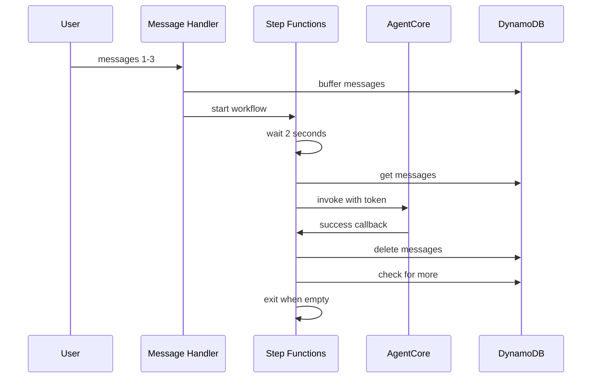

# Design Document: Message Processing Documentation

## Overview

This design updates existing documentation to explain the message processing
architecture by integrating content into:

1. **`documentation/architecture.md`** - Add message buffering section
   explaining the infrastructure decisions (Step Functions, DynamoDB, task token
   pattern)
2. **`documentation/technical_approach.md`** - Add message processing section
   explaining the implementation decisions (buffering window, loop-back pattern,
   retry logic)

The documentation focuses on helping developers understand why this architecture
was chosen and how it works, using visual diagrams and clear explanations to
make the complex Step Functions orchestration approachable.

## Documentation Updates

### architecture.md Updates

Add a new section under "Messaging Assistant" explaining the infrastructure:

````markdown
#### Message Buffering and Processing


The messaging system uses AWS Step Functions to handle rapid-fire messages
intelligently. When users send multiple messages in quick succession (e.g., "Hi"
→ "I need help" → "with my reservation"), the system ensures they're processed
together with full context.

**Infrastructure Components:**

1. **Message Buffer (DynamoDB)**:
   - Stores messages temporarily per user with TTL
   - Tracks processing state and workflow status
   - Enables atomic check-and-set for single workflow guarantee

2. **Step Functions Workflow**:
   - Orchestrates message collection and processing
   - Implements 2-second buffering window
   - Manages retry logic with exponential backoff
   - Uses task token pattern for async coordination

3. **Lambda Handlers**:
   - Message Handler: Buffers incoming messages, starts workflow
   - Prepare Processing: Atomically marks messages for processing
   - Invoke AgentCore: Calls agent with task token
   - Delete Processed: Removes successfully processed messages
   - Handle Failure: Manages permanent failures
   - Prepare Retry: Resets state for retry attempts

**Message Flow:**


````

**Key Benefits:**

- **Context preservation**: Agent sees all related messages together
- **Order guarantee**: Single workflow per user prevents race conditions
- **Reliable delivery**: Task token pattern ensures messages aren't lost on
  failure
- **Automatic retry**: Exponential backoff handles transient errors
- **Production-ready**: Handles real-world rapid messaging scenarios

**Industry Adaptation**: This architecture works for any messaging platform
(WhatsApp, SMS, Slack, etc.) where users send multiple messages rapidly.

````

### technical_approach.md Updates

Add a new section explaining the implementation decisions:

```markdown
## Message Processing Implementation

The message processing system implements a sophisticated buffering and retry mechanism to handle rapid-fire messaging scenarios common in production WhatsApp and SMS deployments.

### Problem Statement

When users send multiple messages in quick succession (common in mobile messaging), processing each message independently causes:

1. **Fragmented context**: Agent doesn't see related messages together
2. **Out-of-order responses**: Race conditions between concurrent invocations
3. **Lost messages**: If async processing fails after Lambda returns success

### Solution Architecture

We use AWS Step Functions with a task token pattern to coordinate message buffering and processing:

```mermaid
stateDiagram-v2
    [*] --> SetWaitingState
    SetWaitingState --> WaitForMessages
    WaitForMessages --> GetMessages
    GetMessages --> CheckIfMessagesExist
    CheckIfMessagesExist --> ClearWaitingState: No messages
    CheckIfMessagesExist --> CheckMessageAge: Messages exist
    CheckMessageAge --> DecideNextAction
    DecideNextAction --> WaitForMessages: Still arriving
    DecideNextAction --> PrepareProcessing: Window expired
    PrepareProcessing --> InvokeAgentCore
    InvokeAgentCore --> DeleteProcessedMessages: Success
    InvokeAgentCore --> PrepareRetry: Failure
    DeleteProcessedMessages --> GetMessages: Loop back
    PrepareRetry --> CheckRetryLimit
    CheckRetryLimit --> CalculateRetryWait: retry < 6
    CheckRetryLimit --> HandleFailure: retry >= 6
    CalculateRetryWait --> WaitBeforeRetry
    WaitBeforeRetry --> PrepareProcessing
    HandleFailure --> ClearWaitingState
    ClearWaitingState --> [*]
````

### Key Implementation Decisions

#### 1. Buffering Window (2 seconds)

Messages are collected for 2 seconds before processing. This balances:

- **Latency**: Short enough for responsive conversations
- **Batching**: Long enough to capture rapid-fire messages
- **User experience**: Imperceptible delay for most interactions

The workflow checks message age using JSONata expressions to determine if more
messages are still arriving.

#### 2. Single Workflow Per User

A `waiting_state` flag in DynamoDB ensures only one workflow runs per user:

```python
# Atomic check-and-set in Message Handler
buffer_table.update_item(
    Key={"user_id": user_id},
    UpdateExpression="SET waiting_state = :true",
    ConditionExpression="attribute_not_exists(waiting_state) OR waiting_state = :false",
)
```

If the condition fails, the message is buffered but no new workflow starts. The
existing workflow will pick it up via loop-back.

#### 3. Task Token Pattern

Step Functions passes a task token to the Lambda, which forwards it to the
AgentCore async task:

```python
# In Step Functions
invoke_agentcore = tasks.LambdaInvoke(
    integration_pattern=sfn.IntegrationPattern.WAIT_FOR_TASK_TOKEN,
    payload={"task_token": sfn.JsonPath.task_token, ...}
)

# In AgentCore async task
if task_token:
    sfn_client.send_task_success(taskToken=task_token, output=result)
```

This ensures the workflow only proceeds after the async task completes,
preventing premature message deletion.

#### 4. Loop-Back Pattern

After processing messages, the workflow loops back to check for new messages:

```python
# After DeleteProcessedMessages
delete_processed_messages.next(get_messages)  # Loop back

# Exit when no messages remain
check_if_messages_exist_choice.when(
    sfn.Condition.jsonata(""),
    clear_waiting_state  # Exit
)
```

This allows a single workflow to handle all messages until the user is idle,
maintaining order and context.

#### 5. Exponential Backoff Retry

Failures trigger retry with exponential backoff (2s, 4s, 8s, 16s, 32s, 64s):

```python
# JSONata calculation in Step Functions
"wait_seconds": ""
```

After 6 retries, messages are marked as failed and remain in the buffer for
manual review (TTL cleans up after 10 minutes).

### Performance Characteristics

- **Latency**: 2-4 seconds (buffering window + processing time)
- **Throughput**: Unlimited concurrent users (independent workflows)
- **Cost**: ~$0.025 per 1000 state transitions (negligible)
- **Scalability**: Limited by Step Functions (25,000 state transitions per
  execution)

### Alternative Approaches Considered

**Simple SQS Processing**: Process each message independently

- ❌ Fragmented context
- ❌ Race conditions
- ❌ Lost messages on async failure
- ✅ Simpler implementation

**Lambda-based Buffering**: Use Lambda with DynamoDB Streams

- ❌ Complex state management
- ❌ Difficult retry logic
- ❌ No visual workflow
- ✅ Lower latency

**Step Functions with Task Token** (chosen approach)

- ✅ Visual workflow debugging
- ✅ Built-in retry and error handling
- ✅ Reliable async coordination
- ✅ Production-ready
- ❌ More complex than SQS

### Production Considerations

This architecture is designed for production use:

1. **Handles real-world scenarios**: Rapid-fire messaging is common in
   WhatsApp/SMS
2. **Prevents message loss**: Task token pattern ensures reliability
3. **Maintains conversation quality**: Context preservation improves agent
   responses
4. **Scales automatically**: Step Functions and DynamoDB scale independently
5. **Observable**: Step Functions console provides visual debugging

See architecture.md for infrastructure details and component descriptions.

```

## Visual Diagrams

The documentation includes three key diagrams:

### 1. Message Flow Sequence Diagram

Shows the complete lifecycle of messages through the system, including:
- Initial message buffering
- Workflow startup with waiting_state
- 2-second buffering window
- Task token pattern with async callback
- Loop-back for new messages
- Clean exit when no messages remain

### 2. Step Functions State Machine Diagram

Illustrates all 13 states in the workflow:
- Message collection states (SetWaitingState, WaitForMessages, GetMessages)
- Decision states (CheckIfMessagesExist, CheckMessageAge, DecideNextAction)
- Processing states (PrepareProcessing, InvokeAgentCore, DeleteProcessedMessages)
- Retry states (PrepareRetry, CheckRetryLimit, CalculateRetryWait, WaitBeforeRetry)
- Error handling (HandleFailure)
- Exit state (ClearWaitingState)

### 3. High-Level Architecture Diagram (Optional)

Could be added to show component relationships, but the sequence diagram may be sufficient.

## Content Guidelines

### Tone and Style

- **Clear and concise**: Avoid unnecessary jargon
- **Visual-first**: Use diagrams to explain complex flows
- **Production-focused**: Emphasize reliability and error handling
- **Practical**: Include code examples from actual implementation

### Technical Depth

- **High-level overview**: Start with the problem and solution
- **Progressive disclosure**: Details available but not overwhelming
- **Code references**: Show actual implementation patterns
- **Real examples**: Use concrete scenarios (WhatsApp rapid messages)

### Audience Assumptions

- Familiar with AWS services (Lambda, Step Functions, DynamoDB)
- Understanding of async/await patterns
- Basic knowledge of message queuing concepts
- May be new to Step Functions task token pattern

## File Locations

```

documentation/ ├── architecture.md # UPDATED: Add message buffering
infrastructure section ├── technical_approach.md # UPDATED: Add message
processing implementation section └── diagrams/ # Mermaid diagrams render
automatically in GitHub

```

## Implementation Approach

### Phase 1: Update architecture.md

1. Locate the "Messaging Assistant" section
2. Add "Message Buffering and Processing" subsection after existing content
3. Include sequence diagram
4. Describe infrastructure components
5. Explain key benefits

### Phase 2: Update technical_approach.md

1. Add "Message Processing Implementation" section
2. Explain the problem statement
3. Include state machine diagram
4. Detail each implementation decision
5. Compare alternative approaches
6. Add performance characteristics

### Phase 3: Review and Polish

1. Ensure diagrams render correctly
2. Verify code examples are accurate
3. Check cross-references between documents
4. Validate Mermaid syntax

## Success Criteria

The documentation is successful if:

1. **Developers can understand the flow** - After reading, developers can explain how messages move through the system
2. **Architecture decisions are clear** - Readers understand why Step Functions was chosen over simple SQS
3. **Diagrams are helpful** - Visual representations clarify complex interactions
4. **Production readiness is evident** - The documentation demonstrates this is not just a prototype feature
5. **Integration is seamless** - New content fits naturally into existing documentation structure

## Maintenance Considerations

- **Keep diagrams in sync** - Update diagrams when implementation changes
- **Link to code** - Reference actual implementation files for details
- **Update as needed** - Add clarifications based on user questions
- **Version consistency** - Ensure documentation matches deployed code
```
