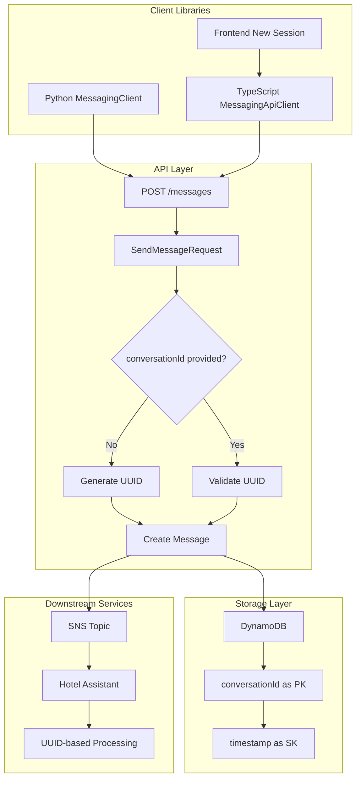

# Design Document

## Overview

This design enhances the chatbot messaging backend to support optional
UUID-based conversation IDs. The core functionality focuses on allowing clients
to specify conversation IDs and adding a simple "New Session" button to the demo
frontend. This is a prototype implementation focusing on essential features
only.

## Architecture

### Current State

The current system uses a deterministic conversation ID pattern:

- Format: `senderId#recipientId` (e.g., `user123#hotel-assistant`)
- Generated in `generate_conversation_id()` function
- Used as DynamoDB partition key
- Lexicographically sorted for consistency

### Target State

The enhanced system will support:

- Optional UUID-based conversation IDs
- Client-controlled conversation grouping
- Backward compatibility with existing patterns
- Frontend "New Session" functionality



## Components and Interfaces

### 1. API Request Model Enhancement

**File:**
`packages/chatbot-messaging-backend/chatbot_messaging_backend/handlers/lambda_handler.py`

```python
class SendMessageRequest(BaseModel):
    """Request model for sending messages."""

    recipient_id: str = Field(alias="recipientId")
    content: str
    conversation_id: str | None = Field(default=None, alias="conversationId")  # NEW
    model_id: str | None = Field(default=None, alias="modelId")
    temperature: float | None = Field(default=None, ge=0.0, le=2.0)

    model_config = {"populate_by_name": True}

    @field_validator("conversation_id")
    @classmethod
    def validate_conversation_id(cls, v: str | None) -> str | None:
        """Validate conversation ID is a valid UUID if provided."""
        if v is None:
            return v

        try:
            uuid.UUID(v)
            return v
        except ValueError:
            raise ValueError("conversationId must be a valid UUID")
```

### 2. Message Creation Enhancement

**File:**
`packages/chatbot-messaging-backend/chatbot_messaging_backend/models/message.py`

```python
def create_message(
    sender_id: str,
    recipient_id: str,
    content: str,
    conversation_id: Optional[str] = None,  # NEW PARAMETER
    message_id: Optional[str] = None,
    status: MessageStatus = MessageStatus.SENT,
) -> Message:
    """Create a new message with optional conversation ID."""

    if message_id is None:
        message_id = generate_message_id()

    # Use provided conversation_id or generate UUID
    if conversation_id is None:
        conversation_id = str(uuid.uuid4())

    timestamp = generate_iso8601_timestamp()

    return Message(
        message_id=message_id,
        conversation_id=conversation_id,  # Now UUID-based
        sender_id=sender_id,
        recipient_id=recipient_id,
        content=content,
        status=status,
        timestamp=timestamp,
        created_at=timestamp,
        updated_at=timestamp,
    )
```

### 3. Message Service Enhancement

**File:**
`packages/chatbot-messaging-backend/chatbot_messaging_backend/services/message_service.py`

```python
def send_message(
    self,
    sender_id: str,
    recipient_id: str,
    content: str,
    conversation_id: str | None = None,  # NEW PARAMETER
    model_id: str | None = None,
    temperature: float | None = None,
) -> Message:
    """Send a new message with optional conversation ID."""

    try:
        message = create_message(
            sender_id=sender_id,
            recipient_id=recipient_id,
            content=content,
            conversation_id=conversation_id  # Pass through to model
        )
    except ValueError as e:
        logger.warning("Message creation validation failed", extra={"error": str(e)})
        raise ValueError(f"Invalid message data: {e}") from e

    # Rest of the method remains the same
    # ...
```

### 4. Python Client Enhancement

**File:**
`packages/hotel-assistant/hotel-assistant-common/hotel_assistant_common/clients/messaging_client.py`

```python
async def send_message(
    self,
    recipient_id: str,
    content: str,
    sender_id: str = "hotel-assistant",
    conversation_id: Optional[str] = None  # NEW PARAMETER
) -> dict[str, Any]:
    """Send message via messaging API with optional conversation ID."""

    client = await self._get_client()
    headers = await self._get_auth_headers()

    request_data = {
        "recipientId": recipient_id,
        "content": content,
        "senderId": sender_id
    }

    # Add conversation_id if provided
    if conversation_id is not None:
        request_data["conversationId"] = conversation_id

    logger.info(f"Sending message to {recipient_id} from {sender_id}")
    if conversation_id:
        logger.info(f"Using conversation ID: {conversation_id}")

    try:
        response = await client.post(
            f"{self.api_endpoint}/messages",
            json=request_data,
            headers=headers
        )
        response.raise_for_status()
        result = response.json()

        logger.info(f"Message sent successfully: {result.get('messageId')}")
        return result

    except httpx.HTTPError as e:
        logger.error(f"Failed to send message: {e}")
        raise
```

### 5. TypeScript Client Enhancement

**File:** `packages/demo/src/lib/messaging-api-client.ts`

```typescript
async sendMessage(
  recipientId: string,
  content: string,
  modelId?: string,
  temperature?: string,
  conversationId?: string  // NEW PARAMETER
): Promise<SendMessageResponse> {
  try {
    const token = await this.getAuthToken();

    const requestBody: SendMessageRequest = {
      recipientId,
      content,
      ...(modelId && { modelId }),
      ...(temperature && { temperature }),
      ...(conversationId && { conversationId })  // NEW FIELD
    };

    const response = await fetch(`${this.baseUrl}/messages`, {
      method: 'POST',
      headers: {
        Authorization: `Bearer ${token}`,
        'Content-Type': 'application/json',
      },
      body: JSON.stringify(requestBody),
    });

    if (!response.ok) {
      await this.handleApiError(response);
    }

    return response.json();
  } catch (error) {
    if (error instanceof Error) {
      throw error;
    }
    throw new Error('Failed to send message. Please try again.');
  }
}

/**
 * Generate a new UUID for conversation ID
 */
public generateNewConversationId(): string {
  return crypto.randomUUID();
}
```

### 6. Frontend New Session Component

**File:** `packages/demo/src/components/chatbot/NewSessionButton.tsx`

```typescript
import React from 'react';
import { Button } from '@cloudscape-design/components';

interface NewSessionButtonProps {
  onNewSession: () => void;
  disabled?: boolean;
}

export const NewSessionButton: React.FC<NewSessionButtonProps> = ({
  onNewSession,
  disabled = false
}) => {
  return (
    <Button
      variant="normal"
      iconName="refresh"
      onClick={onNewSession}
      disabled={disabled}
    >
      New Session
    </Button>
  );
};
```

### 7. Frontend Chat State Management

**File:** `packages/demo/src/components/chatbot/Chatbot.tsx`

```typescript
const [currentConversationId, setCurrentConversationId] = useState<
  string | null
>(null);

const handleNewSession = useCallback(() => {
  // Generate new conversation ID
  const newConversationId = messagingClient.generateNewConversationId();

  // Clear current messages
  setMessages([]);

  // Set new conversation ID
  setCurrentConversationId(newConversationId);

  // Show feedback to user
  addFlashMessage({
    type: 'success',
    content: 'New conversation started',
    dismissible: true,
  });
}, [messagingClient, addFlashMessage]);

const handleSendMessage = useCallback(
  async (content: string) => {
    try {
      const response = await messagingClient.sendMessage(
        hotelAssistantClientId,
        content,
        undefined, // modelId
        undefined, // temperature
        currentConversationId || undefined // Use current conversation ID
      );

      // Update conversation ID if this was the first message
      if (!currentConversationId) {
        setCurrentConversationId(response.message.conversationId);
      }

      // Handle response...
    } catch (error) {
      // Handle error...
    }
  },
  [currentConversationId, messagingClient, hotelAssistantClientId]
);
```

## Data Models

### Enhanced Request Types

```typescript
// TypeScript types
interface SendMessageRequest {
  recipientId: string;
  content: string;
  conversationId?: string; // NEW OPTIONAL FIELD
  modelId?: string;
  temperature?: string;
}

interface SendMessageResponse {
  message: MessageApiResponse;
  success: boolean;
  error?: string;
}

interface MessageApiResponse {
  messageId: string;
  conversationId: string; // Now UUID format
  senderId: string;
  recipientId: string;
  content: string;
  status: MessageStatus;
  timestamp: string;
  createdAt: string;
  updatedAt: string;
}
```

### Python Models

```python
# Pydantic models
class SendMessageRequest(BaseModel):
    recipient_id: str = Field(alias="recipientId")
    content: str
    conversation_id: str | None = Field(default=None, alias="conversationId")  # NEW
    model_id: str | None = Field(default=None, alias="modelId")
    temperature: float | None = Field(default=None, ge=0.0, le=2.0)
```

## Error Handling

### Validation Errors

1. **Invalid UUID Format**
   - HTTP 400 Bad Request
   - Error message: "conversationId must be a valid UUID"
   - Logged with conversation ID attempt

2. **Missing Required Fields**
   - HTTP 400 Bad Request
   - Standard Pydantic validation errors
   - Detailed field-level error messages

### Backward Compatibility

1. **Legacy Conversation ID Retrieval**
   - Support queries with old format conversation IDs
   - Log warnings for deprecated format usage
   - Gradual migration path for existing data

2. **Mixed Format Handling**
   - Detect conversation ID format automatically
   - Route to appropriate handling logic
   - Maintain separate indexes if needed

## Testing Strategy

### Unit Tests

1. **Message Creation Tests**
   - Test UUID generation when no conversation ID provided
   - Test conversation ID validation
   - Test backward compatibility scenarios

2. **API Endpoint Tests**
   - Test optional conversation ID parameter
   - Test UUID validation in requests
   - Test error responses for invalid UUIDs

3. **Client Library Tests**
   - Test Python client with optional conversation ID
   - Test TypeScript client with optional conversation ID
   - Test conversation ID generation methods

### Integration Tests

1. **End-to-End Message Flow**
   - Send message without conversation ID (UUID generated)
   - Send message with conversation ID (UUID used)
   - Retrieve messages by UUID conversation ID

2. **Frontend Integration**
   - Test "New Session" button functionality
   - Test conversation state management
   - Test message grouping by conversation ID

3. **Backward Compatibility**
   - Test retrieval of legacy conversation IDs
   - Test mixed format scenarios
   - Test migration scenarios

### Performance Considerations

1. **UUID Generation**
   - Use `uuid.uuid4()` for cryptographically secure UUIDs
   - Minimal performance impact compared to deterministic generation
   - No collision concerns with proper UUID implementation

2. **Database Queries**
   - UUID conversation IDs work efficiently as partition keys
   - No index changes required for DynamoDB
   - Query performance remains consistent

3. **Client-Side Generation**
   - Use `crypto.randomUUID()` in browsers
   - Fallback to polyfill for older browsers
   - Generate UUIDs client-side to reduce server load

## Migration Strategy

### Phase 1: Backend Enhancement

1. Update API models to accept optional conversation ID
2. Enhance message creation logic
3. Update service layer methods
4. Deploy with backward compatibility

### Phase 2: Client Library Updates

1. Update Python messaging client
2. Update TypeScript messaging client
3. Add conversation ID generation utilities
4. Update documentation and examples

### Phase 3: Frontend Enhancement

1. Add "New Session" button component
2. Implement conversation state management
3. Update chat interface integration
4. Add user feedback for new sessions

### Phase 4: Testing and Validation

1. Comprehensive testing of all components
2. Performance validation
3. Backward compatibility verification
4. User acceptance testing

This design maintains full backward compatibility while enabling the new
UUID-based conversation ID functionality required by downstream services and
improving the user experience with easy session management.
