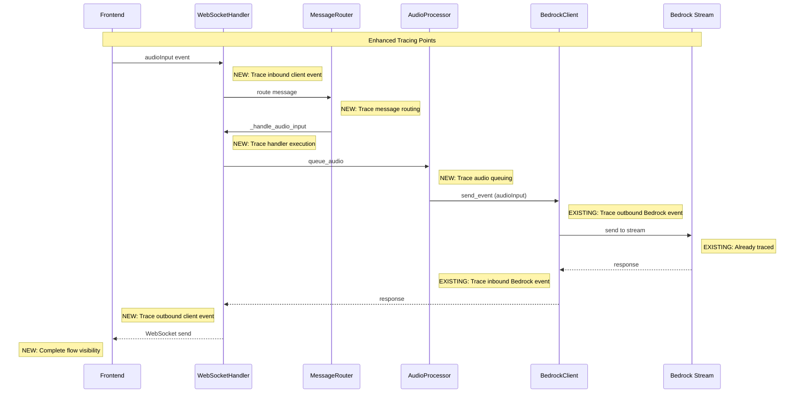

# Nova Sonic OpenTelemetry Tracing Enhancement Design

## Overview

Based on the comprehensive audit documented in `NOVA_SONIC_EVENT_FLOW_AUDIT.md`,
this design addresses the single identified gap in Nova Sonic event tracing:
AudioProcessor events lack proper session correlation and tracing context. The
audit confirmed that all events flow through the proper tracing infrastructure,
with only one specific issue to resolve.

## Current State Analysis

### Existing Tracing Coverage

The current implementation traces:

- Events sent via `bedrock_client.send_event()` (outbound to Bedrock)
- Events received in `_process_responses()` (inbound from Bedrock)
- Tool execution in `_handle_tool_use()`

### Missing Tracing Coverage

Analysis reveals these gaps:

1. **AudioInput Events**: Frontend audioInput events processed by
   `_handle_audio_input()` are not traced
2. **Direct Stream Events**: Events sent directly to the stream bypass
   `send_event()` tracing
3. **Message Router Events**: Events processed through MessageRouter are not
   traced
4. **WebSocket Client Events**: Events sent to the WebSocket client are not
   traced

## Architecture

### Enhanced Event Flow Tracing



## Components and Interfaces

### Enhanced TracingClient Methods

Add new methods to the existing TracingClient:

```python
class TracingClient:
    # Existing methods...

    def trace_websocket_inbound(
        self, event_data: Dict[str, Any], session_id: str, parent_span: Optional[Span] = None
    ) -> Optional[Span]:
        """Create span for events received from WebSocket client."""

    def trace_websocket_outbound(
        self, event_data: Dict[str, Any], session_id: str, parent_span: Optional[Span] = None
    ) -> Optional[Span]:
        """Create span for events sent to WebSocket client."""

    def trace_message_routing(
        self, message_type: str, handler_name: str, session_id: str, parent_span: Optional[Span] = None
    ) -> Optional[Span]:
        """Create span for message routing decisions."""

    def trace_audio_processing(
        self, operation: str, metadata: Dict[str, Any], session_id: str, parent_span: Optional[Span] = None
    ) -> Optional[Span]:
        """Create span for audio processing operations."""
```

### Integration Points

#### 1. WebSocketHandler.\_handle_message Enhancement

```python
async def _handle_message(self, websocket, message):
    """Handle a WebSocket message with enhanced tracing."""
    try:
        # Parse message data
        data = json.loads(message)

        # NEW: Trace inbound WebSocket event
        inbound_span = None
        if self.tracing_client.is_enabled():
            inbound_span = self.tracing_client.trace_websocket_inbound(data, self.session_id, self.session_span)

        try:
            # Route message through message router (with tracing)
            routed_data = await self.message_router.route_message(message, inbound_span)

            # Continue with existing logic...

        finally:
            # End inbound span
            if inbound_span:
                self.tracing_client.end_span_safely(inbound_span)

    except Exception as e:
        # Existing error handling
```

#### 2. MessageRouter Enhancement

```python
class MessageRouter:
    def __init__(self, session_id: str):
        self.session_id = session_id
        self.tracing_client = TracingClient()  # NEW
        # Existing initialization...

    async def route_message(self, message: str, parent_span: Optional[Span] = None) -> dict:
        """Route message with tracing."""
        data = json.loads(message)
        event_type = self._extract_event_type(data)

        # NEW: Trace message routing
        routing_span = None
        if self.tracing_client.is_enabled():
            routing_span = self.tracing_client.trace_message_routing(
                event_type, self._get_handler_name(event_type), self.session_id, parent_span
            )

        try:
            # Existing routing logic with span context
            if event_type in self.handlers:
                handler = self.handlers[event_type]
                # Execute handler with tracing context
                await handler(data)
                return None  # Message consumed
            else:
                return data  # Pass through

        finally:
            if routing_span:
                self.tracing_client.end_span_safely(routing_span)
```

#### 3. AudioProcessor Enhancement

```python
class AudioProcessor:
    def __init__(self, session_id: str):
        self.session_id = session_id
        self.tracing_client = TracingClient()  # NEW
        # Existing initialization...

    async def queue_audio(self, prompt_name: str, content_name: str, audio_base64: str):
        """Queue audio with tracing."""
        # NEW: Trace audio queuing
        audio_span = None
        if self.tracing_client.is_enabled():
            metadata = {
                "prompt_name": prompt_name,
                "content_name": content_name,
                "audio_size_bytes": len(audio_base64),
                "queue_size": self.audio_queue.qsize()
            }
            audio_span = self.tracing_client.trace_audio_processing(
                "queue_audio", metadata, self.session_id
            )

        try:
            # Existing queuing logic
            await self.audio_queue.put((prompt_name, content_name, audio_base64))

        finally:
            if audio_span:
                self.tracing_client.end_span_safely(audio_span)
```

#### 4. WebSocket Response Tracing

```python
async def _process_responses(self, websocket):
    """Process responses with enhanced WebSocket tracing."""
    while self.is_active:
        try:
            # Existing response processing...

            # NEW: Trace outbound WebSocket event before sending
            outbound_span = None
            if self.tracing_client.is_enabled():
                outbound_span = self.tracing_client.trace_websocket_outbound(
                    json_data, self.session_id, self.session_span
                )

            try:
                # Send to WebSocket
                await websocket.send(json.dumps(json_data))

                # Mark span as successful
                if outbound_span:
                    outbound_span.set_status(Status(StatusCode.OK))

            except Exception as e:
                # Mark span as failed
                if outbound_span:
                    outbound_span.set_status(Status(StatusCode.ERROR, str(e)))
                    outbound_span.record_exception(e)
                raise
            finally:
                if outbound_span:
                    self.tracing_client.end_span_safely(outbound_span)

        except Exception as e:
            # Existing error handling
```

## Data Models

### Enhanced Span Attributes

Add new attributes for complete event flow tracing:

```python
ENHANCED_SPAN_ATTRIBUTES = {
    # WebSocket client events
    "nova_sonic.client_direction": "inbound|outbound",
    "nova_sonic.websocket_event": "true",

    # Message routing
    "nova_sonic.routing_decision": "handled|passthrough",
    "nova_sonic.handler_name": str,
    "nova_sonic.routing_duration_ms": float,

    # Audio processing
    "nova_sonic.audio_operation": "queue|process|send",
    "nova_sonic.audio_queue_size": int,
    "nova_sonic.audio_chunk_size_bytes": int,

    # Event correlation
    "nova_sonic.event_source": "client|bedrock|internal",
    "nova_sonic.processing_stage": "receive|route|process|send",
}
```

### Event Flow Correlation

Enhance event correlation with processing stages:

```python
def create_event_correlation_id(session_id: str, event_type: str, timestamp: float) -> str:
    """Create correlation ID for tracking events across processing stages."""
    return f"{session_id}_{event_type}_{int(timestamp * 1000)}"
```

## Error Handling

### Graceful Degradation

All enhanced tracing follows the existing pattern:

```python
def safe_enhanced_tracing(func):
    """Decorator for safe enhanced tracing operations."""
    def wrapper(*args, **kwargs):
        try:
            if tracing_enabled:
                return func(*args, **kwargs)
        except Exception as e:
            logger.debug(f"Enhanced tracing operation failed: {e}")
        return None
    return wrapper
```

### Error Scenarios

1. **Tracing Initialization Failure**: Enhanced tracing disabled, existing
   functionality continues
2. **Span Creation Failure**: Individual operations continue without enhanced
   tracing
3. **Audio Processing Errors**: Audio processing continues, errors logged in
   traces
4. **WebSocket Errors**: WebSocket operations continue, connection issues traced

## Testing Strategy

### Unit Tests

```python
class TestEnhancedTracing:
    def test_websocket_inbound_tracing(self):
        """Test WebSocket inbound event tracing."""

    def test_websocket_outbound_tracing(self):
        """Test WebSocket outbound event tracing."""

    def test_message_routing_tracing(self):
        """Test message routing tracing."""

    def test_audio_processing_tracing(self):
        """Test audio processing tracing."""

    def test_enhanced_event_correlation(self):
        """Test enhanced event correlation across processing stages."""
```

### Integration Tests

```python
class TestCompleteEventFlow:
    def test_audioinput_complete_flow(self):
        """Test complete audioInput event flow from WebSocket to Bedrock."""

    def test_conversation_flow_tracing(self):
        """Test complete conversation flow with all enhanced tracing."""

    def test_missing_events_detection(self):
        """Test that no events bypass tracing instrumentation."""
```

## Implementation Plan

### Phase 1: Core Enhancement Infrastructure

1. Add new tracing methods to TracingClient
2. Implement enhanced span attributes and correlation
3. Add safe tracing decorators for new functionality

### Phase 2: WebSocket Event Tracing

1. Add inbound WebSocket event tracing to `_handle_message`
2. Add outbound WebSocket event tracing to `_process_responses`
3. Implement WebSocket event correlation

### Phase 3: Message Router Integration

1. Add tracing to MessageRouter
2. Implement handler execution tracing
3. Add routing decision visibility

### Phase 4: Audio Processing Integration

1. Add tracing to AudioProcessor operations
2. Implement audio queuing and processing visibility
3. Add audio metadata to traces

### Phase 5: Testing and Validation

1. Create unit tests for all enhanced tracing
2. Create integration tests for complete event flows
3. Validate that no events bypass tracing

## Dependencies

### Code Dependencies

- Existing TracingClient implementation
- WebSocketHandler message processing
- MessageRouter routing logic
- AudioProcessor audio handling

### Testing Dependencies

- Local Jaeger for trace validation
- Real conversation flows for testing
- Audio input simulation for testing

## Performance Considerations

### Minimal Overhead Design

- Reuse existing tracing infrastructure
- Conditional execution based on tracing enabled flag
- Efficient span attribute setting
- Minimal payload processing for trace metadata

### Audio Processing Protection

- Audio processing operations must not be blocked by tracing
- Tracing failures must not impact real-time audio requirements
- Audio content excluded from traces (metadata only)

## Security Considerations

### Data Privacy

- Audio content never included in traces
- Only metadata (size, format, timing) traced
- No sensitive user data in trace attributes
- WebSocket message content sanitized for tracing

### Access Control

- Same access control as existing tracing implementation
- Trace data controlled through Jaeger/OTLP collector
- Environment variable configuration only
