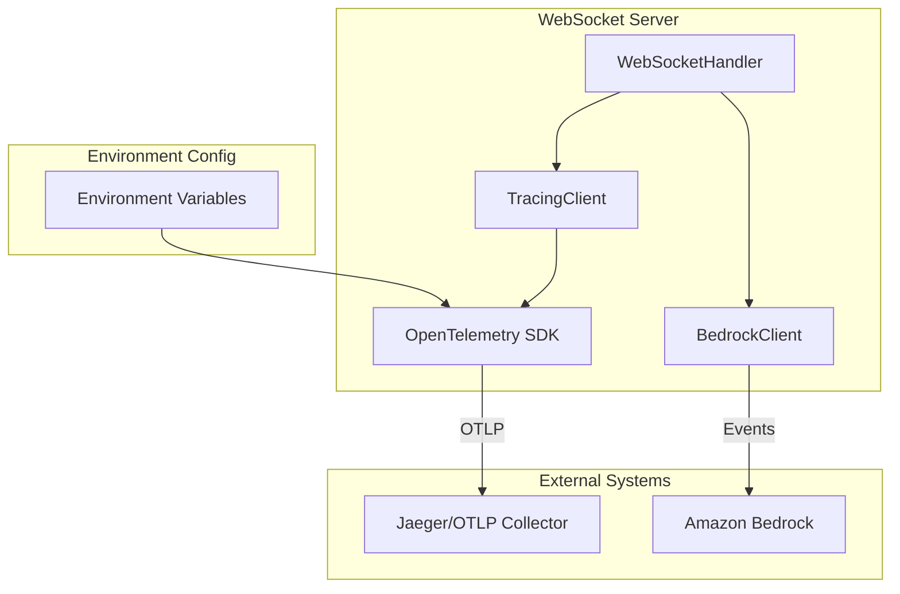

# Nova Sonic OpenTelemetry Tracing Design

## Overview

This design implements basic OpenTelemetry tracing for Nova Sonic events in the
WebSocket server to provide debugging visibility into conversation flows. The
solution uses environment variable configuration and focuses on tracing events
sent to and received from Amazon Bedrock with minimal code changes.

## Architecture

### High-Level Architecture



### Component Responsibilities

1. **TracingClient**: Centralized tracing logic with environment-based
   initialization
2. **WebSocketHandler**: Integration points for tracing Nova Sonic events
3. **BedrockClient**: Instrumentation for send/receive operations
4. **OpenTelemetry SDK**: Standard tracing infrastructure

## Components and Interfaces

### TracingClient

A new utility class that handles OpenTelemetry initialization and provides
tracing methods.

```python
class TracingClient:
    """Handles OpenTelemetry tracing for Nova Sonic events."""

    def __init__(self):
        self.tracer = None
        self.enabled = False
        self._initialize_tracing()

    def _initialize_tracing(self) -> bool:
        """Initialize OpenTelemetry based on environment variables."""

    def trace_outbound_event(self, event_data: dict, session_id: str) -> Span:
        """Create span for events sent to Bedrock."""

    def trace_inbound_event(self, event_data: dict, session_id: str) -> Span:
        """Create span for events received from Bedrock."""

    def create_session_span(self, session_id: str) -> Span:
        """Create root span for WebSocket session."""

    def is_enabled(self) -> bool:
        """Check if tracing is enabled."""
```

### Integration Points

#### WebSocketHandler Integration

```python
class WebSocketHandler:
    def __init__(self, ...):
        # Existing initialization
        self.tracing_client = TracingClient()
        self.session_span = None

    async def handle_connection(self, websocket):
        # Create root session span
        if self.tracing_client.is_enabled():
            self.session_span = self.tracing_client.create_session_span(self.session_id)

        # Existing connection handling logic

    async def _handle_message(self, websocket, message):
        # Existing message handling with tracing
        if self.tracing_client.is_enabled():
            # Trace outbound event before sending to Bedrock
            with self.tracing_client.trace_outbound_event(data, self.session_id):
                await self.bedrock_client.send_event(self.stream, data)
```

#### BedrockClient Integration

```python
class BedrockInteractClient:
    def __init__(self, ...):
        # Existing initialization
        self.tracing_client = TracingClient()

    async def send_event(self, stream, event_data):
        """Send event with optional tracing."""
        if self.tracing_client.is_enabled():
            with self.tracing_client.trace_outbound_event(event_data, "session"):
                return await self._send_event_impl(stream, event_data)
        else:
            return await self._send_event_impl(stream, event_data)
```

## Data Models

### Span Attributes

Standard attributes for Nova Sonic event spans:

```python
SPAN_ATTRIBUTES = {
    # Standard OpenTelemetry attributes
    "messaging.system": "bedrock",
    "messaging.operation": "send|receive",
    "messaging.destination": "nova-sonic",

    # Nova Sonic specific attributes
    "nova_sonic.session_id": str,
    "nova_sonic.event_type": str,  # sessionStart, promptStart, etc.
    "nova_sonic.prompt_name": str,
    "nova_sonic.content_name": str,
    "nova_sonic.direction": "outbound|inbound",

    # Tool-specific attributes (when applicable)
    "nova_sonic.tool_name": str,
    "nova_sonic.tool_type": "builtin|mcp",

    # Audio-specific attributes (metadata only)
    "nova_sonic.audio_format": str,
    "nova_sonic.audio_duration_ms": int,
    "nova_sonic.audio_chunk_count": int,
}
```

### Event Payload Handling

For debugging purposes, event payloads will be included in spans with sensitive
data filtering:

```python
def sanitize_event_payload(event_data: dict) -> dict:
    """Remove sensitive data from event payload for tracing."""
    sanitized = event_data.copy()

    # Remove audio content but keep metadata
    if "event" in sanitized:
        event = sanitized["event"]
        if "audioInput" in event and "content" in event["audioInput"]:
            content = event["audioInput"]["content"]
            event["audioInput"]["content"] = f"<audio_data:{len(content)}_bytes>"

        if "audioOutput" in event and "content" in event["audioOutput"]:
            content = event["audioOutput"]["content"]
            event["audioOutput"]["content"] = f"<audio_data:{len(content)}_bytes>"

    return sanitized
```

## Error Handling

### Graceful Degradation

The tracing system must never impact the core Nova Sonic functionality:

```python
def safe_trace_operation(func):
    """Decorator to safely execute tracing operations."""
    def wrapper(*args, **kwargs):
        try:
            if tracing_enabled:
                return func(*args, **kwargs)
        except Exception as e:
            logger.debug(f"Tracing operation failed: {e}")
            # Continue without tracing
        return None
    return wrapper
```

### Error Scenarios

1. **Tracing Initialization Failure**: Application continues with tracing
   disabled
2. **Trace Export Failure**: Logged but doesn't affect application
3. **Span Creation Failure**: Individual operations continue without tracing
4. **Network Issues**: OTLP export failures are handled gracefully

## Testing Strategy

### Unit Tests

```python
class TestTracingClient:
    def test_initialization_with_env_vars(self):
        """Test tracing initialization with environment variables."""

    def test_initialization_without_env_vars(self):
        """Test tracing remains disabled without environment variables."""

    def test_span_creation_for_events(self):
        """Test span creation for different event types."""

    def test_payload_sanitization(self):
        """Test sensitive data removal from payloads."""

    def test_error_handling(self):
        """Test graceful degradation on tracing errors."""
```

### Integration Tests

```python
class TestNovaSonicTracing:
    def test_end_to_end_tracing(self):
        """Test complete conversation flow with tracing enabled."""

    def test_performance_impact(self):
        """Test that tracing doesn't significantly impact performance."""

    def test_jaeger_integration(self):
        """Test trace export to local Jaeger instance."""
```

## Configuration

### Environment Variables

The system uses standard OpenTelemetry environment variables:

```bash
# Required for tracing to be enabled
OTEL_EXPORTER_OTLP_ENDPOINT="http://localhost:4318"

# Optional authentication
OTEL_EXPORTER_OTLP_HEADERS="Authorization=Bearer TOKEN"

# Optional service configuration
OTEL_SERVICE_NAME="nova-sonic-websocket-server"
OTEL_SERVICE_VERSION="1.0.0"

# Optional resource attributes
OTEL_RESOURCE_ATTRIBUTES="environment=development,component=websocket-server"
```

### Default Configuration

When tracing is enabled, the following defaults apply:

```python
DEFAULT_CONFIG = {
    "service_name": "nova-sonic-websocket-server",
    "service_version": "1.0.0",
    "trace_sampling_ratio": 1.0,  # 100% sampling for debugging
    "max_span_attributes": 128,
    "max_events_per_span": 128,
}
```

## Implementation Plan

### Phase 1: Core Tracing Infrastructure

1. Create `TracingClient` class with environment-based initialization
2. Implement span creation methods for different event types
3. Add payload sanitization logic
4. Create error handling and graceful degradation

### Phase 2: WebSocket Integration

1. Integrate `TracingClient` into `WebSocketHandler`
2. Add session-level span creation
3. Instrument message handling methods
4. Add tracing to response processing

### Phase 3: Bedrock Client Integration

1. Instrument `BedrockInteractClient.send_event()`
2. Add tracing to event receive operations
3. Implement event-specific attribute extraction
4. Add timing measurements

### Phase 4: Testing and Validation

1. Create unit tests for all tracing components
2. Create integration tests with local Jaeger
3. Performance testing to ensure minimal impact
4. End-to-end conversation flow testing

## Dependencies

### Python Packages

```python
# Add to pyproject.toml
dependencies = [
    # Existing dependencies...
    "opentelemetry-api>=1.20.0",
    "opentelemetry-sdk>=1.20.0",
    "opentelemetry-exporter-otlp>=1.20.0",
]
```

### Development Dependencies

```python
# For local testing
dev_dependencies = [
    # Existing dev dependencies...
    "opentelemetry-instrumentation>=0.41b0",  # For testing utilities
]
```

## Security Considerations

### Data Privacy

1. **Audio Content Exclusion**: Audio payloads are replaced with metadata
2. **Authentication Token Filtering**: No sensitive tokens in trace attributes
3. **User Data Protection**: No personally identifiable information in traces

### Access Control

1. **Trace Data Access**: Controlled through Jaeger/OTLP collector configuration
2. **Environment Variables**: Secure handling of authentication headers
3. **Local Development**: Traces only exported to configured endpoints

## Performance Considerations

### Minimal Overhead

1. **Conditional Execution**: All tracing code is conditionally executed
2. **Lazy Initialization**: OpenTelemetry components initialized only when
   needed
3. **Efficient Serialization**: Minimal payload processing for trace attributes
4. **Async Export**: Trace export doesn't block application threads

### Resource Management

1. **Memory Usage**: Bounded span attributes and events
2. **CPU Usage**: Minimal processing overhead for span creation
3. **Network Usage**: Batched trace export to reduce network calls
4. **Storage**: No local trace storage, only in-memory spans

## Monitoring and Observability

### Tracing System Health

The tracing system itself should be observable:

```python
# Metrics for tracing system health
TRACING_METRICS = {
    "traces_exported_total": "Counter of successfully exported traces",
    "trace_export_errors_total": "Counter of trace export failures",
    "span_creation_duration": "Histogram of span creation time",
    "active_spans_count": "Gauge of currently active spans",
}
```

### Debugging Information

When tracing is enabled, additional debug logging provides visibility:

```python
logger.debug(f"Tracing initialized with endpoint: {endpoint}")
logger.debug(f"Created span for {event_type} event: {span_id}")
logger.debug(f"Exported {span_count} spans to OTLP collector")
```
