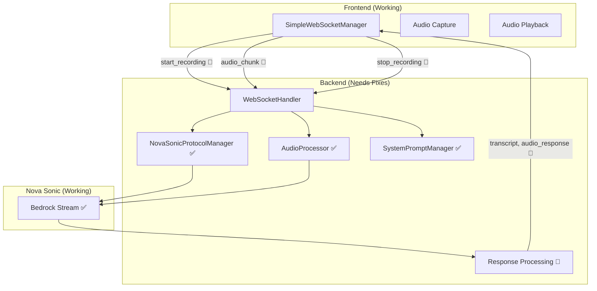

# Nova Sonic Protocol Fix Design

## Overview

This design fixes the speech-to-speech system by properly connecting the
simplified frontend messages to the existing backend Nova Sonic protocol
implementation. The backend already has all the necessary components - we just
need to fix the message routing and response processing.

## Architecture

### Current State Analysis

**Problem**: The backend already has complete Nova Sonic protocol implementation
in `NovaSonicProtocolManager`, `AudioProcessor`, and `SystemPromptManager`. The
issue is that the simplified frontend messages aren't properly triggering the
existing protocol flow.

**What We Already Have** ✅:

1. ✅ `NovaSonicProtocolManager` - Complete protocol implementation
   (sessionStart, promptStart, system prompt)
2. ✅ `AudioProcessor` - Audio chunk processing and queuing
3. ✅ `SystemPromptManager` - Spanish hotel receptionist prompt
4. ✅ Tool configuration and MCP integration
5. ✅ Bedrock client and streaming

**What's Broken** 🔧:

1. 🔧 Message routing from simplified frontend to existing backend components
2. 🔧 Response processing to convert Nova Sonic events back to simplified
   frontend messages
3. 🔧 Audio content lifecycle management (start/stop recording)

### Simple Fix Architecture



## Components and Interfaces

### 1. Fix WebSocketHandler Message Routing

**Current Issue**: The simplified message handlers exist but don't properly
trigger the existing Nova Sonic protocol.

**Simple Fix**:

```python
async def _handle_start_recording_simplified(self, data):
    """Fix: Properly start audio content using existing NovaSonicProtocolManager"""
    # Generate audio content name
    self.audio_content_name = f"audio-{uuid.uuid4().hex[:8]}"

    # Use existing protocol manager to start audio content
    content_start_event = S2sEvent.content_start_audio(self.prompt_name, self.audio_content_name)
    await self.bedrock_client.send_event(self.stream, content_start_event)

async def _handle_stop_recording_simplified(self, data):
    """Fix: Properly end audio content"""
    if self.prompt_name and self.audio_content_name:
        content_end_event = S2sEvent.content_end(self.prompt_name, self.audio_content_name)
        await self.bedrock_client.send_event(self.stream, content_end_event)
```

### 2. Fix Response Processing

**Current Issue**: The `_process_responses` method exists but doesn't properly
convert Nova Sonic events to simplified frontend messages.

**Simple Fix**:

```python
async def _process_responses(self, websocket):
    """Fix: Convert Nova Sonic events to simplified frontend messages"""
    while self.is_active:
        # ... existing response processing ...

        if event_name == "textOutput":
            # Fix: Convert to transcript message
            await self._send_simplified_message(websocket, {
                "type": "transcript",
                "role": "assistant",
                "content": text_content,
                "isPartial": False
            })

        elif event_name == "audioOutput":
            # Fix: Convert to audio_response message
            await self._send_simplified_message(websocket, {
                "type": "audio_response",
                "audioData": audio_content
            })
```

### 3. Fix Audio Content Lifecycle

**Current Issue**: The audio content name isn't properly managed between start
and stop recording.

**Simple Fix**: Ensure `self.audio_content_name` is properly set in
start_recording and used in stop_recording.

## Data Models

### Existing Frontend Messages (No Changes Needed)

```typescript
// These already work - no changes needed
type OutgoingMessage =
  | { type: 'start_recording' }
  | { type: 'audio_chunk'; audioData: string }
  | { type: 'stop_recording' };

type IncomingMessage =
  | { type: 'transcript'; role: 'user' | 'assistant'; content: string }
  | { type: 'audio_response'; audioData: string }
  | { type: 'status_update'; status: string };
```

### Existing Backend Components (No Changes Needed)

- ✅ `NovaSonicProtocolManager` - Already implements complete protocol
- ✅ `AudioProcessor` - Already handles audio chunks
- ✅ `SystemPromptManager` - Already loads Spanish prompt
- ✅ `S2sEvent` - Already has all event types

## Implementation Plan

### Phase 1: Fix Message Routing (30 minutes)

1. Fix `_handle_start_recording_simplified` to use existing
   `S2sEvent.content_start_audio`
2. Fix `_handle_stop_recording_simplified` to use existing
   `S2sEvent.content_end`
3. Ensure audio content name is properly managed

### Phase 2: Fix Response Processing (30 minutes)

1. Fix `_process_responses` to convert `textOutput` to `transcript` messages
2. Fix `_process_responses` to convert `audioOutput` to `audio_response`
   messages
3. Add proper status updates

### Phase 3: Test Complete Flow (30 minutes)

1. Test start_recording → Nova Sonic protocol works
2. Test audio chunks → Nova Sonic processing works
3. Test stop_recording → Nova Sonic response works
4. Test responses → frontend display works

**Total Time: ~90 minutes** instead of days of rebuilding!

## Why This is Much Simpler

1. **No New Components**: We use existing `NovaSonicProtocolManager`,
   `AudioProcessor`, etc.
2. **No Protocol Changes**: The Nova Sonic protocol is already correctly
   implemented
3. **No Frontend Changes**: The `SimpleWebSocketManager` already works correctly
4. **Minimal Backend Changes**: Just fix the message routing and response
   conversion

This is a simple bug fix, not a major architectural change!
