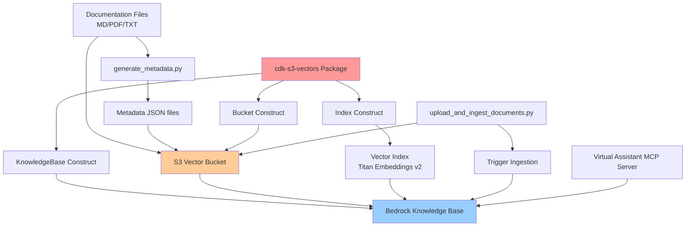

# Design Document

## Overview

The S3 Vectors Knowledge Base design provides a Bedrock Knowledge Base using the
`cdk-s3-vectors` package for document storage and retrieval. The design uses S3
vectors for cost-effective vector storage, eliminating the need for separate
vector databases like Aurora PostgreSQL with pgvector or OpenSearch.

**Key Design Principles:**

- Use `cdk-s3-vectors` package for Bucket, Index, and KnowledgeBase constructs
- Maintain compatibility with existing documentation scripts
- Support multi-entity filtering through metadata
- Deploy as part of application stack (customer-replaceable reference
  implementation)
- Optimize for cost using S3 vectors instead of vector databases

## Architecture

### High-Level Architecture



### Component Responsibilities

- **cdk-s3-vectors Package**: Provides Bucket, Index, and KnowledgeBase
  constructs
- **S3 Vector Bucket**: Stores documents and vector embeddings
- **Vector Index**: Enables similarity search with Titan Embeddings v2 (1024
  dimensions)
- **Bedrock Knowledge Base**: Manages document ingestion and semantic search
- **Metadata**: Enables entity-specific filtering (entity_id, document_type,
  language, category)
- **Existing Scripts**: Generate metadata and upload/ingest documents

## Components and Interfaces

### CDK Construct Using cdk-s3-vectors Package

```python
from aws_cdk import (
    Stack,
    CfnOutput,
    RemovalPolicy,
)
from constructs import Construct
from cdk_s3_vectors import Bucket, Index, KnowledgeBase

class KnowledgeBaseConstruct(Construct):
    """CDK construct for Knowledge Base using S3 Vectors."""

    def __init__(
        self,
        scope: Construct,
        construct_id: str,
        **kwargs
    ):
        super().__init__(scope, construct_id, **kwargs)

        # Create S3 Vector Bucket
        self.vector_bucket = Bucket(
            self,
            "VectorBucket",
            vector_bucket_name=f"{Stack.of(self).stack_name.lower()}-kb-docs",
            encryption_configuration={
                "encryptionType": "AES256"  # Default SSE-S3 encryption
            }
        )

        # Create Vector Index
        # Note: All metadata keys in document metadata are filterable by default
        # Only specify non_filterable_metadata_keys for keys that should NOT be filterable
        self.vector_index = Index(
            self,
            "VectorIndex",
            vector_bucket_name=self.vector_bucket.vector_bucket_name,
            index_name="knowledge-index",
            data_type="float32",
            dimension=1024,  # Titan Embeddings v2 dimension
            distance_metric="cosine",  # Cosine similarity for semantic search
            metadata_configuration=None  # All metadata keys are filterable by default
        )

        # Create Bedrock Knowledge Base
        self.knowledge_base = KnowledgeBase(
            self,
            "KnowledgeBase",
            knowledge_base_name=f"{Stack.of(self).stack_name}-kb",
            knowledge_base_configuration={
                "type": "VECTOR",
                "vectorKnowledgeBaseConfiguration": {
                    "embeddingModelArn": f"arn:aws:bedrock:{Stack.of(self).region}::foundation-model/amazon.titan-embed-text-v2:0"
                }
            },
            vector_bucket_arn=self.vector_bucket.vector_bucket_arn,
            index_arn=self.vector_index.index_arn,
            description="Knowledge base using S3 Vectors for cost-effective document storage and retrieval"
        )

        # Add dependency to ensure proper creation order
        self.vector_index.node.add_dependency(self.vector_bucket)
        self.knowledge_base.node.add_dependency(self.vector_index)

    @property
    def bucket_name(self) -> str:
        """Get the S3 vector bucket name."""
        return self.vector_bucket.vector_bucket_name

    @property
    def knowledge_base_id(self) -> str:
        """Get the Knowledge Base ID."""
        return self.knowledge_base.knowledge_base_id

    @property
    def knowledge_base_arn(self) -> str:
        """Get the Knowledge Base ARN."""
        return self.knowledge_base.knowledge_base_arn
```

### Data Source Configuration

The knowledge base needs a data source pointing to the S3 bucket location where
hotel documents are stored:

```python
from aws_cdk import aws_bedrock as bedrock

# Add data source to knowledge base
self.data_source = bedrock.CfnDataSource(
    self,
    "DataSource",
    knowledge_base_id=self.knowledge_base.knowledge_base_id,
    name="documents",
    data_source_configuration={
        "type": "S3",
        "s3Configuration": {
            "bucketArn": self.vector_bucket.vector_bucket_arn,
            "inclusionPrefixes": ["knowledge-base/"]
        }
    },
    vector_ingestion_configuration={
        "chunkingConfiguration": {
            "chunkingStrategy": "SEMANTIC",
            "semanticChunkingConfiguration": {
                "maxTokens": 500,
                "bufferSize": 1,
                "breakpointPercentileThreshold": 95
            }
        },
        "parsingConfiguration": {
            "parsingStrategy": "BEDROCK_FOUNDATION_MODEL",
            "bedrockFoundationModelConfiguration": {
                "modelArn": f"arn:aws:bedrock:{Stack.of(self).region}::foundation-model/anthropic.claude-3-sonnet-20240229-v1:0"
            }
        }
    }
)

@property
def data_source_id(self) -> str:
    """Get the Data Source ID."""
    return self.data_source.attr_data_source_id
```

### Stack Integration

```python
from aws_cdk import Stack, CfnOutput
from constructs import Construct

class ApplicationStack(Stack):
    """Application Stack with S3 Vectors Knowledge Base."""

    def __init__(self, scope: Construct, construct_id: str, **kwargs):
        super().__init__(scope, construct_id, **kwargs)

        # Create other application resources (DynamoDB, API Gateway, etc.)
        # ...

        # Create Knowledge Base
        self.knowledge_base_construct = KnowledgeBaseConstruct(
            self, "KnowledgeBase"
        )

        # Stack outputs for existing scripts compatibility
        CfnOutput(
            self, "DocumentsBucketName",
            value=self.knowledge_base_construct.bucket_name,
            description="S3 bucket name for documents",
            export_name=f"{self.stack_name}-DocumentsBucketName"
        )

        CfnOutput(
            self, "KnowledgeBaseId",
            value=self.knowledge_base_construct.knowledge_base_id,
            description="Bedrock Knowledge Base ID",
            export_name=f"{self.stack_name}-KnowledgeBaseId"
        )

        CfnOutput(
            self, "DataSourceId",
            value=self.knowledge_base_construct.data_source_id,
            description="Knowledge Base Data Source ID",
            export_name=f"{self.stack_name}-DataSourceId"
        )

        CfnOutput(
            self, "KnowledgeBaseArn",
            value=self.knowledge_base_construct.knowledge_base_arn,
            description="Bedrock Knowledge Base ARN",
            export_name=f"{self.stack_name}-KnowledgeBaseArn"
        )
```

## Data Models

### Documentation Structure

```
knowledge-base/
├── entity-1/
│   ├── document-1.md
│   ├── document-1.md.metadata.json
│   ├── document-2.md
│   ├── document-2.md.metadata.json
│   └── ...
├── entity-2/
│   └── [documents + metadata]
├── entity-3/
│   └── [documents + metadata]
└── entity-4/
    └── [documents + metadata]
```

### Metadata Schema

All metadata keys defined in the document metadata are **filterable by default**
in S3 Vectors. This means you can use any of these keys in query filters without
additional configuration.

```json
{
  "metadataAttributes": {
    "entity_id": "ENT-001",
    "entity_name": "Entity Name",
    "document_type": "general-information",
    "language": "en",
    "category": "general-info",
    "last_updated": "2024-01-15"
  }
}
```

**Filtering Capability**: All keys above (`entity_id`, `entity_name`,
`document_type`, `language`, `category`, `last_updated`) can be used in Bedrock
Knowledge Base queries for filtering results.

### Vector Index Configuration

```python
{
    "indexName": "knowledge-index",
    "dataType": "float32",
    "dimension": 1024,  # Titan Embeddings v2
    "distanceMetric": "cosine",
    "metadataConfiguration": None  # All metadata keys are filterable by default
}
```

**Important**: S3 Vectors makes all metadata keys in document metadata
filterable by default. You only need to specify `non_filterable_metadata_keys`
if you have metadata that should be stored but NOT used for filtering.

**Filterable Metadata Keys** (defined in document metadata JSON):

- `entity_id` - Filterable by default ✅
- `entity_name` - Filterable by default ✅
- `document_type` - Filterable by default ✅
- `language` - Filterable by default ✅
- `category` - Filterable by default ✅
- `last_updated` - Filterable by default ✅

**Example with Non-Filterable Keys** (if needed):

```python
{
    "indexName": "knowledge-index",
    "dataType": "float32",
    "dimension": 1024,
    "distanceMetric": "cosine",
    "metadataConfiguration": {
        "non_filterable_metadata_keys": ["description", "raw_content"]
    }
}
```

## Integration with Existing Scripts

### Script Compatibility

The design maintains full compatibility with existing scripts:

**1. generate_metadata.py**

- No changes needed
- Generates `.metadata.json` files for all hotel documents
- Uses existing hotel mapping and categorization logic

**2. upload_and_ingest_documents.py**

- No changes needed
- Reads CloudFormation outputs: `DocumentsBucketName`, `KnowledgeBaseId`,
  `DataSourceId`
- Uploads documents to S3 with `knowledge-base/` prefix
- Triggers Knowledge Base ingestion
- Monitors ingestion progress

### Deployment Workflow

```bash
# Step 1: Generate metadata files
cd data
python scripts/generate_metadata.py

# Step 2: Deploy infrastructure
cd ..
pnpm exec nx deploy infra

# Step 3: Upload documents and trigger ingestion
cd data
python scripts/upload_and_ingest_documents.py --stack-name ApplicationStack

# Step 4: Monitor ingestion (automatic in script)
# Script monitors until completion or timeout
```

## Query Patterns

**Note**: All metadata keys defined in document metadata are filterable by
default in S3 Vectors. The examples below demonstrate filtering by `entity_id`,
`category`, and other metadata fields.

### Entity-Specific Query

```python
import boto3

bedrock_agent_runtime = boto3.client('bedrock-agent-runtime')

# Filter by entity_id - works because all metadata keys are filterable by default
response = bedrock_agent_runtime.retrieve(
    knowledgeBaseId='<knowledge-base-id>',
    retrievalQuery={
        'text': 'What are the key features?'
    },
    retrievalConfiguration={
        'vectorSearchConfiguration': {
            'numberOfResults': 5,
            'filter': {
                'equals': {
                    'key': 'entity_id',
                    'value': 'ENT-001'
                }
            }
        }
    }
)
```

### Cross-Entity Query

```python
response = bedrock_agent_runtime.retrieve(
    knowledgeBaseId='<knowledge-base-id>',
    retrievalQuery={
        'text': 'Compare features across all entities'
    },
    retrievalConfiguration={
        'vectorSearchConfiguration': {
            'numberOfResults': 10,
            'filter': {
                'equals': {
                    'key': 'category',
                    'value': 'features'
                }
            }
        }
    }
)
```

### Category-Specific Query

```python
response = bedrock_agent_runtime.retrieve(
    knowledgeBaseId='<knowledge-base-id>',
    retrievalQuery={
        'text': 'Show me information about services'
    },
    retrievalConfiguration={
        'vectorSearchConfiguration': {
            'numberOfResults': 5,
            'filter': {
                'and': [
                    {
                        'equals': {
                            'key': 'entity_id',
                            'value': 'ENT-001'
                        }
                    },
                    {
                        'equals': {
                            'key': 'category',
                            'value': 'services'
                        }
                    }
                ]
            }
        }
    }
)
```

## Testing Strategy

### CDK Synthesis Validation

```bash
# Synthesize CloudFormation template
pnpm exec nx run infra:synth

# Verify template includes required resources
cat packages/infra/cdk.out/HotelPmsStack.template.json | jq '.Resources | keys | .[]' | grep -E "(Bucket|Index|KnowledgeBase|DataSource)"

# Expected resources:
# - Custom::S3VectorBucket (from cdk-s3-vectors)
# - Custom::S3VectorIndex (from cdk-s3-vectors)
# - Custom::BedrockKnowledgeBase (from cdk-s3-vectors)
# - AWS::Bedrock::DataSource (for S3 data source)
```

### CDK Deployment Validation

```bash
# Deploy Hotel PMS Stack
pnpm exec nx deploy infra

# Verify stack outputs
aws cloudformation describe-stacks \
  --stack-name ApplicationStack \
  --query 'Stacks[0].Outputs' \
  --output table

# Expected outputs:
# - DocumentsBucketName
# - KnowledgeBaseId
# - DataSourceId
# - KnowledgeBaseArn

# Verify knowledge base
aws bedrock-agent get-knowledge-base \
  --knowledge-base-id <knowledge-base-id>

# Verify data source
aws bedrock-agent get-data-source \
  --knowledge-base-id <knowledge-base-id> \
  --data-source-id <data-source-id>
```

### Document Upload and Ingestion Testing

```bash
# Generate metadata
cd data
python scripts/generate_metadata.py

# Upload and ingest documents
python scripts/upload_and_ingest_documents.py --stack-name ApplicationStack

# Expected output:
# - N markdown files uploaded
# - N metadata JSON files uploaded
# - Ingestion job started
# - Ingestion completed successfully
# - Documents processed: N
```

### Query Testing

```python
# Test hotel-specific query
import boto3

bedrock = boto3.client('bedrock-agent-runtime')

# Get knowledge base ID from CloudFormation
cfn = boto3.client('cloudformation')
response = cfn.describe_stacks(StackName='ApplicationStack')
outputs = {o['OutputKey']: o['OutputValue'] for o in response['Stacks'][0]['Outputs']}
kb_id = outputs['KnowledgeBaseId']

# Test query
result = bedrock.retrieve(
    knowledgeBaseId=kb_id,
    retrievalQuery={'text': 'What are the key features?'},
    retrievalConfiguration={
        'vectorSearchConfiguration': {
            'numberOfResults': 5,
            'filter': {
                'equals': {
                    'key': 'entity_id',
                    'value': 'ENT-001'
                }
            }
        }
    }
)

# Verify results
assert len(result['retrievalResults']) > 0
assert all(r['metadata']['entity_id'] == 'ENT-001' for r in result['retrievalResults'])
print(f"✓ Retrieved {len(result['retrievalResults'])} relevant chunks")
```

## Security Considerations

### Encryption

```python
# S3 Vector Bucket encryption (default)
encryption_configuration={
    "encryptionType": "AES256"  # SSE-S3
}

# Optional: Use KMS encryption
encryption_configuration={
    "encryptionType": "aws:kms",
    "kmsKeyId": "arn:aws:kms:region:account:key/key-id"
}
```

### IAM Permissions

The `cdk-s3-vectors` package automatically creates IAM roles with
least-privilege permissions:

```python
# Bedrock Knowledge Base service role (created by package)
{
    "Version": "2012-10-17",
    "Statement": [
        {
            "Effect": "Allow",
            "Action": [
                "s3:GetObject",
                "s3:ListBucket"
            ],
            "Resource": [
                "arn:aws:s3:::bucket-name",
                "arn:aws:s3:::bucket-name/*"
            ]
        },
        {
            "Effect": "Allow",
            "Action": [
                "bedrock:InvokeModel"
            ],
            "Resource": "arn:aws:bedrock:*::foundation-model/amazon.titan-embed-text-v2:0"
        }
    ]
}
```

### Access Control

```python
# Restrict access to knowledge base
from aws_cdk import aws_iam as iam

# Grant read access to Virtual Assistant MCP Server
mcp_server_role.add_to_policy(
    iam.PolicyStatement(
        actions=[
            "bedrock:Retrieve",
            "bedrock:RetrieveAndGenerate"
        ],
        resources=[self.knowledge_base_construct.knowledge_base_arn]
    )
)
```

## Cost Optimization

### S3 Vectors Cost Benefits

- **No Vector Database**: Eliminates Aurora PostgreSQL or OpenSearch costs
- **S3 Storage**: Pay only for storage (~100KB for 28 documents)
- **Bedrock API Calls**: Pay per query (sub-second latency)
- **No Infrastructure**: No VPC, no database instances, no maintenance

### Cost Estimates

```
Monthly Costs (estimated):
- S3 Storage: $0.023/GB × storage size
- S3 Vectors: Preview pricing TBD
- Bedrock Embeddings: $0.0001 per 1K tokens (one-time ingestion)
- Bedrock Queries: $0.0001 per query

Total: Significantly lower than Aurora Serverless ($50-100/month) or OpenSearch ($100+/month)
```

## Deployment Process

### Prerequisites

```bash
# Install cdk-s3-vectors package
cd packages/infra
uv add cdk-s3-vectors

# Verify hotel documentation exists
ls -la ../../hotel_data/hotel-knowledge-base/
```

### Deployment Steps

```bash
# 1. Generate metadata files
cd data
python scripts/generate_metadata.py

# 2. Synthesize CDK
cd ..
pnpm exec nx run infra:synth

# 3. Deploy infrastructure
pnpm exec nx deploy infra

# 4. Upload documents and trigger ingestion
cd data
python scripts/upload_and_ingest_documents.py --stack-name ApplicationStack

# 5. Verify deployment
aws bedrock-agent get-knowledge-base --knowledge-base-id <kb-id>
```

### Cleanup

```bash
# Delete stack (removes all resources)
pnpm exec nx destroy infra

# Note: S3 bucket must be empty before deletion
# The upload script handles this automatically on stack deletion
```

This design provides a cost-effective, scalable knowledge base solution using S3
Vectors that maintains full compatibility with existing hotel documentation
scripts and workflows.
