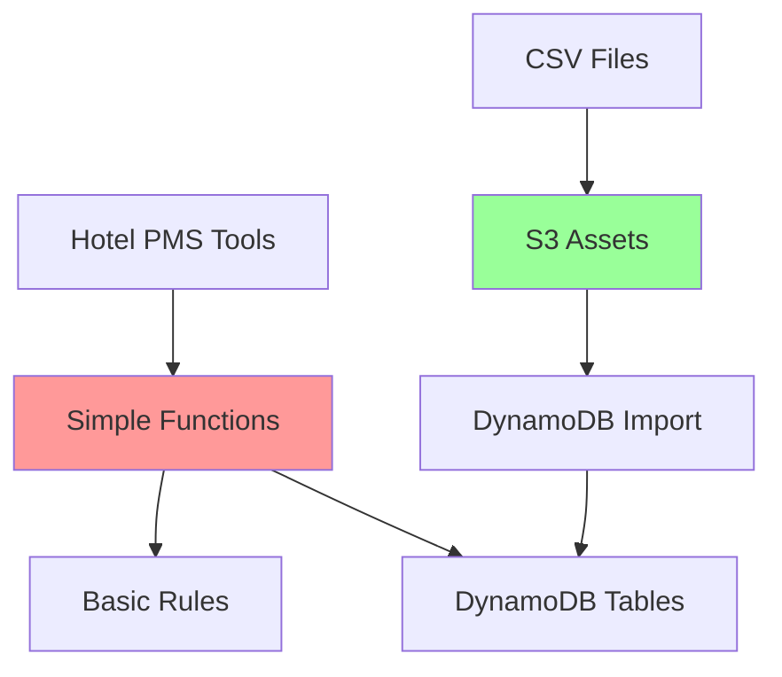

# Design Document

## Overview

The Simplified Hotel PMS Logic is a minimal demo implementation using hardcoded
data and simple rules. All logic is contained in basic Python functions with no
complex classes or patterns - just enough to simulate hotel operations for AI
agent demonstrations.

## Architecture

### Simple Demo Architecture



### Components

- **Simple Functions**: One function per tool, no classes
- **CDK Native Data Loading**: S3 assets + DynamoDB import_source for static
  data
- **Basic Rules**: Simple date checks and pricing math
- **DynamoDB Tables**: Static tables (with CSV import) + dynamic tables (empty)

## Components and Interfaces

### CDK Infrastructure Implementation

```python
# CDK construct for DynamoDB tables with native data import
from aws_cdk import (
    aws_dynamodb as dynamodb,
    aws_s3_assets as assets,
)

class HotelPMSDynamoDBConstruct(Construct):
    def __init__(self, scope: Construct, construct_id: str, **kwargs):
        super().__init__(scope, construct_id, **kwargs)

        # Create S3 assets for CSV data files
        self.hotels_asset = assets.Asset(
            self, "HotelsAsset",
            path="hotel_data/hotel_pms_data/hotels.csv"
        )

        self.room_types_asset = assets.Asset(
            self, "RoomTypesAsset",
            path="hotel_data/hotel_pms_data/room_types.csv"
        )

        self.rate_modifiers_asset = assets.Asset(
            self, "RateModifiersAsset",
            path="hotel_data/hotel_pms_data/rate_modifiers.csv"
        )

        # Create static tables with data import (using Table construct)
        self.hotels_table = dynamodb.Table(
            self, "HotelsTable",
            table_name="hotel-hotels",
            partition_key=dynamodb.Attribute(name="hotel_id", type=dynamodb.AttributeType.STRING),
            billing_mode=dynamodb.BillingMode.PAY_PER_REQUEST,
            removal_policy=RemovalPolicy.DESTROY,
            import_source=dynamodb.ImportSourceSpecification(
                input_format=dynamodb.InputFormat.csv(),
                bucket=self.hotels_asset.bucket,
                key_prefix=self.hotels_asset.s3_object_key
            )
        )

        self.room_types_table = dynamodb.Table(
            self, "RoomTypesTable",
            table_name="hotel-room-types",
            partition_key=dynamodb.Attribute(name="room_type_id", type=dynamodb.AttributeType.STRING),
            billing_mode=dynamodb.BillingMode.PAY_PER_REQUEST,
            removal_policy=RemovalPolicy.DESTROY,
            import_source=dynamodb.ImportSourceSpecification(
                input_format=dynamodb.InputFormat.csv(),
                bucket=self.room_types_asset.bucket,
                key_prefix=self.room_types_asset.s3_object_key
            )
        )

        self.rate_modifiers_table = dynamodb.Table(
            self, "RateModifiersTable",
            table_name="hotel-rate-modifiers",
            partition_key=dynamodb.Attribute(name="modifier_id", type=dynamodb.AttributeType.STRING),
            billing_mode=dynamodb.BillingMode.PAY_PER_REQUEST,
            removal_policy=RemovalPolicy.DESTROY,
            import_source=dynamodb.ImportSourceSpecification(
                input_format=dynamodb.InputFormat.csv(),
                bucket=self.rate_modifiers_asset.bucket,
                key_prefix=self.rate_modifiers_asset.s3_object_key
            )
        )

        # Create dynamic tables (using TableV2, no import source)
        self.reservations_table = dynamodb.TableV2(
            self, "ReservationsTable",
            table_name="hotel-reservations",
            partition_key=dynamodb.Attribute(name="reservation_id", type=dynamodb.AttributeType.STRING),
            billing=dynamodb.Billing.on_demand(),
            removal_policy=RemovalPolicy.DESTROY
        )

        self.requests_table = dynamodb.TableV2(
            self, "RequestsTable",
            table_name="hotel-requests",
            partition_key=dynamodb.Attribute(name="request_id", type=dynamodb.AttributeType.STRING),
            billing=dynamodb.Billing.on_demand(),
            removal_policy=RemovalPolicy.DESTROY
        )

    def get_environment_variables(self) -> dict:
        """Get environment variables for Lambda functions"""
        return {
            'HOTELS_TABLE_NAME': self.hotels_table.table_name,
            'ROOM_TYPES_TABLE_NAME': self.room_types_table.table_name,
            'RATE_MODIFIERS_TABLE_NAME': self.rate_modifiers_table.table_name,
            'RESERVATIONS_TABLE_NAME': self.reservations_table.table_name,
            'REQUESTS_TABLE_NAME': self.requests_table.table_name,
        }

# Runtime implementation using environment variables
def get_hotel(hotel_id):
    """Get hotel from DynamoDB"""
    import os
    dynamodb = boto3.resource('dynamodb')
    table_name = os.environ.get('HOTELS_TABLE_NAME', 'hotel-hotels')
    hotels_table = dynamodb.Table(table_name)
    response = hotels_table.get_item(Key={'hotel_id': hotel_id})
    return response.get('Item')

def get_room_type(room_type_id):
    """Get room type from DynamoDB"""
    import os
    dynamodb = boto3.resource('dynamodb')
    table_name = os.environ.get('ROOM_TYPES_TABLE_NAME', 'hotel-room-types')
    room_types_table = dynamodb.Table(table_name)
    response = room_types_table.get_item(Key={'room_type_id': room_type_id})
    return response.get('Item')

# Tool implementations
def check_availability(hotel_id, check_in_date, check_out_date, guests):
    """Simple availability check"""
    # Parse dates and check if 5th-7th of month
    check_in = datetime.strptime(check_in_date, "%Y-%m-%d")
    check_out = datetime.strptime(check_out_date, "%Y-%m-%d")

    # Check blackout dates (5th-7th of each month)
    current = check_in
    while current < check_out:
        if current.day in [5, 6, 7]:
            return {"available": False, "message": "Fully booked"}
        current += timedelta(days=1)

    return {
        "hotel_id": hotel_id,
        "available": True,
        "available_room_types": [
            {"room_type_id": "RT-STD", "available_rooms": 5, "base_rate": 150},
            {"room_type_id": "RT-SUP", "available_rooms": 3, "base_rate": 200},
            {"room_type_id": "RT-STE", "available_rooms": 1, "base_rate": 350}
        ]
    }

def generate_quote(hotel_id, room_type_id, check_in_date, check_out_date, guests):
    """Simple pricing calculation"""
    check_in = datetime.strptime(check_in_date, "%Y-%m-%d")
    check_out = datetime.strptime(check_out_date, "%Y-%m-%d")
    nights = (check_out - check_in).days

    room_type = get_room_type(room_type_id)
    base_rate = float(room_type["base_rate"])
    total = base_rate * nights * guests

    return {
        "hotel_id": hotel_id,
        "room_type_id": room_type_id,
        "nights": nights,
        "base_rate": base_rate,
        "total_cost": total
    }

def create_reservation(**kwargs):
    """Create demo reservation in DynamoDB"""
    import time
    confirmation_id = f"CONF-{int(time.time() * 1000)}"  # Simple timestamp-based ID

    reservation = {
        "reservation_id": confirmation_id,
        "status": "confirmed",
        "created_at": datetime.now().isoformat(),
        **kwargs
    }

    reservations_table.put_item(Item=reservation)
    return {"reservation_id": confirmation_id, "status": "confirmed"}

def get_hotels(limit=None):
    """Return hotels from DynamoDB"""
    response = hotels_table.scan()
    hotels = response['Items']

    if limit:
        hotels = hotels[:limit]

    return {"hotels": hotels, "total_count": len(hotels)}

# Other tools follow same simple pattern...
```

## Data Models

### DynamoDB Table Structure

```python
# Static Tables (populated via CDK import_source):
# - hotel-hotels: Static hotel data from hotels.csv
# - hotel-room-types: Static room type data from room_types.csv
# - hotel-rate-modifiers: Static rate modifier data from rate_modifiers.csv

# Dynamic Tables (created empty):
# - hotel-reservations: Dynamic reservation data
# - hotel-requests: Dynamic housekeeping/service requests

# Table schemas (CSV column names become DynamoDB attributes):
# hotel-hotels: hotel_id (PK), name, location, timezone, etc.
# hotel-room-types: room_type_id (PK), hotel_id, name, base_rate, etc.
# hotel-rate-modifiers: modifier_id (PK), modifier_type, value, etc.
# hotel-reservations: reservation_id (PK), hotel_id, guest_email, etc.
# hotel-requests: request_id (PK), hotel_id, room_number, etc.

# CDK Asset Structure:
# hotel_data/hotel_pms_data/hotels.csv -> S3 Asset -> DynamoDB Import
# hotel_data/hotel_pms_data/room_types.csv -> S3 Asset -> DynamoDB Import
# hotel_data/hotel_pms_data/rate_modifiers.csv -> S3 Asset -> DynamoDB Import
```

## Error Handling

### Simple Error Responses

```python
def handle_error(error_code, message):
    """Return simple error dict"""
    return {
        "error": True,
        "error_code": error_code,
        "message": message
    }

# Usage in functions:
hotel = get_hotel(hotel_id)
if not hotel:
    return handle_error("HOTEL_NOT_FOUND", f"Hotel {hotel_id} not found")
```

## Testing Strategy

### Basic Function Testing

```python
def test_availability():
    """Test basic availability function"""
    # Available dates
    result = check_availability("H-PVR-002", "2024-03-15", "2024-03-17", 2)
    assert result["available"] == True

    # Blackout dates
    result = check_availability("H-PVR-002", "2024-03-05", "2024-03-07", 2)
    assert result["available"] == False

def test_pricing():
    """Test basic pricing calculation"""
    result = generate_quote("H-PVR-002", "RT-STD", "2024-03-15", "2024-03-17", 2)
    assert result["total_cost"] == 150 * 2 * 2  # base_rate * nights * guests
```

This simplified design focuses purely on demo functionality with minimal code
complexity.
