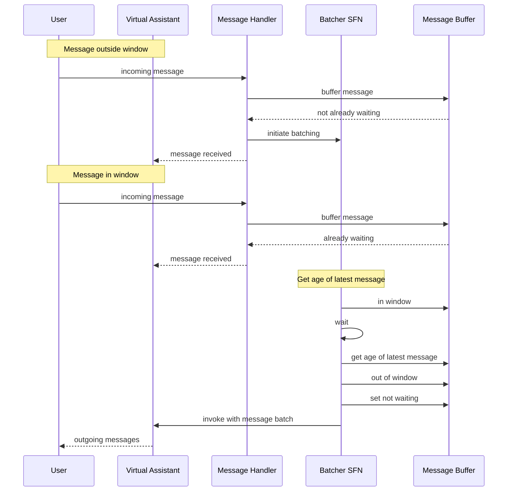
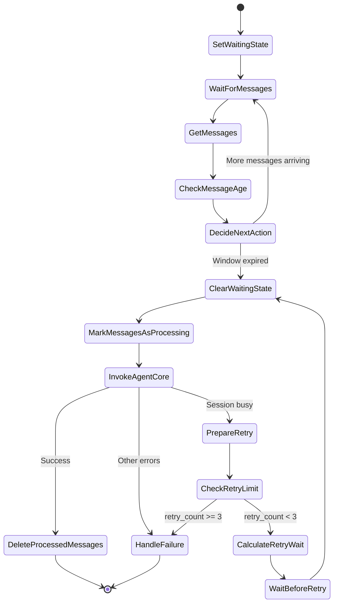

# Design Document: Step Functions Message Buffering

## Overview

This design implements a robust message buffering system using AWS Step
Functions to orchestrate the collection of multiple messages from the same
sender before processing them together in a single AgentCore Runtime invocation.
Step Functions provides deterministic batching with configurable timing and
retry logic using JSONata for data transformations, eliminating the need for
additional Lambda functions.

The design focuses on three main components:

1. **Message Handler Lambda** - Receives messages from SNS and manages workflow
   initiation
2. **Batcher Step Functions Workflow** - Orchestrates the buffering window using
   JSONata transformations
3. **DynamoDB Message Buffer** - Temporarily stores messages per user

## Architecture

### High-Level Flow

```
SNS Topic (WhatsApp messages)
    ↓
Message Handler Lambda
    ├─> Write message to DynamoDB
    ├─> Check if workflow waiting
    └─> Start workflow if not waiting
         ↓
Step Functions Workflow (with JSONata)
    ├─> Set waiting state
    ├─> Wait 2 seconds
    ├─> Get messages from DynamoDB
    ├─> Check message age (JSONata)
    ├─> Loop if messages still arriving
    └─> Invoke AgentCore when ready
         ↓
AgentCore Runtime
    ├─> Process combined messages
    └─> Send single response
```

### Detailed Workflow Diagram



### Step Functions State Machine Flow



### Message Buffering Strategy

The buffering strategy uses Step Functions with JSONata and a processing flag:

1. **Message arrives** → Lambda writes to DynamoDB with `processing = false`
2. **Check waiting state** → If no workflow, start one
3. **Workflow waits** → 2-second wait period
4. **Get messages** → Retrieve all messages from DynamoDB
5. **Check age with JSONata** → Calculate age of latest non-processing message
6. **Decision point**:
   - If latest message < 2 seconds old → Wait again
   - If latest message ≥ 2 seconds old → Mark messages as processing
7. **Mark as processing** → Update all non-processing messages to
   `processing = true`
8. **Invoke AgentCore** → Process combined messages
9. **On success** → Delete processed messages
10. **On session busy** → PrepareRetry: unmark messages, set waiting state to
    true, increment retry count
11. **Calculate wait** → 15s × (2 ^ retry_count) for exponential backoff
12. **Wait and retry** → Wait calculated time, then retry from ClearWaitingState
13. **On retry limit** → After 3 retries, mark messages as failed
14. **On other failure** → Messages stay in buffer with `processing = true`,
    mark as failed

## Components and Interfaces

### 1. Message Handler Lambda

**Purpose**: Receive messages from SNS and manage workflow initiation

**Interface**:

```python
def lambda_handler(event: dict[str, Any], context: LambdaContext) -> dict[str, Any]:
    """Handle incoming message from SNS.

    Args:
        event: SNS event containing message
        context: Lambda context

    Returns:
        Success response
    """
```

**Implementation Details**:

- Parse SNS message to extract MessageEvent (reuse existing parsing logic)
- Write message to DynamoDB buffer
- Atomically check and set waiting state
- Start Step Functions workflow if not waiting
- Return success (workflow runs asynchronously)

**DynamoDB Operations**:

```python
# Write message to buffer
dynamodb.update_item(
    TableName='message-buffer',
    Key={'user_id': user_id},
    UpdateExpression='SET messages = list_append(if_not_exists(messages, :empty), :msg), '
                    'session_id = if_not_exists(session_id, :session), '
                    'last_update_time = :time, '
                    'ttl = :ttl',
    ExpressionAttributeValues={
        ':empty': [],
        ':msg': [message_event.model_dump()],  # Store full MessageEvent
        ':session': conversation_id,
        ':time': current_time,
        ':ttl': int(current_time + 600)  # 10 minutes
    }
)

# Atomic check-and-set for waiting state
try:
    dynamodb.update_item(
        TableName='message-buffer',
        Key={'user_id': user_id},
        UpdateExpression='SET waiting_state = :true, workflow_execution_arn = :arn',
        ConditionExpression='attribute_not_exists(waiting_state) OR waiting_state = :false',
        ExpressionAttributeValues={
            ':true': True,
            ':false': False,
            ':arn': execution_arn
        }
    )
    # Start workflow with just user_id
    sfn_client.start_execution(
        stateMachineArn=state_machine_arn,
        input=json.dumps({'user_id': user_id})
    )
except ConditionalCheckFailedException:
    # Workflow already running, return success
    pass
```

### 2. Batcher Step Functions Workflow

**Purpose**: Orchestrate message buffering and batching using JSONata for
transformations and processing flag for retry safety

**State Machine Definition**: See `state-machine.json` for complete definition

**Key Design Decision - Processing Flag**:

To prevent message loss during retries, messages are marked with a `processing`
flag:

- New messages: `processing = false`
- Being processed: `processing = true`
- After success: Deleted from buffer
- After failure: Remain in buffer with `processing = true` for retry

This ensures that if AgentCore invocation fails and new messages arrive during
retry, the new messages are added to the buffer and will be processed in the
next batch after the current retry completes.

**Workflow States**:

1. **SetWaitingState** - Mark user as having active workflow
2. **WaitForMessages** - Wait 2 seconds for more messages
3. **GetMessages** - Retrieve buffer from DynamoDB (non-destructive)
4. **CheckMessageAge** - Use JSONata to check age of non-processing messages
   only
5. **DecideNextAction** - Loop if messages still arriving
6. **ClearWaitingState** - Mark user as not waiting
7. **MarkMessagesAsProcessing** - Set `processing = true` on non-processing
   messages
8. **InvokeAgentCore** - Invoke AgentCore (combines content internally)
9. **DeleteProcessedMessages** - Delete messages where `processing = true`
   (success path)
10. **PrepareRetry** - Unmark messages and reset waiting state before retry
    (session busy path)
11. **CheckRetryLimit** - Check if retry count < 3
12. **CalculateRetryWait** - Calculate wait time (15s, 30s, 60s)
13. **WaitBeforeRetry** - Wait before retrying from ClearWaitingState
14. **HandleFailure** - Mark messages as failed (failure path, messages stay in
    buffer)

**Complete state machine definition**: See `state-machine.json`

**Workflow Input**:

```json
{
  "user_id": "string"
}
```

**Note**: The workflow retrieves session_id and messages from DynamoDB. JSONata
expressions filter by processing flag and transform data.

### 3. Mark Messages As Processing Lambda

**Purpose**: Mark non-processing messages as processing before AgentCore
invocation

**Interface**:

```python
def lambda_handler(event: dict[str, Any], context: LambdaContext) -> dict[str, Any]:
    """Mark messages as processing.

    Args:
        event: Contains user_id, messages
        context: Lambda context

    Returns:
        {
            "processing_messages": list[dict],  # Messages marked as processing
            "message_count": int
        }
    """
```

**Implementation Details**:

```python
# Get all non-processing messages
non_processing = [msg for msg in event['messages'] if not msg.get('processing', False)]

# Mark them as processing in DynamoDB
# This requires updating each message in the list
# Use a Lambda function to handle the complex update logic

# Return the messages that were marked
return {
    'processing_messages': non_processing,
    'message_count': len(non_processing)
}
```

### 4. Delete Processed Messages Lambda

**Purpose**: Delete messages marked as processing after successful AgentCore
invocation

**Interface**:

```python
def lambda_handler(event: dict[str, Any], context: LambdaContext) -> dict[str, Any]:
    """Delete processed messages.

    Args:
        event: Contains user_id, message_ids
        context: Lambda context

    Returns:
        Success response
    """
```

**Implementation Details**:

```python
# Get current buffer
response = dynamodb.get_item(
    TableName='message-buffer',
    Key={'user_id': user_id}
)

if 'Item' not in response:
    # Buffer already cleaned up
    return {'status': 'already_deleted'}

# Filter out processed messages
messages = response['Item']['messages']
remaining_messages = [msg for msg in messages if not msg.get('processing', False)]

if remaining_messages:
    # Update buffer with only non-processed messages
    dynamodb.update_item(
        TableName='message-buffer',
        Key={'user_id': user_id},
        UpdateExpression='SET messages = :msgs',
        ExpressionAttributeValues={':msgs': remaining_messages}
    )
else:
    # No remaining messages, delete the buffer entry
    dynamodb.delete_item(
        TableName='message-buffer',
        Key={'user_id': user_id}
    )

return {'status': 'success', 'deleted_count': len(messages) - len(remaining_messages)}
```

### 5. Invoke AgentCore Lambda

**Purpose**: Invoke AgentCore Runtime with combined messages

**Interface**:

```python
def lambda_handler(event: dict[str, Any], context: LambdaContext) -> dict[str, Any]:
    """Invoke AgentCore with message batch.

    Args:
        event: Contains marked_messages (with processing=true), session_id, user_id
        context: Lambda context

    Returns:
        Success response

    Raises:
        AgentCoreSessionBusyError: If session is busy (triggers retry via PrepareRetry)
    """
```

**Implementation Details**:

```python
# Extract processing messages from marked_messages
processing_messages = event['marked_messages']['processing_messages']

# Combine content
combined_content = '\n'.join([msg['content'] for msg in processing_messages])

# Extract message IDs
message_ids = [msg['message_id'] for msg in processing_messages]

# Mark all messages as delivered
for message_id in message_ids:
    await platform_router.update_message_status(message_id, 'delivered')

# Create AgentCore invocation request (reuse existing model)
request = AgentCoreInvocationRequest(
    prompt=combined_content,
    actorId=event['user_id'],
    messageIds=message_ids,
    conversationId=event['session_id'],
    modelId=os.environ.get('BEDROCK_MODEL_ID'),
    temperature=float(os.environ.get('MODEL_TEMPERATURE', '0.2'))
)

# Invoke AgentCore (reuse existing client)
try:
    agentcore_client = AgentCoreClient()
    response = agentcore_client.invoke_agent(request)

    if not response.success:
        # Check if session busy
        if 'concurrent' in str(response.error).lower():
            raise AgentCoreSessionBusyError("Session is busy")
        else:
            raise Exception(f"AgentCore invocation failed: {response.error}")

    return {'status': 'success'}

except AgentCoreSessionBusyError:
    # This will trigger PrepareRetry state
    raise
```

### 6. Prepare Retry Lambda

**Purpose**: Unmark messages and reset waiting state before retry

**Interface**:

```python
def lambda_handler(event: dict[str, Any], context: LambdaContext) -> dict[str, Any]:
    """Prepare for retry after session busy error.

    Args:
        event: Contains user_id, retry_count
        context: Lambda context

    Returns:
        {
            "retry_count": int  # Incremented retry count
        }
    """
```

**Implementation Details**:

```python
# Get current buffer
response = dynamodb.get_item(
    TableName='message-buffer',
    Key={'user_id': user_id}
)

if 'Item' not in response:
    return {'retry_count': retry_count + 1}

# Get messages
messages = response['Item']['messages']

# Unmark all processing messages
updated_messages = []
for msg in messages:
    msg['processing'] = False
    updated_messages.append(msg)

# Update buffer: unmark messages and set waiting state to true
dynamodb.update_item(
    TableName='message-buffer',
    Key={'user_id': user_id},
    UpdateExpression='SET messages = :msgs, waiting_state = :true',
    ExpressionAttributeValues={
        ':msgs': updated_messages,
        ':true': True
    }
)

return {'retry_count': retry_count + 1}
```

## Data Models

### Reused Models from chat-message-batching

The following models are already implemented and will be reused:

- **MessageEvent** (`virtual_assistant_common.models.messaging`) - Represents a
  single message
- **MessageGroup** (`virtual_assistant_common.models.messaging`) - Lightweight
  wrapper for grouped messages
- **AgentCoreInvocationRequest** (`virtual_assistant_common.models.messaging`) -
  Request model with messageIds list
- **AgentCoreClient**
  (`virtual_assistant_messaging_lambda.services.agentcore_client`) - Client for
  invoking AgentCore

### DynamoDB Message Buffer Schema

**Table Name**: `message-buffer`

**Primary Key**: `user_id` (String, partition key)

**Attributes**:

```python
{
    'user_id': str,              # Partition key (phone number or sender_id)
    'messages': list[dict],      # List of message objects with processing flag
    'session_id': str,           # AgentCore session ID (conversation_id)
    'last_update_time': float,   # Timestamp of latest message
    'waiting_state': bool,       # Whether workflow is active
    'workflow_execution_arn': str,  # ARN of active workflow
    'ttl': int                   # TTL for automatic cleanup (10 minutes)
}
```

**Message Object Structure**:

```python
{
    **MessageEvent.model_dump(),  # All MessageEvent fields
    'processing': bool            # Whether message is being processed
}
```

**Note**: Messages are stored as full MessageEvent objects with an additional
`processing` flag. New messages have `processing = false`. When the workflow is
ready to invoke AgentCore, it marks messages as `processing = true`. On success,
processed messages are deleted. On failure, they remain with `processing = true`
for retry.

## Correctness Properties

_A property is a characteristic or behavior that should hold true across all
valid executions of a system-essentially, a formal statement about what the
system should do. Properties serve as the bridge between human-readable
specifications and machine-verifiable correctness guarantees._

### Property 1: Message Buffer Write

_For any_ incoming message, the Message Handler Lambda should write it to the
DynamoDB buffer with all required fields.

**Validates: Requirements 1.2**

### Property 2: Waiting State Check

_For any_ incoming message, the Message Handler Lambda should check the user's
waiting state in DynamoDB before starting a workflow.

**Validates: Requirements 1.3, 7.1**

### Property 3: Conditional Workflow Start

_For any_ user with no waiting workflow, the Message Handler Lambda should set
the waiting state and start a new Step Functions execution.

**Validates: Requirements 1.4, 7.3**

### Property 4: No Duplicate Workflows

_For any_ user with an active waiting workflow, the Message Handler Lambda
should not start a new workflow.

**Validates: Requirements 1.5, 7.2**

### Property 5: Waiting State Atomicity

_For any_ concurrent message arrivals for the same user, only one Lambda should
successfully set the waiting state and start a workflow.

**Validates: Requirements 7.4**

### Property 6: Workflow Sets Waiting State

_For any_ Step Functions workflow execution, the workflow should set the user's
waiting state to true at the start.

**Validates: Requirements 2.1**

### Property 7: Message Age Check with JSONata

_For any_ workflow after the wait period, the workflow should use JSONata to
calculate if more messages are still arriving.

**Validates: Requirements 2.3, 3.1**

### Property 8: Conditional Wait Loop

_For any_ workflow where the latest message age is less than the buffering
window, the workflow should wait again.

**Validates: Requirements 2.5, 3.2**

### Property 9: Processing Decision

_For any_ workflow where the latest message age exceeds the buffering window,
the workflow should proceed to invoke AgentCore.

**Validates: Requirements 3.3**

### Property 10: Waiting State Cleared Before Processing

_For any_ workflow ready to process messages, the workflow should clear the
user's waiting state before retrieving messages.

**Validates: Requirements 3.4**

### Property 11: Messages Marked as Processing

_For any_ workflow ready to invoke AgentCore, all non-processing messages should
be marked with `processing = true` before invocation.

**Validates: Requirements 4.1**

### Property 12: Delete Only After Success

_For any_ successful AgentCore invocation, only messages with
`processing = true` should be deleted from the buffer.

**Validates: Requirements 4.5**

### Property 13: Messages Retained on Failure

_For any_ failed AgentCore invocation, messages with `processing = true` should
remain in the buffer for retry.

**Validates: Requirements 4.5**

### Property 14: Message Content Combination with JSONata

_For any_ set of messages marked as processing, JSONata should combine the
content with newline separators.

**Validates: Requirements 4.3**

### Property 15: Message ID Collection with JSONata

_For any_ set of messages marked as processing, JSONata should extract all
message IDs for status tracking.

**Validates: Requirements 4.4**

### Property 16: Combined Content Passed to AgentCore

_For any_ AgentCore invocation, the combined message content from processing
messages should be passed as the prompt.

**Validates: Requirements 5.1**

### Property 17: Message IDs Passed to AgentCore

_For any_ AgentCore invocation, all message IDs from processing messages should
be passed for status tracking.

**Validates: Requirements 5.2**

### Property 18: Session ID Used

_For any_ AgentCore invocation, the user's session_id should be used as the
conversation identifier.

**Validates: Requirements 5.3**

### Property 19: Workflow Completes on Success

_For any_ successful AgentCore invocation, the workflow should delete processed
messages and complete successfully.

**Validates: Requirements 5.4**

### Property 20: Retry on Failure

_For any_ failed AgentCore invocation, the workflow should retry according to
the retry policy (15s, 30s, 60s) without deleting messages.

**Validates: Requirements 5.5**

### Property 21: Delivered Status

_For any_ message being processed, it should be marked as "delivered" before
AgentCore invocation.

**Validates: Requirements 8.1**

### Property 22: TTL Set on Buffer Entries

_For any_ buffer entry created or updated, the TTL should be set to 10 minutes
from the current time.

**Validates: Requirements 9.1**

### Property 23: Independent Workflows Per User

_For any_ two different users sending messages simultaneously, each should have
an independent workflow execution.

**Validates: Requirements 11.1**

### Property 24: Single Workflow Per User

_For any_ single user sending multiple messages, only one workflow should be
active at a time.

**Validates: Requirements 11.2**

### Property 25: Waiting State Cleared on Completion

_For any_ workflow that completes (success or failure), the user's waiting state
should be cleared.

**Validates: Requirements 7.5**

## Error Handling

### AgentCore Session Busy

- **Scenario**: AgentCore Runtime is processing another invocation for the same
  session
- **Handling**:
  - Lambda raises `AgentCoreSessionBusyError`
  - Step Functions retry policy triggers
  - First retry: 15 seconds wait
  - Second retry: 30 seconds wait (15 \* 2.0 backoff)
  - Third retry: 60 seconds wait (30 \* 2.0 backoff)
  - After 3 retries: Send to dead letter queue

### Message Parsing Errors

- **Scenario**: Invalid message format from SNS
- **Handling**:
  - Lambda logs error with message details
  - Lambda returns success (don't retry invalid messages)
  - Message is not buffered

### DynamoDB Errors

- **Scenario**: DynamoDB throttling or service errors
- **Handling**:
  - Lambda raises exception
  - SNS retries Lambda invocation (default: 2 retries)
  - After retries: Message goes to Lambda DLQ

### Workflow Timeout

- **Scenario**: Workflow runs longer than expected
- **Handling**:
  - Step Functions timeout (configured to 5 minutes)
  - Workflow fails and goes to DLQ
  - Waiting state remains set (cleaned up by TTL)

## Testing Strategy

### Unit Tests

1. **Message Handler Lambda**:
   - Test message parsing (reuse existing tests)
   - Test DynamoDB write operations
   - Test waiting state check logic
   - Test workflow start conditions

2. **Invoke AgentCore Lambda**:
   - Test AgentCore invocation (reuse existing tests)
   - Test error handling
   - Test retry logic

3. **JSONata Expressions**:
   - Test message age calculation
   - Test content combination
   - Test ID extraction

### Property-Based Tests

Each correctness property should be implemented as a property-based test with
minimum 100 iterations. Tests should:

- Generate random messages with varying timestamps
- Generate random user IDs
- Verify properties hold across all generated inputs
- Use appropriate generators for message content and metadata

### Integration Tests

1. **End-to-End Workflow**:
   - Send multiple messages for same user
   - Verify workflow starts once
   - Verify messages are batched
   - Verify AgentCore invocation

2. **Concurrent Users**:
   - Send messages for multiple users simultaneously
   - Verify independent workflows
   - Verify no cross-user interference

3. **Retry Scenarios**:
   - Simulate AgentCore session busy
   - Verify retry timing (15s, 30s, 60s)
   - Verify eventual success

## Performance Considerations

### Latency

- **First message**: ~2 seconds (buffering window)
- **Subsequent messages**: Included in same batch if within window
- **Total latency**: 2-4 seconds depending on message timing

### Cost

- **Lambda invocations**: 1 per message + 1 per workflow (AgentCore invocation)
- **Step Functions**: 1 workflow per message group (~8-10 state transitions)
- **DynamoDB**: 2-3 operations per message
- **Estimated cost**: ~$0.00008 per message group

### Scalability

- **Concurrent users**: Unlimited (independent workflows)
- **Messages per user**: Unlimited (DynamoDB item size: 400KB)
- **Workflow concurrency**: Step Functions default: 1000 concurrent executions

## Deployment Considerations

### CDK Configuration

**Step Functions State Machine**:

```python
state_machine = sfn.StateMachine(
    self, "BatcherStateMachine",
    definition_body=sfn.DefinitionBody.from_file("state-machine.json"),
    timeout=Duration.minutes(5),
    tracing_enabled=True
)
```

**Lambda Functions**:

```python
message_handler = _lambda.Function(
    self, "MessageHandler",
    runtime=_lambda.Runtime.PYTHON_3_14,
    handler="handler.lambda_handler",
    timeout=Duration.seconds(30),
    memory_size=128,
    environment={
        'MESSAGE_BUFFER_TABLE': buffer_table.table_name,
        'BATCHER_STATE_MACHINE_ARN': state_machine.state_machine_arn
    }
)
```

**DynamoDB Table**:

```python
buffer_table = dynamodb.Table(
    self, "MessageBuffer",
    partition_key=dynamodb.Attribute(
        name="user_id",
        type=dynamodb.AttributeType.STRING
    ),
    billing_mode=dynamodb.BillingMode.PAY_PER_REQUEST,
    time_to_live_attribute="ttl",
    point_in_time_recovery=True
)
```

### Environment Variables

- `BUFFERING_WINDOW_SECONDS`: Buffering window duration (default: 2)
- `MESSAGE_BUFFER_TABLE`: DynamoDB table name
- `BATCHER_STATE_MACHINE_ARN`: Step Functions ARN
- `BEDROCK_MODEL_ID`: AgentCore model ID (reused)
- `MODEL_TEMPERATURE`: Model temperature (reused)

## Migration Strategy

### Phase 1: Deploy Infrastructure

- Deploy DynamoDB table
- Deploy Lambda functions (reuse existing AgentCore client)
- Deploy Step Functions workflow with JSONata
- Configure SNS subscription

### Phase 2: Test with Subset

- Route small percentage of traffic to new system
- Monitor metrics and logs
- Verify message batching works correctly
- Verify JSONata transformations work

### Phase 3: Full Rollout

- Route all traffic to new system
- Remove old SQS-based infrastructure
- Monitor for issues

### Phase 4: Optimize

- Tune buffering window based on metrics
- Adjust retry timing if needed
- Optimize Lambda memory/timeout settings
