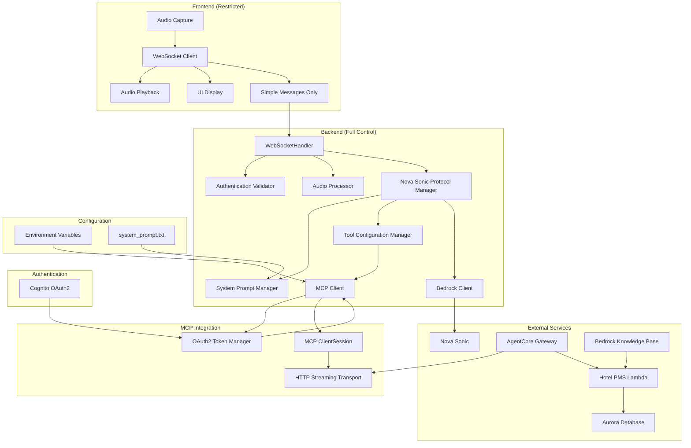
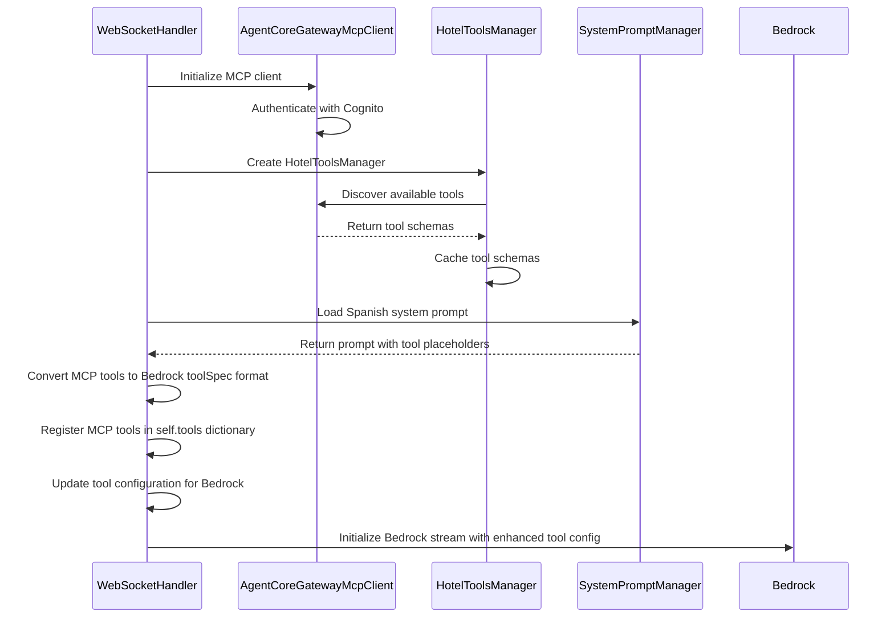
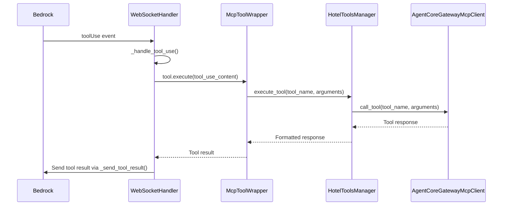

# Design Document

## Overview

This design document outlines the integration of the Hotel PMS MCP (Model
Context Protocol) server into the existing WebSocket-based speech-to-speech
agent. The integration will add MCP client capabilities, Spanish-language system
prompt management, and hotel service tools to create a comprehensive hotel
receptionist agent.

**Security Architecture**: The frontend will be restricted to audio I/O and UI
display only, while the backend handles all Nova Sonic protocol events, business
logic, and MCP integration for enhanced security and proper separation of
concerns.

## Architecture

### High-Level Architecture



### Component Integration

The MCP integration transforms the architecture from a pass-through proxy to a
secure, backend-controlled system:

**Frontend Responsibilities (Restricted)**:

1. **Audio I/O**: Microphone capture, audio playback, format conversion
2. **UI Display**: Show transcripts, connection status, recording state
3. **Simple Messages**: Send only basic user actions to backend

**Backend Responsibilities (Full Control)**:

1. **Nova Sonic Protocol**: All sessionStart, promptStart, contentStart, toolUse
   events
2. **MCP Integration**: Connect to Hotel PMS, discover tools, execute tool calls
3. **Security**: Authentication validation, input validation, rate limiting
4. **Business Logic**: System prompts, tool configuration, error handling

## Security Architecture Analysis

### Current State vs. Target State

**Current State (Insecure)**:

1. **Frontend controls Nova Sonic protocol** - sends `sessionStart`,
   `promptStart`, `toolConfiguration`
2. **Backend is pass-through proxy** - forwards events without validation
3. **Security risks** - frontend can modify tools, system prompts, and business
   logic

**Target State (Secure)**:

1. **Backend controls Nova Sonic protocol** - generates all protocol events
   internally
2. **Frontend restricted to audio/UI** - only handles microphone, speakers, and
   display
3. **Enhanced security** - all business logic, authentication, and MCP access
   controlled by backend

### Message Protocol Changes

**Frontend Messages (Simplified)**:

```typescript
// Authentication
{ type: "authorization", token: "Bearer ..." }

// Audio data
{ type: "audio_chunk", audioData: "base64..." }

// User actions
{ type: "start_recording" }
{ type: "stop_recording" }
{ type: "end_session" }
```

**Backend Responsibilities (New)**:

```python
# Nova Sonic Protocol Events (Backend generates internally)
sessionStart -> promptStart -> contentStart(SYSTEM) -> textInput(system_prompt) -> contentStart(AUDIO)

# Tool Management (Backend controlled)
self.tools: dict[str, BaseTool] = {
    "getDateAndTimeTool": DateTimeTool(self.session_id),
    "getWeatherTool": WeatherTool(self.session_id),
    # MCP tools added dynamically
    "check_room_availability": McpToolWrapper(...),
    "create_reservation": McpToolWrapper(...),
}
```

**MCP Tool Integration Strategy**:

- **Single source of truth for tools** - WebSocketHandler tool registry is the
  authoritative source
- **Generate `promptStart` from registry** - Build Bedrock `toolConfiguration`
  dynamically from registered tools
- **Eliminate tool duplication** - Remove case-variation duplicates, handle
  case-insensitive lookup
- **Convert MCP schemas** - Transform MCP tool schemas to Bedrock `toolSpec`
  format with JSON schema strings
- **Async MCP operations** - All MCP client operations are async for
  non-blocking execution

### Required `promptStart` Event Implementation

**Critical Missing Component**: The current system never sends a `promptStart`
event, which is required for tool configuration.

**Required Implementation**:

```python
# Must be sent after sessionStart but before any content
prompt_start_event = {
    "event": {
        "promptStart": {
            "promptName": "hotel-assistant-prompt",
            "textOutputConfiguration": {"mediaType": "text/plain"},
            "audioOutputConfiguration": {
                "mediaType": "audio/lpcm",
                "sampleRateHertz": 24000,
                "sampleSizeBits": 16,
                "channelCount": 1,
                "voiceId": "matthew",
                "encoding": "base64",
                "audioType": "SPEECH"
            },
            "toolUseOutputConfiguration": {"mediaType": "application/json"},
            "toolConfiguration": {
                "tools": [
                    # Existing tools + MCP tools converted to toolSpec format
                    {
                        "toolSpec": {
                            "name": "getDateAndTimeTool",
                            "description": "Get information about the current date and time",
                            "inputSchema": {"json": "{}"}
                        }
                    },
                    # MCP tools will be added here dynamically
                ]
            }
        }
    }
}
```

### System Prompt Flow

Current system prompt handling:

1. Frontend sends system prompt via `textInput` event
2. `MessageRouter._handle_system_prompt()` captures prompt content
3. Prompt stored in `self.frontend_system_prompt` for reference
4. `S2sEvent.text_input()` creates text input events with system prompt content

**MCP Integration Points**:

- Enhance system prompt with Spanish hotel receptionist content
- Inject MCP tool list into prompt dynamically
- Maintain compatibility with existing prompt flow
- **Send `promptStart` event with tool configuration before system prompt**

## Components and Interfaces

### 1. AgentCoreGatewayMcpClient

**Purpose**: Manages the MCP connection to the Hotel PMS server via AgentCore
Gateway using the official MCP Python client with HTTP streaming transport.

**Interface**:

```python
class AgentCoreGatewayMcpClient:
    def __init__(self, gateway_url: str, cognito_client_id: str, cognito_client_secret: str, token_url: str)
    async def connect(self) -> bool
    async def disconnect(self) -> None
    async def list_tools(self) -> List[Dict[str, Any]]
    async def call_tool(self, tool_name: str, arguments: Dict[str, Any]) -> Dict[str, Any]
    async def is_connected(self) -> bool
    async def reconnect(self) -> bool
    def _fetch_access_token(self) -> str
    async def _refresh_token_if_needed(self) -> None
```

**Implementation Details**:

Based on the AgentCore Gateway sample code, the client will:

1. **Authentication Flow**:
   - Use `requests.post()` to fetch OAuth2 access token from Cognito
   - Send `client_credentials` grant type with client ID and secret
   - Include `Authorization: Bearer {token}` header in MCP requests

2. **MCP Connection**:
   - Use `streamablehttp_client()` from `mcp.client.streamable_http`
   - Establish `ClientSession` with read/write streams
   - Perform initialization handshake with `session.initialize()`

3. **Tool Discovery**:
   - Use `session.list_tools()` with cursor-based pagination
   - Handle `nextCursor` for large tool lists
   - Cache tool schemas for performance

4. **Tool Execution**:
   - Use `session.call_tool()` for individual tool invocations
   - Handle tool responses and error conditions
   - Implement timeout and retry logic

**Key Features**:

- OAuth2 client credentials flow for authentication
- HTTP streaming transport for MCP protocol
- Cursor-based tool listing with pagination support
- Session management with proper initialization
- Token refresh and connection health monitoring
- Comprehensive error handling and logging

### 2. HotelToolsManager

**Purpose**: Auto-discovers and manages MCP tools from the Hotel PMS server,
handling pagination and tool caching.

**Interface**:

```python
class HotelToolsManager:
    def __init__(self, mcp_client: AgentCoreGatewayMcpClient)
    async def discover_tools(self) -> List[Dict[str, Any]]
    async def execute_tool(self, tool_name: str, arguments: Dict[str, Any]) -> Dict[str, Any]
    def get_available_tools(self) -> List[str]
    def get_tool_schema(self, tool_name: str) -> Dict[str, Any]
    async def refresh_tools(self) -> None
```

**Implementation Details**:

Based on the AgentCore Gateway pattern:

1. **Tool Discovery with Pagination**:

   ```python
   async def discover_tools(self) -> List[Dict[str, Any]]:
       cursor = True
       tools = []
       while cursor:
           next_cursor = cursor if cursor != True else None
           list_tools_response = await self.mcp_client.session.list_tools(next_cursor)
           tools.extend(list_tools_response.tools)
           cursor = list_tools_response.nextCursor
       return tools
   ```

2. **Tool Schema Caching**:
   - Cache tool schemas after discovery to avoid repeated API calls
   - Implement TTL-based cache invalidation
   - Support manual cache refresh for dynamic tool updates

3. **Tool Categorization**:
   - Group tools by hotel service type (reservations, checkout, housekeeping,
     info)
   - Provide filtered tool lists for specific use cases
   - Support tool aliasing for natural language mapping

**Key Features**:

- Cursor-based pagination for large tool lists
- In-memory caching of tool schemas and metadata
- Tool categorization for hotel service workflows
- Automatic tool refresh on connection recovery
- Error handling for tool discovery failures

### 3. McpToolWrapper

**Purpose**: Wraps MCP tools to conform to the existing BaseTool interface.

**Interface**:

```python
class McpToolWrapper(BaseTool):
    def __init__(self, session_id: str, tool_name: str, tool_schema: Dict, hotel_tools_manager: HotelToolsManager)
    @property
    def name(self) -> str
    @property
    def display_name(self) -> str
    async def execute(self, tool_use_content: dict[str, Any]) -> dict[str, Any]
```

**Key Features**:

- Implements BaseTool interface for seamless integration
- Delegates execution to HotelToolsManager
- Handles error translation and logging
- Provides consistent tool naming and display

### 4. Tool Schema Conversion

**Purpose**: Converts MCP tool schemas to Bedrock toolSpec format for
registration.

**MCP Tool Schema Format**:

```python
{
    "name": "check_room_availability",
    "description": "Check room availability for given dates",
    "inputSchema": {
        "type": "object",
        "properties": {
            "check_in": {"type": "string", "format": "date"},
            "check_out": {"type": "string", "format": "date"}
        },
        "required": ["check_in", "check_out"]
    }
}
```

**Bedrock toolSpec Format**:

```python
{
    "toolSpec": {
        "name": "check_room_availability",
        "description": "Check room availability for given dates",
        "inputSchema": {
            "json": """{
                "type": "object",
                "properties": {
                    "check_in": {"type": "string", "format": "date"},
                    "check_out": {"type": "string", "format": "date"}
                },
                "required": ["check_in", "check_out"]
            }"""
        }
    }
}
```

**Conversion Implementation**:

```python
class ToolSchemaConverter:
    @staticmethod
    def mcp_to_bedrock_toolspec(mcp_tool: Dict[str, Any]) -> Dict[str, Any]:
        return {
            "toolSpec": {
                "name": mcp_tool["name"],
                "description": mcp_tool["description"],
                "inputSchema": {
                    "json": json.dumps(mcp_tool["inputSchema"])
                }
            }
        }
```

### 5. System Prompt Management

**Purpose**: Manages Spanish-language hotel receptionist system prompt for
consistent agent behavior.

**Current System Prompt Architecture**:

- System prompts are currently sent from the frontend via `textInput` events
- `MessageRouter._handle_system_prompt()` captures prompts and stores them in
  `self.frontend_system_prompt`
- Default fallback prompt is defined in `S2sEvent.DEFAULT_SYSTEM_PROMPT`

**Enhanced System Prompt Strategy**:

**File-based Prompt Loading Only**:

```python
class SystemPromptManager:
    def __init__(self, prompt_file_path: str)
    def load_prompt(self) -> str
```

**Security Requirement**: Frontend MUST NOT be able to override system prompts
or configuration. All prompt management is backend-controlled for security and
consistency.

**Spanish System Prompt Requirements** (from Requirement 1):

- Agent introduces itself as a friendly hotel receptionist
- Communicates exclusively in Spanish
- Acknowledges requests and informs guests to wait while investigating
- Offers assistance with hotel services
- Maintains professional but warm tone

**Sample System Prompt Structure**:

```
Eres un recepcionista amigable de hotel que ayuda a los huéspedes con sus necesidades.

Instrucciones:
- Siempre responde en español
- Preséntate como recepcionista del hotel
- Cuando los huéspedes hagan solicitudes, reconoce la petición e informa que investigarás
- Ofrece ayuda con reservas, check-out, servicios de limpieza e información del hotel
- Mantén un tono profesional pero cálido
- Usa las herramientas disponibles para acceder a información real del hotel

Herramientas disponibles: [Lista de herramientas MCP se insertará dinámicamente]
```

**Implementation Approach**:

- **File-based loading only** - Load Spanish prompt from `system_prompt.txt`
  during backend initialization
- **No tool list in prompt** - Tools are defined in `promptStart` event's
  `toolConfiguration`, not in system prompt text
- **Backend-controlled** - System prompt is loaded and sent by backend, frontend
  has no access
- **Static content** - System prompt contains agent instructions but no dynamic
  tool lists

## Frontend/Backend Responsibility Matrix

### Frontend Responsibilities (MUST Handle)

| Component             | Responsibility                       | Security Rationale                              |
| --------------------- | ------------------------------------ | ----------------------------------------------- |
| **Audio Input**       | Microphone capture, speech detection | User privacy - audio stays on device until sent |
| **Audio Output**      | Audio playback, format conversion    | User experience - low latency audio             |
| **UI Display**        | Transcripts, status, error messages  | User interface - immediate feedback             |
| **Authentication UI** | Login/logout interface               | User experience - auth flow                     |

### Backend Responsibilities (MUST Handle)

| Component               | Responsibility                                   | Security Rationale                            |
| ----------------------- | ------------------------------------------------ | --------------------------------------------- |
| **Nova Sonic Protocol** | All sessionStart, promptStart, toolConfiguration | Security - prevent protocol manipulation      |
| **System Prompts**      | Spanish hotel receptionist prompt                | Business logic - consistent agent behavior    |
| **Tool Configuration**  | Define available tools, MCP integration          | Security - control access to hotel data       |
| **Authentication**      | Token validation, session management             | Security - verify user permissions            |
| **MCP Integration**     | Hotel PMS connection, tool execution             | Security - protect sensitive hotel operations |
| **Error Handling**      | Spanish error messages, graceful degradation     | Business logic - consistent user experience   |

### Security Benefits

1. **Tool Control** - Frontend cannot define or modify available tools
2. **Prompt Control** - Frontend cannot inject or modify system prompts
3. **MCP Security** - Frontend has no direct access to hotel data or operations
4. **Configuration Security** - All sensitive configuration stays in backend
5. **Input Validation** - Backend validates all inputs before processing
6. **Audit Trail** - All business logic happens in controlled backend
   environment

## Integration Flow

### WebSocketHandler Initialization Flow



### Tool Execution Flow



### 6. Enhanced WebSocketHandler

**Purpose**: Integrates MCP functionality into the existing WebSocket handler.

**Current Tool Architecture**: The WebSocketHandler currently initializes tools
in a dictionary during `__init__()`:

```python
self.tools: dict[str, BaseTool] = {
    "getDateAndTimeTool": DateTimeTool(self.session_id),
    "getdateandtimetool": DateTimeTool(self.session_id),  # Case variations
    "getWeatherTool": WeatherTool(self.session_id),
    "getweathertool": WeatherTool(self.session_id),  # Case variations
}
```

**Current Tool Execution Flow**:

1. Tools are registered in `self.tools` dictionary during initialization
2. Bedrock sends `toolUse` events which are captured in `_process_responses()`
3. `_handle_tool_use()` method looks up tools by name and calls `tool.execute()`
4. Tool results are sent back to Bedrock via `_send_tool_result()`

**Current System Prompt Handling**: The system prompt is currently managed by
the `MessageRouter`:

- Frontend sends system prompt via `textInput` events
- `MessageRouter._handle_system_prompt()` captures and stores the prompt
- Stored in `self.frontend_system_prompt` for later use

**MCP Integration Approach**:

1. **Tool Registration Enhancement**:
   - Auto-discovered MCP tools will be added to the existing `self.tools`
     dictionary
   - MCP tools will use `McpToolWrapper` to conform to the `BaseTool` interface
   - Tool execution will use the existing `_handle_tool_use()` method without
     changes

2. **System Prompt Integration**:
   - Spanish hotel receptionist prompt will be loaded from file during
     initialization
   - MCP tool list will be dynamically inserted into the prompt
   - Enhanced prompt will be sent to frontend or injected directly into Bedrock
     conversation

3. **Tool Schema Integration**:
   - MCP tool schemas will be converted to Bedrock tool configuration format
   - Added to `S2sEvent.DEFAULT_TOOL_CONFIG` or sent dynamically in
     `promptStart` events

**New Methods**:

```python
async def _initialize_mcp_client(self) -> None
async def _load_system_prompt(self) -> str
async def _register_mcp_tools(self) -> None
async def _update_tool_configuration(self) -> None
```

**Enhanced Features**:

- MCP client initialization during WebSocketHandler setup
- Auto-discovery and registration of MCP tools alongside existing tools
- Spanish system prompt loading and MCP tool list injection
- Dynamic tool configuration updates for Bedrock
- Seamless integration with existing tool execution pipeline

## Data Models

### 1. MCP Connection Configuration

```python
@dataclass
class McpConfig:
    gateway_url: str  # Full AgentCore Gateway MCP endpoint URL
    cognito_client_id: str
    cognito_client_secret: str
    token_url: str  # Cognito OAuth2 token endpoint
    region: str
    timeout_seconds: int = 30
    max_retries: int = 3
    retry_delay: float = 1.0
    token_refresh_buffer: int = 300  # Seconds before token expiry to refresh
```

### 2. MCP Tool Schema

```python
@dataclass
class McpTool:
    name: str
    description: str
    inputSchema: Dict[str, Any]  # JSON Schema for tool parameters

@dataclass
class McpToolsResponse:
    tools: List[McpTool]
    nextCursor: Optional[str]  # For pagination
```

### 3. OAuth2 Token Response

```python
@dataclass
class OAuth2TokenResponse:
    access_token: str
    token_type: str
    expires_in: int
    issued_at: float  # Timestamp when token was issued

    @property
    def is_expired(self) -> bool:
        return time.time() >= (self.issued_at + self.expires_in)

    @property
    def needs_refresh(self, buffer_seconds: int = 300) -> bool:
        return time.time() >= (self.issued_at + self.expires_in - buffer_seconds)
```

### 2. Hotel Service Request

```python
@dataclass
class HotelServiceRequest:
    service_type: str  # "reservation", "checkout", "housekeeping", "info"
    guest_id: Optional[str]
    room_number: Optional[str]
    parameters: Dict[str, Any]
    session_id: str
    timestamp: datetime
```

### 3. Tool Response

```python
@dataclass
class ToolResponse:
    success: bool
    data: Optional[Dict[str, Any]]
    error_message: Optional[str]
    tool_name: str
    execution_time: float
```

## Error Handling

### 1. MCP Connection Errors

**Strategy**: Graceful degradation with Spanish user notification
(Requirement 8)

**Error Categories and Responses**:

1. **MCP Server Unavailable** (Requirement 8.1):

   ```python
   return {"error": "Algunos servicios del hotel están temporalmente no disponibles. Por favor intente más tarde o contacte recepción directamente."}
   ```

2. **Authentication Failures** (Requirement 8.2):

   ```python
   return {"error": "Estoy experimentando problemas de conexión. Permíteme intentar reconectar..."}
   ```

3. **Tool Call Timeouts** (Requirement 8.3):

   ```python
   return {"error": "La consulta está tomando más tiempo del esperado. Por favor intente nuevamente en unos momentos."}
   ```

4. **Malformed Responses** (Requirement 8.4):

   ```python
   return {"error": "He recibido información incompleta. Permíteme intentar obtener los datos nuevamente."}
   ```

5. **Network Connectivity Issues** (Requirement 8.5):
   ```python
   return {"error": "Problemas de conectividad detectados. Reintentando automáticamente..."}
   ```

**Implementation**:

```python
async def _handle_mcp_error(self, error: Exception, operation: str) -> Dict[str, Any]:
    if isinstance(error, ConnectionError):
        await self._attempt_reconnection_with_backoff()
        return {"error": "Algunos servicios del hotel están temporalmente no disponibles. Por favor intente más tarde o contacte recepción directamente."}
    elif isinstance(error, AuthenticationError):
        await self._reauthenticate()
        return {"error": "Estoy experimentando problemas de conexión. Permíteme intentar reconectar..."}
    elif isinstance(error, TimeoutError):
        return {"error": "La consulta está tomando más tiempo del esperado. Por favor intente nuevamente en unos momentos."}
    elif isinstance(error, (ValueError, KeyError, TypeError)):  # Malformed responses
        logger.error(f"Malformed MCP response in {operation}: {error}")
        return {"error": "He recibido información incompleta. Permíteme intentar obtener los datos nuevamente."}
    else:
        logger.error(f"MCP operation {operation} failed: {error}")
        return {"error": "Ha ocurrido un error inesperado. Por favor intente nuevamente o contacte al personal del hotel."}

async def _attempt_reconnection_with_backoff(self):
    """Implements exponential backoff retry logic (Requirement 8.5)"""
    for attempt in range(self.max_retries):
        delay = self.retry_delay * (2 ** attempt)  # Exponential backoff
        await asyncio.sleep(delay)
        try:
            await self.mcp_client.reconnect()
            logger.info(f"MCP reconnection successful after {attempt + 1} attempts")
            return
        except Exception as e:
            logger.warning(f"MCP reconnection attempt {attempt + 1} failed: {e}")
    logger.error("MCP reconnection failed after all retry attempts")
```

### 2. Tool Execution Errors

**Strategy**: Context-aware error messages in Spanish

- Invalid parameters: Guide user to provide correct information
- Service unavailable: Suggest alternatives or manual assistance
- Data not found: Provide helpful suggestions

### 3. MCP Tool Integration

**Strategy**: Let the agent and MCP server handle workflows naturally through
conversation

- **No hardcoded workflows** - Agent uses available MCP tools based on
  conversation context
- **System prompt guidance** - Define general hotel service patterns in Spanish
  system prompt
- **Tool discovery** - Backend discovers and registers all available MCP tools
- **Agent autonomy** - Nova Sonic agent decides which tools to use and when

### 4. Network and Timeout Handling

**Strategy**: Retry with exponential backoff and circuit breaker pattern
(Requirement 8.5)

- Implement circuit breaker for repeated failures
- Provide fallback responses when services are down
- Monitor connection health continuously
- Use exponential backoff for reconnection attempts

## Dependencies

### Python Package Requirements

The MCP integration requires the following Python packages:

```toml
# In pyproject.toml dependencies
dependencies = [
    "mcp>=1.0.0",  # Official MCP Python client
    "requests>=2.31.0",  # For OAuth2 token requests
    # ... existing dependencies
]
```

**Key MCP Client Components**:

- `mcp.ClientSession`: Main MCP session management
- `mcp.client.streamable_http.streamablehttp_client`: HTTP streaming transport
- Standard MCP protocol types for tool listing and execution

## Testing Strategy

### 1. Unit Tests

**MCP Client Tests**:

- OAuth2 token fetching and refresh logic
- MCP session initialization and handshake
- Tool listing with pagination handling
- Tool execution with various parameter types
- Error handling and reconnection logic
- Token expiration and refresh scenarios

**Hotel Tools Manager Tests**:

- Tool discovery with cursor pagination
- Tool schema caching and invalidation
- Service operation workflows (reservations, checkout, housekeeping)
- Error handling and fallback behavior
- Tool categorization and filtering

**MCP Tool Wrapper Tests**:

- BaseTool interface compliance
- Tool parameter validation and transformation
- Error translation from MCP to WebSocket format
- Session-specific tool execution

### 2. Integration Tests

**WebSocket Integration Tests**:

- End-to-end tool use workflows with real MCP server
- System prompt injection and Spanish language responses
- Error propagation from MCP to WebSocket clients
- Performance under concurrent tool execution load
- Connection recovery during active sessions

**MCP Server Integration Tests**:

- Authentication with AgentCore Gateway using real Cognito credentials
- Tool execution with actual hotel database operations
- Connection resilience during network interruptions
- Timeout and retry behavior with real network conditions
- Token refresh during long-running sessions

### 3. Mock Testing Strategy

**MCP Server Mocking**:

- Mock AgentCore Gateway responses for unit tests
- Simulate tool execution responses for different scenarios
- Mock authentication failures and recovery
- Simulate network timeouts and connection errors

## Configuration Management

### Configurable MCP Integration (Requirement 7)

**Configuration Sources** (Requirement 7.1):

- Environment variables for runtime configuration
- No code changes required for different environments
- Support for development, staging, and production configurations

**Authentication Configuration** (Requirement 7.2):

- Configurable Cognito client credentials
- Support for different Cognito user pools per environment
- Secure credential management through environment variables

**Configuration Loading**:

```python
class HotelPmsMcpConfig:
    def __init__(self):
        self.gateway_url = os.getenv("HOTEL_PMS_MCP_GATEWAY_URL")
        self.cognito_client_id = os.getenv("HOTEL_PMS_MCP_COGNITO_CLIENT_ID")
        self.cognito_client_secret = os.getenv("HOTEL_PMS_MCP_COGNITO_CLIENT_SECRET")
        self.token_url = os.getenv("HOTEL_PMS_MCP_TOKEN_URL")
        self.region = os.getenv("HOTEL_PMS_MCP_REGION", "us-east-1")
        self.timeout_seconds = int(os.getenv("HOTEL_PMS_MCP_TIMEOUT_SECONDS", "30"))
        self.max_retries = int(os.getenv("HOTEL_PMS_MCP_MAX_RETRIES", "3"))
        self.log_level = os.getenv("HOTEL_PMS_MCP_LOG_LEVEL", "INFO")
```

**Context Manager Support**:

```python
class AgentCoreGatewayMcpClient:
    async def __aenter__(self):
        await self.connect()
        return self

    async def __aexit__(self, exc_type, exc_val, exc_tb):
        await self.disconnect()
```

### Environment Variables

```bash
# Hotel PMS MCP Configuration
HOTEL_PMS_MCP_GATEWAY_URL=https://hotelpmsapistack-agentcoregateway-266d5c2f-dndydtjsjd.gateway.bedrock-agentcore.us-east-1.amazonaws.com/mcp
HOTEL_PMS_MCP_COGNITO_CLIENT_ID=your-client-id
HOTEL_PMS_MCP_COGNITO_CLIENT_SECRET=your-client-secret
HOTEL_PMS_MCP_TOKEN_URL=https://agent-gateway-959bc7c5.auth.us-east-1.amazoncognito.com/oauth2/token
HOTEL_PMS_MCP_REGION=us-east-1

# System Prompt Configuration
SYSTEM_PROMPT_FILE=system_prompt.txt

# Connection Settings
HOTEL_PMS_MCP_TIMEOUT_SECONDS=30
HOTEL_PMS_MCP_MAX_RETRIES=3
HOTEL_PMS_MCP_RETRY_DELAY=1.0
HOTEL_PMS_MCP_TOKEN_REFRESH_BUFFER=300  # Refresh token 5 minutes before expiry

# Logging
HOTEL_PMS_MCP_LOG_LEVEL=INFO
```

### CDK Integration

The WebSocket server deployment will be updated to include MCP configuration
based on the AgentCore Gateway infrastructure:

```python
# In FargateNLBConstruct
environment_variables = {
    "MCP_GATEWAY_URL": f"{agentcore_gateway.gateway_url}/mcp",
    "MCP_COGNITO_CLIENT_ID": agentcore_gateway.cognito_client_id,
    "MCP_COGNITO_CLIENT_SECRET": agentcore_gateway.cognito_client_secret,
    "MCP_TOKEN_URL": agentcore_gateway.token_url,
    "MCP_REGION": self.region,
    "SYSTEM_PROMPT_FILE": "system_prompt.txt",
    "MCP_TIMEOUT_SECONDS": "30",
    "MCP_MAX_RETRIES": "3",
    "MCP_TOKEN_REFRESH_BUFFER": "300"
}
```

**Dependencies**:

- The WebSocket server will depend on the AgentCore Gateway stack being deployed
- AgentCore Gateway provides the MCP endpoint and Cognito client credentials
- Environment variables will be populated from AgentCore Gateway stack outputs

## Security Considerations

### 1. Authentication

- Use Cognito machine-to-machine authentication for MCP server access
- Store credentials securely using AWS Secrets Manager
- Implement token refresh logic for long-running connections

### 2. Data Protection

- Encrypt all MCP communications using HTTPS
- Sanitize user inputs before sending to MCP tools
- Implement rate limiting to prevent abuse

### 3. Error Information Disclosure

- Avoid exposing internal system details in error messages
- Log detailed errors server-side while providing generic messages to users
- Implement proper error categorization for different audiences

## Performance Considerations

### 1. Connection Management

- Maintain persistent MCP connections to avoid authentication overhead
- Implement connection pooling for high-concurrency scenarios
- Monitor connection health and preemptively reconnect

### 2. Caching Strategy

- Cache frequently accessed hotel information
- Implement TTL-based cache invalidation
- Use in-memory caching for session-specific data

### 3. Async Operations

- All MCP operations are fully asynchronous
- Implement proper timeout handling to prevent blocking
- Use connection pooling to handle concurrent requests
