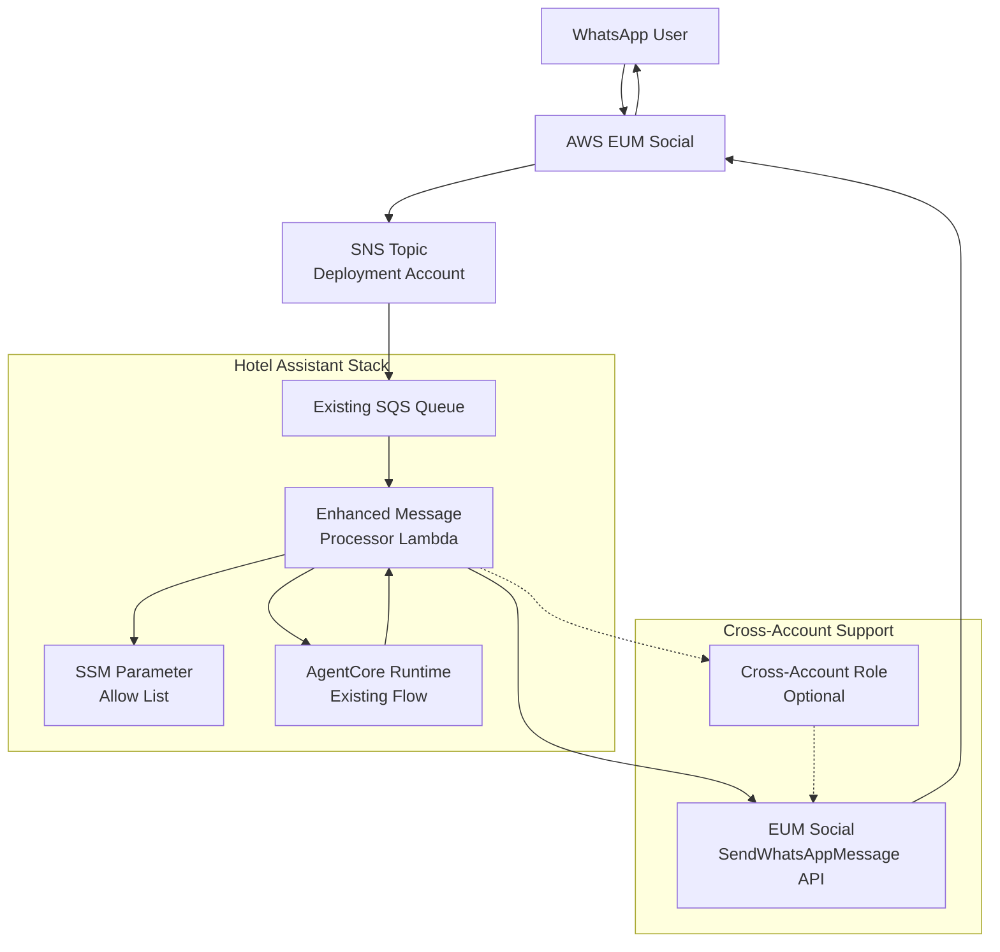
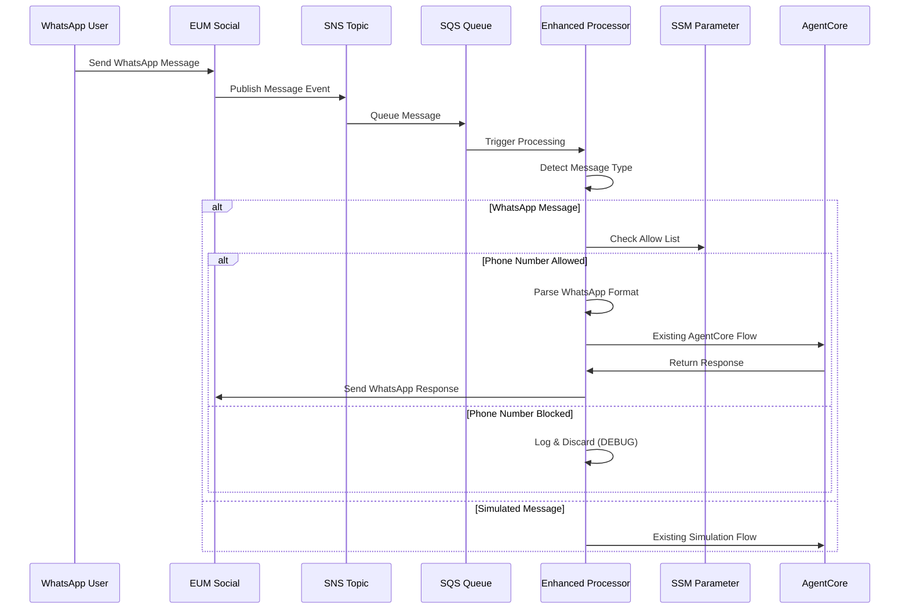

# Design Document

## Overview

The WhatsApp EUM Social Integration extends the existing Hotel Assistant
messaging system to support real WhatsApp messaging through AWS End User
Messaging Social (EUM Social). The system enhances the existing
`hotel-assistant-messaging-lambda` to automatically detect and handle WhatsApp
messages from EUM Social alongside the existing simulated messaging backend,
based on message structure.

The integration reuses the existing message processing architecture, extending
it to parse WhatsApp webhook formats, validate against SSM-based phone number
allow lists, and forward messages to AgentCore using the existing flow. This
approach maintains simplicity by leveraging existing components while adding
WhatsApp-specific parsing and validation.

## Architecture

### High-Level Architecture



### Enhanced Message Processing Flow



## Components and Interfaces

### Enhanced Message Processor

The existing `message_processor.py` will be enhanced to detect and handle
WhatsApp messages:

```python
def process_message_record(record: dict[str, Any]) -> None:
    """Enhanced to handle both simulated and WhatsApp messages."""
    try:
        # Parse SQS record (existing logic)
        sqs_record = SQSRecord(**record)
        sns_message = SNSMessage(**json.loads(sqs_record.body))

        # Detect message type and parse accordingly
        if is_eum_whatsapp_message(sns_message):
            # Parse EUM Social WhatsApp message format
            whatsapp_event = parse_whatsapp_message(sns_message)
            if whatsapp_event and is_phone_allowed(whatsapp_event.sender_id):
                # Process using existing async flow
                result = asyncio.run(_process_message_async(whatsapp_event))
            else:
                logger.debug(f"WhatsApp message blocked: {whatsapp_event.sender_id if whatsapp_event else 'invalid'}")
                return
        else:
            # Existing simulation message handling
            message_data = sns_message.message
            if isinstance(message_data, str):
                message_data = json.loads(message_data)
            event = MessageEvent(**message_data)
            result = asyncio.run(_process_message_async(event))

        # Rest of existing error handling...

    except Exception as e:
        # Existing error handling...
        pass
```

### WhatsApp Message Detection and Parsing

```python
def is_eum_whatsapp_message(sns_message: SNSMessage) -> bool:
    """Detect if SNS message contains EUM Social WhatsApp webhook data."""
    try:
        # Check for EUM Social WhatsApp-specific fields in message
        message_data = sns_message.message
        if isinstance(message_data, dict):
            return "whatsAppWebhookEntry" in message_data
        return False
    except Exception:
        return False

def parse_whatsapp_message(sns_message: SNSMessage) -> Optional[MessageEvent]:
    """Parse WhatsApp message into existing MessageEvent format."""
    try:
        message_data = sns_message.message
        webhook_entry = json.loads(message_data["whatsAppWebhookEntry"])

        # Navigate WhatsApp webhook structure
        changes = webhook_entry.get("changes", [])
        for change in changes:
            if change.get("field") == "messages":
                value = change.get("value", {})
                messages = value.get("messages", [])

                for message in messages:
                    if message.get("type") == "text":
                        # Convert to existing MessageEvent format
                        return MessageEvent(
                            message_id=message["id"],
                            sender_id=message["from"],
                            recipient_id=value["metadata"]["display_phone_number"],
                            content=message["text"]["body"],
                            conversation_id=f"whatsapp:{message['from']}",
                            model_id="anthropic.claude-3-5-sonnet-20241022-v2:0",
                            temperature=0.7
                        )

        return None
    except Exception as e:
        logger.debug(f"Failed to parse WhatsApp message: {e}")
        return None
```

### Phone Number Allow List

```python
# Cache for allow list to avoid repeated SSM calls
_allow_list_cache = {"value": None, "timestamp": 0}
_cache_ttl = 300  # 5 minutes

def get_allow_list() -> str:
    """Get allow list from SSM with caching."""
    import time

    current_time = time.time()
    if (_allow_list_cache["value"] is not None and
        current_time - _allow_list_cache["timestamp"] < _cache_ttl):
        return _allow_list_cache["value"]

    try:
        ssm = boto3.client("ssm")
        parameter_name = os.environ.get("WHATSAPP_ALLOW_LIST_PARAMETER", "/hotel-assistant/whatsapp/allow-list")
        response = ssm.get_parameter(Name=parameter_name)

        _allow_list_cache["value"] = response["Parameter"]["Value"]
        _allow_list_cache["timestamp"] = current_time

        return _allow_list_cache["value"]
    except Exception as e:
        logger.error(f"Failed to retrieve allow list: {e}")
        return ""

def is_phone_allowed(phone_number: str) -> bool:
    """Check if phone number is allowed."""
    allow_list = get_allow_list()
    if not allow_list:
        return False

    if "*" in allow_list:
        return True

    allowed_numbers = [num.strip() for num in allow_list.split(",")]
    return phone_number in allowed_numbers
```

### EUM Social Client with Caching

```python
# Cache for EUM Social clients (similar to bedrock sessions)
_eum_social_clients = {}

def get_eum_social_client():
    """Get EUM Social client with caching and optional cross-account role."""
    cross_account_role = os.environ.get("EUM_SOCIAL_CROSS_ACCOUNT_ROLE")
    region = os.environ.get("AWS_REGION")  # Use stack region, not separate eumSocialRegion

    cache_key = f"{region}:{cross_account_role or 'same-account'}"

    if cache_key in _eum_social_clients:
        return _eum_social_clients[cache_key]

    if cross_account_role:
        # Use cached session pattern from aws.py
        sts = boto3.client("sts")
        response = sts.assume_role(
            RoleArn=cross_account_role,
            RoleSessionName="whatsapp-message-sender"
        )

        credentials = response["Credentials"]
        client = boto3.client(
            "socialmessaging",
            region_name=region,
            aws_access_key_id=credentials["AccessKeyId"],
            aws_secret_access_key=credentials["SecretAccessKey"],
            aws_session_token=credentials["SessionToken"]
        )
    else:
        client = boto3.client("socialmessaging", region_name=region)

    _eum_social_clients[cache_key] = client
    return client
```

### Response Handling with Wrappers

The existing `_process_message_async` function will use wrapper functions to
handle different messaging backends:

```python
async def update_message_status_wrapper(message_id: str, status: str, conversation_id: str):
    """Wrapper to update message status based on conversation type."""
    if conversation_id.startswith("whatsapp:"):
        # WhatsApp messages don't use the messaging backend for status updates
        logger.debug(f"WhatsApp message {message_id} status: {status}")
        return
    else:
        # Use existing messaging client for simulated messages
        messaging_client = MessagingClient()
        await messaging_client.update_message_status(message_id, status)

async def send_response_wrapper(event: MessageEvent, response_content: str) -> bool:
    """Wrapper to send response based on conversation type."""
    if event.conversation_id.startswith("whatsapp:"):
        # Send via EUM Social WhatsApp API
        return send_whatsapp_response(event.sender_id, response_content)
    else:
        # Send via existing messaging simulation backend
        messaging_client = MessagingClient()
        response = await messaging_client.send_message(
            recipient_id=event.sender_id,
            content=response_content,
            conversation_id=event.conversation_id
        )
        return response is not None

async def _process_message_async(event: MessageEvent) -> ProcessingResult:
    """Enhanced with wrapper functions for different backends."""
    try:
        # Update message status to delivered using wrapper
        await update_message_status_wrapper(event.message_id, "delivered", event.conversation_id)

        # Existing AgentCore invocation logic...
        request = AgentCoreInvocationRequest(...)
        agentcore_client = AgentCoreClient()
        agent_response = agentcore_client.invoke_agent(request)

        if agent_response.success:
            # Send response using wrapper
            response_sent = await send_response_wrapper(event, agent_response.content)
            if response_sent:
                await update_message_status_wrapper(event.message_id, "read", event.conversation_id)
            else:
                await update_message_status_wrapper(event.message_id, "failed", event.conversation_id)

        # Rest of existing logic...

    except Exception as e:
        # Existing error handling with wrapper
        await update_message_status_wrapper(event.message_id, "failed", event.conversation_id)
        # ...
```

## Data Models

### Reuse Existing Models

The integration reuses existing models from
`hotel_assistant_common.models.messaging`:

- `MessageEvent`: Used for both simulated and WhatsApp messages
- `AgentCoreInvocationRequest`: Existing AgentCore integration
- `ProcessingResult`: Existing result handling

### WhatsApp-Specific Extensions

```python
# Add to existing models if needed
@dataclass
class WhatsAppMetadata:
    """WhatsApp-specific metadata for debugging."""
    waba_id: str
    phone_number_id: str
    display_phone_number: str
```

## Error Handling

The integration reuses the existing error handling patterns from
`message_processor.py`:

- Same retry logic for SQS messages
- Same status update patterns (delivered/read/failed)
- Same logging and metrics patterns
- Same batch processing error handling

Additional WhatsApp-specific errors:

- Allow list validation failures (logged at DEBUG level)
- WhatsApp API failures (logged at ERROR level)
- Cross-account authentication failures (logged at ERROR level)

## Testing Strategy

### Unit Testing

Extend existing test patterns:

```python
def test_whatsapp_message_detection():
    """Test detection of WhatsApp vs simulated messages."""
    # Test with WhatsApp webhook format
    # Test with simulated message format

def test_whatsapp_message_parsing():
    """Test parsing WhatsApp webhook to MessageEvent."""
    # Test valid WhatsApp message
    # Test invalid/malformed messages

def test_phone_allow_list():
    """Test phone number validation."""
    # Test wildcard allow list
    # Test specific phone numbers
    # Test blocked numbers
```

### Integration Testing

Extend existing integration tests to include WhatsApp scenarios.

## Deployment Integration

### CDK Context Configuration

```typescript
// Optional EUM Social configuration
"eumSocialTopicArn": "arn:aws:sns:us-east-1:123456789012:whatsapp-messages",
"eumSocialPhoneNumberId": "phone-number-id-01234567890123456789012345678901",
"eumSocialCrossAccountRole": "arn:aws:iam::123456789012:role/WhatsAppCrossAccountRole",
"whatsappAllowListParameter": "/hotel-assistant/whatsapp/allow-list"
```

### Enhanced Backend Stack

```python
def _create_messaging_integration(self):
    """Enhanced to support both simulated and WhatsApp messaging."""

    # Check for EUM Social configuration
    eum_social_topic_arn = self.node.try_get_context("eumSocialTopicArn")
    eum_social_phone_id = self.node.try_get_context("eumSocialPhoneNumberId")

    if eum_social_topic_arn and eum_social_phone_id:
        # Subscribe existing message processor to user-provided SNS topic
        external_topic = sns.Topic.from_topic_arn(
            self, "EUMSocialTopic", eum_social_topic_arn
        )
        external_topic.add_subscription(
            sns_subscriptions.SqsSubscription(self.existing_message_queue)
        )

        # Add WhatsApp-specific environment variables
        self.message_processor_lambda.add_environment("EUM_SOCIAL_PHONE_NUMBER_ID", eum_social_phone_id)
        self.message_processor_lambda.add_environment("WHATSAPP_ALLOW_LIST_PARAMETER",
            self.node.try_get_context("whatsappAllowListParameter") or "/hotel-assistant/whatsapp/allow-list")

        cross_account_role = self.node.try_get_context("eumSocialCrossAccountRole")
        if cross_account_role:
            self.message_processor_lambda.add_environment("EUM_SOCIAL_CROSS_ACCOUNT_ROLE", cross_account_role)

        # Grant additional permissions
        self._grant_whatsapp_permissions()
    else:
        # Deploy existing messaging simulation
        self._create_messaging_simulation()
```

### User-Managed SNS Topic

The user is responsible for creating and managing the SNS topic:

1. **Same Account**: User creates SNS topic in deployment account and configures
   EUM Social to publish to it
2. **Cross Account**: User creates SNS topic in deployment account and
   subscribes it to the EUM Social topic in the other account
3. **CDK Configuration**: User provides the topic ARN via `eumSocialTopicArn`
   context variable

This approach keeps the deployment simple and gives users full control over the
SNS topic configuration.

### IAM Permissions

```python
def _grant_whatsapp_permissions(self):
    """Grant WhatsApp-specific permissions."""

    # SSM parameter access
    self.message_processor_lambda.add_to_role_policy(
        iam.PolicyStatement(
            effect=iam.Effect.ALLOW,
            actions=["ssm:GetParameter"],
            resources=[f"arn:aws:ssm:{self.region}:{self.account}:parameter/hotel-assistant/whatsapp/*"]
        )
    )

    # EUM Social API access
    self.message_processor_lambda.add_to_role_policy(
        iam.PolicyStatement(
            effect=iam.Effect.ALLOW,
            actions=["socialmessaging:SendWhatsAppMessage"],
            resources=["*"]
        )
    )

    # Cross-account role assumption (if configured)
    cross_account_role = self.node.try_get_context("eumSocialCrossAccountRole")
    if cross_account_role:
        self.message_processor_lambda.add_to_role_policy(
            iam.PolicyStatement(
                effect=iam.Effect.ALLOW,
                actions=["sts:AssumeRole"],
                resources=[cross_account_role]
            )
        )
```

## Security Considerations

### Simplified Security Model

- Phone numbers and message content logged only at DEBUG level
- No persistent storage of WhatsApp data (existing AgentCore memory only)
- Allow list stored in encrypted SSM parameters
- Cross-account access uses least-privilege IAM roles

### Privacy Protection

- Reuse existing privacy patterns from simulated messaging
- No additional data retention beyond existing AgentCore memory
- Allow list supports wildcard (\*) for development/testing

## Performance Optimization

### Minimal Changes

- Reuse existing SQS batch processing
- Cache allow list and EUM Social clients
- No additional infrastructure overhead
- Leverage existing Lambda memory and timeout settings

## Monitoring and Observability

### Enhanced Existing Metrics

- Extend existing CloudWatch metrics to include WhatsApp message counts
- Reuse existing error tracking and alerting
- Add WhatsApp-specific log entries at appropriate levels
- Maintain existing health check patterns
