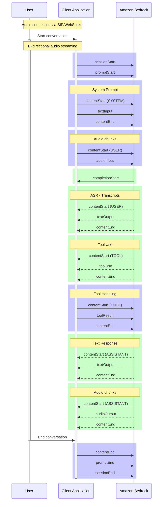

# Amazon Nova Sonic Speech-to-Speech Development Guide

## Overview

Amazon Nova Sonic is a real-time conversational AI model that enables
bidirectional audio streaming for natural speech-to-speech interactions. This
guide covers the event-driven architecture, proper event sequencing, and best
practices for implementing Nova Sonic applications using Python and the
experimental `aws_sdk_bedrock_runtime` package.

## Key Architectural Principles

### Event-Driven Architecture



Nova Sonic uses a structured event sequence with bidirectional streaming. All
communication happens through JSON events sent over the
`InvokeModelWithBidirectionalStream` API. The conversation follows a strict
hierarchical structure with unique identifiers that tie events together.

### Identifier Hierarchy

- **sessionId**: Generated by Nova Sonic, identifies the entire conversation
  session
- **promptName**: Client-generated UUID, ties all conversation events together
- **contentName**: Client-generated UUID for each content block (system prompt,
  audio stream, etc.)
- **completionId**: Generated by Nova Sonic for each response cycle

### Real-Time Processing

Nova Sonic processes audio in real-time with ~32ms audio chunks. The model
supports natural conversation flow including barge-in capabilities where users
can interrupt the assistant mid-speech.

## Required Event Flow Sequence

### 1. Session Initialization

```
sessionStart → promptStart → (system prompt content) → (conversation history if needed)
```

**Critical Requirements:**

- `sessionStart` must include inference configuration (maxTokens, temperature,
  topP)
- `promptStart` must define audio output configuration including voice selection
- System prompt should be optimized for conversational speech patterns
- Conversation history (if any) must come after system prompt but before new
  user input

### 2. Audio Input Lifecycle

```
contentStart (AUDIO, USER) → audioInput chunks → contentEnd
```

**Implementation Notes:**

- Audio should be streamed in real-time as captured from microphone
- Use consistent `contentName` for all audio chunks in a single user turn
- Audio format: 16kHz, 16-bit, mono, base64-encoded LPCM
- Each audio chunk represents ~32ms of audio data

### 3. Model Response Processing

```
completionStart → (ASR transcription) → (optional tool use) → (text response) → (audio response) → completionEnd
```

**Response Event Types:**

- **ASR Transcription**: `role: "USER"`, `generationStage: "FINAL"` - what the
  user said
- **Tool Use**: When external data is needed, includes tool name and parameters
- **Text Response**: `role: "ASSISTANT"`, `generationStage: "SPECULATIVE"` -
  preview of planned speech
- **Audio Response**: Base64-encoded speech chunks for playback
- **Final Transcription**: `role: "ASSISTANT"`, `generationStage: "FINAL"` -
  what was actually spoken

### 4. Session Termination

```
contentEnd (for any open audio streams) → promptEnd → sessionEnd
```

**Critical for Resource Management:**

- Always close open content streams before ending prompt
- Proper termination prevents resource leaks and orphaned connections
- Follow exact sequence to avoid incomplete conversations

## Audio Processing Patterns

### Microphone Capture

- Continuous sampling at 16kHz with 1024-byte chunks
- Real-time streaming without buffering delays
- Exception handling for audio device issues
- Graceful handling of microphone permissions

### Audio Playback

- Output at 24kHz (Nova Sonic's native output rate)
- Queue-based playback system for smooth audio delivery
- Barge-in support: clear audio queue when user interrupts
- Handle audio device switching and errors

### Barge-in Implementation

When user interrupts during assistant speech:

1. Nova Sonic sends interruption notification
2. Client immediately clears audio playback queue
3. Client stops current audio playback
4. Client starts new audio input stream
5. Nova Sonic switches to listening mode

## Tool Integration Patterns

### Tool Definition

Tools must be defined in the `promptStart` event with:

- Clear, descriptive names and descriptions
- Proper JSON schema for input parameters
- Consideration for speech-based parameter collection

### Tool Use Flow

1. User makes request requiring external data
2. Nova Sonic sends `toolUse` event with parameters
3. Client executes tool and sends `toolResult` back
4. Nova Sonic incorporates result into response
5. Audio response includes information from tool

### Speech-Optimized Tool Design

- Ask for one parameter at a time in speech interactions
- Confirm understanding before executing actions
- Provide clear, concise responses suitable for audio
- Handle ambiguous speech input gracefully

## Error Handling and Recovery

### Connection Errors

- Implement exponential backoff for reconnection attempts
- Preserve conversation context for session resumption
- Handle network timeouts and connection drops gracefully

### Audio Errors

- Fallback to text-based interaction if audio fails
- Clear error messages for microphone/speaker issues
- Graceful degradation when audio devices are unavailable

### Model Errors

When errors occur, always send cleanup sequence:

1. `contentEnd` (if audio streaming was active)
2. `promptEnd`
3. `sessionEnd`

### Conversation Resumption

For long conversations or error recovery:

- Store conversation history in structured format
- Include chat history after system prompt in new session
- Ensure first message in history is from user
- Handle conversation timeouts proactively

## Performance Optimization

### Real-Time Requirements

- Minimize latency between audio capture and streaming
- Use async/await patterns for concurrent audio processing
- Implement efficient audio queuing systems
- Monitor and optimize for sub-100ms response times

### Resource Management

- Properly close all streams and connections
- Monitor memory usage for long conversations
- Implement connection pooling where appropriate
- Use appropriate buffer sizes for audio processing

### Token Usage Monitoring

- Track `usageEvent` events for cost monitoring
- Monitor both input and output token consumption
- Implement usage limits and alerts
- Optimize prompts for token efficiency

## Voice and Localization

### Voice Selection

Available voices by language:

- English (US): matthew (masculine), tiffany (feminine)
- English (GB): amy (feminine)
- French: florian (masculine), ambre (feminine)
- German: lennart (masculine), greta (feminine)
- Italian: lorenzo (masculine), beatrice (feminine)
- Spanish: carlos (masculine), lupe (feminine)

### Audio Configuration

- Input: 8kHz, 16kHz, or 24kHz sampling rates supported
- Output: Typically 24kHz for best quality
- Always use mono (single channel) audio
- Base64 encoding for all audio data

## System Prompt Best Practices

### Speech-Optimized Prompting

- Keep responses concise (2-3 sentences for casual conversation)
- Use conversational language, not formal instructions
- Ask for one piece of information at a time
- Confirm understanding before taking actions
- Provide clear, step-by-step guidance for complex tasks

### Memory and Context Management

- Remember that users can't "scroll back" in speech
- Summarize key points periodically
- Use natural conversation flow over formal structures
- Handle interruptions and topic changes gracefully

### Error Prevention

- Confirm critical information by repeating it back
- Ask clarifying questions for ambiguous requests
- Provide clear options when multiple choices exist
- Use everyday language instead of technical jargon

## Testing and Debugging

### Local Development

- Test with various microphone and speaker configurations
- Simulate network interruptions and reconnections
- Test barge-in functionality with overlapping speech
- Validate proper event sequencing and cleanup

### Integration Testing

- Test with different voice selections and languages
- Validate tool integration with speech parameters
- Test conversation resumption after errors
- Monitor token usage and performance metrics

### Production Monitoring

- Log all event sequences for debugging
- Monitor audio quality and latency metrics
- Track conversation completion rates
- Alert on unusual error patterns or resource usage

## Common Pitfalls to Avoid

1. **Incorrect Event Sequencing**: Always follow the prescribed event order
2. **Missing Cleanup**: Always send termination events to prevent resource leaks
3. **Audio Buffering**: Stream audio in real-time, don't buffer unnecessarily
4. **Ignoring Barge-in**: Implement proper interruption handling for natural
   conversation
5. **Poor Error Handling**: Always clean up properly when errors occur
6. **Text-Optimized Prompts**: Adapt prompts for speech interaction patterns
7. **Blocking Operations**: Use async patterns to prevent audio stuttering
8. **Resource Leaks**: Properly close audio streams and connections
