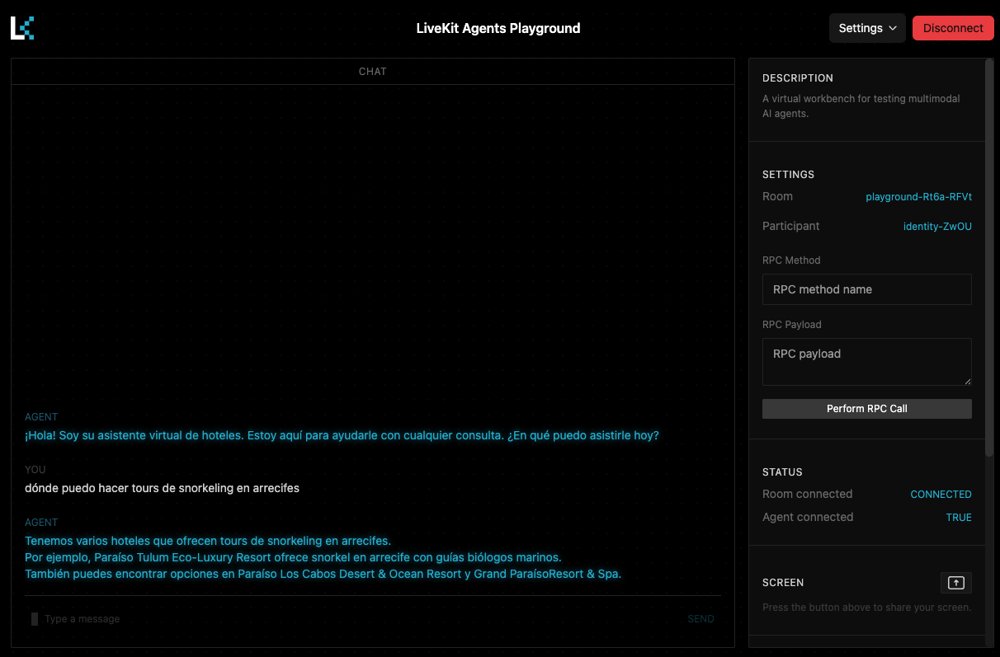
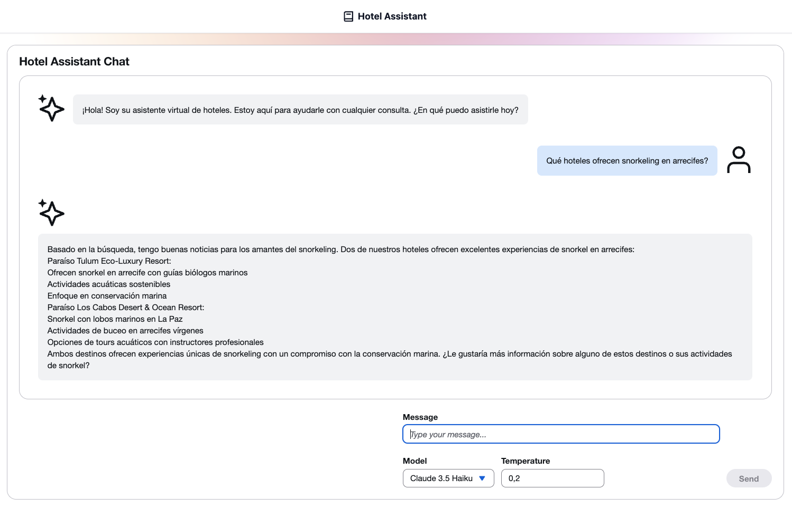
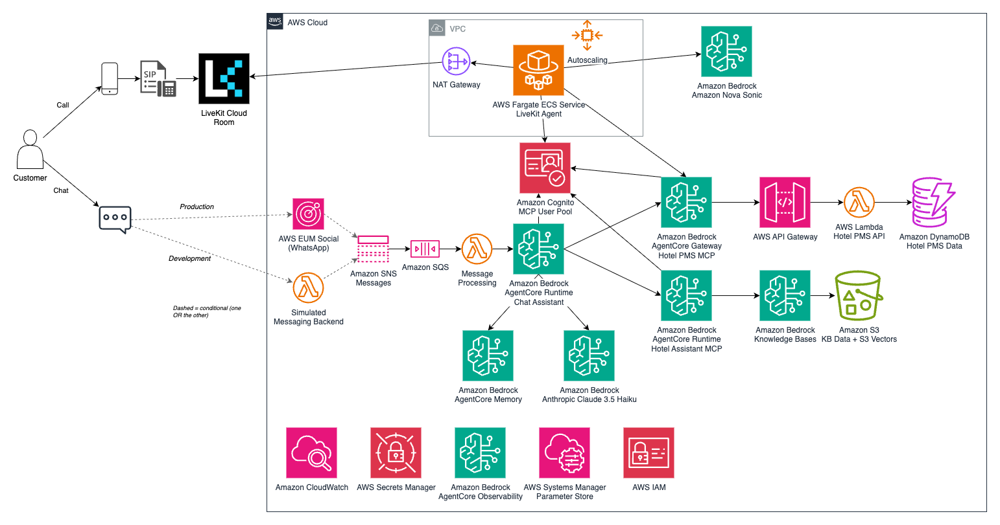
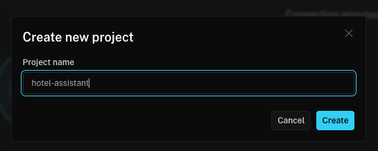
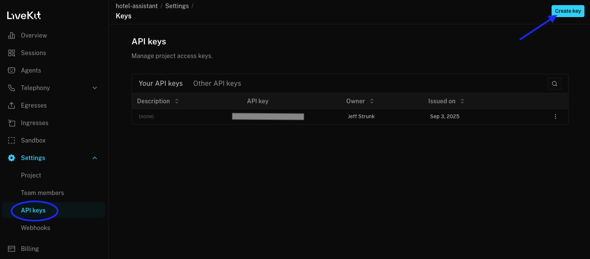
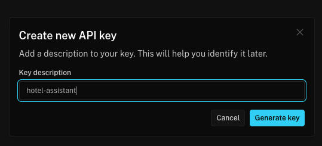
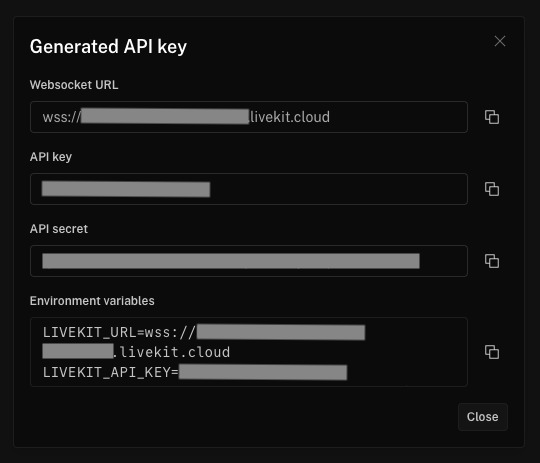

# Voice and Chat Hotel Assistant

This virtual assistant platform is a comprehensive real-time speech-to-speech
conversational AI system built on AWS and LiveKit with Amazon Bedrock Nova Sonic
for voice and Amazon Bedrock AgentCore Runtime for chat. While designed as a
hotel guest services assistant, this platform is easily adaptable to any
industry by simply changing system prompts and integrating industry-specific
tools. It provides natural, context-aware conversations through multiple
interfaces including voice, chat, and web applications.

**Key Adaptability Features:**

- **Industry-Agnostic Architecture**: Core platform works for hospitality,
  retail, healthcare, finance, and more
- **Simple Customization**: Adapt to any industry by modifying system prompts
  and available tools
- **Flexible Tool Integration**: Easy integration with any backend system via
  standardized MCP protocol
- **Reference Implementation**: Complete hotel use case demonstrates platform
  capabilities

## Key Value Propositions

- **Multi-Modal Customer Interactions**: Support voice calls (LiveKit), web
  chat, and text messaging across any industry
- **Real-Time Natural Speech Processing**: Natural, conversational interactions
  with Amazon Nova Sonic
- **Easy Industry Adaptation**: Customize for any vertical by changing system
  prompts and tools - no code changes required
- **Backend Service Integration**: Easy integration with any backend system via
  standardized MCP protocol
- **Scalable AWS Architecture**: Auto-scaling infrastructure with Amazon ECS with AWS Fargate
  and Aurora Serverless
- **Complete Reference Implementation**: Hotel use case demonstrates full
  platform capabilities

### Core Capabilities (Hotel Reference Implementation)

- **Room Management**: Check availability, make reservations, modify bookings
- **Guest Services**: Concierge information, amenities details, service requests
- **Housekeeping Coordination**: Schedule services, track requests, room status
  updates
- **Multi-Language Support**: English and Spanish with localized system prompts
- **Conversation Memory**: Persistent context across interactions using
  Amazon Bedrock AgentCore Memory

_Note: These hotel-specific capabilities demonstrate the platform's flexibility.
The same architecture supports any industry by replacing the hotel PMS tools
with industry-specific integrations._

## Example




## Architecture


[Architecture Details](documentation/architecture.md#architecture-overview)

## Cost

You are responsible for the cost of the AWS services used while running this
solution. As of December 2025, the cost for running this prototype with the
default settings in the US East (N. Virginia) Region is approximately $342.01
per month for 500 voice calls and 500 chat conversations.

The costs shown represent pricing without consideration of AWS free tier
benefits.

We recommend creating a budget through
[AWS Cost Explorer](http://aws.amazon.com/aws-cost-management/aws-cost-explorer/)
to help manage costs. Prices are subject to change. For full details, refer to
the pricing webpage for each AWS service used in this solution.

The following table provides a sample cost breakdown for deploying this solution
with the default parameters in the US East (N. Virginia) Region for one month:

### Cost estimate (500 voice calls, 500 chat conversations per month)

#### Component Overview

| Component                         | Description                              | Cost [USD]  |
| --------------------------------- | ---------------------------------------- | ----------- |
| Backend Integration & Database    | Industry-specific tools + knowledge base | $6.78       |
| Virtual Assistant Voice (LiveKit) | AI voice processing infrastructure       | $292.89     |
| Virtual Assistant Chat            | AI chat processing + simulated messaging | $42.34      |
| **Total**                         |                                          | **$342.01** |

#### Backend Integration & Database - $6.78/month

| AWS Service                               | Usage                             | Cost [USD] |
| ----------------------------------------- | --------------------------------- | ---------- |
| Amazon Cognito                            | User authentication               | $3.00      |
| AWS Secrets Manager                       | API key management                | $1.70      |
| Amazon CloudWatch                         | Monitoring & logs                 | $1.00      |
| AWS Lambda                                | Serverless compute                | $0.84      |
| Bedrock AgentCore Gateway                 | Tool calling gateway              | $0.10      |
| S3 Standard                               | Object storage & vector store     | $0.06      |
| Amazon Bedrock - Amazon Titan Text Embeddings V2 | Text embeddings for RAG           | $0.04      |
| Amazon DynamoDB                                  | Hotel PMS data storage (6 tables) | $0.04      |
| **Total**                                 |                                   | **$6.78**  |

#### Virtual Assistant Voice (LiveKit) - $284.63/month

**Note**: Voice infrastructure is optional. If you only need chat/messaging, you
can skip LiveKit configuration and save $284.63/month (including $81.30 in VPC
costs).

| AWS Service                               | Usage                                      | Cost [USD]  |
| ----------------------------------------- | ------------------------------------------ | ----------- |
| Amazon Bedrock - Nova Sonic 2             | AI voice processing (500 calls)            | $65.80      |
| Network Address Translation (NAT) Gateway | Network address translation (VPC)          | $74.00      |
| LiveKit Cloud                             | Real-time voice infrastructure (500 calls) | $70.00      |
| AWS Fargate                               | Containerized compute                      | $60.00      |
| Public IPv4 Address                       | Public IP addresses (VPC)                  | $7.30       |
| Amazon CloudWatch                         | Monitoring & logs                          | $5.00       |
| Data Transfer                             | Network data transfer                      | $2.00       |
| AWS Secrets Manager                       | API key management                         | $0.53       |
| **Total**                                 |                                            | **$284.63** |

#### Virtual Assistant Chat - $28.34/month

| AWS Service                                            | Usage                                    | Cost [USD] |
| ------------------------------------------------------ | ---------------------------------------- | ---------- |
| Amazon Bedrock - Amazon Nova 2 Lite (global inference) | AI chat processing (500 conversations)   | $14.80     |
| Amazon API Gateway                                            | Simulated messaging API                  | $0.02      |
| Amazon Cognito                                         | User authentication                      | $2.00      |
| DynamoDB                                               | Message storage & message buffering      | $0.27      |
| Bedrock AgentCore Memory                               | Conversation memory storage              | $2.50      |
| Amazon CloudWatch                                      | Monitoring & logs                        | $1.50      |
| Bedrock AgentCore Runtime                              | Agent execution runtime                  | $0.76      |
| Bedrock AgentCore Observability                        | Agent performance monitoring             | $0.35      |
| AWS Step Functions                                     | Message buffering workflow orchestration | $0.71      |
| AWS Lambda                                             | Message processing & buffering handlers  | $0.02      |
| AWS Secrets Manager                                    | API credentials                          | $0.40      |
| AWS WAF Web ACL                                            | API protection                           | $5.00      |
| S3 Standard                                            | Configuration storage                    | $0.01      |
| **Total**                                              |                                          | **$28.34** |

**Alternative Messaging Configuration:**

For production WhatsApp messaging via AWS End User Messaging Social (instead of
simulated messaging backend):

| AWS Service                   | Usage                                  | Cost [USD]  |
| ----------------------------- | -------------------------------------- | ----------- |
| AWS End User Messaging Social | WhatsApp message delivery (5,000 msgs) | ~$50.00     |
| AWS Lambda                    | Message processing                     | $0.04       |
| Amazon CloudWatch             | Monitoring & logs                      | $0.50       |
| **Additional Cost**           |                                        | **~$50.54** |

_Note: WhatsApp Business API pricing varies by region and message type. This
estimate assumes average costs._

The actual cost will vary based on:

- Number of voice calls and chat conversations processed
- Average duration of voice calls (default estimate assumes 10 minutes)
- Complexity of conversations and token usage
- Selected AWS region for deployment
- Whether production backend integration replaces simulated database

**Important**: This estimate excludes telephony and messaging integration costs.
Voice telephony (Twilio/Amazon Connect) and messaging connectors (WhatsApp/SMS)
require separate providers. When using the optional WhatsApp integration with
AWS End User Messaging Social, additional costs apply based on message volume
and WhatsApp Business API pricing.

## Deployment and Development

### Project Structure

This project is organized as an NX monorepo with pnpm workspaces, providing
efficient build caching, task orchestration, and dependency management across
multiple technologies:

```
virtual-assistant/
├── packages/
│   ├── demo/                        # React web application
│   ├── virtual-assistant/           # Python workspace with:
│   │   ├── virtual-assistant-chat/  #   - AgentCore chat agent
│   │   ├── virtual-assistant-livekit/ #   - LiveKit voice agent
│   │   ├── virtual-assistant-common/ #   - Shared utilities
│   │   └── virtual-assistant-messaging-lambda/ # - Message processing
│   ├── hotel-pms-simulation/            # Hotel PMS API & MCP server (reference)
│   ├── infra/                       # AWS CDK infrastructure
│   └── common/constructs/           # Shared CDK constructs
├── documentation/                   # Shared documentation
├── hotel_data/                      # Sample hotel data and scripts (reference)
├── .kiro/                           # Kiro IDE configuration
    ├── specs/                       # Feature specifications
    └── steering/                    # Development guidelines
```

## Adapting to Different Industries

The Virtual Assistant Platform is designed for easy adaptation to any industry.
The hotel implementation serves as a complete reference.

**What you customize:**

- System prompts and conversation flows
- Industry-specific tools via MCP protocol
- Knowledge base content
- Backend API integrations

**What stays the same:**

- Core infrastructure (voice, chat, messaging)
- AWS architecture and deployment
- Authentication and security

The platform uses the Model Context Protocol (MCP) to connect your existing APIs
as tools. AgentCore Gateway wraps any REST API with an OpenAPI specification,
eliminating the need to implement MCP protocol yourself.

**For complete step-by-step instructions**, see the
[Industry Adaptation Guide](documentation/industry-adaptation.md#industry-adaptation-guide).

### Prerequisites

- Configure the AWS Credentials in your environment. Refer to
  [Authentication and access](https://docs.aws.amazon.com/sdkref/latest/guide/access.html).
- A free LiveKit Cloud account. [About LiveKit](https://livekit.io/). Click
  "Start building" to sign up.
- Download and install AWS CLI. Refer to
  [Installing the AWS CLI](https://docs.aws.amazon.com/cli/latest/userguide/getting-started-install.html).
- Install and configure AWS CDK. Refer to Installing the
  [AWS CDK](https://docs.aws.amazon.com/cdk/v2/guide/getting_started.html).
- Download and install Docker. Refer to
  [Docker](https://www.docker.com/products/docker-desktop/).
- NodeJS >= 18.0.0. You can manage NodeJs versions with
  [nvm](https://github.com/nvm-sh/nvm?tab=readme-ov-file#installing-and-updating)
  or [pnpm](https://pnpm.io/cli/env)
- Python >= 3.13. You can manage Python versions with
  [uv](https://docs.astral.sh/uv/#python-versions).
- uv >= 0.6.0. Refer to
  [uv installation guide](https://docs.astral.sh/uv/getting-started/installation/).
- pnpm >= 8.6.3. Refer to
  [pnpm installation guide](https://pnpm.io/installation).

```shell
# Install pnpm
curl -fsSL https://get.pnpm.io/install.sh | sh -

# Install uv
curl -LsSf https://astral.sh/uv/install.sh | sh

# Install required tools and versions
pnpm  env use --global 22
uv python install 3.14

# Install global packages
npm install -g aws-cdk
```

### Activate Models in Amazon Bedrock

This prototype uses Amazon Nova and Anthropic Claude models on Amazon Bedrock.
Amazon models are enabled by default, while Anthropic models require a
marketplace subscription.

**Recommended approach**: Subscribe to all Anthropic models to ensure
compatibility with current and future model versions:

```bash
# Subscribe to all Anthropic models (recommended)
uv run scripts/bedrock_subscribe.py "Anthropic*" \
  --company-name "Your Company Name" \
  --use-cases "AI-powered virtual assistant and conversational AI"

# Subscribe to specific Anthropic model only
uv run scripts/bedrock_subscribe.py "Anthropic Claude 3.5 Haiku"
```

The prototype requires these models:

- Amazon Nova Sonic (enabled by default)
- Anthropic Claude 3.5 Haiku (requires subscription)
- Amazon Titan Text Embeddings V2 (enabled by default)

### Configure LiveKit Project Secret

1. **Create LiveKit Project**:

   

2. **Navigate to project settings**:

   

3. **Create a new API key**:

   

4. **Copy the generated API key and secret**:

   

5. Store the LiveKit credentials in AWS Secrets Manager with the secret name
   `"virtual-assistant-livekit"`:

   ```bash
   # Replace with your actual values from the LiveKit dashboard
   aws secretsmanager create-secret \
     --name "virtual-assistant-livekit" \
     --description "LiveKit credentials for Virtual Assistant" \
     --secret-string '{
       "LIVEKIT_URL": "wss://your-project-name-xxxxxxxx.livekit.cloud",
       "LIVEKIT_API_KEY": "your-api-key-from-step-4",
       "LIVEKIT_API_SECRET": "your-api-secret-from-step-4"
     }'
   ```

### Configure WhatsApp Integration (Optional)

The Virtual Assistant Platform supports real WhatsApp messaging through AWS End
User Messaging Social (EUM Social). This is optional - the system works with
simulated messaging by default.

#### Prerequisites for WhatsApp Integration

- AWS End User Messaging Social set up in your account
- WhatsApp Business Account connected to EUM Social
- SNS topic for receiving WhatsApp webhook events

#### Quick Setup

1. **Create SNS Topic for WhatsApp Events**:

   ```bash
   aws sns create-topic --name whatsapp-messages --region us-east-1
   ```

2. **Create Phone Number Allow List**:

   ```bash
   # Allow specific phone numbers (recommended for production)
   aws ssm put-parameter \
     --name "/virtual-assistant/whatsapp/allow-list" \
     --value "+1234567890,+0987654321" \
     --type "String"

   # OR allow all numbers (for development/testing)
   aws ssm put-parameter \
     --name "/virtual-assistant/whatsapp/allow-list" \
     --value "*" \
     --type "String"
   ```

3. **Configure CDK Context Variables**: Add to your `cdk.context.json` or pass
   via command line:

   ```json
   {
     "eumSocialTopicArn": "arn:aws:sns:us-east-1:YOUR-ACCOUNT:whatsapp-messages",
     "eumSocialPhoneNumberId": "your-eum-social-phone-number-id"
   }
   ```

4. **Deploy with WhatsApp Integration**:
   ```bash
   nx deploy infra --context eumSocialTopicArn=arn:aws:sns:us-east-1:123456789012:whatsapp-messages --context eumSocialPhoneNumberId=phone-number-id-01234567890123456789012345678901
   ```

For detailed WhatsApp integration setup, cross-account configuration, and
troubleshooting, see the WhatsApp Integration Guide
(`documentation/whatsapp-integration.md`).

### Build and Deploy

The entire build and deployment can be done with just a few commands:

```bash
pnpm install
pnpm exec nx bootstrap infra     # First time only
pnpm exec nx deploy infra        # Deploy to AWS (~2.5 min)
```

The deploy command will automatically trigger the necessary builds and then
deploy the infrastructure.

#### CDK Context Variables

The infrastructure supports various configuration options through CDK context
variables. These can be set in `packages/infra/cdk.context.json` or passed via
command line.

##### Core Configuration

- **`bedrock_xacct_role`** (Optional): Cross-account IAM role ARN for Bedrock
  access when models are in a different AWS account
  - Format: `arn:aws:iam::account-id:role/role-name`
  - Example: `arn:aws:iam::123456789012:role/BedrockCrossAccountRole`

##### WhatsApp Integration Configuration (Optional)

For real WhatsApp messaging through AWS End User Messaging Social, configure
these variables:

- **`eumSocialTopicArn`** (Required for WhatsApp): SNS topic ARN that receives
  WhatsApp webhook events from EUM Social
  - Format: `arn:aws:sns:region:account-id:topic-name`
  - Example: `arn:aws:sns:us-east-1:123456789012:whatsapp-messages`
  - Note: You must create and manage this SNS topic

- **`eumSocialPhoneNumberId`** (Required for WhatsApp): EUM Social phone number
  ID for sending WhatsApp messages
  - Format: 36-character alphanumeric string
  - Example: `phone-number-id-01234567890123456789012345678901`
  - Location: Found in EUM Social console under your WhatsApp phone number
    configuration

- **`eumSocialCrossAccountRole`** (Optional): IAM role ARN for cross-account EUM
  Social access
  - Format: `arn:aws:iam::account-id:role/role-name`
  - Example: `arn:aws:iam::123456789012:role/WhatsAppCrossAccountRole`
  - Use Case: When EUM Social is deployed in a different AWS account

- **`whatsappAllowListParameter`** (Optional): SSM parameter name for phone
  number allow list
  - Default: `/virtual-assistant/whatsapp/allow-list`
  - Format: SSM parameter path
  - Example: `/virtual-assistant/whatsapp/allow-list`

##### Setting Context Variables

**Method 1: Configuration File**

Create `packages/infra/cdk.context.json`:

```json
{
  "eumSocialTopicArn": "arn:aws:sns:us-east-1:123456789012:whatsapp-messages",
  "eumSocialPhoneNumberId": "phone-number-id-01234567890123456789012345678901",
  "eumSocialCrossAccountRole": "arn:aws:iam::123456789012:role/WhatsAppCrossAccountRole",
  "whatsappAllowListParameter": "/virtual-assistant/whatsapp/allow-list"
}
```

**Method 2: Command Line**

```bash
pnpm exec nx deploy infra \
  --context eumSocialTopicArn=arn:aws:sns:us-east-1:123456789012:whatsapp-messages \
  --context eumSocialPhoneNumberId=phone-number-id-01234567890123456789012345678901
```

##### Deployment Behavior

- **With EUM Social Configuration**: Deploys WhatsApp integration, skips
  simulated messaging backend
- **Without EUM Social Configuration**: Deploys simulated messaging backend
  (default behavior)
- **Partial EUM Social Configuration**: Deployment fails with clear error
  message if required variables are missing

### Load the Sample Hotel Data

The prototype uses a sample hotel data set. The data is loaded into Amazon S3
and ingested with Amazon Bedrock Knowledge Bases.

```bash
python ./hotel_data/scripts/generate_metadata.py
python ./hotel_data/scripts/upload_and_ingest_documents.py
```

## Demo

### Voice Assistant

Navigate to the
[LiveKit Agents Playground](https://agents-playground.livekit.io/). Enter with
your LiveKit Cloud account. Select your project and connect.

### Chat Assistant

#### Set up

You will need the `VirtualAssistantStack.UserPoolId` output from deployment.

For the demo, user sign up is disabled. You will need to
[create your user on the Amazon Cognito console](https://docs.aws.amazon.com/cognito/latest/developerguide/how-to-create-user-accounts.html#creating-a-new-user-using-the-console)
in the `VirtualAssistantStack.UserPoolId` so you can log in.

1. Navigate to the Amazon Cognito console.
2. Find your User Pool using the `VirtualAssistantStack.UserPoolId` from the
   stack deployment outputs.
3. In the "Users" section, click "Create user" and follow the instructions.

#### Use the Chat Assistant

Navigate to `http://localhost:5173` after running `nx serve demo`.

### Conversation suggestions

#### Look for a hotel

You: "¿Dónde puedo hacer meditación maya con cuencos tibetanos?" Agent: should
respond with information about Paraíso Tulum You: "¿Qué hay de rico para comer
allí?" Agent: should respond with information about Paraíso Tulum

#### Book a Room

You: "Quiero reservar una habitación para dos personas." Agent: should collect
required details and respond with a booking confirmation.

#### Request Maintenance

You: "¿Puedes hacer mantenimiento en la habitación 101?"

#### Check Out

You: "¿Puedes hacer checkout de la habitación 101?"

## Cleanup

In the event that you decide to stop using the prototype, we recommend that you
follow a tear-down procedure. Most of the services used have no cost when there
is no active use with the notable exception of storage in S3 and CloudWatch
Logs. AWS CloudFormation via CDK will tear down all resources except for Amazon
S3 buckets and AWS CloudWatch Logs log groups with data.

### 1. Destroy CDK Stacks

```bash
nx run infra:destroy
```

### 2. Clean Up Remaining S3 Buckets

Due to versioning, lifecycle rules are the most thorough approach for complete
cleanup.

```bash
# Find virtual-assistant related bucket names
ASSISTANT_BUCKETS=$(aws s3api list-buckets --query 'Buckets[?contains(Name, `virtualassistant`) || contains(Name, `cdk-hnb659fds`)].Name' --output text)

# Apply lifecycle rules to expire all objects and versions after 1 day
for bucket in $ASSISTANT_BUCKETS; do
  echo "Setting lifecycle rule for bucket: $bucket"
  aws s3api put-bucket-lifecycle-configuration \
    --bucket "$bucket" \
    --lifecycle-configuration '{
      "Rules": [{
        "ID": "DeleteEverything",
        "Status": "Enabled",
        "Filter": {},
        "Expiration": {"Days": 1},
        "NoncurrentVersionExpiration": {"NoncurrentDays": 1},
        "AbortIncompleteMultipartUpload": {"DaysAfterInitiation": 1}
      }]
    }'
done

# After 24+ hours, delete the empty buckets
for bucket in $ASSISTANT_BUCKETS; do
  echo "Deleting bucket: $bucket"
  aws s3 rb s3://"$bucket"
done
```

### 3. Delete CloudWatch Log Groups

```bash
# Delete virtual-assistant related log groups
aws logs describe-log-groups \
  --query 'logGroups[?contains(logGroupName, `VirtualAssistant`) || contains(logGroupName, `HotelPms`)].logGroupName' \
  --output text | xargs -I {} aws logs delete-log-group --log-group-name {}
```

**Important Notes:**

- The CDKToolkit stack should remain as it's used by other CDK deployments
- Wait 24+ hours after setting lifecycle rules before attempting to delete S3
  buckets

## Troubleshooting

For common issues and debugging guidance, see the
[troubleshooting guide](documentation/troubleshooting.md). This includes
specific guidance for WhatsApp integration, voice processing, deployment issues,
and performance optimization.

## Improvements

As part of the prototype process, we have some
[improvement ideas](documentation/improvements.md#improvements) for your path to
production.

**Amazon Connect Integration**: If your use case requires telephone support,
human agent escalation, or complete contact center capabilities, we recommend
using Amazon Connect. The
[AWS Workshop for Amazon Connect Integration](https://catalog.workshops.aws/workshops/f77f49a2-1eae-4223-a9da-7044d6da51f8/en-US)
provides comprehensive guidance for building virtual assistants with Amazon
Connect, including integration with Amazon Bedrock Nova Sonic for natural
conversations.

## Security Guideline

Please see the [security guidelines](documentation/security.md#security).

## Legal Disclaimer

Sample code, software libraries, command line tools, proofs of concept,
templates, or other related technology are provided as AWS Content or
Third-Party Content under the AWS Customer Agreement, or the relevant written
agreement between you and AWS (whichever applies). You should not use this AWS
Content or Third-Party Content in your production accounts, or on production or
other critical data. You are responsible for testing, securing, and optimizing
the AWS Content or Third-Party Content, such as sample code, as appropriate for
production grade use based on your specific quality control practices and
standards. Deploying AWS Content or Third-Party Content may incur AWS charges
for creating or using AWS chargeable resources, such as running Amazon EC2
instances or using Amazon S3 storage.
