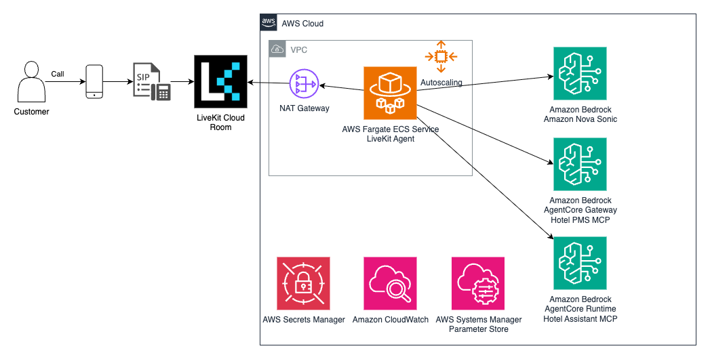
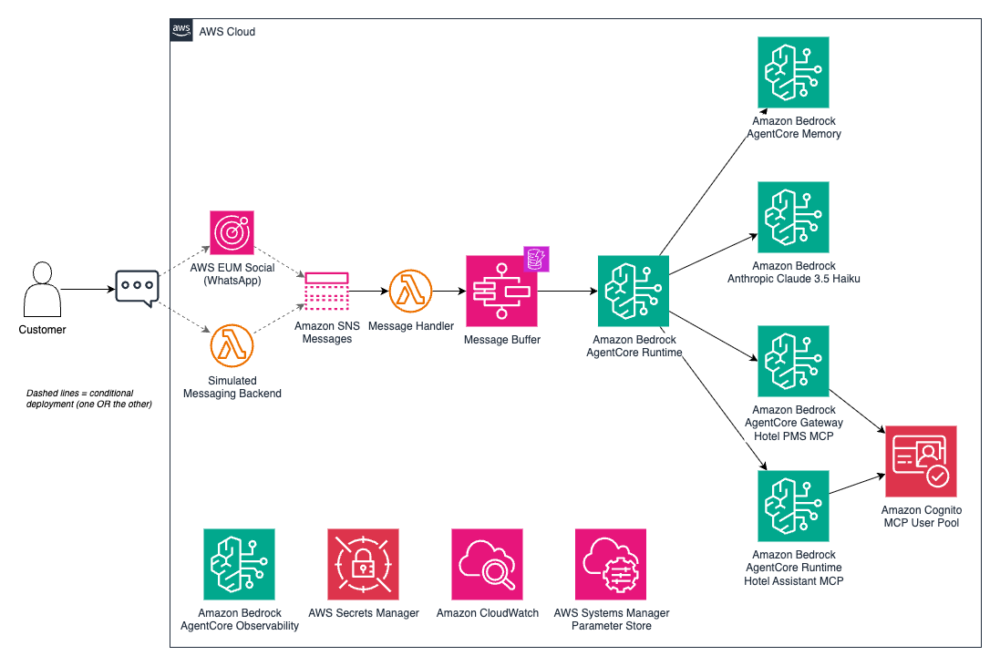
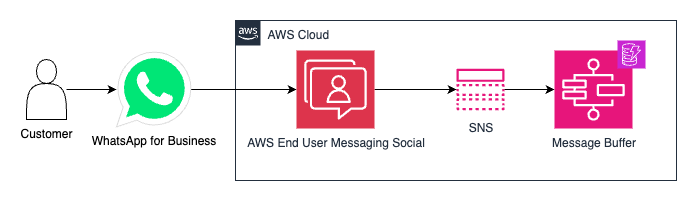
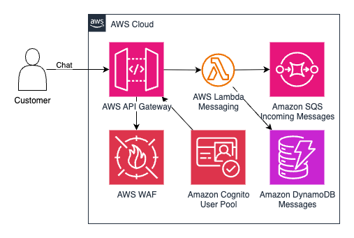
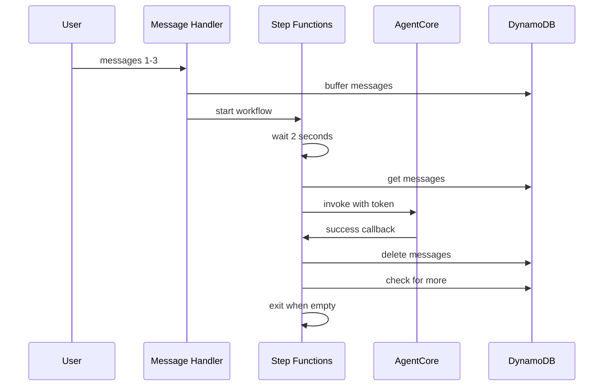
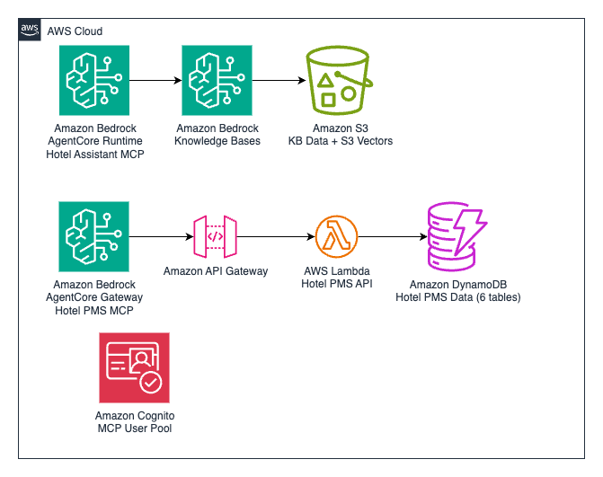

# Architecture Overview

This Virtual Assistant platform is built on a multi-modal, serverless
architecture that enables natural conversational interactions across voice and
chat channels while integrating seamlessly with business systems. The
architecture is designed to be industry-agnostic, with the hotel use case
serving as a comprehensive reference implementation that demonstrates the
platform's capabilities.

The platform prioritizes scalability, cost-efficiency, and operational
flexibility, making it adaptable to various industries including hospitality,
retail, healthcare, finance, and customer service operations.

## Core Architecture Components

The Virtual Assistant platform consists of modular components that can be
customized for different industries by adapting system prompts, tools, and
business integrations. The hotel implementation showcases the full capabilities
of the platform.

### Voice Assistant

1. **Real-Time Voice Processing**:
   - [LiveKit Cloud](https://livekit.io/) provides enterprise-grade voice
     infrastructure
   - Supports web-based (WebRTC) voice interactions through LiveKit Cloud
   - Handles real-time audio streaming with low latency for natural
     conversations
   - [Amazon Nova Sonic](https://aws.amazon.com/ai/generative-ai/nova/speech/)
     provides speech-to-speech AI capabilities
   - **Industry Adaptation**: Voice channels work for any customer service
     scenario

2. **Scalable Compute**:
   - [AWS Fargate](https://aws.amazon.com/fargate/) ECS Service runs voice agent
     containers
   - ARM64 architecture optimizes cost-performance for audio processing
   - Auto-scaling configuration: 1-5 tasks based on 20 calls per task target
   - Scale-out: 2-minute cooldown for rapid response to demand spikes
   - Scale-in: 10-minute cooldown to avoid thrashing during variable load
   - Container specifications: 2 vCPU, 4GB memory for real-time audio processing
   - **Industry Adaptation**: Scales to handle varying customer interaction
     patterns

3. **AI-Powered Conversations**:
   - Amazon Nova Sonic enables natural speech-to-speech interactions
   - Multi-language support serves diverse customer populations
   - Consistent responses maintain brand voice across interactions
   - **Industry Adaptation**: Customize system prompts to reflect your
     industry's terminology and processes

4. **Business System Integration** _(Hotel Reference Implementation)_:
   - [Amazon Bedrock AgentCore Gateway](https://aws.amazon.com/bedrock/agentcore/) provides
     secure API access to business operations
   - [MCP protocol](https://modelcontextprotocol.io/docs/getting-started/intro)
     standardizes integration with existing business systems
   - **Hotel Example**: Real-time access to room availability, reservations, and
     guest services
   - **Industry Adaptation**: Replace hotel tools with your industry-specific
     operations (inventory, appointments, orders, etc.)

5. **Configuration and Secrets**:
   - AWS Systems Manager Parameter Store stores MCP server configuration as JSON
   - AWS Secrets Manager stores Amazon Cognito OAuth credentials for secure API access
   - Automatic credential rotation supported through Secrets Manager
   - Environment variables configure agent behavior and endpoints

### Chat Assistant

1. **Serverless Chat Processing**:
   - [AgentCore Runtime](https://aws.amazon.com/bedrock/agentcore/) handles chat
     conversations without infrastructure management
   - Anthropic Claude 3.5 Haiku provides fast, cost-effective language
     understanding
   - Automatic scaling from zero to high volumes based on conversation demand
   - Pay-per-use pricing scales with actual usage
   - MicroVM isolation provides secure, dedicated resources per conversation
   - **Industry Adaptation**: Works for any text-based customer interaction
     scenario

2. **Authentication**:
   - Amazon Cognito User Pool manages secure access for applications
   - OAuth 2.0 authorization code flow for user authentication
   - Machine-to-machine authentication using client credentials flow for MCP
     servers
   - JWT tokens for API authorization
   - **Industry Adaptation**: Integrate with existing identity providers as
     needed

3. **Conversation Memory**:
   - AgentCore Memory maintains context during sessions
   - Automatic conversation history persistence
   - Session-based context retrieval for multi-turn conversations
   - **Industry Adaptation**: Preserves conversation context regardless of
     industry

4. **Performance Monitoring**:
   - AgentCore Observability tracks conversation quality and response times
   - Real-time metrics enable proactive service optimization
   - CloudWatch integration for custom metrics and alarms
   - **Hotel Example**: Analytics inform service improvements and staff training
   - **Industry Adaptation**: Monitor performance metrics relevant to your
     business KPIs

5. **Configuration and Secrets**:
   - AWS Systems Manager Parameter Store stores MCP server configuration as JSON
   - AWS Secrets Manager stores Cognito OAuth credentials for secure API access
   - Environment variables configure agent behavior and model selection

### Messaging Assistant

The platform supports asynchronous messaging through two deployment options:
production WhatsApp integration via AWS End User Messaging Social, or a
simulated messaging backend for demonstration. The simulated backend is deployed
by default and used by the demo frontend.

#### Production WhatsApp Integration

For production deployments with WhatsApp Business:

1. **WhatsApp Message Ingestion**:
   - AWS End User Messaging Social receives WhatsApp messages from customers
   - Messages are published to Amazon SNS topic as webhook events
   - SNS delivers messages to SQS queue for reliable processing

2. **Message Processing**:
   - AWS Lambda processes messages from SQS queue
   - Integrates with AgentCore Runtime for conversation handling
   - Supports phone number allow lists via Parameter Store for security
   - Cross-account role support for multi-account deployments

3. **Response Delivery**:
   - AgentCore responses are sent back through EUM Social API
   - Messages delivered to customers via WhatsApp Business

#### Simulated Messaging Backend (Demo)

The simulated messaging backend is deployed by default and used by the demo
frontend to demonstrate messaging capabilities without requiring WhatsApp
Business:

1. **Demo Message Interface**:
   - Amazon API Gateway provides webhook-compatible REST API
   - Simulates WhatsApp's message delivery model
   - Amazon Cognito authenticates demo users
   - Amazon DynamoDB stores message history for demo conversations

2. **Message Processing**:
   - AWS Lambda processes incoming messages
   - Same AgentCore Runtime integration as production
   - Messages published to SNS topic
   - SQS queue ensures reliable processing

3. **Use Cases**:
   - Testing without WhatsApp Business account
   - Customer demonstrations and proof-of-concepts
   - Validates messaging integration patterns before production deployment
   - **Industry Adaptation**: Test your custom prompts and tools before
     connecting real messaging channels

#### Message Buffering and Processing

The messaging system uses AWS Step Functions to handle rapid-fire messages
intelligently. When users send multiple messages in quick succession (e.g., "Hi"

> "I need help" > "with my reservation"), the system ensures they're processed
> together with full context.

**Infrastructure Components:**

1. **Message Buffer (DynamoDB)**:
   - Stores messages temporarily per user with TTL
   - Tracks processing state and workflow status
   - Enables atomic check-and-set for single workflow guarantee
   - Automatic cleanup after 10 minutes via TTL

2. **Step Functions Workflow**:
   - Orchestrates message collection and processing
   - Implements 2-second buffering window
   - Manages retry logic with exponential backoff
   - Uses task token pattern for async coordination
   - Visual workflow debugging through AWS console

3. **AWS Lambda Handlers**:
   - **Message Handler**: Buffers incoming messages, starts workflow
   - **Prepare Processing**: Atomically marks messages for processing
   - **Invoke AgentCore**: Calls agent with task token
   - **Delete Processed**: Removes successfully processed messages
   - **Handle Failure**: Manages permanent failures
   - **Prepare Retry**: Resets state for retry attempts

**Message Flow:**

**Key Benefits:**

- **Context preservation**: Agent sees all related messages together
- **Order guarantee**: Single workflow per user prevents race conditions
- **Reliable delivery**: Task token pattern ensures messages aren't lost on
  failure
- **Automatic retry**: Exponential backoff handles transient errors (2s, 4s, 8s,
  16s, 32s, 64s)
- **Production-ready**: Handles real-world rapid messaging scenarios

**Industry Adaptation**: This architecture works for any messaging platform
(WhatsApp, SMS, Slack, etc.) where users send multiple messages rapidly. The
buffering mechanism ensures coherent conversations regardless of message
velocity.

For detailed implementation decisions, state machine diagram, and performance
characteristics, see
[Message Processing Architecture](message-processing.md#message-processing-architecture).

### Business System Integration _(Hotel Reference Implementation)_

The hotel implementation demonstrates how to integrate the Virtual Assistant
platform with industry-specific business systems. This pattern can be adapted
for any industry by replacing the hotel-specific components with your business
logic.

1. **Flexible Data Management**:
   - [Amazon DynamoDB](https://aws.amazon.com/dynamodb/) provides serverless
     NoSQL database for operational data
   - On-demand capacity mode automatically scales read/write throughput
   - **Hotel Example**: Three tables store hotel information, room types, and
     reservations
     - `Hotels` table: Partition key `hotel_id`, stores property details and
       amenities
     - `RoomTypes` table: Composite key `hotel_id` (partition) + `room_type_id`
       (sort), stores room configurations and base pricing
     - `Reservations` table: Partition key `confirmation_number`, stores booking
       details with GSI on `hotel_id` for queries
   - **Industry Adaptation**: Replace with your business data models (inventory,
     customers, orders, appointments, etc.)
   - Point-in-time recovery enabled for data protection
   - Encryption at rest using AWS managed keys

2. **Intelligent Knowledge Base**:
   - [Amazon Bedrock Knowledge Bases](https://aws.amazon.com/bedrock/knowledge-bases/)
     with [S3 Vectors](https://github.com/cdklabs/cdk-s3-vectors) provides
     cost-effective semantic search
   - S3-based vector storage eliminates need for separate vector database
     infrastructure
   - Amazon Titan Text Embeddings v2 generates vector embeddings
   - RAG (Retrieval Augmented Generation) delivers accurate, contextual
     responses
   - **Hotel Example**: Hotel policies, amenities, and service information
     stored as markdown files
   - **Industry Adaptation**: Load your industry-specific documentation,
     policies, and procedures
   - Automatic synchronization when S3 content changes
   - Centralized knowledge management ensures consistent information across
     channels

3. **MCP Server Integration**:
   - **Hotel Demo Simulation**: The `hotel-pms-simulation` package provides a
     simulated hotel PMS for demonstration purposes only
   - **For Your Implementation**: Build your own MCP server using one of two
     approaches:
     - **AgentCore Runtime**: For implementing new business logic and operations
       - Serverless Lambda functions with automatic scaling
       - Direct integration with AWS services
       - Custom business logic implementation
     - **AgentCore Gateway**: For connecting to existing APIs and business
       systems
       - API Gateway REST API with OpenAPI specification
       - Cognito OAuth authentication with client credentials flow
       - Single Lambda function routing pattern (512MB memory, Python 3.13)
       - Zero-code API-to-MCP tool conversion
   - **Demo Example**: Simulated room availability, reservations, and guest
     services with mock data
   - **Your Implementation**: Create MCP tools that connect to your real
     business systems and data
   - Standardized MCP protocol ensures consistent integration patterns across
     industries

4. **API Gateway Configuration** _(Hotel Demo)_:
   - REST API with manually maintained OpenAPI specification
   - Cognito authorizer validates JWT tokens
   - CORS configuration enables web client access
   - Request/response validation based on OpenAPI schemas
   - Lambda proxy integration with single routing function
   - CloudWatch logging for API access and errors

5. **Lambda Implementation** _(Hotel Demo)_:
   - Single Lambda function handles all hotel operations
   - 512MB memory allocation
   - Python 3.13 runtime with uv package management
   - 15-minute timeout for complex operations
   - Routes requests based on HTTP method and path
   - Implements canned data with rule-based availability logic
   - Dynamic pricing calculations for realistic demonstrations
   - Environment variables configure DynamoDB table names

## Data Flow

### Voice Interaction Flow

1. Guest initiates voice call through LiveKit Agents Playground (WebRTC)
2. LiveKit Cloud routes audio to Amazon ECS with AWS Fargate voice agent container
3. Voice agent processes audio through Amazon Nova Sonic for speech-to-speech
4. Agent queries MCP servers for business operations and knowledge:
   - Hotel Assistant MCP (AgentCore Runtime) for knowledge base queries via
     Amazon Bedrock
   - Hotel PMS MCP (AgentCore Gateway) for reservations via API Gateway + Lambda
5. Lambda function reads/writes DynamoDB tables for hotel operations
6. Responses flow back through Nova Sonic for natural speech output
7. Audio streams back to guest through LiveKit Cloud

### Chat Interaction Flow

1. Guest sends message through demo website
2. Amazon Cognito authenticates user and provides JWT token
3. AgentCore Runtime receives message and initializes Claude conversation
4. Chat agent queries MCP servers for business operations and knowledge:
   - Hotel Assistant MCP (AgentCore Runtime) for knowledge base queries via
     Bedrock
   - Hotel PMS MCP (AgentCore Gateway) for reservations via API Gateway + Lambda
5. Lambda function reads/writes DynamoDB tables for hotel operations
6. AgentCore Memory persists conversation context
7. Response returns to demo website through AgentCore Runtime

### MCP Server Configuration Flow

1. Voice and chat agents start and read Parameter Store for MCP server
   configuration
2. Agents retrieve OAuth credentials from Secrets Manager
3. Agents authenticate with Cognito using client credentials flow
4. Agents establish HTTP connections to MCP servers with JWT tokens
5. Agents query each MCP server for available tools and prompts
6. Agents maintain tool registry for routing requests to appropriate servers

### Knowledge Base Query Flow

1. Agent sends query to Hotel Assistant MCP server
2. MCP server calls Bedrock Knowledge Base with query text
3. Bedrock generates embeddings using Titan Text Embeddings v2
4. S3 Vectors performs semantic search across hotel documentation
5. Relevant documents return to Bedrock for context
6. Bedrock generates response using RAG with Claude
7. Response returns through MCP server to agent

See technical_approach.md for software design patterns including multi-modal
architecture, MCP integration patterns, and dynamic prompt loading.

## Business Value Architecture

### Multi-Channel Customer Experience

The architecture enables consistent service across voice calls and chat,
adaptable to any industry's customer interaction needs.

### Operational Efficiency

- **Auto-scaling**: Infrastructure automatically adjusts to demand, reducing
  costs during low-traffic periods
- **Serverless Components**: Pay-per-use pricing aligns costs with actual usage
- **Standardized Integration**: MCP protocol simplifies connections to existing
  business systems across any industry

### Service Quality

- **Real-time Processing**: Voice and chat responses maintain conversational
  flow for natural customer interactions
- **Contextual Memory**: Agents remember previous interactions for personalized
  service across any industry
- **Knowledge Consistency**: Centralized knowledge base ensures accurate
  information across all channels, customizable for your business domain

### Scalability & Reliability

- **Cloud-Native Design**: Leverages AWS managed services for high availability
- **Elastic Scaling**: Handles peak business periods without manual intervention
  (e.g., hotel check-in/check-out, retail sales events, appointment rushes)
- **Fault Tolerance**: Multi-AZ deployment and automatic failover ensure service
  continuity

### Integration Flexibility

- **Protocol Standardization**: MCP enables easy integration with various
  business management systems across industries
- **Modular Architecture**: Components can be updated or replaced independently
- **Industry Adaptation**: Replace hotel-specific tools and prompts with your
  business logic while keeping the core platform unchanged

## Customization for Different Industries

The Virtual Assistant platform is designed for easy adaptation to various
industries:

### What Stays the Same

- Core voice and chat infrastructure
- AWS serverless architecture
- Authentication and security patterns
- Conversation memory and context management
- Multi-channel support (voice + chat)

### What You Customize

- **System Prompts**: Adapt conversation style and terminology for your industry
- **MCP Server**: Build your own MCP server (the hotel one is just a demo
  simulation)
  - Use **AgentCore Runtime** for new business logic implementation
  - Use **AgentCore Gateway** to connect existing APIs and systems
- **Knowledge Base**: Load your business documentation, policies, and procedures
- **Data Models**: Design your own database schema for your business entities
- **Business Tools**: Create MCP tools specific to your operations and workflows

### Industry Examples

- **Retail**: Product catalog, inventory, order management, customer support
- **Healthcare**: Appointment scheduling, patient information, insurance
  verification
- **Finance**: Account inquiries, transaction history, loan applications
- **Customer Service**: Ticket management, FAQ responses, escalation procedures

## MCP Server Implementation Guidance

The hotel implementation includes a simulated MCP server
(`hotel-pms-simulation`) that provides **demo functionality only** with mock
hotel data and operations. This is not intended as a reference implementation to
adapt, but rather as a working example to demonstrate the platform capabilities.

### Choose Your MCP Server Approach

For your real implementation, build a new MCP server using:

1. **AgentCore Runtime** - For implementing new business logic:
   - Build serverless functions that implement your business operations
   - Ideal when you need to create new workflows and processes
   - Examples: Custom appointment scheduling, order processing, ticket
     management

2. **AgentCore Gateway** - For connecting existing systems:
   - Connect to your existing APIs and business systems
   - Ideal when you have established systems you want to integrate
   - Examples: Existing CRM, ERP, inventory management, or customer service
     platforms

### Demo vs. Production

The `hotel-pms-simulation` package provides:

- **Demo Purpose**: Simulated hotel operations with mock data for demonstration
- **Learning Value**: Shows MCP server structure and integration patterns
- **Not for Adaptation**: Build your own MCP server from scratch for your
  business

**For Production**: Create your own MCP server that connects to your real
business systems and data, using the demo as inspiration for the overall
architecture pattern but implementing your specific business logic and
integrations.
