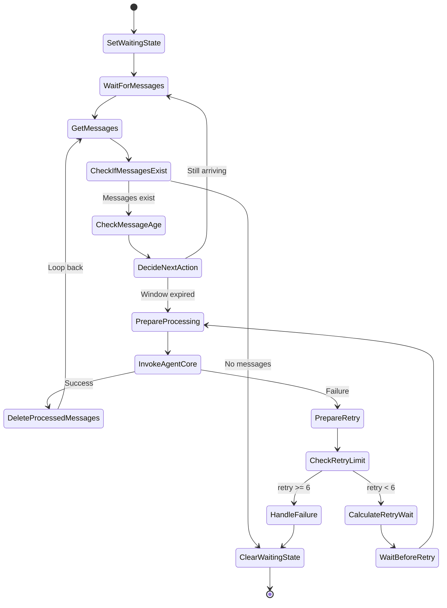

# Message Processing Architecture

## Overview

The message processing system implements a sophisticated buffering and retry
mechanism to handle rapid-fire messaging scenarios common in production WhatsApp
and SMS deployments. This architecture ensures reliable message delivery,
maintains conversation context, and prevents race conditions when users send
multiple messages in quick succession.

## Problem Statement

When users send multiple messages in quick succession (common in mobile
messaging), processing each message independently causes several critical
issues:

1. **Fragmented context**: The agent doesn't see related messages together,
   leading to incomplete or confusing responses. For example, if a user sends
   "Hi" > "I need help" > "with my reservation" in rapid succession, processing
   each independently results in three separate agent invocations that lack the
   full context.

2. **Out-of-order responses**: Race conditions between concurrent invocations
   can cause responses to arrive in the wrong order. The agent might respond to
   "with my reservation" before responding to "Hi", creating a confusing
   conversation flow.

3. **Lost messages**: If async processing fails after the AWS Lambda handler returns
   success to the messaging platform, messages can be lost without any
   indication to the user or system operators.

These issues are particularly problematic in production messaging deployments
where users naturally send thoughts as multiple rapid messages rather than
composing a single complete message.

## Solution Architecture

We use AWS Step Functions with a task token pattern to coordinate message
buffering and processing. This approach provides visual workflow debugging,
built-in retry and error handling, and reliable async coordination while
maintaining conversation quality.

### State Machine Diagram



The state machine implements 13 distinct states that manage the complete
lifecycle of message collection, processing, retry, and cleanup. Each state has
a specific responsibility in the workflow, from initial message buffering
through final cleanup.

## Key Implementation Decisions

### 1. Buffering Window (2 seconds)

Messages are collected for 2 seconds before processing. This window balances
multiple competing concerns:

- **Latency**: Short enough for responsive conversations where users expect
  replies within a few seconds
- **Batching**: Long enough to capture rapid-fire messages that users send
  within moments of each other
- **User experience**: Imperceptible delay for most interactions while
  preventing fragmented context

The workflow checks message age using JSONata expressions to determine if more
messages are still arriving. If the newest message is less than 2 seconds old,
the workflow waits longer. Once the window expires without new messages,
processing begins.

**Implementation detail**: The workflow uses `WaitForMessages` state with a
2-second wait, then `CheckMessageAge` to compare the newest message timestamp
against the current time. This pattern ensures we don't process prematurely
while messages are still arriving.

### 2. Single Workflow Per User

A `waiting_state` flag in Amazon DynamoDB ensures only one workflow runs per user at
any given time. This prevents race conditions and maintains message ordering:

```python
# Atomic check-and-set in Message Handler
# Note: Simplified for clarity - actual implementation includes ExpressionAttributeValues
buffer_table.update_item(
    Key={"user_id": user_id},
    UpdateExpression="SET waiting_state = :true",
    ConditionExpression="attribute_not_exists(waiting_state) OR waiting_state = :false",
    ExpressionAttributeValues={
        ":true": True,
        ":false": False,
    },
)
```

If the condition fails (another workflow is already running), the message is
buffered but no new workflow starts. The existing workflow will pick up the new
message via the loop-back pattern, ensuring all messages are eventually
processed in order.

**Why this matters**: Without this guarantee, concurrent workflows could process
messages out of order, leading to confusing conversations where the agent
responds to later messages before earlier ones.

### 3. Task Token Pattern

Step Functions passes a task token to the Lambda function, which forwards it to
the Amazon Bedrock AgentCore async task. This ensures the workflow only proceeds after the
async task completes:

```python
# In Step Functions state definition
# Note: Simplified for clarity - actual implementation uses JSONata mode with
# tasks.LambdaInvoke.jsonata() and JSONata expressions
invoke_agentcore = tasks.LambdaInvoke(
    integration_pattern=sfn.IntegrationPattern.WAIT_FOR_TASK_TOKEN,
    payload={"task_token": sfn.JsonPath.task_token, ...}
)

# In AgentCore async task completion
if task_token:
    sfn_client.send_task_success(taskToken=task_token, output=result)
```

This pattern prevents premature message deletion. Without the task token, the
Lambda function would return success immediately after starting the async task,
and the workflow would delete messages before the agent actually processes them.
If the async task then fails, those messages are lost.

**Reliability guarantee**: The task token pattern ensures messages remain in the
buffer until the agent successfully processes them and sends the callback. Only
then does the workflow proceed to delete the messages.

### 4. Loop-Back Pattern

After processing messages, the workflow loops back to check for new messages
rather than exiting immediately:

```python
# After DeleteProcessedMessages state
delete_processed_messages.next(get_messages)  # Loop back

# Exit condition when no messages remain
check_if_messages_exist_choice.when(
    sfn.Condition.jsonata(""),
    clear_waiting_state  # Exit workflow
)
```

This allows a single workflow to handle all messages until the user is idle.
Without this pattern, each burst of messages would require starting a new
workflow, increasing latency and complexity.

**Efficiency benefit**: The loop-back pattern processes multiple message bursts
within a single workflow execution, reducing state transition costs and
improving response times for active conversations.

### 5. Exponential Backoff Retry

Failures trigger retry with exponential backoff (2s, 4s, 8s, 16s, 32s, 64s) to
handle transient errors:

```python
# JSONata calculation in Step Functions
"wait_seconds": ""
```

After 6 retries (total of ~2 minutes), messages are marked as failed and remain
in the buffer for manual review. A TTL of 10 minutes automatically cleans up old
messages, preventing indefinite storage of failed messages.

**Error handling philosophy**: Most failures are transient (network issues,
temporary service unavailability). Exponential backoff gives the system time to
recover while avoiding overwhelming downstream services with rapid retry
attempts.

## Performance Characteristics

The message processing system exhibits the following performance profile:

- **Latency**: 2-4 seconds typical (2-second buffering window + processing time)
- **Throughput**: Unlimited concurrent users (independent workflows per user)
- **Cost**: ~$0.025 per 1000 state transitions (negligible for most workloads)
- **Scalability**: Limited by Step Functions quota (25,000 state transitions per
  execution)

**Latency breakdown**: The 2-second buffering window is the primary contributor
to latency. Agent processing time varies based on complexity (1-3 seconds
typical), and network overhead adds minimal latency (<100ms). Total
user-perceived latency is typically 3-5 seconds from sending the last message to
receiving a response.

**Cost analysis**: At $0.025 per 1000 state transitions, a typical message
processing workflow (8-10 transitions) costs $0.0002-0.00025. Even at high
volumes (1 million messages/month), the Step Functions cost is only
$200-250/month, far less than the cost of the underlying AI model invocations.

## Alternative Approaches Considered

We evaluated three primary approaches before selecting the Step Functions
implementation:

### Simple SQS Processing

Process each message independently using SQS queues

- **Cons:**
  - Fragmented context: Each message processed in isolation
  - Race conditions: No ordering guarantee between concurrent consumers
  - Lost messages on async failure: SQS deletes messages before async processing
    completes
- **Pros:**
  - Simpler implementation: Fewer moving parts and easier to understand

### Lambda-based Buffering

Use Lambda with DynamoDB Streams for message aggregation

- **Cons:**
  - Complex state management: Requires custom logic for buffering windows and
    retries
  - Difficult retry logic: Must implement exponential backoff manually
  - No visual workflow: Debugging requires log analysis across multiple Lambda
    invocations
- **Pros:**
  - Lower latency: Can potentially reduce buffering window with more complex
    logic

### Step Functions with Task Token (Chosen Approach)

- **Pros:**
  - Visual workflow debugging: Step Functions console shows execution state and
    history
  - Built-in retry and error handling: Declarative retry policies and error
    catching
  - Reliable async coordination: Task token pattern ensures messages aren't lost
  - Production-ready: Battle-tested AWS service with high availability
- **Cons:**
  - More complex than SQS: Requires understanding Step Functions state machine
    concepts

The Step Functions approach provides the best balance of reliability,
observability, and maintainability for production messaging deployments.

## Production Considerations

This architecture is designed for production use with real-world messaging
platforms:

1. **Handles real-world scenarios**: Rapid-fire messaging is common in
   WhatsApp/SMS where users send thoughts as multiple messages rather than
   composing a single complete message.

2. **Prevents message loss**: The task token pattern ensures messages remain in
   the buffer until the agent successfully processes them, preventing data loss
   even when async processing fails.

3. **Maintains conversation quality**: Context preservation improves agent
   responses by providing the full conversation context rather than fragmented
   individual messages.

4. **Scales automatically**: Step Functions and DynamoDB scale independently
   based on demand, handling traffic spikes without manual intervention.

5. **Observable**: The Step Functions console provides visual debugging with
   execution history, state transitions, and error details, making
   troubleshooting straightforward.

**Operational benefits**: The visual workflow in Step Functions significantly
reduces debugging time compared to log-based debugging. Operators can see
exactly where a workflow failed, what state it was in, and what data it was
processing, without parsing through CloudWatch logs.

## Infrastructure Details

See [architecture.md](./architecture.md) for infrastructure details including:

- DynamoDB table schema and configuration
- Step Functions state machine definition
- Lambda handler implementations
- Monitoring and alerting setup
- IAM roles and permissions
