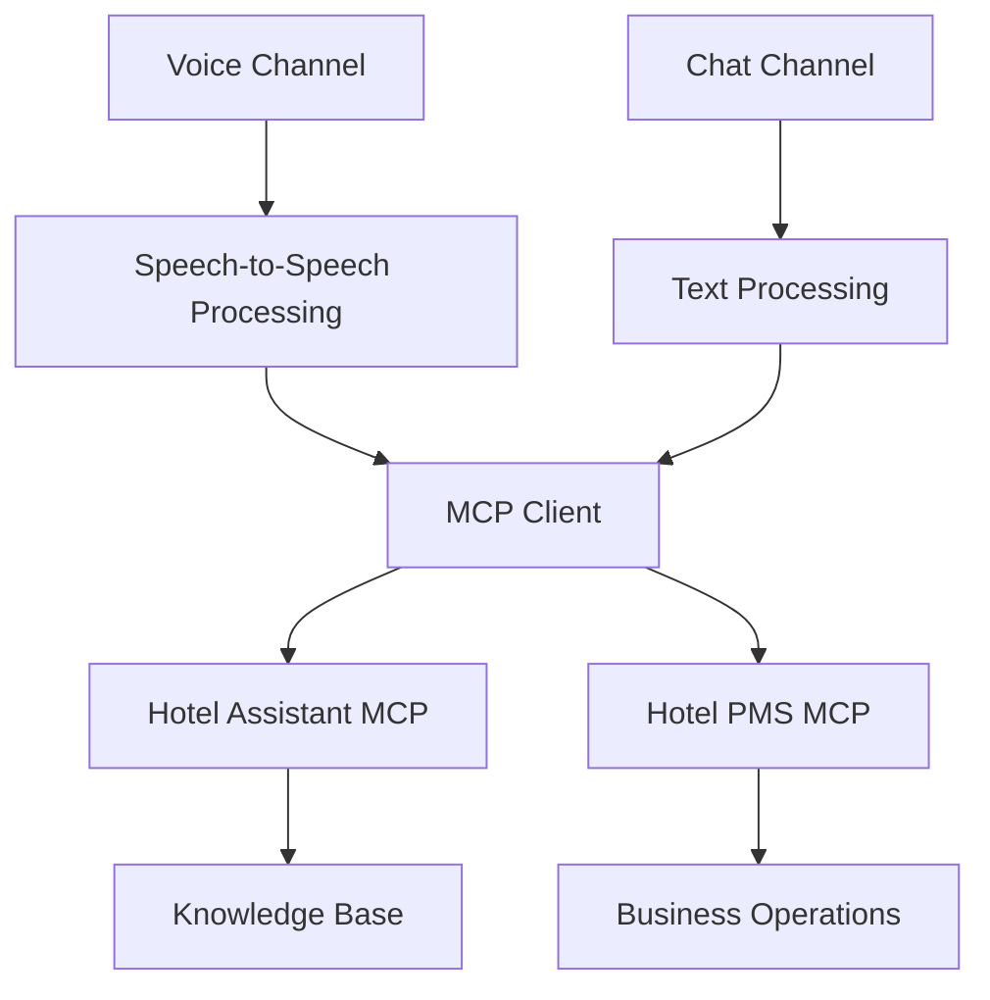

# Technical Approach

The Hotel Assistant prototype addresses the challenge of creating a scalable
virtual voice assistant for hotel services. The solution enables guests to use
voice interactions for hotel inquiries, quotations, and reservations while
overcoming the limitations of traditional voice assistants that feel unnatural
and are restricted to certain channels. Here's how we solved this problem:

## Multi-Modal Architecture

The system implements two independent interfaces that connect to shared backend
services, rather than a single endpoint routing requests. This architectural
pattern separates concerns by channel type while maintaining consistent business
logic across all interaction modes.

The voice processing pipeline handles real-time speech-to-speech interactions
using natural conversation flow optimized for audio latency and streaming
requirements. The chat processing manages text-based conversations optimized for
cost-effective text interactions with advanced reasoning capabilities. Both
channels connect to two MCP servers: the Hotel Assistant MCP provides knowledge
base queries and dynamic system prompts, while the Hotel PMS MCP exposes hotel
operations as MCP tools. This architecture ensures consistent functionality
across voice and text modalities while maintaining conversation context. See
architecture.md for AWS infrastructure details including Amazon ECS with AWS Fargate deployment,
Amazon Bedrock AgentCore Runtime configuration, and service integration.

## MCP Architecture

The system uses the Model Context Protocol (MCP) to separate agent capabilities
from business logic, enabling dynamic configuration and reusable components. We
chose this architecture to avoid hardcoding system prompts and tool
implementations directly in agent code, which would require redeployment for
every prompt update or business logic change.

### Multi-Server Configuration

Rather than implementing a monolithic integration, we deploy two specialized MCP
servers that provide distinct capabilities:

**Hotel Assistant MCP Server** provides knowledge base access and system
prompts. This server queries the S3 Vectors knowledge base for hotel
documentation and generates context-aware system prompts with dynamic
information like current date and available hotels. The server implements the
MCP prompt primitive, allowing agents to request prompts by type (chat, voice,
or default) and receive appropriately formatted instructions.

**Hotel PMS MCP Server** exposes hotel operations through AgentCore Gateway.
This server converts the REST API operations (reservations, availability,
housekeeping) into MCP tools that agents can discover and invoke. The separation
enables replacing the demonstration PMS with production systems without
modifying the Hotel Assistant MCP or agent code.

### Dynamic Prompt Loading

Instead of hardcoding system prompts in agent deployments, we load them
dynamically from the Hotel Assistant MCP server at runtime. When an agent
initializes, it requests the appropriate prompt type (chat_system_prompt or
voice_system_prompt) through the MCP protocol. The server responds with the
prompt template populated with current context, including today's date and the
list of available hotels with their IDs.

This approach provides several benefits: prompt updates deploy independently
from agent code, reducing deployment frequency and risk; the same prompt
templates serve both chat and voice agents with appropriate formatting; dynamic
context injection ensures agents always have current information without manual
updates; and prompt versioning and A/B testing become possible without code
changes.

### Configuration Management

The system stores MCP server configuration as standardized JSON that defines
available MCP servers, their HTTP endpoints, and authentication requirements.
Both chat and voice agents read this configuration at startup, establishing
connections to all defined servers.

For authentication, we use OAuth machine-to-machine credentials with the client
credentials flow. The configuration references secure credential storage rather
than containing plaintext credentials, maintaining security while enabling
automated credential rotation. Agents retrieve credentials when initializing MCP
connections, requesting fresh tokens as needed. See architecture.md for AWS
Systems Manager Parameter Store and Secrets Manager configuration details.

### Tool Discovery and Routing

When agents start, they query each connected MCP server for available tools. The
Hotel Assistant MCP provides the query_hotel_knowledge tool for semantic search,
while the Hotel PMS MCP provides tools for reservations, availability checks,
and service requests. The agent maintains a registry of tools and their source
servers, routing invocations to the appropriate endpoint.

This discovery mechanism enables adding new capabilities by deploying additional
MCP servers and updating the configuration, without modifying agent code. If one
MCP server becomes unavailable, agents continue operating with tools from
remaining servers, providing graceful degradation rather than complete failure.

## Strategic Technology Choices

Rather than using a one-size-fits-all approach, we selected specialized
technologies for each component to address the specific challenges of scaling
voice assistants while maintaining natural interactions.

### Voice Processing Framework

[LiveKit](https://docs.livekit.io/agents/) serves as our voice processing
foundation because it provides an open source framework specifically designed
for speech agents with seamless integration for real-time audio processing. The
framework handles the complexity of conversation flow management, audio
streaming, and provides the abstractions needed for natural speech-to-speech
interactions that feel human-like rather than robotic. Built-in support for
WebRTC integration allows connecting telephony systems without custom protocol
development.

### Chat Processing Framework

[Strands](https://strandsagents.com/) powers our chat assistant implementation
by providing high-level abstractions for building conversational agents. The SDK
offers built-in prompt management, tool integration, and conversation flow
handling that eliminates boilerplate code. This framework approach separates
conversation logic from infrastructure concerns, enabling focus on agent
behavior and business logic rather than low-level implementation details.

### API-to-Tool Integration Pattern

AgentCore Gateway enables our hotel operations integration by providing
zero-code conversion of REST APIs into
[MCP (Model Context Protocol)](https://modelcontextprotocol.io/docs/getting-started/intro)
tools, eliminating the need for custom protocol implementation. The gateway
consumes OpenAPI specifications optimized for AI agent consumption, with clear
operation descriptions and structured schemas that enable automatic tool
definition generation. This pattern separates API design from agent
implementation, allowing independent evolution of business systems and
conversational interfaces.

### Backend Implementation Strategy

The backend implementation uses a routing pattern where a single entry point
dispatches requests to appropriate business logic functions based on operation
type. For this prototype, the implementation uses simplified hotel operations
with canned data and rule-based logic, providing realistic functionality for
demonstrations. In production deployments, customers would replace this
implementation with integrations to their existing hotel PMS systems that
already provide APIs, requiring no changes to the agent code while enabling
access to real hotel operations and data. See architecture.md for AWS Lambda
configuration, Amazon API Gateway setup, and authentication details.

## Scalable Architecture

The system addresses the complexity and cost of scaling with voice assistant
systems by implementing independent scaling strategies optimized for different
interaction types. This architectural pattern recognizes that voice and chat
have fundamentally different resource requirements and usage patterns.

### Voice Processing Scaling

Voice interactions require persistent, high-performance compute for real-time
audio processing. The system uses containerized deployment with auto-scaling
based on active call volume, ensuring sufficient capacity during peak periods
while minimizing costs during low-traffic times. ARM64 architecture optimizes
cost-performance for audio processing workloads. See architecture.md for ECS
Fargate configuration, scaling policies, and container specifications.

### Chat Processing Scaling

Chat interactions use serverless scaling that provides automatic resource
provisioning based on conversation demand with pay-per-use pricing aligned to
actual processing time. Each conversation session receives dedicated isolated
resources, eliminating the need for pre-provisioned capacity while maintaining
responsive performance. This approach scales from zero to high volumes
automatically without capacity planning.

### Data Layer Scaling

The backend data layer uses serverless database scaling that automatically
adjusts read and write throughput based on actual request volume. This approach
eliminates capacity planning and provides instant scaling for varying workloads,
from simple hotel inquiries to complex reservation workflows. The
demonstration-focused design with canned data and simple rule-based logic
minimizes database complexity while maintaining realistic hotel operations
functionality. See architecture.md for Amazon DynamoDB table design, capacity modes,
and index configurations.

## Hotel Operations Integration

The system enables comprehensive hotel service capabilities including
information search, quotations, and reservations through voice and text
interactions. For prototype purposes, we implemented a demonstration-focused
hotel operations system that prioritizes consistent, predictable scenarios over
production complexity.

### Demonstration-Focused Design

Rather than implementing a full production PMS with complex relational data
models, we chose a simplified approach optimized for effective demonstrations.
The system uses canned data with rule-based logic to provide realistic hotel
management functionality while maintaining predictability across multiple demo
runs.

**Canned Data Approach**: The system stores simplified hotel information with
pre-defined data for four hotels in the Paraíso Luxury Group chain. Each hotel
includes basic property information, room types with base pricing, and amenity
details. This flat data structure eliminates complex foreign key relationships
while providing sufficient realism for demonstration scenarios.

**Date-Based Availability Rules**: Instead of maintaining a complex reservation
database, the system uses simple calendar-based rules. Hotels are marked as
fully booked on the 5th, 6th, and 7th of each month, creating predictable
scenarios for demonstrating both successful bookings and unavailability
responses. All other dates show full availability, enabling consistent demo
experiences.

**Dynamic Pricing Calculations**: While using canned data, the system calculates
prices dynamically based on booking parameters. The pricing algorithm applies
guest count multipliers for additional occupancy beyond base capacity, seasonal
adjustments based on month (peak vs. off-peak periods), and weekend surcharges
for Friday-Sunday stays. This approach demonstrates realistic pricing variations
without requiring complex rate management systems.

**Recording Demo Interactions**: The system stores new reservations and service
requests, enabling follow-up queries within a demo session. When a guest makes a
reservation, the system generates a unique confirmation number and stores the
booking details. This allows demonstrating scenarios like "What's my
confirmation number?" or "Can I modify my reservation?" while maintaining
simplicity.

### Knowledge Base Integration

The prototype integrates with a knowledge base using semantic search for
cost-effective information retrieval. The knowledge base contains hotel amenity
information and descriptions, local area recommendations and directions,
operating hours and service availability, and multilingual content support in
Spanish. This enables the assistant to provide detailed information about hotel
facilities and services beyond basic operational data, without requiring a
separate vector database infrastructure. See architecture.md for Amazon Bedrock
Knowledge Bases configuration and S3 Vectors implementation.

### API Integration Pattern

The hotel operations expose through a REST API with OAuth authentication,
following standard API design patterns. The API uses an OpenAPI specification
optimized for AI agent consumption, with clear operation descriptions and
structured request/response schemas. A routing pattern handles all API
operations, dispatching requests to the appropriate business logic functions
based on HTTP method and path.

This API-to-tool conversion pattern provides consistent authentication across
all operations, automatic tool discovery for agents, and maintains the same
integration pattern that would be used with production hotel PMS systems. In
production deployments, customers would replace the demonstration implementation
with integrations to their existing hotel PMS systems that already provide APIs,
requiring no changes to the agent implementations while enabling access to real
hotel operations and live booking data. See architecture.md for API Gateway
configuration, AWS Lambda implementation, and Amazon Cognito authentication setup.

## Message Processing for Rapid-Fire Messaging

The system handles rapid-fire messaging scenarios where users send multiple
messages in quick succession (common in WhatsApp and SMS). Without proper
handling, this causes fragmented context, out-of-order responses, and potential
message loss.

We use DynamoDB to buffer incoming messages and AWS Step Functions with a task
token pattern to orchestrate processing. Messages are collected for 2 seconds,
ensuring the agent sees all related messages together. A single workflow per
user (enforced via DynamoDB atomic operations) prevents race conditions, while
the task token pattern ensures messages aren't deleted until the agent
successfully processes them. The workflow includes exponential backoff retry for
transient failures and loops back to check for new messages, handling multiple
message bursts efficiently.

This approach provides visual workflow debugging through the Step Functions
console, built-in retry and error handling, and reliable async coordination. The
2-4 second latency (primarily from the buffering window) is imperceptible to
users while significantly improving conversation quality by preserving context.

See
[Message Processing Architecture](message-processing.md#message-processing-architecture)
for detailed implementation decisions, state machine diagram, performance
characteristics, and alternative approaches considered.

## Performance Optimization

To improve efficiency and reduce costs while maintaining natural conversation
quality, we implemented several software design optimizations:

**Model Selection Strategy**: Different AI models are optimized for their
specific interaction types. Speech-to-speech models handle voice interactions
that require real-time audio processing with low latency, while advanced text
models manage chat conversations with superior reasoning capabilities at lower
cost per interaction.

**Resource Allocation Pattern**: The architecture separates resource allocation
by interaction type, with containerized deployment for persistent voice
connections and serverless execution for stateless chat requests. This pattern
optimizes cost-performance by matching infrastructure to workload
characteristics.

**Independent Scaling Design**: Voice and chat scale independently based on
their distinct demand patterns, allowing optimization of costs while maintaining
responsive service. This separation enables different scaling policies for
real-time audio processing versus text-based reasoning tasks.

**Integration Readiness**: The MCP protocol abstraction supports both prototype
and production systems without requiring agent modifications. This design
pattern enables seamless transition from demonstration to production deployment.

**Observability and Auditability**: Complete conversation logging and
performance monitoring provide insights for service improvement while
maintaining privacy and security standards. See architecture.md for AWS
infrastructure specifications including container configurations, serverless
scaling, and monitoring setup.

## Industry Adaptability

The software design enables easy adaptation across different industries by
separating configuration from code. System prompts can be swapped without code
changes through the dynamic prompt loading pattern, allowing deployment in
different verticals with industry-specific terminology and compliance language.
The tool-based architecture separates business logic into replaceable MCP tools
that can be customized for different industries while maintaining the same agent
implementation.

This design pattern provides flexibility to adapt to new business requirements
while maintaining core capabilities. See architecture.md for details on which
AWS infrastructure components stay the same versus what you customize for your
industry.

## Future Adaptability

The software architecture supports evolution with changing business needs and
technological advances. New AI models can be incorporated through configurable
model selection without requiring architectural changes. Additional interaction
channels can be integrated through the same MCP backend pattern, enabling
expansion to mobile apps, messaging platforms, or emerging communication
technologies. Enhanced business operations can be implemented through production
system integration using the existing API-to-tool conversion pattern.

This foundation provides the flexibility to adapt to new requirements while
maintaining the core design patterns that deliver natural, efficient service
experiences. See architecture.md for AWS infrastructure extensibility including
scaling capabilities and service integration options.
